# Storing Large, Heterogeneous Data at Scale: A Practical Guide

Production machine-vision and ML pipelines do not just produce results — they produce *evidence*: debug images, video recordings, depth maps, point clouds, and sensor logs that pile up for years and that you will eventually need to search, replay, or re-process. When that data lives on isolated, air-gapped servers (no cloud durability, no managed backups, no infinite bucket) the storage problem stops being "where do I put this file" and becomes "how do I keep terabytes of heterogeneous data findable, intact, and affordable for the better part of a decade." This guide is a practical reference for building that storage layer with self-hosted, offline-capable tools that scale from gigabytes to many terabytes.

> **Mining-server note:** Throughout, the running example is a mining operation whose debug *image* storage already works fine. The new pain is **video** and **Stereolabs ZED 3D data** (SVO/SVO2 recordings, depth maps, point clouds) — much larger, more heterogeneous, and burdened by multi-year retention on servers that may never touch the internet.

## Table of Contents

- [How to Use This Guide](#how-to-use-this-guide)
- [The Mental Model: Storage Engine vs. Layout vs. Catalog](#the-mental-model-storage-engine-vs-layout-vs-catalog)
- [Key Concepts You Need First](#key-concepts-you-need-first)
- [Storage Options: The Landscape](#storage-options-the-landscape)
  - [Plain Filesystem (Direct Files)](#plain-filesystem-direct-files)
  - [Embedded Single-File Stores (SQLite, LMDB, RocksDB)](#embedded-single-file-stores-sqlite-lmdb-rocksdb)
  - [Object Storage (S3, MinIO, Ceph)](#object-storage-s3-minio-ceph)
  - [Relational Databases (PostgreSQL, MySQL): BLOB vs. Path Pattern](#relational-databases-postgresql-mysql-blob-vs-path-pattern)
  - [Document & NoSQL Stores (MongoDB, GridFS)](#document--nosql-stores-mongodb-gridfs)
  - [Scientific & Array Formats (HDF5, Zarr, NetCDF, TileDB)](#scientific--array-formats-hdf5-zarr-netcdf-tiledb)
  - [Columnar & Tabular Formats (Parquet, Arrow, Lance)](#columnar--tabular-formats-parquet-arrow-lance)
  - [Vector Databases (LanceDB, Qdrant, Milvus, pgvector)](#vector-databases-lancedb-qdrant-milvus-pgvector)
  - [Time-Series Databases (InfluxDB, TimescaleDB)](#time-series-databases-influxdb-timescaledb)
  - [Data Lakes & Lakehouse (Iceberg, Delta Lake, Hudi)](#data-lakes--lakehouse-iceberg-delta-lake-hudi)
  - [Data Version Control (DVC, git-annex, DataLad, lakeFS)](#data-version-control-dvc-git-annex-datalad-lakefs)
- [Directory Layout & Partitioning Strategies](#directory-layout--partitioning-strategies)
  - [Partitioning Dimensions](#partitioning-dimensions)
  - [Composite Hierarchical Keys](#composite-hierarchical-keys)
  - [Time-Based Partitioning in Depth](#time-based-partitioning-in-depth)
  - [Hive-Style Partitioning (key=value)](#hive-style-partitioning-keyvalue)
  - [Raw vs. Derived](#raw-vs-derived)
  - [Naming Conventions & File-Count Limits](#naming-conventions--file-count-limits)
  - [Storage Tiering (Hot / Warm / Cold)](#storage-tiering-hot--warm--cold)
- [Cross-Cutting Concerns](#cross-cutting-concerns)
  - [The Catalog / Index in Practice](#the-catalog--index-in-practice)
  - [Data Integrity Over Years](#data-integrity-over-years)
  - [Backup & Deduplication](#backup--deduplication)
  - [Compression](#compression)
- [Modality-Specific Playbooks](#modality-specific-playbooks)
  - [Images](#images)
  - [Video](#video)
  - [3D & Point-Cloud Data (ZED, LiDAR)](#3d--point-cloud-data-zed-lidar)
- [Decision Guide](#decision-guide)
  - [Decision Tree](#decision-tree)
  - [Comparison Matrix](#comparison-matrix)
  - [What Should I Use? (By Scenario)](#what-should-i-use-by-scenario)
- [Recommended Architecture for Production Sensor Data (Isolated Servers)](#recommended-architecture-for-production-sensor-data-isolated-servers)
- [Operations & Hardening for Isolated Sites](#operations--hardening-for-isolated-sites)
  - [Encryption at Rest](#encryption-at-rest)
  - [RAID Is Not Backup — and Rebuild/URE Risk](#raid-is-not-backup--and-rebuildure-risk)
  - [Drive Health Monitoring (SMART)](#drive-health-monitoring-smart)
  - [ECC RAM](#ecc-ram)
  - [Time Synchronization Offline](#time-synchronization-offline)
  - [Power Protection & Write Integrity](#power-protection--write-integrity)
  - [Capacity & Growth Planning](#capacity--growth-planning)
  - [Writing to Tape (LTFS/LTO)](#writing-to-tape-ltfslto)
  - [Access Control & Audit Logging](#access-control--audit-logging)
  - [Disaster-Recovery Runbook](#disaster-recovery-runbook)
  - [Retention & Legal Hold](#retention--legal-hold)
  - [Total Cost of Ownership (Rough $/TB)](#total-cost-of-ownership-rough-tb)
  - [Air-Gap Install & Staging Playbook](#air-gap-install--staging-playbook)
- [Migrating an Existing Image Store](#migrating-an-existing-image-store)
  - [Principle: Index in Place Before You Move a Byte](#principle-index-in-place-before-you-move-a-byte)
  - [Step 1 — Assess What You Have (Inventory + Checksums)](#step-1--assess-what-you-have-inventory--checksums)
  - [Step 2 — Strangler / Coexistence: New Captures, New Layout](#step-2--strangler--coexistence-new-captures-new-layout)
  - [Step 3 — Backfill the Catalog Without Moving Bytes](#step-3--backfill-the-catalog-without-moving-bytes)
  - [Step 4 — Optionally Relocate Into the Canonical Tree (Batches by Date)](#step-4--optionally-relocate-into-the-canonical-tree-batches-by-date)
  - [Step 5 — Verify (Row Count vs File Count, Checksum Match)](#step-5--verify-row-count-vs-file-count-checksum-match)
  - [A Resumable, Rollback-Safe Migration Script](#a-resumable-rollback-safe-migration-script)
- [Tooling Quick Reference](#tooling-quick-reference)
- [Further Reading](#further-reading)
- [Glossary](#glossary)

## How to Use This Guide

**Who this is for.** Engineers and operators who run data-producing pipelines and have to store the output themselves — on their own disks, on isolated networks, for years. You should be comfortable with the command line, basic filesystems, and SQL. You do not need to be a storage specialist; the goal is to make you one for your own use case.

**How it is organized.** The guide moves from foundations to specifics:

- **Concepts** — *How to Use This Guide* (this section), *The Mental Model: Storage Engine vs. Layout vs. Catalog*, and *Key Concepts You Need First*: the mental model and vocabulary everything else depends on.
- **Storage Options: The Landscape** — every place bytes can live, from a plain filesystem to object stores, databases, scientific array formats, and lakehouses, each with the same *What it is / Best for / Avoid when / Tools / Trade-offs* breakdown.
- **Directory Layout & Partitioning Strategies** — how to physically organize the files once you have picked an engine.
- **Cross-Cutting Concerns** — the catalog, integrity over years, backup/dedup, and compression that apply no matter what you chose.
- **Modality-Specific Playbooks** — concrete recipes for images, video, and 3D/point-cloud data.
- **Decision Guide** and **Recommended Architecture** — decision tree, comparison matrix, and a concrete default stack for isolated servers, followed by a tooling quick reference, further reading, and a glossary.

**One-line reading path.** Read this Concepts chapter, skim *The Landscape* to find the two or three engines that match your data, then jump straight to *Recommended Architecture for Production Sensor Data (Isolated Servers)* and work backward into the cross-cutting and modality chapters as needed.

## The Mental Model: Storage Engine vs. Layout vs. Catalog

Most storage confusion comes from collapsing three *independent* decisions into one. They are not the same question, they are solved by different tools, and you can change any one of them without rebuilding the others. Separate them on purpose:

1. **Storage engine — the bytes, and where they physically live.** This is the substrate that actually holds the data: a POSIX filesystem (ideally on a checksumming volume manager like ZFS), a self-hosted object store, a database, or a specialized array/columnar format. The engine decides durability, throughput, and integrity guarantees. *Big opaque blobs — video, SVO2, point clouds — almost always belong as files on a filesystem or as objects in an object store, never inside a database.*

2. **Layout — how the files are arranged.** Given an engine, this is the directory tree (or key namespace): the partitioning scheme, the `raw/` vs `derived/` split, the naming convention, the time granularity. Layout determines whether you can grab "all of camera X in March" with one glob and whether a whole month can be moved to cold storage as a single unit. Layout is pure organization; it stores no extra data.

3. **Catalog — how you find and verify the bytes.** A small, queryable index with one row per asset: its path, content hash, capture time, sensor, project, labels, and storage tier. The catalog answers *"which files match this query?"* without walking the tree, and its stored checksums let you prove a file is intact years later. Crucially, **volatile facts (labels, QA flags, detections) live in the catalog, not in the path** — so re-labeling a million files is an `UPDATE`, not a million `mv`s.

The connective rule for everything that follows is **"files for the bytes, a database for the facts."** The engine holds the bytes, the layout places them, and the catalog points at them and describes them.

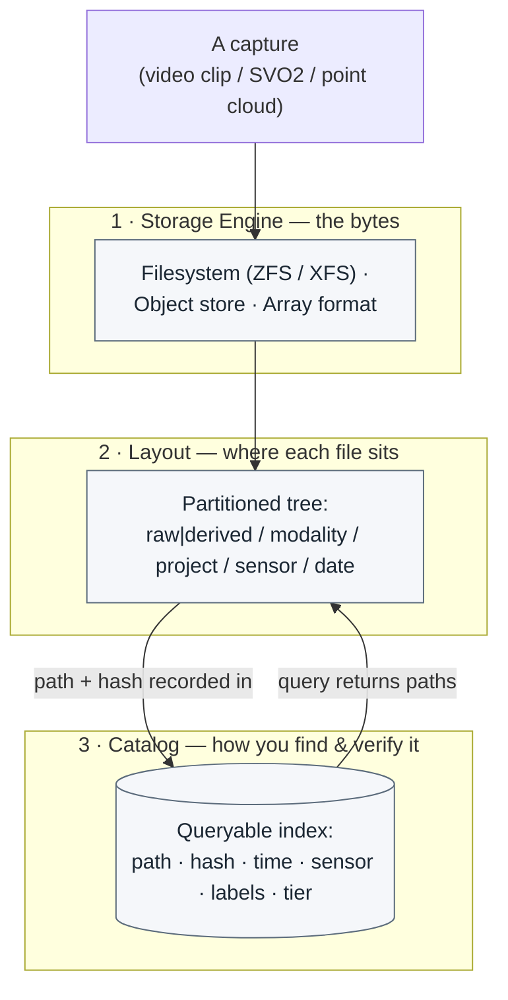

> **Mining-server note:** Keeping these three separate is what lets you evolve safely on an air-gapped box. You can move old data from NVMe to bulk HDD to tape (layout/engine) without changing a single catalog query, and you can re-run a better detector and rewrite labels (catalog) without touching one immutable `raw/` byte.

## Key Concepts You Need First

A handful of ideas recur in every later chapter. Internalize these five and the rest of the guide reads as application of them.

**Raw vs. Derived (and immutability).** Split your data into two trees with opposite lifecycles. `raw/` holds the original captures — SVO2 recordings, original video, original images — and is **write-once and immutable**: mount it read-only where you can, set files to `0444`, and treat any correction as a *new* file rather than an overwrite. `derived/` holds anything you can regenerate from `raw/` plus pipeline code — depth maps, exported point clouds, transcodes, thumbnails, detections — and is **disposable**: under storage pressure you delete it and recompute later. This split is the single highest-leverage decision for ZED data, because an SVO2 stores only the stereo streams and sensors; depth maps and point clouds are *recomputed at replay*, so they are derived caches, not raw data. Tag every derived artifact with the pipeline version that produced it so stale caches are obvious.

**Hot / Warm / Cold tiering.** Not all data is accessed equally, and not all storage costs the same per terabyte. Keep recent, actively-debugged data **hot** (fast NVMe/SSD), the last year or so **warm** (bulk HDD, ideally ZFS/RAIDZ), and old, rarely-touched archives **cold** (high-density HDD, LTO tape, or external drives kept physically offline). Because time is the natural retention axis, tiers map directly onto time-based partitions: an entire `YYYY/MM` directory can be moved between tiers with a single `mv`, `rsync`, `tar`, or `zfs send`. Design the layout so this is one command, not a file-by-file migration.

**The Catalog / Index (teaser).** As soon as you have tens of thousands of clips and point clouds spread over years, `find` and `grep` stop being enough — "every ZED capture from line 2 in March where `zed_depth_valid_pct` was under 60" is not a filesystem query. The fix is a small queryable index (a single SQLite file, or Hive-partitioned Parquet queried offline with DuckDB) holding one row per asset with its path, hash, timestamp, and searchable metadata. It is cheap, it is the highest-ROI piece of the whole system, and it is *derived* — if it is ever lost you rebuild it by re-walking the tree. The full treatment, including schema and queries, is in **The Catalog / Index in Practice**.

**Metadata sidecars.** The catalog is queryable but disposable; the **source of truth** for an asset's metadata should travel *with* the file as a small sidecar — typically a `metadata.json` (and a `.sha256`/`.b3` checksum) sharing the asset's basename. Sidecars are human-readable, need no database to interpret, survive being copied to any medium (including a tape carried offsite), and make the archive self-describing. Populate them with standard tools (`ffprobe` for video, `exiftool` for images, the ZED SDK for SVO2, PDAL/`lasinfo` for point clouds), write them atomically (temp file, `fsync`, rename) to avoid drift, and mirror their contents into the catalog. Truth lives beside the bytes; the catalog is the fast index built from it.

> **Mining-server note:** Self-describing sidecars matter most exactly where you have no cloud safety net. If the catalog DB is ever lost on an isolated server, a directory of `.json` + `.sha256` sidecars means the archive is still searchable with `find`/`jq` and still verifiable on the next integrity scrub — the index is a convenience, not a dependency.

**A warning on the word "partitioning."** It means at least four different things in this space; later chapters use it precisely, so disambiguate it now:

| "Partitioning" as used in… | What it actually means | Where it appears in this guide |
|---|---|---|
| **Directory / data partitioning** | Splitting data into a hierarchical tree (by date, sensor, modality) for human and tool access | Directory Layout & Partitioning Strategies |
| **Hive-style partitioning** | Encoding partition columns as `key=value` directory names that query engines (DuckDB, Spark, PyArrow) auto-detect and *prune* | Hive-Style Partitioning (key=value) |
| **Database table partitioning** | An engine-internal split of one logical table into many physical chunks (e.g. PostgreSQL/TimescaleDB) | Relational and Time-Series sections |
| **Disk / block partitioning** | Carving a physical device into block-level partitions (`fdisk`, GPT) — the lowest layer, mostly out of scope here | Mentioned only in passing |

When this guide says "partition" without qualification, it means **directory/data partitioning** — the layout decision from the mental model above.

## Storage Options: The Landscape

There is no single "best" store for heterogeneous sensor data — there is a *foundation layer* that holds the bytes and an *index layer* that makes them findable, plus specialized formats for specific modalities. The guiding rule that runs through every option below is **"files for bytes, a database for facts"**: keep large opaque blobs (video, SVO2, point clouds) on a filesystem or object store, and keep metadata + paths + checksums in something you can query. The table below maps every family covered in this guide so you can see where each fits before diving in; the first five families form the byte-and-catalog foundation; the remaining subsections below cover modality-specific and analytical formats.

| Family | Sweet spot | Scale | Offline / Self-host |
|---|---|---|---|
| **Plain Filesystem** (Direct Files) | The byte store of record for large opaque blobs (video, SVO2, point clouds) | GB → many TB (PB on ZFS/XFS) | Native — nothing to run |
| **Embedded Single-File Stores** (SQLite, LMDB, RocksDB) | Server-less local index/catalog of those files | KB → tens of GB of *metadata* | Native — in-process, no daemon |
| **Object Storage** (S3, MinIO, Ceph) | Durable archive + multi-client serving of big blobs at scale | TB → PB, billions of objects | Yes — SeaweedFS / Garage / Ceph |
| **Relational Databases** (PostgreSQL, MySQL) | The catalog / system-of-record for metadata + paths | Millions of rows | Yes — run fully air-gapped |
| **Document & NoSQL** (MongoDB, GridFS) | Highly heterogeneous, schema-churning capture metadata | Millions of documents | Yes — self-hosted |
| **Scientific & Array Formats** (HDF5, Zarr, NetCDF, TileDB) | N-D numeric arrays (depth maps, voxel grids) | GB → TB per array | Yes — file formats + embedded libs |
| **Columnar & Tabular** (Parquet, Arrow, Lance) | Analytical catalogs and flattened point tables | Many TB of rows | Yes — Parquet + DuckDB |
| **Vector Databases** (LanceDB, Qdrant, Milvus, pgvector) | Embeddings for near-duplicate / similarity / curation | Millions → billions of vectors | Yes — embedded or single-binary |
| **Time-Series Databases** (InfluxDB, TimescaleDB) | Sensor / IMU telemetry with timestamps | Billions of points | Yes — Postgres ext. or single binary |
| **Data Lakes & Lakehouse** (Iceberg, Delta, Hudi) | ACID + time-travel over *tabular* data | Many TB | Yes — Delta-rs / DuckLake offline |
| **Data Version Control** (DVC, git-annex, DataLad, lakeFS) | Versioning opaque assets + provenance | GB → tens of TB | Yes — local / USB / S3-compatible remotes |

> **Mining-server note:** Your debug images already work, so do not rip anything out. The new video and ZED 3D data is a *byte-store-plus-catalog* problem: a checksumming filesystem (or self-hosted object store) for the blobs, and an embedded or relational catalog for the facts. The lower the row in this table, the more it is a *derived* layer — none of them should ever hold the raw blobs.

### Plain Filesystem (Direct Files)

- **What it is.** Files written directly into a directory tree on a POSIX filesystem. This is the simplest thing that works, and for large opaque blobs it is usually the *right* thing.
- **Best for.** The byte store of record for big, write-once objects — SVO/SVO2 recordings, MP4/MKV video, PLY/PCD point clouds, EXR/16-bit-PNG depth maps. Sequential I/O is fast, every standard offline tool (`rsync`, `cp`, `tar`, `ffmpeg`, the ZED SDK, `find`) operates on it directly, and there is no lock-in.
- **Avoid when.** You need rich queries over the data ("all clips from camera 3 last March"), cross-file transactional atomicity, or you would otherwise dump millions of *small* files into one directory. Pair it with a catalog (next section) and shard the namespace.
- **Tools.** The filesystem itself plus POSIX/offline tooling: `rsync`, `tar`, `find`, `ls -f`/`ls -U`, `ffmpeg`, `cron` for scheduled scrubs.
- **Trade-offs.** Filesystems beat databases for blobs past roughly 100 KB–1 MB and have zero operational overhead, but they offer no built-in metadata query layer and — depending on which filesystem you pick — no defense against silent corruption.

#### Picking the filesystem: integrity is the deciding factor

For a **multi-year** archive the single most important property is **end-to-end data checksumming with scrub-and-repair**. Disks suffer silent corruption ("bit rot") that ordinary filesystems never notice. `ext4` and `XFS` checksum only their *metadata*; **ZFS and Btrfs checksum the actual data blocks** and can repair them from redundancy. Over years this is the difference between *detecting* a corrupt SVO and *silently serving* one.

| Feature | ext4 | XFS | Btrfs | OpenZFS |
|---|---|---|---|---|
| Data checksums (catch bit rot) | No | No (metadata only) | **Yes** | **Yes** |
| Self-heal from redundancy | No | No | Yes (RAID1/10/DUP) | **Yes** (mirror / RAID-Z) |
| Scrub | No | No | **Yes** | **Yes** |
| Snapshots | No | No | **Yes** | **Yes** |
| Transparent compression | No | No | **Yes** | **Yes** |
| In mainline kernel | Yes | Yes | Yes | **No** (DKMS / CDDL) |
| Parity RAID safe to use | via md/hw | via md/hw | **No (RAID5/6)** | **Yes (RAID-Z)** |
| Inode allocation | static | **dynamic** | dynamic | dynamic |
| Best at | simplicity | big files / huge counts | snapshots + integrity (no parity) | **integrity-first archive** |

- **OpenZFS — first choice for the archive tier.** A combined filesystem + volume manager with copy-on-write, per-block checksums, redundancy (mirror, RAID-Z1/2/3), instant snapshots, transparent compression, and `zfs send`/`recv` replication. A `scrub` reads every block, verifies its checksum, and *self-heals* from parity on RAID-Z/mirror pools — schedule it monthly; this is your bit-rot defense. RAID-Z avoids the parity "write hole" via variable-width stripes + CoW. Caveats: it ships as an out-of-tree DKMS module (CDDL license), and dedup is RAM-expensive (~5 GB RAM per TB of pool) — avoid dedup unless you have 128 GB+ RAM and genuinely duplicate data; compression + snapshots usually give the wins you want.
- **Btrfs — ZFS-like integrity, in the mainline kernel.** Data + metadata checksums, snapshots, and `compress=zstd`, on **single / DUP / RAID1 / RAID10** layouts. The headline caveat: **Btrfs RAID5/6 is still not production-ready** (write hole; upstream actively discourages it). For parity, prefer ZFS RAID-Z, or run Btrfs *single* on top of `mdadm`/hardware RAID (you keep corruption *detection* but lose Btrfs self-heal).
- **XFS — best plain, high-throughput choice.** Mature, large-file-optimized, with **dynamic inode allocation** and B+tree directories that scale to *billions* of files (default on RHEL/Rocky 9). It has **no** data checksums, snapshots, or compression (metadata CRC only) and **cannot shrink** — use it only when integrity is handled by another layer (hardware RAID with scrubbing, or application-level SHA-256 verification).
- **ext4 — simplest, smallest setups only.** Ubiquitous and conservative, but **inodes are fixed at `mkfs` time** (you can run out despite free space), and very large directories can hit the HTree height ceiling (*"index full, reach max htree level"*) unless you enable `large_dir` — or simply shard directories.

```bash
# OpenZFS dataset tuned for large ZED/video blobs
zfs create -o recordsize=1M -o compression=lz4 -o atime=off tank/zed
# higher-ratio alternative (more CPU): -o compression=zstd-3
zpool scrub tank                    # run monthly via cron; check `zpool status`
zfs snapshot tank/zed@2026-06-29    # instant, space-efficient point-in-time
```

Two practical knobs matter for this data: set **`recordsize=1M`** for large sequential media/3D files (better throughput *and* compression ratio), and turn compression **on** (`lz4` is the safe ~2:1 default; `zstd` trades CPU for ratio). Already-compressed H.264/H.265 SVO and JPEG will not shrink, but lossless SVO, depth maps, and PLY/PCD point clouds often do.

> **Mining-server note:** OpenZFS being out-of-tree (CDDL/DKMS) is a real air-gap hazard — a kernel upgrade can break the module if the matching ZFS package was not staged offline first. Pin and pre-stage matching versions before any kernel bump. And never put millions of files in one directory: shard by time (`cam03/2026/06/29/...`) or hash-prefix (`ab/cd/abcd...`), and use `ls -f`/`ls -U`/`find` instead of a sorted `ls -l` that triggers a `stat()` storm.

### Embedded Single-File Stores (SQLite, LMDB, RocksDB)

These run **in-process** — no daemon, no network port, no auth to manage — which makes them ideal for **air-gapped** servers. Use them to *index* the files from the filesystem layer: paths, sizes, capture time, camera ID, calibration, stored content checksums, processing status, and small previews. Keep the large blobs themselves external; store the path, not the bytes.

#### SQLite — the default catalog

- **What it is.** A serverless, zero-config, single-file SQL database — the most widely deployed database in the world and an explicitly supported *application file format*.
- **Best for.** The metadata catalog/index for your files; small derived blobs (thumbnails, sidecar contents); anything you will *query*. Crash-safe and trivially portable — back it up by copying one file.
- **Avoid when.** You need many concurrent *writers* (writes serialize), multi-node access, or you want to store the *large* blobs inside it.
- **Tools.** `sqlite3` CLI; WAL mode (`PRAGMA journal_mode=WAL`) for concurrent reads during writes; `.backup` / `VACUUM INTO` for safe offline backups; the optional `sqlite-zstd` extension for transparent row-level compression (vendor/compile it offline — it is third-party).
- **Trade-offs.** Per SQLite's own benchmarks, small blobs (~10 KB) read/write **~35% faster** than individual files and use **~20% less disk** (rows pack tightly; files pad to block size) — present this as guidance, not a guarantee, since results vary by hardware/OS/cache. The internal-vs-external break-even is near **~100 KB**: store blobs smaller than that inside, keep anything larger as files and store the path. (Single-blob hard limit ~2 GB; your MB–GB media is always external.)

```sql
-- Catalog pattern: bytes on disk, facts in SQLite
CREATE TABLE captures(
  id          INTEGER PRIMARY KEY,
  path        TEXT NOT NULL,   -- raw/svo2/flotation-cell-7/zed2i-sn12345/2026/06/29/zed2i-sn12345_20260629T153000Z_0001.svo2
  modality    TEXT,            -- 'image' | 'video' | 'svo2' | 'depth' | 'point_cloud'
  bytes       INTEGER,
  checksum    TEXT,            -- stored hash (BLAKE3/sha256) for periodic re-verification
  captured_at TEXT,
  sensor      TEXT,            -- stable serial-style id, e.g. zed2i-sn12345
  thumb       BLOB             -- small (<100 KB) preview kept inline
);
```

#### LMDB (Lightning Memory-Mapped Database)

- **What it is.** A tiny embedded, memory-mapped copy-on-write B+tree key-value store with full ACID transactions.
- **Best for.** **Read-heavy** `key → metadata/path` lookups where you want *zero tuning* — e.g., a hot index consulted constantly by inference jobs.
- **Avoid when.** Write-heavy ingest, values you need SQL over, or datasets far larger than RAM.
- **Tools.** C library plus bindings (Python `lmdb`, etc.); single data file + lock file.
- **Trade-offs.** Reads return pointers directly into mapped memory (no copy). **Single writer**, but readers never block writers and vice versa (MVCC). **Crash-proof by design** — CoW means the on-disk structure is always valid, with no recovery step after a power cut (excellent for a mining site). No built-in compression; set the max map size up front (effectively unbounded on 64-bit).

#### RocksDB

- **What it is.** An embedded LSM-tree key-value store built for high write throughput and datasets larger than RAM.
- **Best for.** **Write-heavy / high-ingest** indexing — per-frame events, IMU/sensor streams, or rapid metadata from many capture nodes — where the index itself grows into the hundreds of GB.
- **Avoid when.** You want simplicity/zero-config, lowest read latency on a small dataset, or SQL.
- **Tools.** C++ library plus bindings; column families (separate hot/cold data); `ldb` / `sst_dump` utilities.
- **Trade-offs.** LSM design favors writes via in-memory buffering + background compaction, at the cost of **write amplification** and more RAM/CPU. **Built-in compression** (Snappy/LZ4/ZSTD) — a common pattern is no compression on L0/L1 and ZSTD on L2+. More knobs than LMDB/SQLite.

| | SQLite | LMDB | RocksDB |
|---|---|---|---|
| Model | SQL (relational) | KV, mmap B+tree | KV, LSM-tree |
| Optimized for | balanced + queries | **reads** | **writes / ingest** |
| Concurrency | serialized writes; WAL readers | 1 writer, many readers (MVCC) | concurrent, tunable |
| Config effort | very low | **none** | high |
| Compression | via `sqlite-zstd` | none | **built-in** (zstd/lz4) |
| Crash safety | atomic txns | **no-recovery CoW** | WAL + recovery |
| Best role here | **the catalog** | hot path → metadata lookups | high-rate event ingest |

> **Mining-server note:** Start with SQLite as the catalog — it covers ~95% of needs, is the easiest to back up and inspect offline, and proves the "files for bytes, DB for facts" split. Reach for LMDB only if a hot read path needs lower latency, or RocksDB only if concurrent ingest outgrows SQLite's single-writer model. None of these are multi-writer shared stores; for that, graduate to PostgreSQL.

### Object Storage (S3, MinIO, Ceph)

A POSIX filesystem is fine until you have millions of files spread over years. **Object storage** — the S3 model — is the strongest fit for your *new* pain (video and ZED 3D data piling up for years) once these pressures appear:

| Pressure | Filesystem | Object storage |
|---|---|---|
| Scale to billions of objects | Listing / lookups degrade on huge trees | Flat namespace; key lookup is independent of object count |
| Rich, queryable metadata | Fixed (timestamps, owner, size) | Arbitrary per-object metadata (camera_id, scene, GPS, run_id) |
| Parallel / multi-client access | NFS/SMB locking gets fragile | Stateless HTTP GET/PUT; many concurrent clients |
| Large immutable blobs | One big file; resume is manual | Multipart upload: parallel, resumable, checksum-verified parts |
| Multi-year integrity | Silent bit rot unless ZFS/Btrfs | Erasure coding + per-object checksums + per-object self-heal |
| Retention / tamper-resistance | Anyone with write access can overwrite | Versioning + WORM Object Lock |

It is **not** a working/scratch filesystem: no in-place edit or append, and the ZED SDK records SVO2 to a *local path*, not an S3 URL. The pattern is **capture-local → upload (multipart) → optionally lock for retention → tier/expire via lifecycle**.

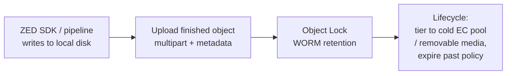

The S3 data model is shared by every option below: a **bucket** holds **objects** addressed by a single string **key** — `zed/2026/06/29/cam01/run_1234.svo2` is one flat key, and the `/` characters are just part of the string ("folders" are a UI illusion built from prefixes). Lead keys with a stable, low-cardinality dimension (data type/camera), then date. Two integrity features matter most for years of retention: **erasure coding** (Reed–Solomon *k* data + *m* parity shards gives per-object healing and per-read checksum verification; e.g. 8+4 costs ~1.5x raw vs 3x for replication) and **Object Lock** (WORM built on versioning — Governance mode lets privileged users remove the lock; Compliance mode lets *no one*, including root, delete until expiry).

**Multipart upload** is essential for multi-GB SVO2/video files:

| S3 limit | Value |
|---|---|
| Max object size | 5 TB |
| Single `PUT` max | 5 GB (use multipart above this) |
| Recommended multipart threshold | ~100 MB |
| Part size | 5 MB – 5 GB |
| Max parts per object | 10,000 |

Each part uploads independently (parallel, resumable on a flaky link) and is checksum-verified; `aws s3 cp`, `mc cp`, and `rclone` all do this automatically above a threshold.

> **Warning — MinIO status (2026):** MinIO was the default self-hosted S3, but it changed dramatically. In 2025 features were removed from the Community Edition console, and as of early 2026 the community repository was reported to be moving toward maintenance/archival with no guaranteed security patches — verify its current status before relying on it. An existing AGPLv3 install still runs offline and can be pinned short-term, but **do not start a new long-retention deployment on it** — and do not adopt MinIO Enterprise/AIStor on an air-gapped box if it requires online license validation. For new isolated deployments, prefer SeaweedFS or Garage below.

#### SeaweedFS — primary recommendation for isolated servers

- **What it is.** Apache-2.0, Go, distributed store on Facebook's *Haystack* design; separates the metadata path from the data path for O(1) disk seek (~40 bytes metadata/file). Components: Master, Volume servers, optional Filer, and an S3 gateway.
- **Best for.** Mixed workloads exactly like yours — **billions of small files** (depth maps, point-cloud frames) *and* **large blobs** (SVO2/video); single-node start that scales out.
- **Avoid when.** You want a turnkey GUI/IAM console out of the box, or the absolute minimum number of moving parts.
- **Tools.** Full S3 API including versioning, lifecycle, Object Lock/WORM, multipart; replication for hot data plus optional rack-aware erasure coding for warm data; cloud/remote tiering; `weed` single static binary or container image.
- **Trade-offs.** More components than Garage, but each is simple — and it is the richest actively-maintained open-source feature set now that MinIO's community edition is winding down. Budget ~2–4 GB RAM per volume server.

#### Garage — simplest / lightest

- **What it is.** AGPLv3, Rust, by Deuxfleurs; in production since 2020. Consistent-hashing ring for small, self-hosted clusters on modest hardware.
- **Best for.** Operational minimalism — a backup/archive target on a few low-RAM machines (~1–2 GB RAM/node), or multi-site copies in separate buildings.
- **Avoid when.** You need maximum storage efficiency (it does **3x replication only — no erasure coding by design**), very high throughput, or advanced S3 features.
- **Tools.** Core S3 — GET/PUT/DELETE, multipart, listing, presigned URLs, static-site hosting; single static binary.
- **Trade-offs.** The easiest to operate, at the cost of features and **3x raw storage** — budget disks accordingly at many-TB scale.

#### Ceph + RADOS Gateway (RGW) — central, staffed sites only

- **What it is.** The battle-tested unified platform (object + block + file) on RADOS; RGW provides the S3 endpoint, with flexible K+M erasure coding across drives/hosts/racks.
- **Best for.** Large, long-lived deployments (many TB → PB) with a **dedicated ops team**.
- **Avoid when.** Small isolated servers or a small team — **Ceph does not scale down**: technical minimum 3 nodes, 5–9 recommended for real production resilience, ~4 GB RAM per OSD, high operational complexity.
- **Tools.** Most complete S3 feature set; deploy via `cephadm` container images (mirror them for air-gap).
- **Trade-offs.** Maximum capability and durability, maximum operational cost — overkill for a one-or-two-box mining edge.

> **A note on RustFS:** it is an Apache-2.0, drop-in MinIO replacement in Rust — promising and permissively licensed, but **alpha** (upstream says do not use in production; a hardcoded gRPC token, CVE-2025-68926 at CVSS 9.8, affected alpha.13–alpha.77). Watch it, do not deploy it for multi-year data yet.

| | SeaweedFS | Garage | Ceph RGW | MinIO (community) |
|---|---|---|---|---|
| License | Apache 2.0 | AGPLv3 | LGPL | AGPLv3 |
| Maintained (2026) | Active | Active | Active | **Maintenance/archival (verify)** |
| Redundancy | Replication + optional EC | **3x replication only** | Flexible K+M EC | Reed–Solomon EC |
| Small-file efficiency | Excellent (Haystack) | OK | Moderate | Good |
| Min footprint | 1 node, ~2–4 GB/server | 1+ node, ~1–2 GB | **5–9 nodes** prod | 1 node |
| Best role here | **Primary store** | **Simple archive target** | Central DC w/ ops team | Existing only — migrate off |

> **Mining-server note:** All recommended options install fully offline from mirrored static binaries or container images, with no license phone-home in the OSS builds — verify the storage hosts have no network egress. Throughput numbers circulating in community blog comparisons are single-source single-node benchmarks; treat them as rough relative ordering and benchmark on your own hardware. Self-hosted systems do **not** replicate AWS's per-prefix auto-scaling, so design keys with a stable low-cardinality dimension first and skip hashed prefixes.

### Relational Databases (PostgreSQL, MySQL): BLOB vs. Path Pattern

The default architecture for large, heterogeneous data is the **catalog (metadata-index) pattern**: store **metadata + a path/URI + a checksum** in the database, and keep the bytes on the filesystem or object store. The database is an *index*, not a blob container.

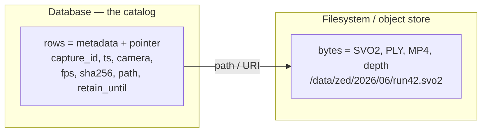

This wins for GB-to-TB, multi-year, offline workloads because the database stays small and fast (indexes, backups, and `VACUUM`/`OPTIMIZE` operate on kilobytes of metadata, not terabytes of pixels), reads are roughly **10x faster** straight from the filesystem than streaming the same bytes out of a relational DB, and retention becomes a row update plus a file delete rather than a database rewrite. It is also exactly how lakehouse catalogs (Iceberg/Delta, DuckLake) work — you are building a small, purpose-specific version of the same idea.

**When is it worth putting bytes *in* the database?** Only when the blob is *small*, you need the blob and its metadata to commit/rollback **atomically**, and you value a single backup artifact over throughput. The classic empirical study (Microsoft Research, *"To BLOB or Not To BLOB"*) found:

| Blob size | Winner | Notes |
|---|---|---|
| **< 256 KB** | **Database** | Fewer open/close syscalls; transactional |
| 256 KB – 1 MB | Gray zone | Depends on engine, filesystem, workload |
| **> 1 MB** | **Filesystem / object store** | DB overhead and bloat dominate |

Per-engine ceilings (hard limits are *not* recommendations):

| Engine | Hard max per value | Keep it under | What goes wrong above |
|---|---|---|---|
| PostgreSQL `BYTEA` | 1 GB | a few MB | Whole value loaded in memory; TOAST bloat; ~10x slower than file |
| PostgreSQL Large Object | 4 TB (2 GB pre-9.3) | streamed >1 GB only | Orphans, txn-scoped reads, non-portable API |
| MySQL/MariaDB `LONGBLOB` | 4 GB | a few MB | Bounded by `max_allowed_packet`; replication bloat |
| MongoDB document | 16 MiB | well under 16 MiB | Hits BSON limit → GridFS |

ZED SVO2 (~7 GB/hour with H.264/H.265, up to ~180 GB/hour lossless at HD2K@15FPS) plus point clouds, depth maps, and ordinary video are far past every threshold — **they never belong inside the database.**

#### PostgreSQL as a catalog — recommended default

- **What it is.** A robust, offline-capable relational database used purely to *index* files: rich types (`JSONB`, arrays, full-text), strong constraints, mature backup (`pg_dump`/PITR), table partitioning.
- **Best for.** The primary metadata catalog and system-of-record for video + ZED data over many years; querying by camera, time, scene tags, retention.
- **Avoid when.** You want a truly zero-admin single-file DB on a lone edge box — use SQLite instead.
- **Tools.** `psql`; `JSONB` + GIN indexes for heterogeneous capture metadata; partition by month/year for huge catalogs; logical/physical backups.
- **Trade-offs.** Needs a running service and basic ops; in return you get the strongest query and integrity story for long-lived metadata.

```sql
CREATE TABLE captures (
  capture_id   BIGINT GENERATED ALWAYS AS IDENTITY PRIMARY KEY,
  modality     TEXT NOT NULL,        -- 'image' | 'video' | 'svo2' | 'depth' | 'point_cloud'
  sensor       TEXT NOT NULL,        -- stable serial-style id, e.g. zed2i-sn12345
  captured_at  TIMESTAMPTZ NOT NULL,
  compression  TEXT,                 -- 'H264' | 'H265' | 'LOSSLESS'
  file_uri     TEXT NOT NULL,        -- 'file:///data/raw/svo2/flotation-cell-7/zed2i-sn12345/2026/06/29/...svo2'
  bytes        BIGINT NOT NULL,
  checksum     BYTEA NOT NULL,       -- BLAKE3/sha256 digest; integrity over multi-year retention
  calib_json   JSONB,               -- camera calibration / extrinsics
  scene_tags   JSONB,               -- flexible, heterogeneous metadata
  retain_until DATE                  -- drives lifecycle / cleanup jobs
);
CREATE INDEX ON captures (sensor, captured_at);
CREATE INDEX ON captures USING GIN (scene_tags);
```

#### PostgreSQL `BYTEA` (bytes in-row, via TOAST)

- **What it is.** A binary column; PostgreSQL transparently pushes large values out-of-line into a per-table TOAST table and deletes them with their row.
- **Best for.** *Small* binary tightly bound to a row needing atomic commit — thumbnails, calibration snapshots, small previews (< a few MB).
- **Avoid when.** Multi-MB-to-GB objects or anything throughput-sensitive (hard cap 1 GB, and the value is materialized whole in memory).
- **Tools.** Driver binary binding; `ALTER TABLE ... SET STORAGE EXTERNAL` to disable compression and speed partial reads.
- **Trade-offs.** Dead-simple and transactional, but ~10x slower than a file and inflates table/backup size; streaming from `BYTEA` with `EXTERNAL` storage is actually faster than a Large Object.

#### PostgreSQL Large Objects (`lo` / `oid`)

- **What it is.** The legacy big-binary mechanism — data in the shared `pg_largeobject` catalog with a seek/read/write streaming API.
- **Best for.** Single objects > 1 GB you must keep in the DB, or genuine server-side streaming/partial writes (max 4 TB since 9.3).
- **Avoid when.** Almost always for this use case — files on disk plus a path are simpler and faster.
- **Tools.** `lo` extension, `lo_import`/`lo_export`, `vacuumlo`, `lo_unlink`.
- **Trade-offs (the gotchas).** Deleting the referencing row does **not** delete the object (orphans → run `vacuumlo`); an open LO must be read within the same transaction; the API is Postgres-specific and non-portable.

#### MySQL / MariaDB (BLOB family)

- **What it is.** Binary columns in four sizes — `TINYBLOB` (255 B), `BLOB` (64 KB), `MEDIUMBLOB` (16 MB), `LONGBLOB` (4 GB).
- **Best for.** A catalog database (same pattern as Postgres) plus the *occasional* small `MEDIUMBLOB` tightly coupled to a row.
- **Avoid when.** Multi-MB+ media — transfers are bounded by `max_allowed_packet` (commonly 64 MB) and bloat replication.
- **Tools.** Prepared statements for binary, `LENGTH(col)` to check size before fetching, `OPTIMIZE TABLE` to reclaim fragmentation.
- **Trade-offs.** Familiar and transactional; the same "files > a few MB → object store + path" rule applies; no first-class chunking.

> **Mining-server note:** Whatever engine you choose, the catalog must carry a **`checksum` (BLAKE3 or sha256) and `bytes` per file** and re-verify on a schedule — that is how you prove a 3-year-old point cloud is still byte-intact *independent* of the filesystem. Use a stable `sensor`/UUID as the key, not an absolute path, so files can move across drives, tiers, and media over the years without breaking lineage. Use PostgreSQL for a central server, SQLite for a lone air-gapped box.

### Document & NoSQL Stores (MongoDB, GridFS)

- **What it is.** MongoDB is a document store with flexible (schemaless) BSON documents. A single document is capped at **16 MiB**; for larger files, **GridFS** splits a file into **255 KiB chunks** across two collections — `fs.files` (metadata) and `fs.chunks` (binary) — with a `{ files_id, n }` index for ordered retrieval.
- **Best for.** **Highly heterogeneous capture metadata.** When every camera/run emits different fields, MongoDB's schemaless documents avoid constant migrations — a genuine advantage for varied ZED/scene metadata. (PostgreSQL `JSONB` + GIN offers similar flexibility inside a relational catalog if you would rather consolidate.)
- **Avoid when.** Files < 16 MiB you could store as a single document with `BinData`; or large media you should keep as files/objects + a path. **GridFS is not object storage** — it cannot update file content in place, the GridFS API does not wrap its `fs.files`/`fs.chunks` writes in a transaction, and it is slower and more complex than files on disk.
- **Tools.** Official drivers' GridFS API, `mongofiles`. The GridFS `md5` field is deprecated — compute and store your own checksum.
- **Trade-offs.** Excellent for flexible metadata; for TB-scale ZED data, use **MongoDB for the metadata and the filesystem/object store for the bytes**, with a path/URI in the document. GridFS earns its place only for files just over 16 MiB you specifically insist on keeping in Mongo.

```python
# GridFS only for files just over 16 MiB you insist on keeping in Mongo:
from pymongo import MongoClient
import gridfs
fs = gridfs.GridFS(MongoClient().captures)
with open("preview.mp4", "rb") as f:        # but a 7 GB/hour SVO belongs on disk!
    fs.put(f, filename="preview.mp4", sensor="zed2i-sn12345", fps=15)
```

> **Mining-server note:** A related NoSQL trap is Redis — its 512 MB string cap is a *technical* limit, not a license to use it. A few large values block its single-threaded event loop and exhaust RAM; keep Redis to hot metadata and pointers (`key → {path, sha256, size}`), never blobs. Across every store in this section, the rule holds: the database catalogs the bytes, it does not contain them.

### Scientific & Array Formats (HDF5, Zarr, NetCDF, TileDB)

These formats store **dense or sparse numeric arrays** — exactly the shape of the new 3D data you are wrestling with. ZED depth maps are per-frame 2D float arrays; voxel / occupancy / TSDF grids are 3D+ arrays; point clouds are sparse 3D data. All four formats here are open, self-hostable, and read fully offline from local disk, which matters on an air-gapped box that must stay readable for years.

> **Mining-server note:** Don't store the *SVO recording* in these formats — it is a proprietary stereo-video container handled in the Video and 3D playbooks. Use array formats for the **exported / derived** depth and voxel data, and remember those exports are regenerable from the SVO, so they are a cache, not a master.

| Format | One self-contained file? | Writer model | Best fit here |
|---|---|---|---|
| **HDF5** | Yes (`.h5`) | Single-writer (SWMR = append-only) | Per-run bundle of depth maps + confidence/normals |
| **Zarr v3** | No (dir of chunks/shards) | Parallel multi-writer | Big voxel/TSDF grids written by many processes |
| **NetCDF-4** | Yes (HDF5 under the hood) | Single-writer | Labeled grids needing CF metadata + geoscience tooling |
| **TileDB** | No (array directory) | Lock-free parallel | Point clouds as sparse 3D arrays; dense + sparse in one engine |

#### HDF5

- **What it is.** A mature, self-describing hierarchical container (groups ≈ folders, datasets ≈ arrays) in a single file. Datasets are chunked, optionally compressed (gzip/szip built-in; Blosc/Zstd/LZ4 via filter plugins), and can carry a per-chunk **Fletcher32 checksum** for bit-rot detection. The maintained line is the 1.14.x series.
- **Best for.** One portable file per capture run holding a stack of ZED depth maps plus aligned confidence/normal maps and per-frame attributes; long-term archival where broad, decades-old tooling matters.
- **Avoid when.** You need concurrent writers, or the file lives on NFS/SMB. HDF5 is fundamentally single-writer; **SWMR is append-only to pre-created fixed-type datasets on a POSIX local filesystem** — it cannot add/remove objects mid-write and silently misbehaves over network filesystems.
- **Tools.** `h5py`, `PyTables`, the HDF5 C/Fortran libraries, `hdf5plugin` (bundles the extra codecs), `HDFView`, `h5ls`/`h5dump`.
- **Trade-offs.** Single file, rich chunk/compression/checksum options, ubiquitous and stable; but single-writer, one corrupt file risks the whole container, and non-built-in codecs need the matching plugin present *at read time* — an archival hazard, so record which filters each file uses and vendor the plugin libraries with the data.

#### Zarr (v3)

- **What it is.** A chunked, compressed N-D array format where each chunk is an object in a *store* (a directory of files, a zip, or object storage). `zarr-python` 3.0.0 (released 9 Jan 2025) brought full Zarr v3 support, an async core, and the **sharding codec** that packs many inner chunks (the read unit) into one shard file (the write unit). Codecs include Blosc, Zstd, gzip, and a crc32c checksum codec.
- **Best for.** Large voxel/occupancy/TSDF grids and depth stacks written or read in parallel by multiple processes, each owning different chunks with no locking dance; data you may later move to object storage (same format on disk and in a bucket).
- **Avoid when.** You want one self-contained file to hand around, or naive small chunks would create millions of tiny files and exhaust inodes on local disk — use the v3 sharding codec or a zip store to decouple file count from chunk size.
- **Tools.** `zarr-python` 3.x, `xarray`, `dask`, `tensorstore`, `fsspec`.
- **Trade-offs.** Trivially parallel writes, partial/random chunk reads, storage-agnostic, checksums; but a directory-of-files stresses local filesystems without sharding, and v3 is newer — pin the version and archive the reader for multi-year retention.

> **HDF5 vs Zarr in one line:** same chunked-compressed-array idea — HDF5 is one file, single-writer, POSIX-local; Zarr is many files/shards, parallel-writer, storage-agnostic.

#### NetCDF-4

- **What it is.** A self-describing scientific array format that, since v4, is **built on top of HDF5** (a constrained subset plus extras), adding a simpler API, named dimensions, and the widely used CF metadata conventions. It removed the 2 GB size limits of classic NetCDF-3 and inherits HDF5 chunking/compression/parallel-I/O.
- **Best for.** Labeled grid data that benefits from rich, standardized metadata and the large geoscience ecosystem (`xarray`, `ncview`, CDO, NCO, Panoply); teams wanting HDF5 performance with a gentler, self-documenting API.
- **Avoid when.** Your data isn't naturally a labeled grid (point clouds, catalogs), or you need HDF5's full hierarchical flexibility — NetCDF-4 deliberately exposes a subset and inherits the single-writer model.
- **Tools.** `netCDF4-python`, `xarray`, NCO/CDO, `ncdump`/`ncview`, Panoply.
- **Trade-offs.** Simpler than raw HDF5, CF metadata, massive stable tooling, decades-readable; but a capability subset of HDF5 and overkill if you don't need CF conventions.

#### TileDB (Embedded / Open Source)

- **What it is.** An MIT-licensed, embeddable C++ array engine (with Python/R/Java/Go APIs) supporting **both dense and sparse** multi-dimensional arrays, running fully self-hosted on local disk with the same code path as cloud. Writes land as immutable *fragments* (lock-free parallel writes), and versioning / time-travel is built into the format.
- **Best for.** ZED **point clouds**, stored as 3D sparse arrays with native floating-point (X,Y,Z) coordinates, spatial (R-tree-style) indexing for fast bounding-box slicing, and PDAL-based LAS/LAZ ingest — consolidating thousands of separate point-cloud files plus sidecars into one queryable, versioned array; also mixed dense+sparse workloads under one engine.
- **Avoid when.** You want the absolute safest "any tool reads this in 15 years" bet, or your needs are simple enough that Parquet/HDF5 already cover them — TileDB adds operational surface area and the format is younger.
- **Tools.** TileDB Embedded (C++), `tiledb` Python/R, PDAL and GDAL/Rasterio bridges.
- **Trade-offs.** One engine for dense + sparse, lock-free parallel writes, native versioning, spatial indexing for point clouds, self-hosted MIT library; but a smaller community than HDF5/Parquet and a still-evolving format — version-pin and archive the library for multi-year retention.

```python
# HDF5: a per-run depth bundle with chunking + per-chunk checksum
import h5py, hdf5plugin
with h5py.File("run_2026-06-29.h5", "w") as f:
    f.create_dataset("depth", shape=(0, 720, 1280), maxshape=(None, 720, 1280),
                     chunks=(1, 720, 1280), dtype="float32",
                     compression=hdf5plugin.Zstd(), fletcher32=True)  # checksum on
```

> **Mining-server note:** Turn on the built-in checksums (HDF5 `fletcher32`, Zarr `crc32c`) *and* keep a top-level SHA-256 per file in your catalog. You won't get cloud durability here, so format checksums are your bit-rot tripwire and the catalog hash proves integrity independent of the filesystem.

### Columnar & Tabular Formats (Parquet, Arrow, Lance)

Columnar formats are the highest-leverage, lowest-risk piece of this whole guide: a **metadata catalog** that indexes every SVO recording, video clip, depth file, and debug image you accumulate — one row per asset with its path, capture time, sensor, codec, size, and checksum. Query that catalog offline with DuckDB and a multi-TB archive becomes *findable* and *verifiable* without any server. Keep the heavy bytes in the array/video/object stores; put only **pointers + metadata + hashes** here.

| Format | Role | Mutable? | Use it for |
|---|---|---|---|
| **Parquet** | On-disk columnar storage | Immutable (append = new files) | The metadata catalog; flattened point/detection tables |
| **Arrow IPC / Feather v2** | In-memory / interchange | n/a (transient) | Zero-copy process-to-process handoff — *not* archival |
| **Lance** | ML-native columnar | Versioned (ACID, time-travel) | Versioned multimodal training/eval datasets |

#### Apache Parquet

- **What it is.** The de-facto columnar analytics format: files are row groups → column chunks → pages, with per-column min/max statistics and a footer enabling **predicate pushdown** (engines skip data they don't need). Supports Snappy/Zstd/Gzip; files are immutable (write-once).
- **Best for.** Your metadata catalog — one row per frame/recording (`captured_at, run_id, sensor, intrinsics, exposure, label, svo_path, video_path, depth_h5_path, checksum, …`), partitioned by date so a year of runs is a prunable directory tree queried offline with DuckDB. Also a good home for point clouds *flattened into columnar tables* (`x,y,z,intensity,class,frame_id`).
- **Avoid when.** Storing the big binaries themselves (depth arrays, point clouds, video) — keep those in HDF5/Zarr/TileDB/SVO and store pointers here; or when you need row-level random access or frequent updates (Parquet is scan-oriented and immutable).
- **Tools.** `pyarrow`, **DuckDB** (the ideal offline SQL engine here), Polars, pandas.
- **Trade-offs.** Tiny, fast, partition/predicate pushdown, universally supported, rock-solid for archival; but not for N-D arrays or blobs, and over-partitioning creates a small-file explosion — aim for ~128 MB–1 GB files with 128–512 MB row groups and compact often.

```sql
-- Offline, serverless catalog query over a date-partitioned Parquet tree
SELECT path, captured_at, bytes
FROM read_parquet('catalog/**/*.parquet', hive_partitioning = true)
WHERE sensor = 'zed2i-sn12345' AND modality = 'svo2'
  AND captured_at >= '2026-03-01' AND captured_at < '2026-04-01';
```

#### Apache Arrow (IPC / Feather v2)

- **What it is.** Primarily an *in-memory* columnar standard; its IPC serialization (Feather v2 on disk) has an on-disk layout identical to the in-memory layout, so reads are zero-copy and memory-mappable with no deserialization cost.
- **Best for.** Fast handoffs between processes and languages (a C++ vision pipeline → Python tooling), mmap-ing a feature table, caching hot intermediates you'll re-read.
- **Avoid when.** Long-term archival — Arrow's own guidance is to use **Parquet for storage** and Feather/IPC only for short-term interchange.
- **Tools.** `pyarrow`, Arrow C++/Rust, Polars (Arrow-native).
- **Trade-offs.** Zero-copy, mmap, language-neutral; but larger on disk than Parquet and not an archival format.

#### Lance

- **What it is.** A modern, Rust-implemented columnar format for ML/multimodal data (images, video frames, embeddings, labels), built around fast random/point access, zero-copy versioning (ACID, time-travel, tags, branches), a built-in vector index, and cheap column evolution ("convert from Parquet in 2 lines"). It runs on local disk; LanceDB layers a vector database on top.
- **Best for.** A versioned multimodal training/eval dataset — depth + RGB + point-cloud-derived features + embeddings + labels in one table you can shuffle-sample, append columns to without rewrites, and time-travel to reproduce a model run.
- **Avoid when.** You just need a metadata catalog (Parquet + DuckDB is simpler and more universal), or maximum decade-scale "any tool reads it" stability matters — Lance is the youngest format here and evolves quickly.
- **Tools.** `pylance` / LanceDB; integrates with pandas, Polars, DuckDB, PyArrow, PyTorch.
- **Trade-offs.** Fast random access, git-like versioning, vector search, multimodal-native, self-hosted; but least battle-tested for multi-year archival — pin versions and archive the reader. (Lance's own benchmarks claim large random-access speedups over Parquet; treat that as a vendor claim, not a measured guarantee.)

> **Mining-server note:** Build the Parquet-over-DuckDB catalog *first*. It's nearly free, scales from GBs to many TBs of rows, and is decades-stable. Reach for Lance only once you're curating versioned ML training sets; for everything else the catalog is the win.

### Vector Databases (LanceDB, Qdrant, Milvus, pgvector)

Vector databases store **embeddings** — numeric fingerprints a model (CLIP, DINOv2, a ResNet, your own) computes from each image or video frame so you can search media by *similarity*, not by pixels. They store derived vectors and metadata, never the raw blobs. With millions of these vectors you can do, fully offline: near-duplicate detection (collapse redundant frames before they bloat years of debug storage), similarity retrieval ("find every frame that looks like this fault condition"), and dataset curation (cluster, surface out-of-distribution or mislabeled samples — exactly what tools like FiftyOne do).

> **Mining-server note:** Sizing is roughly N × D × 4 bytes (float32) plus index overhead — 10M × 512-d ≈ 20 GB raw. That's tiny next to your video, which is precisely why the vector store is a metadata/search layer, not the bulk store. For ZED data, embed rendered frames, depth maps, or point clouds; the raw `.svo2` stays in blob storage.

| Option | Form factor | Offline self-host | Sweet-spot scale | Metadata filtering |
|---|---|---|---|---|
| **LanceDB** | Embedded, file-based | `pip` / wheelhouse, no server | 1 → ~100M on one node | SQL + full-text + vector |
| **pgvector** | Postgres extension | OS package + extension | up to low tens of millions | Full SQL (it *is* Postgres) |
| **Qdrant** | Single Rust binary / Docker | `docker save`/`load` or binary | millions → 100M+ | Rich first-class payload filters |
| **Milvus** | Standalone (1 image) / Distributed (K8s) | Docker; distributed needs etcd+MinIO | 100M → billions | Yes (scalar/expr) |
| **FAISS** | Library, **not a DB** | vendored wheels | in-RAM, billions w/ compression | None (build it yourself) |

#### LanceDB

- **What it is.** An Apache-2.0 *embedded*, in-process vector/multimodal store built on the Lance format — no server, no daemon, persisting as files on the local filesystem. SDKs for Python/Rust/Node plus REST; keeps vectors, metadata, and multimodal data in one table searchable by vector, full-text, or SQL.
- **Best for.** The default for an air-gapped single server: `pip install lancedb`, point it at a directory, index millions of image/video-frame embeddings, done — ideal for near-dup and curation workflows without babysitting a service.
- **Avoid when.** Many independent processes/hosts must write the same store concurrently (multi-writer concurrency is limited — it's embedded, not a clustered server).
- **Tools.** `lancedb` Python/Rust/Node SDKs; integrates with pandas, Polars, DuckDB, FiftyOne.
- **Trade-offs.** Maximum operational simplicity and zero-service offline use, at the cost of clustered horizontal scale and mature multi-writer semantics.

```python
import lancedb                              # offline, no server — just a directory
db = lancedb.connect("/data/vectors/frames.lance")
tbl = db.create_table("frames", data=[{"vector": emb, "path": p, "ts": t}])
tbl.create_index(metric="cosine")
hits = tbl.search(query_emb).limit(20).to_list()   # similarity / near-duplicate
```

#### pgvector

- **What it is.** A PostgreSQL extension (v0.8.x) adding vector columns and ANN indexes. Supports up to 16,000 dimensions for the `vector` type (HNSW indexes up to 2,000 dims for `vector`, 4,000 for `halfvec`), HNSW and IVFFlat indexes, and six distance operators.
- **Best for.** Teams already running Postgres who want vectors living next to relational metadata — labels, file paths, run IDs — with full SQL joins, ACID, and backups they already understand. Typical image-embedding dims (CLIP 512, ViT-L 768, DINOv2 up to 1536) sit under the HNSW limit, and the *same* Postgres instance can also run TimescaleDB (next section), giving you vectors + telemetry + metadata in one database.
- **Avoid when.** You're heading toward hundreds of millions / billions of vectors with tight latency targets — a purpose-built engine indexes and quantizes faster at that scale.
- **Tools.** Standard `psql`/Postgres tooling and ORMs.
- **Trade-offs.** Unmatched operational simplicity *if Postgres is already in your stack*, but it tops out earlier and has fewer ANN knobs than dedicated engines. (HNSW caps at 2,000 dims for `vector` — use `halfvec` for higher.)

#### Qdrant

- **What it is.** A Rust vector engine shipped as a single binary or Docker image, with first-class payload (metadata) filtering and aggressive memory controls: scalar quantization (4×, int8), binary (up to 32×), product (up to 64×), plus on-disk vectors.
- **Best for.** Self-hosted, metadata-filtered similarity at millions → 100M+ vectors on one or a few nodes where RAM is the constraint — the common pattern keeps quantized vectors in RAM with originals on disk. A lightweight Qdrant Edge embedded mode exists for constrained boxes.
- **Avoid when.** You have a single node and want zero services running — LanceDB/pgvector are lighter.
- **Tools.** Python/Rust/Go/JS clients, REST + gRPC, web dashboard.
- **Trade-offs.** Best-in-class filtering and memory efficiency with a clean single-binary ops model, at the cost of running and tuning a service.

#### Milvus

- **What it is.** A vector database with three modes: **Lite** (a Python library, up to a few million vectors), **Standalone** (all components in one Docker image, up to ~100M), and **Distributed** (Kubernetes, 100M → billions, requiring external etcd + MinIO + message queue).
- **Best for.** The largest collections — genuine 100M–billions with strong recall and multiple index strategies. Standalone is a reasonable single-server tier; Lite is a fine embedded experiment path.
- **Avoid when.** You're at single-node GB-to-low-TB embedding scale — Distributed's etcd + MinIO + queues are real operational weight to maintain offline.
- **Tools.** PyMilvus, Attu GUI, Docker Compose / Helm; integrates with FiftyOne.
- **Trade-offs.** The most scalable and feature-complete here, but the distributed mode is the heaviest to operate air-gapped; for this reader, **Standalone** is the relevant tier.

#### FAISS

- **What it is.** Meta's ANN **library** (not a database), C++ with Python bindings, CPU and GPU. Index families include Flat (exact), IVFFlat, IVFPQ, and HNSW.
- **Best for.** Embedding the raw ANN engine inside your own code or a curation tool — it's the engine FiftyOne uses for `compute_similarity` / near-duplicate detection.
- **Avoid when.** You want a *database*: FAISS has no metadata filtering, no CRUD server, no concurrency control, and no durability beyond manually saving/loading index files.
- **Tools.** `faiss-cpu` / `faiss-gpu`; commonly driven via FiftyOne or custom scripts.
- **Trade-offs.** Maximum control and speed (especially GPU) with minimal moving parts, at the cost of building everything a database normally gives you.

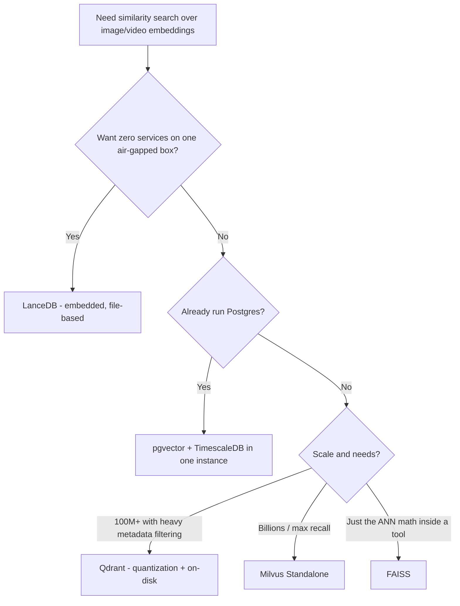

> **Mining-server note:** Embeddings are only comparable within the same model version. Pin and record the embedding model in your catalog — switching models invalidates the index and forces a planned re-embed of the corpus, a recurring multi-year cost the vector store can't avoid.

### Time-Series Databases (InfluxDB, TimescaleDB)

Time-series databases hold the **numbers-with-timestamps** your rig emits while it records — ZED IMU / positional-tracking samples, camera/exposure settings over time, conveyor and line sensors, PLC tags, temperatures, throughput — plus the ops metrics of the pipeline itself. **They store telemetry and metadata, never the frames, SVO files, or point clouds.** Their value is correlation: "what did the sensors say at the moment this SVO segment was captured," driving downsampling and retention so multi-year history stays compact.

| Option | Form factor | Best at | Long-term retention | Offline note |
|---|---|---|---|---|
| **TimescaleDB** | Postgres extension | Telemetry that must join metadata via SQL | Compression + retention + continuous aggregates | One DB for vectors + telemetry + metadata |
| **InfluxDB 3 Core** | Single binary (OSS) | High-throughput dedicated sensor ingest | Core limited; long-range needs Enterprise | **single query ≤ 72h span in Core** |
| **Prometheus** | Single binary | Monitoring the *pipeline's own* health | ~15-day default; needs remote store | Pull-based; not a sensor warehouse |

#### TimescaleDB

- **What it is.** A PostgreSQL extension turning Postgres into a time-series engine via **hypertables** (time-partitioned chunks), columnar **compression** (commonly cited around 90–95% / 10–20× on cold chunks), **continuous aggregates** (auto-maintained rollups), and automated **retention policies**.
- **Best for.** Telemetry that should live next to relational metadata and be queried together in plain SQL — join sensor readings to capture sessions, sites, equipment IDs. Crucially it runs in the *same* Postgres instance as pgvector, giving embeddings + metadata + telemetry in one database to back up and operate.
- **Avoid when.** You need single-purpose ingest throughput beyond one Postgres node and don't value the relational/SQL integration.
- **Tools.** All standard Postgres tooling; Grafana for dashboards.
- **Trade-offs.** Full SQL + relational joins + compression + a familiar ops model, vs. a dedicated TSDB's peak ingest rate.

```sql
SELECT create_hypertable('sensor', 'ts');
ALTER TABLE sensor SET (timescaledb.compress);
SELECT add_compression_policy('sensor', INTERVAL '7 days');
SELECT add_retention_policy('sensor', INTERVAL '5 years');
```

#### InfluxDB 3 Core

- **What it is.** A purpose-built TSDB. **Core** (GA April 2025) is the open-source (MIT/Apache-2) tier: a single object-storage-backed binary with SQL + InfluxQL and high write throughput. Note that v1 is in maintenance mode and InfluxData's focus has shifted to v3; v2 continues to receive maintenance updates.
- **Best for.** Dedicated, high-ingest telemetry not tied to relational data, where queries are mostly over recent windows.
- **Avoid when.** You need multi-year *ad hoc* historical queries on Core — a **single query may span at most 72 hours**, and long-range history, compaction, and HA are reserved for InfluxDB 3 Enterprise (also self-hostable). Also avoid it when telemetry must join relational metadata (use TimescaleDB).
- **Tools.** Influx CLI/clients, Grafana, Telegraf collectors.
- **Trade-offs.** Excellent purpose-built ingest and a clean single binary, but the open-source Core tier's historical-query limits push serious long-term/HA needs toward Enterprise.

#### Prometheus

- **What it is.** A pull-based monitoring system with its own TSDB, built for infrastructure/application operational metrics; default local retention is ~15 days.
- **Best for.** Watching the health of the pipeline itself — ingest rates, queue depths, blob-store disk usage, GPU utilization, job failures — paired with Grafana and Alertmanager for offline dashboards.
- **Avoid when.** It's your *data* store. Prometheus is explicitly not for long-term retention, high cardinality, or IoT/sensor ingestion — use a TSDB above for that.
- **Tools.** `node_exporter` and friends, Grafana, Alertmanager.
- **Trade-offs.** Superb, simple ops-monitoring with a huge exporter ecosystem, but a poor fit as a long-term/sensor warehouse.

> **Mining-server note:** The strongest low-ops play for an isolated box is "consolidate into Postgres" — pgvector + TimescaleDB in one instance gives embeddings, telemetry, and relational metadata behind a single service with a single backup story. Use TimescaleDB compression + downsampling/retention to bound multi-year growth.

### Data Lakes & Lakehouse (Iceberg, Delta Lake, Hudi)

Lakehouse table formats add **ACID transactions, time-travel/snapshots, and schema/partition evolution** to columnar Parquet on a filesystem or object store. The central misconception to correct first: they do **not** store your raw video or SVO bytes. They manage *tabular* data — detection results, per-frame metadata, sensor logs, and point clouds *flattened into columnar tables* (`x,y,z,intensity,class,frame_id`). Your blobs stay as files (disk / object store), and a catalog points at them.

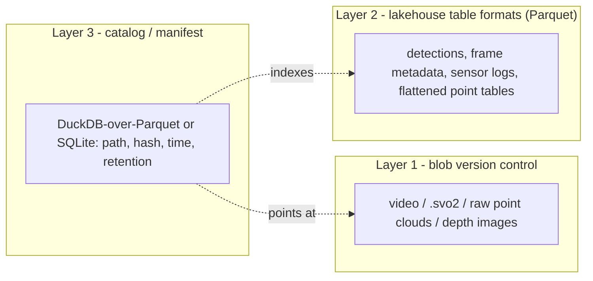

#### Apache Iceberg

- **What it is.** An open table format using a snapshot + manifest model that separates table metadata from data files, with atomic commits via compare-and-swap on a catalog pointer. Recent line is ~v1.10.
- **Best for.** Many different query engines reading the same tables, frequent schema changes, and **hidden partition evolution** (re-partition without rewriting data).
- **Avoid when.** You want zero extra infrastructure — Iceberg generally **requires a catalog**. (For pure offline single-server use, PyIceberg's SQL catalog backed by SQLite + a filesystem warehouse needs no service; multi-engine setups expect a JDBC/REST catalog.)
- **Tools.** Spark, Flink, Trino, **PyIceberg**, the DuckDB Iceberg extension.
- **Trade-offs.** The most engine-neutral open standard; the catalog requirement is friction for a tiny isolated deployment.

#### Delta Lake

- **What it is.** A table format using an ordered transaction log over Parquet, with simple ACID and time-travel. Recent line is ~v4.0.
- **Best for.** A general-purpose lakehouse with the lightest offline footprint of the big three — `delta-rs` (the `deltalake` Python/Rust library) reads and writes local or S3-compatible (SeaweedFS / Garage) Delta tables **without Spark or Java**, integrating with pandas/Polars/DuckDB.
- **Avoid when.** You need heavy update/delete/CDC throughput (Hudi is stronger), or you must read tables written at very new Databricks-Spark protocol versions `delta-rs` doesn't yet support.
- **Tools.** `delta-rs`/`deltalake` (no-Spark), DuckDB `delta` extension, Spark.
- **Trade-offs.** The easiest "ACID + time-travel without a server" for a Python-centric team; merge-on-read/deletion-vector features are less mature than copy-on-write.

#### Apache Hudi

- **What it is.** A table format built for *mutable* data, with Copy-On-Write and full Merge-On-Read, native incremental queries and CDC, and async compaction/clustering. Recent line is ~v1.0.2.
- **Best for.** Streaming-heavy, update/delete-heavy ingestion needing frequent upserts and incremental consumption.
- **Avoid when.** Your workload is append-mostly (your case) — Hudi's update machinery is largely wasted and it's the most operationally complex of the three.
- **Tools.** Spark, Flink, Hudi Streamer, Trino/Hive/Presto.
- **Trade-offs.** Best mutability/CDC story; heaviest for a simple append-only archive.

> **Mining-server note:** For a single, isolated, append-mostly server, a full multi-engine Iceberg-with-REST-catalog or Hudi deployment is usually overkill. If you want ACID/time-travel on the *structured* layer, prefer the lightest path: `delta-rs`, or **DuckLake** — an open lakehouse format that keeps all table metadata in a SQL database (a single SQLite file works) while data stays as plain Parquet, giving snapshots, time-travel, and schema evolution with almost no infrastructure. Reserve the full lakehouse stacks for a staffed central data center.

| | Iceberg | Delta Lake | Hudi |
|---|---|---|---|
| Recent version (mid-2026) | ~1.10 | ~4.0 | ~1.0.2 |
| Catalog required | **Yes** | No | No |
| No-Spark local engine | PyIceberg / DuckDB | **delta-rs / DuckDB** | weak |
| Partition evolution | **Hidden** | Limited | via clustering |
| Update/delete/CDC | Append-incremental | CoW (MoR maturing) | **Strongest** |
| Best workload | Multi-engine analytics | General + append | Update/stream-heavy |

### Data Version Control (DVC, git-annex, DataLad, lakeFS)

These tools version the **opaque large files** themselves — video, `.svo2`, raw `.ply`/`.pcd` point clouds, depth-map images, model weights — keeping the bytes out of Git while tracking lightweight, content-addressed pointers. The content addressing (hashes) doubles as a long-term **fixity/integrity** mechanism, which is valuable for multi-year retention: you can prove a years-old recording is bit-for-bit intact and enforce N verified copies. They are Layer 1 in the three-layer model above — distinct from the lakehouse table formats, which version *tabular* data, not blobs.

| | DVC | git-annex | DataLad | lakeFS |
|---|---|---|---|---|
| Running server needed | No | No | No | **Yes** (PostgreSQL + server) |
| Offline / air-gap | Excellent (local / S3-compatible remote) | Excellent (USB/directory remote) | Excellent | Good via `lakectl local` |
| Branch/merge over live lake | Snapshot only | No | No | **Yes (zero-copy)** |
| Scales to millions of files | Weaker | **Strong** | **Strong** | **Strong** |
| Provenance capture | Pipelines | Manual | **Automatic** | Hooks/commits |
| Integrity (fixity) | md5 | sha + `fsck`, `numcopies` | inherits git-annex | commit immutability |
| Effort to operate | Low | Medium | Medium | **High** |

#### DVC (Data Version Control)

- **What it is.** "Git for data + a Makefile for ML." Large files/dirs are replaced in Git by small `.dvc` pointer files (md5 hash + size); the bytes live in a cache and push/pull to a **remote** that can be a plain local directory or an S3-compatible bucket (SeaweedFS / Garage). Pipelines (`dvc.yaml` DAG, `dvc.lock`, `dvc repro`) re-run only stages whose inputs changed.
- **Best for.** Git-centric teams versioning datasets/model artifacts alongside commits and wanting reproducible preprocessing — fully offline via a local-dir or S3-compatible (SeaweedFS / Garage) remote.
- **Avoid when.** You have millions of tiny files (per-file tracking gets slow), need concurrent multi-writer branching over a shared lake (use lakeFS), or want true distributed peer copies (use git-annex).
- **Tools.** Local-dir / S3-compatible (SeaweedFS / Garage) / SSH / NFS remotes; `reflink`/`hardlink`/`symlink` cache modes to avoid duplicating bytes.
- **Trade-offs.** Dead simple, offline-capable, integrity via md5; but a naive setup stores each file twice (cache + workspace) unless you enable link modes, and it's a snapshot model, not branch/merge over a live bucket.

```bash
# Self-hosted S3-compatible store (SeaweedFS / Garage), no cloud; credentials kept out of Git
dvc remote add -d s3store s3://debug-bucket/dvcstore
dvc remote modify s3store endpointurl http://s3.local:9000
dvc add data/videos/2026-06-29/        # creates a .dvc pointer
dvc push                               # bytes -> S3-compatible store; pointer -> Git
```

#### git-annex

- **What it is.** A Git extension that turns Git into a key-value store for large files: the pointer and per-file location metadata live in Git; content is distributed via **special remotes**. It's a true distributed system — many clones each hold different subsets, and git-annex tracks how many copies exist and where.
- **Best for.** Very large file counts and multi-TB scale; **air-gapped sneakernet** (configure a removable USB / `directory` special remote, `git annex copy --to usb`, carry it, `git annex get` elsewhere); strong "N verified copies" guarantees (`git annex fsck` verifies checksums, `numcopies` enforces redundancy).
- **Avoid when.** You want a polished ML-pipeline UX out of the box (use DVC/DataLad on top) or a server UI with branching over object storage (use lakeFS).
- **Tools.** Special remotes for `directory`/USB, `rsync`, SSH, S3-compatible (SeaweedFS / Garage); client-side encryption and chunking of huge files.
- **Trade-offs.** Extremely capable and battle-tested for huge distributed datasets; but the raw CLI has a learning curve and a symlink-based working tree some tools dislike on certain filesystems.

#### DataLad

- **What it is.** A convenience + provenance layer built on Git + git-annex (it requires both), adding nested **subdatasets**, automatic provenance capture (`datalad run` records the exact command that produced an output), and on-demand `datalad get`.
- **Best for.** Multi-year, multi-TB, provenance-critical archives where you want "this depth map was produced by this script version from this SVO" recorded automatically. Proven at scale (the Human Connectome Project dataset is ~80 TB / ~15M files under DataLad), fully self-hosted with no central service.
- **Avoid when.** You just need a quick snapshot pushed to an S3-compatible store (DVC is lighter), or you don't want the Git/git-annex dependency.
- **Tools.** Inherits all git-annex special remotes (directory/USB, rsync, S3-compatible: SeaweedFS / Garage); modular dataset linking.
- **Trade-offs.** Best-in-class provenance and modular scaling; inherits git-annex's complexity and symlink model.

#### lakeFS

- **What it is.** A **server** that puts Git-like semantics (branch, commit, merge, revert, tag, hooks) over an object store, including a self-hosted S3-compatible store (e.g. SeaweedFS / Garage). Branching is zero-copy (metadata-only), so you can branch a multi-TB lake instantly, validate ingest on a branch, then atomically merge.
- **Best for.** You already run an S3-compatible store (SeaweedFS / Garage) and want atomic all-or-nothing ingest of a day's capture, isolated experiment branches over the whole lake, and pre-merge validation hooks (e.g., reject a commit if a depth map is missing its SVO). `lakectl local` gives DVC-like offline checkout/commit.
- **Avoid when.** You can't operate an extra stateful service — lakeFS **requires a KV metadata store (PostgreSQL ≥ 11)** plus the server (~512 MB RAM / 1 CPU, a recommended ~10 GiB starting DB that grows ~150 MiB per 100k uncommitted writes), and objects are accessed *through* lakeFS rather than directly from the bucket.
- **Tools.** S3-compatible API, Spark/Trino/Python/DuckDB, `lakectl` / `lakectl local`, Docker/Helm.
- **Trade-offs.** The most "real" Git-for-a-whole-data-lake experience, scaling to billions of objects; cost is a stateful PostgreSQL + server and an access-path indirection — heavier than DVC/git-annex for a small team.

> **Mining-server note:** For this reader, the priorities are: build the catalog (Layer 3) first; version blobs with **DVC** (local / S3-compatible remote) if you're Git-centric, or **git-annex/DataLad** when file counts are huge, you need verified N-copy redundancy, or you do USB-sneakernet between air-gapped machines. Add lakeFS only if you genuinely want git-like branch/merge over an S3-compatible bucket (SeaweedFS / Garage) and can run PostgreSQL.

## Directory Layout & Partitioning Strategies

> **Scope.** How to physically organize a multi-terabyte, multi-year archive of **images, video, and Stereolabs ZED 3D data (SVO/SVO2, depth maps, point clouds)** on **self-hosted, air-gapped servers**. Your image debug storage already works; the new pressure is video and 3D, which are far larger and have a *raw → derived* relationship the layout must exploit.

One idea drives everything in this chapter: **the directory layout is the physical truth, and a separate catalog is the queryable view.** Large binaries (a multi-GB SVO, a video segment, a point cloud) do not belong inside a columnar table. Keep two layers cleanly separated:

| Layer | What it holds | Where it lives | Who reads it |
|---|---|---|---|
| **Blob tree** | The actual files, write-once / immutable | Plain filesystem (ext4/XFS/ZFS) in a hierarchical, partitioned directory tree | `ls`, `rsync`, `tar`, your pipeline, FFmpeg, the ZED SDK |
| **Catalog / index** | One row per blob: path, checksum, size, modality, project, sensor, UTC timestamp, **labels**, pipeline version, storage tier | A small set of **Hive-partitioned Parquet** files (or a single DuckDB/SQLite file) sitting next to the blobs | DuckDB, Spark, PyArrow |

The layout answers *"where is the file?"*. The catalog answers *"which files match this query?"*. Pushing query-only, **volatile** dimensions (content labels, QA pass/fail, the model that produced a detection) into the **catalog instead of the path** is exactly what keeps the blob tree immutable: re-labeling a million frames becomes an `UPDATE` in the catalog, not a million `mv` operations.

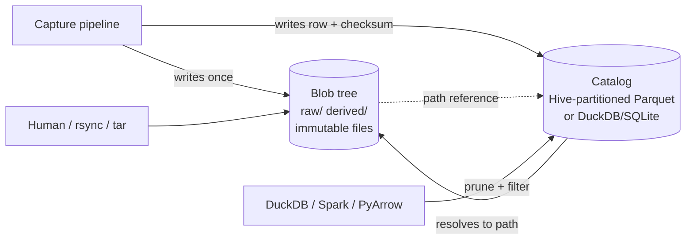

> **Mining-server note:** On an isolated box there is no managed metastore and no cloud catalog service. The blob tree plus a single DuckDB/Parquet catalog is the offline sweet spot — both are static binaries with nothing to administer, and the catalog can always be rebuilt by re-walking the tree if it is ever lost.

### Partitioning Dimensions

Pick your dimensions first, then decide for each one whether it belongs **in the path** or **in the catalog**. The deciding test is simple: a dimension earns a place in the path only if it is **(a) stable for the life of the file** and **(b) frequently filtered**. Everything else goes in the catalog.

| Dimension | In path or catalog? | Why | Cardinality |
|---|---|---|---|
| **Raw vs. derived** | Path (top level) | Different lifecycle and immutability rules; derived is disposable | 2 |
| **Modality** (image / video / svo2) | Path | Stable forever; different tools per modality | low (3–6) |
| **Project / site / line** (e.g. `flotation-cell-7`) | Path | Stable; nearly every query filters by it | low–med |
| **Sensor / device** (camera serial) | Path | Stable; "everything from camera X" is a constant query | med |
| **Time** (capture date, UTC) | Path | Append-only, never rewritten; natural archival and tiering boundary | high but ordered |
| **Content / label** (froth class, defect, has-person) | **Catalog only** | **Volatile** — labels get added, corrected, and are multi-valued; in the path they force file moves and break immutability | very high |
| **Quality / QA flag** | Catalog only | Volatile | low |
| **Content hash** (SHA-256 / BLAKE3) | Catalog always; *optionally* a separate content-addressed store | Enables integrity checking and dedup | unique |

The recurring trap is putting **content labels or QA flags in the path**. Labels are volatile and multi-valued, so encoding them in directory names forces a file move on every re-label and destroys the write-once guarantee. Keep them as columns the catalog can `UPDATE` in place.

### Composite Hierarchical Keys

Order path levels **most-stable and most-filtered first, most-volatile last**. There are two payoffs:

1. **Stability first** → you almost never move a file once it is written, so immutability is cheap to enforce.
2. **Selectivity first** → query engines prune whole subtrees early, and a human or `rsync` can grab a coherent slice with a single glob.

The recommended order for this reader:

```
raw|derived / modality / project / sensor / YYYY / MM / DD[/ HH]
```

- `raw|derived` is first because it cleanly splits "never touch" from "safe to delete and recompute."
- `time` is last because it is the only append-only, ever-growing axis and the natural backup/tiering boundary.
- Labels are deliberately absent — they live in the catalog.

> **Mining-server note:** Resist the instinct to put the date at the very top (`/2026/06/29/...`). Time-first scatters every project and sensor across every date directory, so "all of camera X" or "all of project Y" becomes a full-tree walk, and you cannot tier or archive a single line's data independently — a real problem when one line's footage ages out faster than another's.

Four concrete layout schemes are worth weighing. Use the same template for each.

**Positional time-first tree** (`/YYYY/MM/DD/...`)
- **What it is:** capture date at the top of the path.
- **Best for:** single-stream, append-only logging where you only ever query by time.
- **Avoid when:** you filter by project or sensor, or need per-project tiering — i.e. this reader.
- **Tools:** any filesystem; `find`, `rsync`.
- **Trade-offs:** trivially simple to write; terrible for "all of camera X"; cannot archive a project independently.

**Positional dimension-first tree** (`raw/modality/project/sensor/YYYY/MM/DD/`) — **recommended for the blob tree**
- **What it is:** stable dimensions first, time last, plain human-readable directory names.
- **Best for:** browsing, `rsync`/`tar` slices, tiering whole subtrees, pure filesystem operations.
- **Avoid when:** you need an engine to auto-map directory names to query columns (pair it with a catalog instead).
- **Tools:** ext4/XFS/ZFS, `ls`, `rsync`, `tar`, the ZED SDK, FFmpeg.
- **Trade-offs:** human-friendly and portable; engines will not infer columns from it, so it relies on the sidecar catalog.

**Hive `key=value` tree** — **recommended for the catalog (and any derived columnar exports)**
- **What it is:** every path level is encoded as `key=value`.
- **Best for:** automatic discovery and partition pruning in DuckDB / Spark / PyArrow.
- **Avoid when:** naming raw media blobs no engine reads as a dataset — you get verbose paths for no benefit.
- **Tools:** DuckDB, Apache Spark, PyArrow / Arrow Datasets.
- **Trade-offs:** zero-config querying and pushdown; longer paths; you must zero-pad values and cap the partition count.

**Content-addressed store** (`cas/sha256/ab/cd/<hash>`)
- **What it is:** files named by their hash, fanned out by a short hash prefix.
- **Best for:** dedup across redundant captures, integrity by construction, immutability by construction.
- **Avoid when:** you want it as the *primary* human-browsable layout — hashes carry no time or project ordering.
- **Tools:** `sha256sum`/`b3sum`, plus the catalog to map hash → meaning.
- **Trade-offs:** perfect dedup, built-in verification, and an evenly balanced tree (Git-style 2-char fan-out gives 256 buckets per level, 65,536 over two); but it is unreadable to humans and useless without the catalog.

> **Net recommendation:** the **dimension-first tree** for blobs, **Hive** for the catalog, and **content-addressing optionally underneath** for dedup.

### Time-Based Partitioning in Depth

**Use ISO 8601, zero-padded, so lexical sort equals chronological sort.** Always pad: `06`, never `6`; `01`, never `1`. With fixed-width components, the plain alphabetical ordering that `ls`, globbing, directory listings, and Hive value sorting all use is automatically chronological — `2026/01/15` sorts before `2026/06/29` before `2027/01/01` with no date parsing anywhere.

- **Directory levels:** split components into nested directories — `2026/06/29/` — so each level stays small and you can move a whole month with one `mv`.
- **In filenames:** use the **basic (compact) ISO form with `Z`** — `20260629T141500Z` — which avoids the `:` character (illegal or awkward on some filesystems and in URLs) while staying sortable. Always store **UTC**: air-gapped sites often have skewed or hand-corrected local clocks, and UTC keeps ordering correct across DST changes and clock fixes.

**Granularity is your file-count balancer.** Match the time leaf to each sensor's data rate so leaf directories stay a sane size:

| Per-sensor capture rate | Time leaf | Files per leaf (target) |
|---|---|---|
| A few clips/day (ZED SVO chunked hourly) | `YYYY/MM/DD` | ~24–100 |
| Continuous video in N-minute segments | `YYYY/MM/DD` | hundreds |
| High-rate image bursts (thousands/day) | `YYYY/MM/DD` or `YYYY/MM/DD/HH` | a few thousand |
| Very high frequency | `.../HH` | keep at or below ~10k–100k |

**Archival and backup boundaries fall out for free.** Because time is the last path level, a whole `YYYY/MM` (or `YYYY/MM/DD`) directory is a self-contained unit you can snapshot, `tar`, checksum, `rsync` to cold storage, or write to LTO tape as one atomic job without touching anything older. Align backup cadence and retention rules to these boundaries.

> **Mining-server note:** For multi-year retention, treat each completed `YYYY/MM` as frozen the moment it rolls over. Generate a SHA-256 (or BLAKE3) manifest for it, store that manifest both alongside the data and in the catalog, and let your monthly ZFS scrub plus optional `par2` parity on offline copies prove the bytes are still intact years later.

### Hive-Style Partitioning (key=value)

Hive partitioning encodes each level as `key=value` in the directory name:

```
catalog/modality=svo2/project=conveyor-scan/ingest_date=2026-06-29/part-0000.parquet
```

It is worth using for the **catalog** (and for any derived columnar exports) because the offline engines you would actually run on an air-gapped box read it automatically.

| Engine | Auto-reads Hive? | How / notes |
|---|---|---|
| **DuckDB** | **Yes, on by default.** | `SELECT * FROM read_parquet('catalog/**/*.parquet', hive_partitioning=true)`. Detects the `key=value` pattern, does partition pruning and filter pushdown (a `WHERE ingest_date='2026-06-29'` skips other directories), and auto-casts `DATE`/`TIMESTAMP`/`BIGINT` (override with `hive_types={...}`). Writes via `COPY t TO 'catalog' (FORMAT parquet, PARTITION_BY (modality, ingest_date))`. **Best offline choice — single binary, no server.** |
| **PyArrow / Arrow Datasets** | **Yes.** | `ds.dataset(path, partitioning="hive")`, or it infers Hive by default. Guidance: avoid more than ~10,000 distinct partitions; partition field *order* in the path is ignored. |
| **Apache Spark** | **Yes.** | All file sources auto-discover `key=value` partitions. If you point at a *sub*-partition, set `basePath` so the upper keys are still recognized as columns; inconsistent directory depth causes partition-discovery conflicts. |

Hive caveats that bite:

- **Zero-pad values too** (`month=06`, not `month=6`) so lexical value order stays chronological across every tool.
- **Do not also store the partition column inside the file** — it is redundant; engines reconstruct it from the path.
- **Never** put a high-cardinality field (frame id, content hash) in a Hive key, or you create millions of directories. PyArrow's ~10,000-partition ceiling is the practical guardrail.
- For **raw binaries** (images, video, SVO), Hive directory names only become query columns *if a tool reads them as a dataset*. The robust, tool-agnostic pattern is a plain dimension-first blob tree plus a sidecar Parquet catalog that carries those columns explicitly. Use Hive for the catalog, not necessarily for every blob folder.

### Raw vs. Derived

This is the highest-leverage decision for ZED data specifically. Split the tree at the top into two lifecycles and enforce them differently.

- **`raw/` is write-once and immutable.** SVO/SVO2 files, original video, original images. Mount it read-only where you can; set files to `0444`; verify with stored checksums. Never edit in place — corrections become *new* files, never overwrites (the medallion "bronze" rule: append-only, nothing mutated or deleted).
- **`derived/` is reproducible and disposable.** Depth maps, exported point clouds (PLY/PCD), rectified frames, thumbnails, detections, transcodes. Anything regenerable from `raw/` plus your pipeline code lives here and can be deleted under storage pressure and recomputed later.

**Why this matters enormously for ZED:** an `.svo/.svo2` stores **only the essential sensor streams** (rectified stereo video plus IMU/sensor data) — roughly **7 GB per hour with H.265 at HD2K 15 fps, versus around 180 GB per hour in lossless mode** (Stereolabs figures; rates scale with resolution, FPS, and bitrate). **Depth maps and point clouds are not stored in the SVO at all — the ZED SDK regenerates them from the stereo pair at replay.** The consequences for layout:

- Keep the **SVO/SVO2 as the single raw artifact** — it is compact, complete, and replayable. SVO2 (default since ZED SDK 4.1) additionally records high-frequency and custom/external-sensor data, making it an even stronger single source of truth.
- Put any materialized depth or point-cloud exports in `derived/` and treat them as a **cache**. Do not back them up like raw data — back up the SVO and the export recipe (pipeline version) instead.
- Tag every derived artifact with the **pipeline version** that produced it (both in the filename suffix and in the catalog) so you can distinguish stale caches and recompute deterministically.

> **Mining-server note:** Materializing and backing up regenerated depth/point-cloud dumps as if they were raw is one of the fastest ways to fill a mine-site disk. The SVO is the small, durable master; the depth and clouds are a disposable cache derived from it.

### Naming Conventions & File-Count Limits

A filename should be **sortable, unique, parseable, and portable** with no catalog lookup required.

**Template:** `<sensor-id>_<UTC-timestamp>_<seq>[__<tag>][.<ext>]`

```
cam-froth-01_20260629T141500Z_0001.jpg
cam-overview-02_20260629T141500Z_0007.mkv
zed2i-sn12345_20260629T141500Z.svo2
zed2i-sn12345_20260629T141500Z__depth-v2.npz      # derived, versioned
zed2i-sn12345_20260629T141500Z.svo2.sha256        # integrity sidecar
zed2i-sn12345_20260629T141500Z.json               # metadata sidecar (same basename)
```

Rules:

- **No spaces, no special characters.** Restrict to `[A-Za-z0-9._-]`. Spaces and `:` break shell globs, scripts, URLs, and some filesystems.
- **Stable IDs only.** Use the **camera serial** (`zed2i-sn12345`), never `"left-camera"` or a role that can be reassigned when hardware is swapped.
- **Zero-padded sequence numbers** (`_0001`) so lexical order equals numeric order.
- **Compact ISO-8601 UTC** timestamp with `Z`, no colons.
- **Versions on derived data** (`__depth-v2`, or a full pipeline semver `__pipe-1.4.0`) so caches are self-describing.
- **Sidecars share the basename** plus a new extension (`.json`, `.sha256`) so they sort adjacent and associate trivially.
- Filenames are **stable identifiers** — once written, never renamed.

**File-count limits and tree balancing.** The rule of thumb is **a few thousand files per leaf directory, and at most ~10k–100k.** ext4 with HTree indexing (and the `large_dir` feature on Linux 4.13+) and XFS can technically hold millions of entries — ext4's index reaches roughly 10–12M, billions with `large_dir` — but `ls`, `rsync`, backup scans, and globbing degrade long before the filesystem does. Treat the filesystem ceiling as irrelevant; **performance, not capacity, is the real limit.**

| Concern | Practical guidance |
|---|---|
| Files per leaf directory | Target a few thousand; stay at or below ~10k–100k for fast `ls`/`rsync`/backup |
| ext4 raw capacity | HTree ~10–12M entries; `large_dir` (Linux 4.13+) extends to billions — but perf is the binding constraint |
| Distinct Hive partitions (catalog) | Keep under ~10,000 (PyArrow guidance) |
| Parquet **catalog** file size | 128 MB–1 GB per file; compact small files; row groups 128–512 MB |
| Blob files | Their natural size (GBs) is fine — the small-files problem is about the *catalog*, not the media |

Balancing tactics: tune time granularity per the table in *Time-Based Partitioning in Depth*; for a content-addressed store, use Git-style hex fan-out (`ab/cd/abcd…`) — one or two 2-char levels give 256 or 65,536 buckets so even billions of blobs spread evenly. On huge directories, prefer `ls -f`/`ls -U` or `find` over a default sorted `ls -l`, which triggers a sort and a `stat` storm.

### Storage Tiering (Hot / Warm / Cold)

Because time is the deepest path level, tiers map directly onto **time slices** and move as whole directories.

| Tier | Holds | Media (offline-friendly) | Move operation |
|---|---|---|---|
| **Hot** | Last days–weeks; active debugging; all derived caches | NVMe / SSD | written here by the pipeline |
| **Warm** | Last ~1 year of raw | Bulk HDD / RAID (ZFS / RAID-Z) | `mv` whole `YYYY/MM` from hot |
| **Cold** | Older raw; rarely accessed | High-density HDD, **LTO tape**, or external drives kept offline | `tar`/`zfs send` a `YYYY/MM`, verify, then drop from warm |

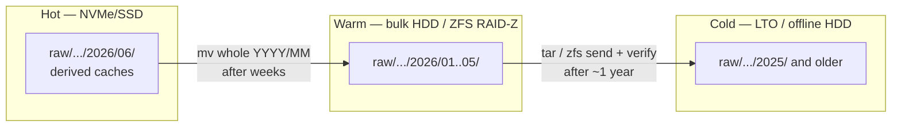

Implementation on air-gapped servers:

- A nightly job walks `raw/**/YYYY/MM` directories older than the tier threshold, computes or verifies a **checksum manifest**, copies the slice to the next tier, re-verifies, then frees the space. Update the catalog's `tier` column so queries know where a blob currently lives.
- **Whole-month moves are the unit of work.** Because each `YYYY/MM` is self-contained, tiering is a single `mv`, `tar`, or `zfs send` per slice with nothing older disturbed.
- **Multi-year integrity:** ZFS snapshots plus a scheduled `scrub` detect and repair bit-rot on spinning tiers; for offline/tape archives, add **`par2` parity files** so you can repair without the original. Store the checksum manifest *with* the archive and keep a copy in the catalog so integrity is provable independent of any single medium.

> **Mining-server note:** "RAID is not a backup." Tiering moves data for cost and access speed, but a true air gap means the cold copy is physically disconnected (offline HDD or LTO) so a bad job, a bad command, or ransomware on the live host cannot reach it. Verify a restore from cold media on a schedule — an unread tape is an unproven backup.

#### Worked example: combined images + video + ZED-3D tree

```
/data
├── raw/                                   # immutable, write-once (chmod 0444 / RO mount)
│   ├── image/                             # already-handled modality, same scheme
│   │   └── flotation-cell-7/
│   │       └── cam-froth-01/
│   │           └── 2026/06/29/
│   │               ├── cam-froth-01_20260629T141500Z_0001.jpg
│   │               └── cam-froth-01_20260629T141500Z_0001.json
│   ├── video/
│   │   └── flotation-cell-7/
│   │       └── cam-overview-02/
│   │           └── 2026/06/29/
│   │               ├── cam-overview-02_20260629T141500Z_0007.mkv
│   │               └── cam-overview-02_20260629T141500Z_0007.json
│   └── svo2/
│       └── conveyor-scan/
│           └── zed2i-sn12345/
│               └── 2026/06/29/
│                   ├── zed2i-sn12345_20260629T141500Z.svo2          # raw, replayable
│                   └── zed2i-sn12345_20260629T141500Z.svo2.sha256
│
├── derived/                               # reproducible cache; safe to delete & recompute
│   └── svo2/
│       └── conveyor-scan/
│           └── zed2i-sn12345/
│               └── 2026/06/29/
│                   ├── zed2i-sn12345_20260629T141500Z__depth-v2.npz
│                   └── zed2i-sn12345_20260629T141500Z__cloud-v2.ply
│
├── cas/                                   # optional content-addressed dedup store
│   └── sha256/ab/cd/abcd…ef.bin
│
└── catalog/                               # Hive-partitioned Parquet index (DuckDB-queryable)
    └── modality=svo2/
        └── ingest_date=2026-06-29/
            └── part-0000.parquet          # cols: path, checksum, bytes, project, sensor,
                                            #       captured_at, labels[], pipeline_ver, tier
```

Example offline query (DuckDB, no server, on the air-gapped box):

```sql
-- All ZED captures from one camera in June 2026 that a model flagged 'overflow'
SELECT path, captured_at, bytes
FROM read_parquet('catalog/**/*.parquet', hive_partitioning = true)
WHERE modality = 'svo2'
  AND sensor   = 'zed2i-sn12345'
  AND ingest_date BETWEEN DATE '2026-06-01' AND DATE '2026-06-30'
  AND list_contains(labels, 'overflow');
```

`modality=` and `ingest_date=` are pruned straight from the path; `labels` (volatile) is filtered as a column — and no file under `raw/` ever moved.

## Cross-Cutting Concerns

Once you have decided *where the bytes physically land*, four disciplines decide whether a multi-terabyte archive is still **usable and trustworthy** a decade from now: you can **find** data (catalog/index), the bytes are still **correct** (integrity), you have more than one **copy** (backup/dedup), and you are not **wasting** space or CPU (compression). These sit on top of every storage layout in this guide and matter most exactly where you have the least safety net.

> **Mining-server note:** Your debug *images* are already handled. The new pain — **video** and **Stereolabs ZED 3D data** (point clouds, depth maps, `.svo2` recordings) — is precisely the data that is biggest, hardest to re-acquire, and longest-lived. On isolated, air-gapped sites you cannot lean on a cloud provider's durability SLA or managed backups, so every recommendation below is offline-capable and built from static binaries.

These four concerns reinforce each other. A useful way to hold them in your head:

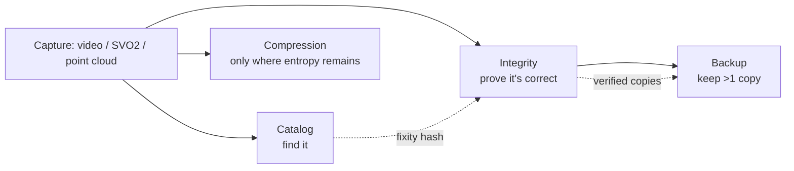

---

### The Catalog / Index in Practice

Files on disk are not a database. With tens of thousands of clips, point clouds, and SVO recordings spread over years, *"find every ZED capture from line 2 in March where depth-valid % < 60"* is impossible with `find` and `grep`. The fix is a **two-layer pattern**: sidecar metadata that travels *with* each asset, plus a derived index you can *query*.

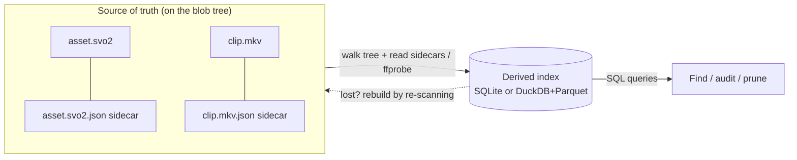

The index is **derived and disposable**: if it is ever lost or corrupted, you rebuild it by walking the tree again. The sidecars are the durable truth.

#### Sidecar metadata.json (the source of truth lives with the file)

- **What it is.** A small JSON file written next to every asset (or every capture session) carrying what the filename cannot — capture time, camera serial, site/line, pipeline version, calibration ID, labels, and a content checksum. Technical media facts are *extracted* with standard tools, never typed by hand.

- **Best for.** Self-describing archives that survive being copied to any medium (HDD, LTO) and read with no database present — the offline-first ideal.

- **Avoid when.** Never skip it; but do not treat the sidecar as your *query* surface — that is the index's job.

- **Tools.**
  - **`ffprobe`** (ships with FFmpeg) — codec, resolution, duration, frame rate, bitrate, stream layout for video and SVO-derived MP4s.
  - **`exiftool`** — EXIF/XMP for stills and many container formats.
  - **ZED SDK** — for `.svo2`: frame count, resolution, FPS, depth mode, and any *custom* timestamped channels you recorded. (See the 3D playbook for SVO2 specifics.)
  - **PDAL / `lasinfo`** — point count, extent, CRS for LAS/LAZ point clouds.

- **Trade-offs.** One extra small file per asset (mitigate sidecar drift by writing atomically — `tmp` + `fsync` + `rename` — and mirroring its contents into the index).

```bash
# Extract technical metadata into a sidecar at ingest
ffprobe -v quiet -print_format json -show_format -show_streams clip.mkv > clip.mkv.json
```

A worked sidecar for a ZED recording:

```json
{
  "asset_id": "9f3c1a7e-2b40-4d51-8a1e-0c7d6f2e9b11",
  "path": "raw/svo2/concentrator-A/zed2i-sn12345/2026/03/12/zed2i-sn12345_20260312T084122Z_0007.svo2",
  "modality": "svo2",
  "captured_at": "2026-03-12T08:41:22Z",
  "site": "concentrator-A", "line": 2,
  "sensor": "zed2i-sn12345",
  "camera": {"model": "ZED 2i", "serial": "SN12345", "fw": "1.5.2"},
  "zed": {"sdk": "4.1.3", "depth_mode": "NEURAL", "fps": 30, "frames": 5400,
          "resolution": "1920x1080"},
  "zed_depth_valid_pct": 71.4,
  "pipeline": {"name": "froth-3d", "git_sha": "a1b2c3d", "calib_id": "cal-2026-02"},
  "labels": ["overflow_event"],
  "bytes": 5123456789,
  "blake3": "af1349b9f5f9a1a6...",
  "schema_version": 2
}
```

#### Fields worth storing (don't skip these)

| Field group | Examples | Why it earns its place |
|---|---|---|
| **Identity** | `asset_id` (UUID), relative `path` | Use a stable UUID as the key, *not* the path — files move across years and media |
| **Classification** | `modality`, `site`, `line`, `sensor` | The dimensions you filter on most |
| **Time** | `captured_at` (UTC) | Always UTC on air-gapped boxes with skewing clocks |
| **Technical** | `codec`, `width/height`, `fps`, `duration_s`, `frames`, `bytes` | Pulled from ffprobe/SDK; powers quality filters |
| **Integrity** | `blake3` / `sha256` + algorithm | Doubles as fixity record *and* dedup key |
| **Provenance** | `pipeline_sha`, `calib_id`, `zed.sdk` | You will thank yourself when reprocessing or re-deriving depth |
| **Operational** | `labels`, `retention_class`, `indexed_at`, `schema_version` | Mutable workflow state; lets the schema evolve |

> **Mining-server note:** Record the **ZED SDK version and depth mode** per dataset. SVO2 does not store depth or point clouds — the SDK *recomputes* them on playback, so the same recording yields different depth across SDK versions. Without the pinned version, your 3D results are not reproducible.

#### The queryable index — SQLite vs DuckDB-over-Parquet

Build the index by **walking the tree once**, reading each sidecar (and/or running ffprobe), and writing rows. Re-scan incrementally: skip files whose `path + mtime + size` are unchanged. Two offline-friendly engines, both single static binaries:

| | **SQLite** | **DuckDB + Parquet** |
|---|---|---|
| **What it is** | Single-file embedded relational DB | Embedded analytical (OLAP) engine querying columnar Parquet directly |
| **Best for** | Up to a few million rows; point lookups, "open this asset"; *mutable* fields (labels, retention flags) | Millions–billions of rows; scans/aggregations/`GROUP BY` over the whole archive |
| **Storage** | One `.db` file | A directory of `.parquet`, partitioned by year/month/site |
| **Concurrency** | Single-writer | Read-optimized; rewrite a partition to update |
| **Offline** | Single static binary | Single static binary |

**Recommendation:** Start with **SQLite** for operational metadata you mutate — it is the simplest thing that works for a lone isolated box. Add a **DuckDB-over-Parquet** layer once you want fast analytics across the multi-TB tree or the index passes tens of millions of rows. They compose: keep the JSON sidecars as truth, mirror them into Parquet for analytics.

A schema that works in both:

```sql
CREATE TABLE assets (
  asset_id      TEXT PRIMARY KEY,      -- stable UUID, not the path
  path          TEXT NOT NULL,
  modality      TEXT,                  -- image | video | svo2 | depth | point_cloud
  captured_at   TIMESTAMP,             -- UTC
  site          TEXT,  line     INTEGER,
  camera_model  TEXT,  sensor   TEXT,
  codec         TEXT,  width INTEGER, height INTEGER,
  fps           DOUBLE, duration_s DOUBLE, frames INTEGER,
  bytes         BIGINT,
  checksum      TEXT,                  -- fixity + dedup key (BLAKE3)
  zed_depth_valid_pct DOUBLE,          -- nullable; ZED depth-valid %
  pipeline_sha  TEXT, calib_id TEXT, zed_sdk TEXT,
  labels        TEXT,                  -- JSON array
  retention_class TEXT,
  indexed_at    TIMESTAMP, schema_version INTEGER
);
CREATE INDEX idx_assets_time      ON assets(captured_at);
CREATE INDEX idx_assets_site_line ON assets(site, line);
```

Querying a Hive-partitioned Parquet catalog directly with DuckDB — no import step:

```sql
-- catalog laid out as catalog/year=*/month=*/site=*/*.parquet
SELECT site, line, COUNT(*) AS clips, SUM(bytes)/1e12 AS tb
FROM read_parquet('catalog/**/*.parquet', hive_partitioning = true, union_by_name = true)
WHERE modality = 'svo2' AND captured_at >= '2026-03-01'
GROUP BY site, line
ORDER BY tb DESC;

-- find low-quality 3D captures to prune
SELECT path, zed_depth_valid_pct
FROM read_parquet('catalog/**/*.parquet')
WHERE modality = 'svo2' AND zed_depth_valid_pct < 60;
```

DuckDB helpers when building or auditing the index: `glob('data/**/*')` enumerates files, `read_parquet(..., filename = true)` adds a source-file column, and `parquet_metadata()` / `parquet_schema()` inspect Parquet internals (row counts, row groups, min/max stats) *without* scanning the data.

> **Mining-server note:** Keep catalog Parquet files in the ~128 MB–1 GB range and partition only by stable, low-cardinality dimensions (year/month/site) — never by `frame_id` or hash. A thousand tiny Parquet files cripple scans. This sizing applies to the *catalog*, not your multi-GB media blobs, which stay at their natural sizes. See the partitioning chapter for layout details.

---

### Data Integrity Over Years

Disks fail loudly *and* quietly. **Silent bit-rot** — a flipped bit the drive returns with no error reported — is the killer for multi-year archives, because an ordinary copy faithfully propagates the corruption into your backups *before you notice*. Two complementary defenses: **fixity records** (prove a file is unchanged) and a **checksumming filesystem that scrubs and self-heals**.

#### Fixity checksums (SHA-256 / BLAKE3)

- **What it is.** A cryptographic hash of every asset recorded at ingest (in the sidecar and the index), re-computed periodically and compared to detect rot, truncation, or accidental edits.

- **Best for.** Proving integrity *independent of the filesystem* and across media and copies; the hash doubles as a dedup key.

- **Avoid when.** Never skip recording one — but do not mistake a checksum for *repair*. It only **detects**; repair needs redundancy or a second copy.

- **Tools.**

| Algorithm | Throughput (typical) | Notes |
|---|---|---|
| **SHA-256** (`sha256sum`) | ~300–500 MB/s/core (faster with SHA-NI) | NIST/FIPS standard, universally available; the safe default for published/interop hashes |
| **BLAKE3** (`b3sum`) | Multiple GB/s; tree-structured, scales across cores | Far faster for re-hashing TBs; newer, less ubiquitous in package ecosystems |

- **Trade-offs.** Re-hashing many TB with SHA-256 is painfully slow, so prefer **BLAKE3** for archive-wide re-verification and keep **SHA-256** for hashes others must verify. Store both the value *and* the algorithm in the sidecar.

```bash
find raw/svo2 -type f -print0 | xargs -0 b3sum > CHECKSUMS.b3   # at ingest
b3sum --check CHECKSUMS.b3                   # quarterly audit
```

#### Checksumming filesystems that scrub (ZFS / Btrfs)

- **What it is.** ZFS and Btrfs checksum every data *and* metadata block on write and verify it on read. A periodic **scrub** re-reads all blocks, recomputes checksums, and — *when you have redundancy* (mirror, RAIDZ, Btrfs RAID1/10) — **self-heals** by overwriting the bad copy from a good one. This is the single most effective defense against silent bit-rot for a self-hosted archive.

> Plain ext4/XFS checksum *metadata only* — they cannot detect silent corruption in your data blocks. For a multi-year archive that is the decisive difference. (See the filesystem chapter for the full ZFS/Btrfs/XFS comparison.)

- **Best for.** Multi-year local archives on isolated servers. ZFS is the conservative choice (mature RAIDZ, ~20 years in production); Btrfs is fine for single-disk checksumming and RAID1/10 self-healing.

- **Avoid when.** **Btrfs RAID5/6 is still not production-ready** (parity write-hole) — use ZFS RAIDZ2 for parity redundancy instead.

- **Tools.** `zpool scrub`, `btrfs scrub`, plus `cron` to schedule them.

- **Trade-offs.** ZFS wants a little planning (pools/vdevs) and prefers ECC RAM; Btrfs is simpler to start. Both let you pause, resume, and monitor scrubs.

```bash
# ZFS: scrub monthly (cron); weekly for critical pools
zpool scrub tank   && zpool status tank
# Btrfs:
btrfs scrub start /mnt/tank && btrfs scrub status /mnt/tank
```

**Cadence:** monthly for normal data, weekly for critical — the goal is to find rot *before* it reaches your only good copy.

#### "RAID is not a backup"

RAID (or RAIDZ/mirroring) protects against **drive failure** and, with checksums, repairs bit-rot. It does **not** protect against accidental `rm`, a buggy pipeline overwriting files, ransomware, a controller that scrambles the array, fire/theft/flood, or corruption you replicate before noticing. A mirror dutifully mirrors your mistakes. Redundancy buys *availability*; you still need independent, ideally offline **backups** (next section) and **snapshots** for point-in-time recovery.

> **Mining-server note:** ZFS snapshots are nearly free and instant — schedule them so a fat-fingered pipeline that overwrites a day of SVO2 captures is a `zfs rollback` away, not a disaster. Snapshots still live on the same pool, so they complement, never replace, an offline backup.

---

### Backup & Deduplication

For an air-gapped mining site, "backup" means **encrypted, deduplicated, verifiable copies on removable media you physically rotate offsite** — not a cloud bucket. Three mature, self-hostable tools dominate; all do content-defined chunking, deduplication, and authenticated encryption.

#### The 3-2-1 rule (and its hardened form)

- **3** copies of the data, on **2** different media types, with **1** offsite.
- Hardened **3-2-1-1-0**: add **1** offline/air-gapped (immutable or physically disconnected) copy, and **0** verified errors (you actually test restores).
- For an air-gapped site this maps cleanly to: **live array → local backup repo → rotated external HDDs / LTO tapes carried offsite**, each verified.

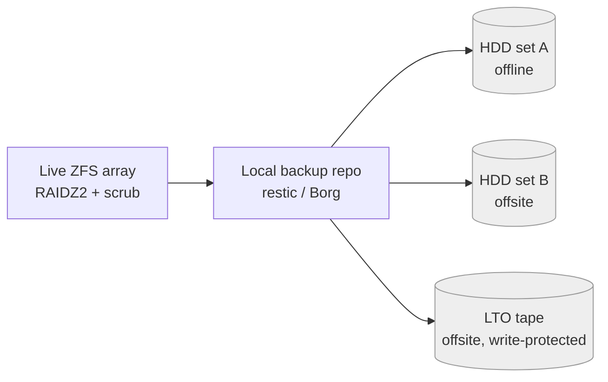

#### Tool comparison

| | **restic** | **BorgBackup** | **Kopia** |
|---|---|---|---|
| Chunking | Content-defined (Rabin) | Content-defined (Buzhash) | Content-defined (configurable) |
| Encryption | AES-256, authenticated, on by default | repokey/keyfile; AES-256, BLAKE2 option | Per-repo, on by default |
| Compression | **zstd since v0.14.0 (2022)** | lz4 / zstd / zlib / lzma | zstd / others |
| Dedup scope | Global within repo | Within repo | Global within repo |
| Air-gap features | Many backends incl. local/USB; `check --read-data` | **append-only mode**; paper/QR key export | Append-only/immutability; built-in web UI |
| Best for | Mixed environments, simple cross-platform CLI, removable disks | Performance on local/USB targets; tends to produce slightly smaller repos | Teams wanting a GUI + snapshot policies |

> Typical real-world dedup lands around **~60–85%**, heavily workload-dependent. For large media that changes little between runs, all three perform similarly. Treat that range as *typical, not guaranteed*.

- **Best for.** **restic** as the simple, cross-platform default for removable disks; **Borg** when you want append-only protection and the smallest repos on local/USB targets; **Kopia** when a GUI helps a small team.

- **Avoid when.** None is a fit for *streaming* your hot capture path — back up the at-rest archive, not the live recorder.

#### Important nuance for your data

Dedup shines on data with repeated blocks (VM images, document trees, incremental snapshots). **Already-compressed media (JPEG, H.264/H.265, lossy SVO2) deduplicates and compresses poorly** — backups of those are essentially "encrypted copies." That is fine; you still want versioning, encryption, and a second medium. Set the backup tool's compression to a cheap level (or off) for media-heavy repos so you do not burn CPU for ~0% gain.

#### Air-gapped workflow (removable-media rotation)

1. Back up the live array to a **local repo** (`restic backup /tank/archive`).
2. Sync/copy that repo to **rotating external HDDs** (label A/B/C) or write to **LTO tape**; only one is connected at a time, the rest sit **offline** in a separate location.
3. Use **append-only** (Borg) or write-protected media so a compromised host cannot wipe history.
4. **Export/print the encryption key** and store it separately — with `repokey`, losing the key (or a corrupted repo) means no recovery.
5. **Verify, then test-restore.** A structural check is cheap; a content check reads every byte; only a restore proves the backup.

```bash
restic check                      # metadata/index consistency (cheap, often)
restic check --read-data          # re-reads & re-checksums every pack (slow, quarterly)
restic restore <snap> --target /tmp/restore-test   # the only real proof
borg key export /repo borg-key.txt --paper          # store the key OFF the repo
```

> **Mining-server note:** **LTO tape** is the classic true air gap — cheap per-TB, decades of shelf life, inherently offline — at the cost of slow random access. External HDDs are simpler and faster to restore for GB-to-low-TB; tape wins as you climb into many TB with strict multi-year retention. Whichever you pick, a backup is **unproven until you restore it and byte-compare**; put a test restore on the calendar.

---

### Compression

The number-one mistake is re-compressing data that is *already* compressed. JPEG, H.264/H.265 video, most SVO2 recordings, and PNG are already entropy-coded — running zstd or gzip over them yields ~0% and can *grow* the file from container overhead. Spend CPU only where entropy remains.

| Data type | Recompress at archive layer? | Use instead |
|---|---|---|
| JPEG / PNG images | No (already handled for you) | Store as-is |
| H.264 / H.265 video | No | Store as-is |
| ZED `.svo2` (lossy H.264/H.265 mode) | No | Store as-is; it's the master |
| Raw / lossless video masters | Yes, lossless codec | **FFV1 in Matroska** |
| Point clouds (LAS/XYZ/PLY ASCII) | Yes, big wins | **LAZ (LASzip)** lossless; **Draco** for lossy transmission |
| Depth maps (16-bit PNG) | Already compressed | Store as-is; or pack into FFV1 if sequential |
| Logs, CSV/JSON sidecars, Parquet, model files | Yes | **zstd** |
| Backup repos of mixed data | Tool-managed | restic/Borg/Kopia (zstd, *low* level for media) |

#### General-purpose: zstd

- **What it is.** A modern lossless compressor with an excellent speed/ratio curve.

- **Best for.** Text, CSV/JSON sidecars, logs, Parquet (built-in zstd codec), config, and anything not already entropy-coded.

- **Avoid when.** Input is already-compressed media (see table) — you pay CPU for nothing.

- **Tools.** `zstd` CLI; native Parquet `CODEC zstd`.

- **Trade-offs.** Levels **1–19** (default 3); **20–22** need `--ultra` and more RAM; `--long` improves ratio on large files; `-T0` uses all cores. Defaults: `zstd -3` for fast/streaming, `zstd -19 --long` for cold archival of compressible data.

#### Lossless video masters: FFV1 + Matroska

- **What it is.** FFV1 is an open, lossless, intra-frame codec with **per-frame/per-slice CRC checksums** (built-in fixity), paired with the Matroska `.mkv` container. The pairing is a recognized long-term preservation format.

- **Best for.** Footage you must keep *bit-exact* for re-analysis or forensics over years.

- **Avoid when.** The footage is already acceptable as H.264/H.265 and bit-exactness is not required — FFV1 masters are several times larger. (Codec details and proxy strategy live in the Video playbook.)

- **Tools.** FFmpeg.

- **Trade-offs.** Bit-exact and self-verifying, at a large size premium.

```bash
ffmpeg -i master.mov -c:v ffv1 -level 3 -g 1 -slicecrc 1 master.mkv
```

#### Point clouds: LAZ (lossless) and Draco

- **What it is.** **LAZ** is the lossless compressed form of ASPRS LAS via LASzip — decompresses bit-for-bit, typically a large size reduction. **Draco** compresses point clouds/meshes with optional *lossy* attribute quantization, common in glTF/3D-tiles delivery.

- **Best for.** **LAZ** as the archival master for ZED-derived point clouds (lossless, well supported by PDAL/LAStools); **Draco** only for transmission/web delivery where some quantization is acceptable.

- **Avoid when.** Never use lossy Draco as the *master* of measurement-grade 3D data — keep a lossless copy. (Format internals are in the 3D & Point-Cloud playbook.)

- **Tools.** LASzip/LAStools, PDAL; Draco.

- **Trade-offs.** LAZ is lossless and widely readable; Draco trades fidelity for the smallest transfer size.

> **Mining-server note:** Treat the original **`.svo2` as the 3D master** and regenerate point clouds and depth maps on demand — the SDK exports point clouds (PLY/PCD/XYZ/VTK) and depth (16-bit PNG/PFM/PGM) from it. Store any point-cloud *derivatives* you keep as **LAZ**. This keeps the authoritative, reproducible source compact and your derivatives cheap to rebuild — and it pairs with the partitioning chapter's "raw vs. derived" split, where derived 3D exports belong in a disposable tree.

#### Default stack (tying the four together)

A pragmatic, fully offline default for a multi-year, multi-TB machine-vision + ZED archive:

- **Integrity filesystem:** ZFS (mirror at GB scale, **RAIDZ2** as you grow) with **monthly scrub** (weekly for critical) and periodic snapshots; avoid Btrfs RAID5/6.
- **Catalog:** `metadata.json` sidecar per asset (ffprobe/exiftool/ZED-SDK extracted) carrying a **BLAKE3** hash; scan the tree into **SQLite** for mutable metadata and mirror into **Parquet** for **DuckDB** analytics.
- **Fixity:** `b3sum` sidecars re-verified quarterly *plus* ZFS scrub for self-healing. Remember RAID/RAIDZ ≠ backup.
- **Backup:** **restic or Borg**, encrypted, following **3-2-1-1-0**: live array → local repo → rotated external HDDs and/or LTO carried offsite; append-only/write-protected; **export the key**; run `check --read-data` and a test restore on a schedule.
- **Compression:** store media as-is; `zstd -19 --long` for logs/CSV/JSON/Parquet; **FFV1/MKV** only for must-be-lossless footage; **LAZ** for point-cloud masters; keep `.svo2` as the 3D master and regenerate derivatives.

This stack is entirely open-source, runs offline as static binaries, scales from a single disk to many-TB pools, and gives you detectable-and-repairable integrity, fast search, and verifiable backups for the long haul.

## Modality-Specific Playbooks

This is where the format theory meets your three data types. The reader already has images under control, so the **Images** section is a short validation. **Video** is your main pain and gets the most depth. **3D & Point-Cloud Data** covers the awkward ZED outlier. Everything here is self-hosted and offline: the whole stack is FFmpeg + Matroska/MP4 for video, and the ZED SDK + open exporters for 3D. Install once from a local mirror and you never touch the network again.

> **Mining-server note:** the connective tissue across all three modalities is the same hybrid you'll see throughout this guide — **bytes on the filesystem, facts in a catalog**. Each blob gets a checksum and a sidecar so it stays findable and verifiable for years even if your index DB is lost.

### Images

You already do this well. The goal here is to confirm the good habits and name the one practice that crosses over into the video and 3D sections: **packing many small files**.

- **Formats.** Lossy JPEG for debug captures where a little artifacting is fine; PNG (lossless) for anything you'll measure against, for masks/labels, and for any 16-bit data (depth-as-image lives in the 3D section, not here). WebP/AVIF can shave bytes but add a decoder dependency — for an air-gapped box, the universality of JPEG/PNG usually wins. Don't re-encode JPEGs you already have; it only compounds loss.
- **Sidecars.** Keep a small `.json` next to each image (or a batch manifest) with capture timestamp, camera serial, line/shift, exposure, and a checksum. This is the same pattern video and 3D use — write it atomically (`tmp` → `fsync` → `rename`) and roll its contents into the catalog so you can query without walking the tree.
- **Thumbnails / proxies for debug browsing.** A tiny downscaled preview per image (or a periodic contact sheet) lets you scan a TB-scale archive on a modest workstation. Keep previews under `/working/` and treat them as disposable — regenerable from the masters at any time.

The genuinely important image lesson for the rest of this guide is the **small-file problem**. Millions of individual files crush directory listing, `rsync`, backups, and inode budgets — and you will hit this again with extracted video frames, ZED depth-PNG sequences, and Zarr chunks. The fix is to **pack** them.

**Packing many small files**

- **What it is.** Bundling thousands of small files into a smaller number of large container files (uncompressed `tar` shards, or the WebData­set convention of sequential `.tar` shards keyed by sample), read sequentially at training/processing time.
- **Best for.** ML training/eval sets and any "millions of tiny files" situation where you stream rather than random-access individual files; dramatically faster backups and copies.
- **Avoid when.** You need frequent random access to, or in-place edits of, individual members — a tar shard is read start-to-finish, not seeked into cheaply.
- **Tools.** `tar` (plain shards), WebDataset (PyTorch-native tar sharding), or any archive format; pair with a manifest listing shard → sample offsets.
- **Trade-offs.** Turns an inode/listing nightmare into a handful of big sequential reads (great for HDD and tape tiers); the cost is that updating one sample means rewriting (or appending a new) shard.

```
# Instead of 2,000,000 loose files, ship ~2,000 shards of ~1,000 samples each:
dataset/
  train/
    shard-000000.tar   # img00000.jpg img00000.json img00001.jpg img00001.json ...
    shard-000001.tar
    ...
  shards.manifest      # shard -> {count, sha256, byte ranges}
```

> **Mining-server note:** sharding images is the same lever you'll reach for to tame extracted frames and depth-PNG sequences. Whenever a workflow threatens to emit "a file per frame," ask whether the frames can stay inside their source video/SVO and be extracted on demand instead (see below).

### Video

Video is the reader's main pain because, unlike images, **file size is dominated almost entirely by encoding choices — codec, quality target, and GOP — not by raw resolution.** Video adds *temporal* compression: instead of storing every frame, the codec stores occasional full frames (keyframes / I-frames) and, in between, only the *differences* (P/B-frames). A static conveyor belt compresses far better than turbulent froth or a fast pan, so all numbers below are order-of-magnitude, not promises.

**The single principle that matters most:** separate write-once **archival masters** (integrity-checked, never re-encoded) from cheap, regenerable **working / proxy copies**. Re-encoding lossy video repeatedly compounds quality loss ("generation loss"); a master should be encoded exactly once, and every derivative should be made with `-c copy` (lossless repackage) wherever possible.

#### TL;DR defaults (video)

| Need | Default choice | Why |
|---|---|---|
| **Archival master, must be bit-exact** | **FFV1 in MKV** | Lossless, open, per-frame CRC catches silent bit-rot |
| **Archival master, "looks identical" is enough** | **H.265/HEVC, CRF ~18–20, in MKV/MP4** | ~2× smaller than H.264 at equal quality; often 10×+ less disk than FFV1 (content-dependent) |
| **Working / debug-browsing copy** | **H.264, 480p–720p proxy, CRF 28, preset fast** | Tiny, plays everywhere, scrubs instantly, no GPU |
| **Maximum cold-storage compression** | **AV1 via SVT-AV1, preset 6** | ~30% smaller than HEVC; only when CPU time is cheaper than disk |
| **Long recordings (hours)** | **Segment into fixed, closed-GOP chunks** | Cheap partial reads + fast seek + damage isolation |
| **ZED stereo camera** | **Keep the `.svo2` master; export MP4/PNG derivatives** | SVO is proprietary; see the 3D section |

#### The three knobs, in order of impact

1. **Codec** — H.264 → H.265 → AV1 each roughly cuts size again at equal quality.
2. **Quality target (CRF, Constant Rate Factor)** — your main dial; lower = bigger + better. Prefer CRF over a fixed bitrate for archives: it spends bits where the scene needs them.
3. **GOP / keyframe interval** — affects seeking and partial access more than size.

A back-of-envelope feel for **1080p30, one hour** (content-dependent — treat as ranking, not benchmark):

| Form | Approx. 1-hour size | Notes |
|---|---|---|
| Uncompressed / raw | ~670 GB (RGB24) / ~340 GB (YUV 4:2:0 8-bit) | Never store this; YUV 4:2:0 is the FFV1 baseline below |
| FFV1 (lossless) | ~120–230 GB | Intra-only; ~35–65% of the YUV 4:2:0 raw |
| H.264, CRF 23 | ~2–5 GB | The universal baseline |
| H.265, CRF 20 | ~1–2.5 GB | Visually lossless, ~half of H.264 |
| AV1 (SVT, preset 6) | ~0.7–1.8 GB | Best ratio, slowest encode |
| 720p H.264 proxy, CRF 28 | ~0.3–0.6 GB | Browsing only |

#### Codecs (the core decision)

**H.264 / AVC**
- **What it is.** The 2003-era universal codec; decodes on essentially everything, hardware-accelerated everywhere.
- **Best for.** Proxies, working copies, real-time/live capture, anything that must "just play" on any plant laptop without installing codecs.
- **Avoid when.** Minimizing TB on a multi-year archive — it's the least efficient modern codec.
- **Tools.** `libx264` (software), `h264_nvenc` (NVIDIA GPU).
- **Trade-offs.** Largest files of the modern codecs, but unbeatable compatibility and fastest software encode.

**H.265 / HEVC**
- **What it is.** Roughly **2× the compression of H.264** at equal quality (a 6 Mbps H.264 stream ≈ 3–3.5 Mbps HEVC).
- **Best for.** The primary "visually lossless" master when bit-exactness isn't required; 4K; long retention where you want strong compression without AV1's encode cost.
- **Avoid when.** You need bit-exact preservation (use FFV1), or playback hardware is ancient. There is patent-licensing complexity, but for an internal, air-gapped pipeline that's a practical non-issue.
- **Tools.** `libx265` (software), `hevc_nvenc` (GPU). The ZED SDK uses HEVC via NVENC for SVO.
- **Trade-offs.** Half the size of H.264; slower software encode; near-universal modern playback, slightly less ubiquitous than H.264.

**AV1**
- **What it is.** Royalty-free, the current compression champion — roughly **30% smaller than HEVC** at equal quality (and ~30–50% lower bitrate than H.264 on real content).
- **Best for.** Cold, long-term archives you encode once and keep for years; the savings compound across a multi-TB corpus, and CPU spent once is cheap relative to disk held forever.
- **Avoid when.** Fast turnaround or real-time encode — software AV1 is **5–10× slower than H.265**.
- **Tools.** `libsvtav1` (SVT-AV1, the fastest *software* AV1 encoder — use this), `libaom-av1` (reference, slower). GPU AV1 needs recent hardware (NVIDIA RTX 40-series / Intel Arc).
- **Trade-offs.** Best ratio, worst encode speed. **SVT-AV1 presets** run slow/small → fast/large; **preset 6 is the recommended starting point**, 4–8 is the sane range, ≥8 for real-time. Dropping preset 6 → 4 roughly doubles CPU for only ~5–8% smaller files — usually not worth it.

**VP9**
- **What it is.** Google's royalty-free pre-AV1 codec, between H.264 and HEVC/AV1 in efficiency.
- **Best for.** Mostly legacy interop only.
- **Avoid when.** Starting fresh — AV1 supersedes it.
- **Tools.** `libvpx-vp9`.
- **Trade-offs.** Slow software encode, efficiency now beaten by AV1; little reason to choose it new.

**FFV1 (the archival workhorse)**
- **What it is.** A mathematically **lossless**, intra-frame (every frame is a keyframe) codec from the FFmpeg project, standardized by IETF (RFC 9043, 2021). The **Library of Congress lists FFV1 v3 in MKV as a "Preferred" preservation format** (upgraded from "Acceptable" in Dec 2023).
- **Best for.** Master copies that must be bit-exact — e.g. source footage feeding ML training/labeling where you cannot tolerate codec artifacts becoming "ground truth," or anything you may need to re-derive from later.
- **Avoid when.** Disk is the binding constraint and visually-lossless HEVC is good enough — FFV1 masters are often 10×+ larger than a visually-lossless HEVC encode (highly content-dependent).
- **Tools.** Native `ffv1` encoder in FFmpeg (slice-based multithreading).
- **Trade-offs.** Lossless + **built-in per-frame CRC checksums** (storage corruption years later is *detectable*, not silent — decisive for multi-year retention) + open and non-proprietary. Cost: large files (~35–65% of the YUV 4:2:0 raw; intra-only, no temporal savings).

**Codec comparison at a glance**

| Codec | Rel. size @ equal quality | SW encode speed | Playback ubiquity | Royalty-free | Best role here |
|---|---|---|---|---|---|
| H.264 | 100% (baseline) | Fastest | Universal | No | Proxies, live, compatibility |
| H.265 | ~50% | Medium | Very wide (modern) | No | Primary visually-lossless master |
| VP9 | ~50–60% | Slow | Wide | Yes | (skip — AV1 supersedes) |
| AV1 (SVT) | ~50% | Slowest (5–10× H.265) | Growing | Yes | Cold long-term archive |
| FFV1 | Lossless (~35–65% of YUV 4:2:0 *raw*) | Fast | FFmpeg/VLC | Yes | Bit-exact preservation master |

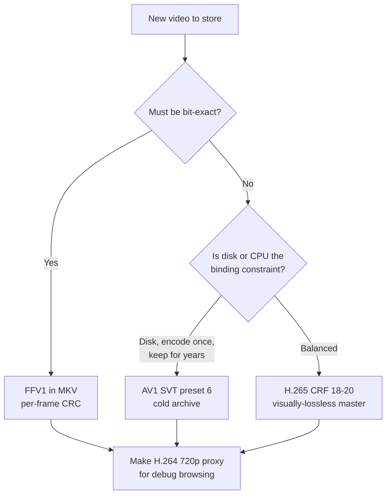

#### Bitrate vs quality vs CPU

- **CRF (quality-targeted) vs fixed bitrate.** For archives, prefer **CRF**: you pin a quality level and the encoder uses only the bits the scene needs. Fixed bitrate wastes bits on easy scenes and starves hard ones; reserve it for streaming pipes with a hard bandwidth ceiling (not your case on local disk).
- **Encoder preset = CPU vs size.** Slower presets squeeze out a few more percent at large CPU cost. For x264/x265, `-preset medium` is a sane default for masters; `-preset fast`/`veryfast` for proxies. The same diminishing-returns curve applies to SVT-AV1 presets.
- **Hardware (NVENC) vs software (libx26x).** GPU encoders (`h264_nvenc`, `hevc_nvenc`) keep CPU free and are ideal at capture time; software encoders give better quality-per-byte for the one-time master encode. A common split: capture with NVENC, re-encode "promoted" masters with software libx265/SVT-AV1 when CPU is idle.

#### Containers (the envelope vs the letter)

| Container | Strengths | Weaknesses | Use it for |
|---|---|---|---|
| **MKV (Matroska)** | Open; holds *any* codec incl. FFV1; multiple tracks + timed metadata/attachments; robust to truncation; LoC-preferred with FFV1 | Slightly less ubiquitous in consumer players (VLC/FFmpeg fine) | **Archival masters**, FFV1, rich-metadata recordings |
| **MP4 (MPEG-4)** | Universal playback; small overhead; supports fragmentation (fMP4) for partial reads | No FFV1; a non-fragmented MP4 whose `moov` atom is lost = unplayable | **Proxies & working copies**, HLS/DASH segments |
| **MOV (QuickTime)** | Apple/pro-video native; MP4's ancestor | Apple-centric, no advantage over MP4 here | Only if a tool demands it |

**Rule of thumb:** FFV1 → MKV. Lossy masters → MKV or MP4. Proxies/segments → MP4.

> **Mining-server note:** for any MP4 you'll seek into, always pass `-movflags +faststart` so the index (`moov`) sits at the front of the file. For huge single recordings prefer MKV or fragmented MP4 — a plain MP4 with the `moov` at the end seeks poorly and is fragile to truncation.

#### GOP / keyframe interval — the seeking & partial-access knob

A **GOP (Group of Pictures)** begins at a keyframe followed by inter-frames. You can only seek to, or cut at, a keyframe cheaply; to show any other frame the decoder must walk back to the previous keyframe.

- **Long GOP** (e.g. 250 frames) → smaller files, coarse seeking.
- **Short GOP** (e.g. 1–2 s) → bigger files, fast scrubbing — what you want for debug browsing.
- **Closed GOP** (no references across boundaries) → reliable seeking and clean cutting. **Open GOP** can stall or artifact on seek. **Always force closed, fixed-interval GOPs for archives and segments**, or your HLS segments won't line up on keyframes.

```bash
# 2-second closed GOP at 30 fps, fixed keyframe interval, no scene-cut keyframes
ffmpeg -i in.mp4 -c:v libx264 -crf 20 \
  -g 60 -keyint_min 60 -sc_threshold 0 \
  -x264-params "keyint=60:min-keyint=60:scenecut=0:open-gop=0" \
  -movflags +faststart out.mp4
```

`-g 60` = a keyframe every 60 frames (2 s @30fps). `sc_threshold 0` / `scenecut=0` make keyframes predictable so segments align.

#### Segmentation / chunking — partial reads on huge recordings

A single 4-hour file is awkward: any read or recovery touches the whole thing. Splitting gives **partial access, parallel processing, and damage isolation** (one corrupt 6 s segment ≠ a lost 4 h recording). All three options below are pure repackaging with `-c copy` — lossless and near-instant, no re-encode.

**Fragmented MP4 (fMP4)**
- **What it is.** One MP4 internally broken into self-describing fragments (moof/mdat) instead of one monolithic `moov`.
- **Best for.** Streaming-style partial reads and truncation resilience while keeping a single file.
- **Avoid when.** You want maximal player compatibility for a tiny clip (a plain MP4 is marginally simpler).
- **Tools.** FFmpeg `-movflags +frag_keyframe+empty_moov+default_base_moof`.
- **Trade-offs.** Slightly larger; broadly compatible; survives truncation better than a monolithic MP4.

```bash
ffmpeg -i in.mp4 -c copy \
  -movflags +frag_keyframe+empty_moov+default_base_moof frag.mp4
```

**HLS / DASH segment sets**
- **What it is.** A playlist (`.m3u8` for HLS, `.mpd` for DASH) plus many small segment files (MPEG-TS or fMP4/CMAF). Fully self-hostable — just files served by any static web server.
- **Best for.** Browsing long recordings in a local debug web UI; jumping to a timestamp loads only the relevant segments. One fMP4/CMAF segment set can feed both HLS and DASH.
- **Avoid when.** You can't tolerate large file counts (each recording explodes into many small segments — mind inode budgets and the small-file problem from the Images section).
- **Tools.** FFmpeg HLS/DASH muxers; any static web server (even `python -m http.server`).
- **Trade-offs.** Clean partial access; many small files. **Segment duration must align with GOP** — set GOP to a divisor of `hls_time`.

```bash
ffmpeg -i master.mkv -c copy \
  -f hls -hls_time 6 -hls_segment_type fmp4 \
  -hls_playlist_type vod -hls_list_size 0 \
  out.m3u8
```

**Plain time-split files**
- **What it is.** Cut the master into N independent files (e.g. 10-minute MKVs).
- **Best for.** The simplest possible partial access + damage isolation with zero playlist machinery.
- **Avoid when.** You need single-file playback or timestamp-jump UX.
- **Tools.** FFmpeg `segment` muxer.
- **Trade-offs.** Dead simple and robust; no unified single-file playback.

```bash
ffmpeg -i master.mkv -c copy -f segment -segment_time 600 \
  -reset_timestamps 1 part_%04d.mkv
```

> **Mining-server note:** segment **at capture time** when you can (record straight into N-minute chunks) so you never hold a single giant file in the first place — easier rsync, easier tiering, and a corrupt sector damages one chunk, not the whole shift.

#### Whole clips vs extracted frames vs proxies

Three distinct storage forms — keep them on separate tiers:

| Form | Pros | Cons | Keep for |
|---|---|---|---|
| **Whole clip (master)** | Smallest per second; full temporal context | Need decode to view a frame | Long-term truth |
| **Extracted frames (PNG/JPEG)** | Random access, feed image tools directly | **Huge** — no temporal compression (the same small-file pain you know from debug images) | Only the few frames you actually need |
| **Low-res proxy** | Instant browse/scrub, tiny | Lossy, not for analysis | Day-to-day debugging |

**Low-resolution proxy copies (do this for debug browsing)**
- **What it is.** A small, lossy 480p–720p H.264 copy used purely to *find* the moment of interest; you then pull exact frames/clips from the master.
- **Best for.** Fast browsing of a TB-scale archive on a modest, GPU-less workstation.
- **Avoid when.** Any measurement or analysis — proxies are lossy and downscaled.
- **Tools.** FFmpeg `libx264` with a scale filter.
- **Trade-offs.** ~10–20× smaller than the master; never for analysis.

```bash
ffmpeg -i master.mkv -vf "scale=-2:720" \
  -c:v libx264 -crf 28 -preset fast -an proxy_720p.mp4
```

**On-demand vs precomputed frame extraction**
- **On-demand** (extract frames only when a debugging session needs them): zero extra storage, costs CPU each time, needs FFmpeg/the SDK present. **Default to this** for a frame-rarely-needed archive.
- **Precomputed** (extract and store frames up front): instant access, but explodes storage. Only justified for a *small, hot* set you hit repeatedly (e.g. a labeled eval set) — and pack it into shards (see Images).

```bash
# Fast seek to 00:12:30 and grab one frame on demand
ffmpeg -ss 00:12:30 -i master.mkv -frames:v 1 -q:v 2 frame.png

# 1 frame/second as a low-res contact sheet for scanning a long clip
ffmpeg -i master.mkv -vf "fps=1,scale=-2:360" sheet_%05d.jpg
```

> **Mining-server note:** seek tip — put `-ss` *before* `-i` for a fast keyframe seek; *after* `-i` for a frame-accurate (slower) seek. Short GOPs make the fast seek land close to your target.

#### Metadata: ffprobe + per-clip sidecars

On an air-gapped server you have no catalog service, so make every clip **self-describing**. Write a JSON sidecar next to each master, plus a whole-file checksum.

```bash
# clip.mkv -> clip.mkv.json (codec, duration, resolution, fps, bitrate, frame count...)
ffprobe -v quiet -print_format json -show_format -show_streams \
  clip.mkv > clip.mkv.json

# whole-file fixity to complement FFV1's per-frame CRC
sha256sum clip.mkv > clip.mkv.sha256
```

Extend the JSON with operational metadata (camera ID, shift, line, plant location, capture timestamp). This makes a multi-year archive searchable with just `find`/`jq` and survivable if your indexing DB is ever lost. FFV1's per-frame CRC covers in-stream decode; the file checksum covers the whole object during scheduled scrubs.

#### Recommended defaults & a concrete two-tier layout

```
/archive/                 # write-once masters; integrity-scrubbed; never re-encoded
  line3/2026-06-29/
    cam-froth-01_0930.mkv            # FFV1 (bit-exact) or H.265 CRF20 (visually lossless)
    cam-froth-01_0930.mkv.json       # ffprobe + operational metadata
    cam-froth-01_0930.mkv.sha256     # whole-file checksum
    zed2i-sn12345/
      zed2i-sn12345_0930.svo2        # ZED master stays native (see 3D section)
      zed2i-sn12345_0930.svo2.json   # + SDK version, serial, calibration

/working/                 # disposable, regenerable from masters
  line3/2026-06-29/
    cam-froth-01_0930_720p.mp4       # H.264 proxy for browsing
    cam-froth-01_0930.m3u8 + seg*/   # HLS/fMP4 segments for timestamp jumps
    zed2i-sn12345_0930_left.mp4      # exported ZED derivatives, on demand
```

Operational habits for isolated servers and multi-year retention:

- Masters are **write-once**; everything under `/working/` is regenerable and can be deleted freely.
- Prefer **MKV + FFV1** (or H.265) for masters — open, documented, decodable by FFmpeg/VLC long term.
- **Encode once, repackage many:** segmenting, fragmenting, and proxy creation with `-c copy` are lossless and fast; reserve real re-encoding for one-time master creation.
- **Scheduled integrity scrubs** verify the `.sha256`; pair with a checksumming filesystem (ZFS/Btrfs) where available.
- **Archive your tools** (the FFmpeg build, the ZED SDK installer + version) next to the data — air-gapped means no `apt install` later.

### 3D & Point-Cloud Data (ZED, LiDAR)

This is the awkward outlier. The central decision is **keep the raw ZED SVO vs. extract durable open-format artifacts** — and the honest answer is *both*, for different reasons.

> **Mining-server note:** SVO/SVO2 is a **proprietary** Stereolabs container that requires the ZED SDK to read, and depth/point clouds are **recomputed on playback**, not stored. Two consequences drive everything below: (1) archive the exact SDK installer offline alongside the data, and (2) for anything you must guarantee readable in a decade, export to open formats. Pin and log the SDK version *and depth mode* per dataset — the same SVO yields different depth as the neural models change.

#### TL;DR defaults (3D)

| Need | Default choice | Why |
|---|---|---|
| Capture raw from ZED | **SVO2, H.265 (lossy)** for bulk; **H.265-lossless / PNG-ZSTD-lossless** only for "golden"/calibration clips | SVO2 is the native master; PNG/ZSTD lossless runs ~3 GB/min (~180 GB/hr) and will eat disks |
| Long-term safety net for SVO | **Archive the exact ZED SDK installer offline** + export open artifacts | SVO is proprietary, version-coupled; depth is *recomputed*, not stored |
| Depth map (single frame) | **OpenEXR 32-bit float** (lossless); or **16-bit PNG in mm** if range < 65.5 m | EXR keeps full range/precision; PNG is universal but range-limited |
| Depth as bulk arrays | **HDF5** (single server) or **Zarr v3** (parallel/sharded) | Chunked, compressed N-D arrays |
| Point cloud — working / interchange | **PLY** or **PCD** | Simple, ubiquitous in Open3D/PCL |
| Point cloud — archival | **E57** (self-contained, standard) or **LAZ** (max lossless compression) | Durable, open, vendor-neutral |
| Point cloud — offline web viewing | **Potree + Entwine EPT**, or **COPC** | Static files, no server runtime — ideal for air-gapped |
| Point cloud — query / analytics | **PostGIS pointcloud** or **TileDB** | Spatial queries / array analytics |
| Derived 3D *meshes* for web | **glTF/GLB + Draco** | 60–90% smaller; **not** for raw point clouds |

#### The ZED SVO / SVO2 master

- **What it is.** Stereolabs' native recording container: rectified left + right streams, timestamps, and high-frequency IMU/sensor data; SVO2 (default since ZED SDK 4.1) adds native-rate sensor recording, timestamped custom data (GPS, external sensors), and optional AES-256 encryption. It does **not** store depth or point clouds.
- **Best for.** The working master — full synchronized stereo + sensors, and the ability to re-derive better depth later as neural models improve. Keep it as the system of record for any "scene of interest."
- **Avoid when.** You need a format guaranteed readable without the SDK, or a metrology/ground-truth product you must reproduce exactly across SDK versions — extract open artifacts for those.
- **Tools.** ZED SDK (recording API, `svo_export`, depth/point-cloud export samples), ZED Explorer / ZED Studio.
- **Trade-offs.** Native, lossless option available, full sensor sync, re-derivable depth — but proprietary, version-coupled, and lossless is enormous.

**Lossless vs lossy SVO — the storage-planning trap.** SVO compression as a share of RAW size (Stereolabs figures, HD2K @ 15 FPS):

| Mode | Lossy? | Size vs RAW | Approx. rate |
|---|---|---|---|
| H.264 / H.265 (lossy) | Yes | **~1%** | **~7 GB/hour** (~0.12 GB/min) |
| H.265-lossless | No | ~25% | between lossy and PNG/ZSTD (no vendor figure) |
| LOSSLESS (PNG/ZSTD) | No | ~42% | **~180 GB/hour** (~3 GB/min) |

*Note: the "Size vs RAW" percentages and the absolute GB/hr rates come from different Stereolabs configurations and do not reconcile exactly with one another — treat the absolute GB/hr rates as authoritative and the percentages as approximate.*

Lossless and HEVC modes use NVIDIA NVENC hardware (desktop GPUs and Jetson), so the CPU stays free during capture. Over multi-year retention the lossy/lossless gap is the difference between a few TB and petabytes — **record bulk capture as H.265 lossy and reserve lossless for golden/calibration sequences only.** Note that depth recomputed from a lossy stereo pair is less accurate, so use lossless (or extract artifacts) for any metrology work.

#### Depth maps & disparity

**16-bit PNG (depth in millimeters)**
- **What it is.** Single-channel 16-bit grayscale PNG, lossless DEFLATE; the ZED SDK exports it directly.
- **Best for.** Universal interchange, indoor/short-range scenes, quick debugging, smallest tooling footprint.
- **Avoid when.** Range exceeds **65,535 mm (~65.5 m)** — values clip; or sub-mm precision matters.
- **Tools.** OpenCV, Pillow, the ZED SDK, any image viewer.
- **Trade-offs.** Tiny dependency surface, lossless, ubiquitous — but the **mm scale factor is NOT embedded in the file**; record it in a sidecar or lose physical meaning. Limited dynamic range.

**OpenEXR (16-bit half or 32-bit float)**
- **What it is.** A floating-point image container with lossless codecs (ZIP/PIZ), plus PXR24, a near-lossless codec that reduces 32-bit floats to 24 bits (lossless only for half-float/integer channels).
- **Best for.** Full-range outdoor depth, float depth in meters, preserving precision; can carry extra channels (confidence, normals).
- **Avoid when.** Consumers only speak PNG/NumPy, or you want the absolute simplest pipeline.
- **Tools.** OpenEXR / OpenImageIO, `imageio`, OpenCV (with EXR enabled).
- **Trade-offs.** No range clipping, lossless, multi-channel — but a heavier dependency, and not every viewer opens it.

**Arrays in HDF5 / Zarr / npz**
- **What it is.** Depth (plus disparity, confidence) stored as chunked, compressed N-D arrays.
- **Best for.** Bulk depth across many frames, time-series, batched ML I/O.
- **Avoid when.** You need a single self-describing frame to hand to a non-array tool (use EXR/PNG).
- **Tools.** `h5py`/PyTables (HDF5), `zarr`/`xarray` (Zarr), NumPy (`npz`).
- **Trade-offs.** HDF5 = one portable, broadly-supported file, single-writer, strong archival default (but an interrupted write can corrupt the whole file — keep checksums/backups). Zarr v3 = parallel writes and partial reads, but a directory of many small files unless you use the **sharding** codec. `npz` is fine for ad-hoc dumps, not archival.

> **Mining-server note:** always persist **camera intrinsics/baseline (and the disparity scale)** with every depth/cloud artifact, or downstream disparity ↔ depth ↔ point-cloud conversions become irreproducible. For 16-bit PNG depth, the sidecar must record the mm-per-unit scale.

#### Point-cloud file formats

| Format | Open / Std | Compression | Stores | Best role |
|---|---|---|---|---|
| **PLY** | Open (Stanford) | None (ASCII/binary) | XYZ, RGB, normals, custom | Working / interchange, meshes |
| **PCD** | Open (PCL) | binary / binary-compressed | XYZ + arbitrary fields | Robotics / PCL processing |
| **LAS** | ASPRS std | None | XYZ, intensity, class, GPS time | Geospatial / lidar-style |
| **LAZ** | Open (LASzip) | **Lossless, ~7–25% of LAS** | same as LAS | **Archival** of lidar-style clouds |
| **E57** | **ASTM E2807** | Lossless (~40–60%) | XYZ, RGB, intensity, **images + scan poses**, metadata | **Self-contained archival / exchange** |
| **COPC** | Open (LAZ 1.4) | Lossless (LAZ) | LAS fields + **octree index** | Streamed/served archival |
| **glTF/GLB + Draco** | Khronos | Draco | **meshes** (point `POINTS` *not* in the extension) | Derived web meshes, not raw clouds |

**PLY / PCD**
- **What it is.** Simple, ubiquitous working formats — PLY (ASCII/binary, arbitrary per-point properties), PCD (PCL-native, supports binary-compressed).
- **Best for.** Open3D/MeshLab/CloudCompare interchange (PLY); robotics/PCL pipelines (PCD); derived products.
- **Avoid when.** You need standardized geospatial metadata or maximal compression (use LAZ/E57).
- **Tools.** Open3D, PCL, CloudCompare, MeshLab.
- **Trade-offs.** Dead-simple and universal — but no built-in compression and no standardized CRS/metadata (PLY); niche outside robotics (PCD).

**LAS / LAZ**
- **What it is.** The ASPRS lidar standard; **LAZ is LASzip-compressed LAS that decompresses bit-for-bit**, typically ~7–25% of original size, with random access.
- **Best for.** Large surveys, size-bound archival, geospatial tooling (QGIS/PDAL).
- **Avoid when.** You need embedded imagery/scan poses (use E57).
- **Tools.** LAStools / LASzip, PDAL, QGIS.
- **Trade-offs.** Excellent lossless compression, huge ecosystem, patent-free — but a lidar-centric schema and no embedded panoramic images.

**E57**
- **What it is.** The ASTM E2807 vendor-neutral container (hybrid XML + binary) holding XYZ, RGB, intensity, calibrated images, per-scan pose matrices, and metadata in one file; ~40–60% lossless compression. v1.0 (E2807-11, reaffirmed 2019) is the only standardized version as of 2026; reference impl is libE57.
- **Best for.** Multi-year archival — the "format you'll still read in a decade" — and handing data to unknown downstream tools.
- **Avoid when.** You need extreme compression (LAZ wins) or a GIS-native load (LAS).
- **Tools.** libE57, e57inspector, CloudCompare.
- **Trade-offs.** Open standard, self-contained, durable — but moderate compression and fewer ultra-fast loaders.

**COPC**
- **What it is.** A LAZ 1.4 file whose points are reorganized into a clustered octree (described in a VLR); backward-compatible with any LAZ 1.4 reader.
- **Best for.** One-file archival that *also* streams by level-of-detail (PDAL 2.4+, QGIS 3.32+, Potree).
- **Avoid when.** Tools predate LAZ 1.4.
- **Tools.** PDAL (build), untwine (>500M points), QGIS, Potree.
- **Trade-offs.** Archive + serve in a single file, no tiling sprawl — but it needs a build step.

**glTF/GLB + Draco**
- **What it is.** Web 3D delivery; Draco (`KHR_draco_mesh_compression`) shrinks **meshes** 60–90%.
- **Best for.** Derived **meshes** for offline web/AR viewers.
- **Avoid when.** Archiving raw point clouds — **point-cloud `POINTS` are NOT part of the glTF Draco extension** (mode must be TRIANGLES/TRIANGLE_STRIP), and library-level Draco point compression is lossy/quantized.
- **Tools.** Google Draco, glTF tooling.
- **Trade-offs.** Tiny meshes, browser-native — but needs a WASM decoder and has no standardized point-cloud path. **Never use glTF as a point-cloud archive.**

#### Serving & querying large point clouds (offline)

| Tool | Type | Runtime needed? | Best for |
|---|---|---|---|
| **Potree** | WebGL viewer | **No server runtime** — static files | Offline browser viewing of huge clouds |
| **Entwine / EPT** | Lossless octree tiles | Build-time only, serve static | Web-scale rendering + lossless archive |
| **COPC** | Single-file octree | None (static) | Same as EPT but one file |
| **PostGIS pointcloud** | PostgreSQL ext | Postgres server | SQL spatial queries; patches of ~400–600 pts |
| **TileDB** | Sparse N-D array | Library / embedded | Massive sparse 3D (X/Y/Z) analytics |

- **Potree** is ideal for an air-gapped box: serve the static folder with any web server (even `python -m http.server`); no Node.js runtime required.
- **Entwine** rearranges points into a lossless **EPT** octree that doubles as archive and render source; Potree reads it directly. **COPC** gives the same LOD streaming from a single `.copc.laz`.
- **PostGIS pointcloud** + PDAL (`writers.pgpointcloud`) when you need SQL/spatial joins; **TileDB** models a cloud as a 3D sparse array (X,Y,Z) with lock-free parallel writes and built-in versioning, embeddable with no server.

#### Downsampling / voxelization for derived products

- **What it is.** `open3d` `voxel_down_sample(voxel_size=...)` averages points per voxel into a uniform, much smaller cloud.
- **Best for.** Visualization, lightweight viewers, and analytics where full density isn't needed.
- **Avoid when.** Anything measurement-grade — voxelization introduces quantization error.
- **Tools.** Open3D, PCL, PDAL.
- **Trade-offs.** Big size reduction for fast viewing — but **keep it as a derived, regenerable product; never overwrite the raw master cloud.**

#### Recommended reference pipeline for the mine

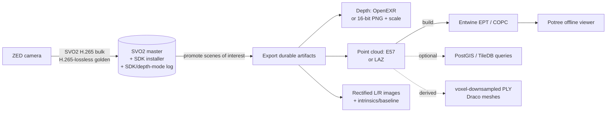

1. **Capture.** ZED → SVO2 H.265 for bulk; H.265-lossless for golden/calibration. Log **SDK version + depth mode** per recording.
2. **Triage.** Keep all SVO short-term on the debug disk; promote "scenes of interest" to the archive tier.
3. **Extract durable artifacts** for promoted scenes — rectified L/R images, depth as OpenEXR (or 16-bit PNG + scale sidecar), point cloud as E57 (or LAZ if size-bound). Store intrinsics/baseline alongside.
4. **Archive masters.** SVO2 (+ offline SDK installer) and E57/LAZ on the long-term volume; add per-file SHA-256 and a manifest for multi-year integrity.
5. **Serve / inspect offline.** Build EPT (Entwine) or COPC and view with Potree; push to PostGIS/TileDB only if you need queries.
6. **Derived / regenerable layer.** Voxel-downsampled PLY, Draco meshes for lightweight viewers — never the system of record.

> **Mining-server note:** the decade-scale copy should be **open and self-describing** (E57/LAZ + EXR/PNG depth), with the SVO2 kept as a re-derivable bonus rather than the sole copy. Checksum every master and verify on a schedule — on isolated servers there is no cloud durability backstop, so your sidecars, manifests, and scrubs *are* the durability story.

## Decision Guide

Use this guide to route from what you are storing to a concrete pick. The golden rule across every branch: **bytes live on the filesystem or in object storage; facts live in a catalog.** A database is an index over your data, not a place to dump multi-gigabyte blobs.

### Decision Tree

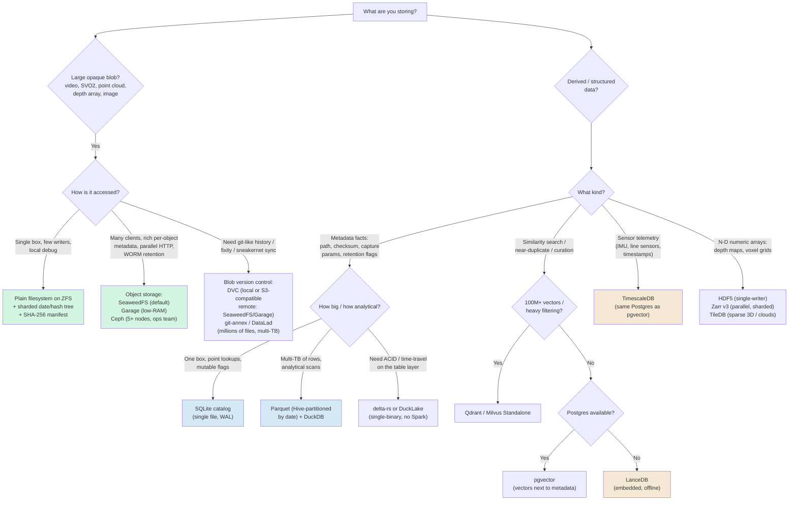

> **Mining-server note:** Your debug images already work, so most new traffic enters this tree on the left (large blobs: video and ZED 3D) and routes to ZFS-backed files or SeaweedFS, with everything indexed by the catalog on the right. You rarely need more than three or four of these boxes in one deployment.

### Comparison Matrix

| Option | Best for | Scale | Query / Index | Offline / Self-host | Integrity features | Complexity |
|---|---|---|---|---|---|---|
| **Plain filesystem (ZFS / XFS)** | Large write-once blobs: video, SVO2, point clouds | GB → many TB | None native (pair with a catalog) | Excellent (POSIX, rsync, tar) | ZFS: per-block checksums + scrub + self-heal. XFS: metadata CRC only | Low–medium |
| **Embedded store (SQLite / LMDB / RocksDB)** | Single-file catalog; small blobs (<100 KB) | Up to ~millions of rows | SQL (SQLite) / KV (LMDB, RocksDB) | Excellent (one file, no server) | App-level checksums; atomic writes | Low |
| **Object storage (SeaweedFS / Garage / Ceph)** | Video + 3D at scale, rich metadata, WORM retention | TB → PB | Key/prefix lookup; metadata per object | Excellent (static binaries, no phone-home) | Erasure coding + per-read checksums; Object Lock | Medium (Ceph: high) |
| **Relational DB (PostgreSQL)** | Catalog + relational metadata; JSONB for heterogeneous fields | GB → TB of metadata | Full SQL, rich indexes | Excellent | WAL, constraints; store checksum column | Medium |
| **Document store (MongoDB / GridFS)** | Highly heterogeneous capture metadata | GB → TB | Document queries, secondary indexes | Good | Replica-set durability; no atomic file-content update (GridFS) | Medium |
| **Scientific array (HDF5 / Zarr / TileDB)** | N-D numeric arrays: depth maps, voxel grids | GB → TB | Slicing by index; TileDB spatial index | Good (pin reader libs!) | Fletcher32 / crc32c per chunk; TileDB fragments | Medium |
| **Columnar / tabular (Parquet / Lance)** | Metadata catalogs; exploded point tables | TB+ of rows | DuckDB/Spark predicate pushdown | Excellent (DuckDB single binary) | Per-column stats; immutable files | Low–medium |
| **Vector DB (LanceDB / pgvector / Qdrant)** | Embeddings: similarity, near-dup, curation | M → 100M+ vectors | ANN (HNSW/IVF) + metadata filter | Excellent (LanceDB embedded; others self-host) | Index rebuild after large ingest | Low (LanceDB) → medium |
| **Time-series DB (TimescaleDB / InfluxDB)** | Sensor telemetry, IMU, timestamps | Billions of points | SQL/time functions, continuous aggregates | Excellent | Compression + retention policies | Medium |
| **Lakehouse table format (Iceberg / Delta / DuckLake)** | ACID + time-travel over structured tables | TB+ | SQL via DuckDB/Spark | Good (delta-rs / DuckLake offline) | Snapshot history; relies on store for byte integrity | Medium (Iceberg multi-engine: high) |
| **Data version control (DVC / git-annex / DataLad)** | Versioning opaque assets; provenance; sneakernet | GB → tens of TB | Pointer files in Git + catalog | Excellent (USB/dir remotes) | Content-addressed fixity (md5/sha), `numcopies`, fsck | Medium |

> **Mining-server note:** "Offline / Self-host" is a hard gate for you, not a nice-to-have. Every row above runs fully air-gapped, but two carry deployment traps: **OpenZFS is out-of-tree** (CDDL/DKMS — pre-stage the matching module before any kernel upgrade), and **MinIO's community repository was reported (as of early 2026) to be moving to maintenance/archival** with no guaranteed security patches — verify its current status, and for new long-retention object storage prefer SeaweedFS or Garage instead.

### What Should I Use? (By Scenario)

- **Millions of debug images (already solved):** Keep them as files on a checksumming filesystem (**ZFS** or Btrfs single/RAID1), sharded into `YYYY/MM/DD` or hash-prefix subtrees — never one flat directory. Index paths + checksums in the catalog. No change needed; this is the model the rest of the stack extends.
- **Long videos for human review / debugging:** Split into two tiers. Keep a write-once **master** (FFV1-in-MKV when bit-exact, else H.265 CRF ~20) and generate cheap **480p–720p H.264 proxies** for browsing. Store both as files; write a per-clip `ffprobe` JSON sidecar so the archive is searchable with `find` + `jq` even if the index is lost.
- **ZED 3D capture (the new pain):** Record **SVO2 with H.265** as the working master (~7 GB/hr at HD2K@15fps); reserve lossless (~180 GB/hr) for golden/calibration clips only. Archive the matching **ZED SDK installer offline** — SVO is proprietary and SDK-locked. For frames that matter, export durable open formats: depth to **16-bit PNG or OpenEXR**, point clouds to **E57 or LAZ**. Treat regenerated depth/clouds as a disposable `derived/` cache.
- **ZED point clouds you need to query/analyze:** **TileDB** sparse 3D arrays (MIT, embeddable, spatial index) or flatten to **Parquet/GeoParquet** for DuckDB analytics. For offline web viewing, build a **COPC/Entwine octree** and serve with **Potree** (static files, no server runtime).
- **Searchable metadata catalog over everything:** One box → **SQLite**. Multi-TB of rows / analytical scans → **Parquet partitioned by date + DuckDB**. Want relational joins and JSONB flexibility → **PostgreSQL**. Always store `asset_id`, path/URI, size, **checksum**, capture time, and a `retain_until` column.
- **Similarity search / near-duplicate detection over frames:** Compute embeddings and store the **vectors**, never the blobs. Standalone box → **LanceDB** (embedded, offline). Already running Postgres → **pgvector** (CLIP/ViT/DINOv2 dims fit under HNSW's 2,000-d limit). 100M+ vectors with heavy metadata filtering → **Qdrant** or **Milvus Standalone**.
- **Sensor telemetry alongside media (ZED IMU, line sensors):** **TimescaleDB** in the same Postgres instance as pgvector — one service, one backup, SQL joins across embeddings + telemetry + relational metadata.
- **You want git-like history of raw assets / provenance:** **DVC** with a local or S3-compatible (SeaweedFS/Garage) remote for moderate file counts; **git-annex / DataLad** for millions of files and multi-TB (DataLad's provenance capture and sneakernet via USB special remotes shine on air-gapped sites).
- **ACID / time-travel on structured tables (detections, point tables):** **delta-rs** or **DuckLake** (single-binary, SQLite/Parquet, no Spark/Java). A full multi-engine Iceberg + REST-catalog stack is overkill for one isolated, append-mostly server.

## Recommended Architecture for Production Sensor Data (Isolated Servers)

This is one opinionated, end-to-end design that fits an air-gapped mining server scaling from GBs to many TB over years. It is deliberately boring: a checksumming filesystem for bytes, a single-file (or Parquet) catalog for facts, and a deduplicating backup to rotated removable media. Add object storage and vector/time-series layers only when scale or a second node demands them.

**The shape of it:**

- **Storage engine:** OpenZFS pool (mirror or **RAIDZ2** for parity) with `compression=lz4`, `recordsize=1M` on the bulk media dataset, and a **monthly `zpool scrub`**. ZFS gives you the one thing ext4/XFS cannot: end-to-end data checksums that catch and self-heal silent bit-rot over multi-year retention.
- **Layout:** an immutable, write-once blob tree split `raw/` vs `derived/`, keyed most-stable-first (`modality / project / sensor / YYYY / MM / DD`). Volatile facts (labels, QA flags) stay **out of the path and in the catalog**, so re-labeling is an `UPDATE`, not a million file moves.
- **Catalog:** a **SQLite** file (single box) or **Parquet + DuckDB** (multi-TB) recording `asset_id`, path, size, SHA-256/BLAKE3 checksum, capture time, sensor/SDK version, and `retain_until`. It is *derived and disposable* — rebuildable by re-scanning the tree, because the JSON sidecars are the source of truth.
- **Backup:** **restic** or **BorgBackup** to external HDDs (or LTO), following **3-2-1-1-0** (3 copies, 2 media, 1 offsite, 1 offline/immutable, 0 verified errors). Rotate media so at least one copy is physically disconnected. Export the repo key to paper/QR.

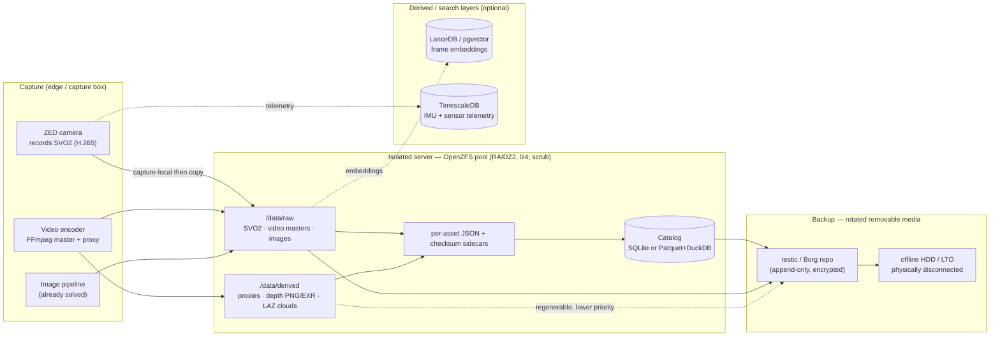

**How each modality fits:**

- **Images:** Unchanged. Files on ZFS, sharded by date/hash, paths + checksums in the catalog. They are the model everything else copies.
- **Video:** Master (FFV1/MKV or H.265 CRF ~20) under `raw/video/`; H.264 proxies under `derived/video/`. Force **closed, fixed-interval GOPs** so seeking and segmenting are cheap. Each clip gets an `ffprobe` JSON sidecar. Proxies are regenerable, so they back up at lower priority.
- **3D (ZED):** The `.svo2` is the raw master under `raw/svo2/` (record the SDK version in the catalog — depth is *recomputed* on playback, not stored). Exported depth (16-bit PNG/EXR) and point clouds (E57/LAZ) live under `derived/depth/` and `derived/point_cloud/` and can be deleted and recomputed. Persist intrinsics, baseline, and disparity scale in the sidecar or conversions become irreproducible.

Example directory tree:

```text
/data                                        # single-project site; project level shown (flotation-cell-7)
├── raw/                                  # write-once, never mutated, top backup priority
│   ├── image/flotation-cell-7/cam-froth-01/2026/06/29/...jpg
│   ├── video/flotation-cell-7/cam-froth-01/2026/06/29/
│   │   ├── cam-froth-01_20260629T141500Z_0001.mkv          # FFV1 or H.265 CRF~20
│   │   └── cam-froth-01_20260629T141500Z_0001.mkv.json
│   └── svo2/flotation-cell-7/zed2i-sn12345/2026/06/29/
│       ├── zed2i-sn12345_20260629T141500Z_0001.svo2        # H.265 working master
│       └── zed2i-sn12345_20260629T141500Z_0001.svo2.json   # sdk_version, depth_mode, intrinsics
├── derived/                              # regenerable cache, lower backup priority
│   ├── video/flotation-cell-7/cam-froth-01/2026/06/29/...proxy_720p.mp4
│   ├── depth/flotation-cell-7/zed2i-sn12345/2026/06/29/
│   │   └── frame_000123_depth.png                          # 16-bit mm (scale in sidecar)
│   └── point_cloud/flotation-cell-7/zed2i-sn12345/2026/06/29/
│       └── cloud_000123.laz                                # lossless, ~7–25% of original
├── catalog/
│   └── assets.duckdb                     # or assets.sqlite
└── _sidecar_truth/                       # JSON sidecars are source of truth
```

Minimal catalog schema (SQLite/DuckDB):

```sql
CREATE TABLE assets (
  asset_id     TEXT PRIMARY KEY,   -- stable UUID, NOT the path
  path         TEXT NOT NULL,
  modality     TEXT,               -- image | video | svo2 | depth | point_cloud
  is_derived   BOOLEAN,
  sensor       TEXT,               -- device serial, not a role name
  captured_at  TIMESTAMP,          -- UTC
  bytes        BIGINT,
  checksum     TEXT,               -- sha256 / blake3
  sdk_version  TEXT,               -- ZED SDK + depth mode for 3D
  retain_until DATE
);
```

> **Mining-server note:** Verify, don't trust. Schedule `zpool scrub` monthly to catch bit-rot at the block level, re-hash a rolling sample of assets against the catalog (BLAKE3 is multi-GB/s, fast enough to re-verify TBs), and run a real **test restore** from removable media periodically — a backup is unproven until you restore and byte-compare. RAID is *not* a backup: it protects availability, not against `rm`, overwrite, or corruption replicated before detection.

> **Mining-server note:** When a second capture node or many concurrent writers appear, promote the bulk store from plain ZFS files to **SeaweedFS** (S3-compatible, versioning + Object Lock for WORM retention, erasure coding) — but keep the same catalog and the same `raw/`-vs-`derived/` discipline. The architecture grows by swapping the byte store, not by rewriting the index.

## Operations & Hardening for Isolated Sites

A storage layout and a catalog tell you *where the bytes go*. This chapter is about keeping those bytes **correct, available, and recoverable for years** on a server nobody can SSH into from the outside. On an air-gapped mining site you are the durability SLA, the on-call engineer, and the data-recovery vendor — so every control below has to work with no cloud, static binaries, and the assumption that the next person to touch the machine is doing it in a noisy MCC room six months from now.

> **Mining-server note:** Treat the box as *unattended infrastructure*, not a workstation. Anything that needs a human to notice a blinking light, remember a passphrase, or "just run the upgrade" will eventually fail silently. Automate the checks, write the runbook down, and store the keys where a second person can find them.

### Encryption at Rest

**What it is.** Transparent encryption of the data on the disks so that a drive removed from the chassis is opaque ciphertext. Two production-grade options on Linux: **LUKS/dm-crypt** (block layer, below the filesystem) and **ZFS native encryption** (per-dataset, inside the pool).

**Why it matters.** The realistic threat at a remote site is **physical theft of disks** — a drive pulled from a rack in an unmanned building, or a "failed" disk that walks off during an RMA. Encryption at rest defeats *that* threat. It does **not** protect a running system: once the pool is unlocked the keys live in RAM and the plaintext is readable, so this is orthogonal to access control (below). There is no cloud KMS here, so key management is entirely yours.

**What to do.**

| | **LUKS / dm-crypt** | **ZFS native encryption** |
|---|---|---|
| Layer | Block device, beneath any FS (ext4/XFS/ZFS-on-LUKS) | Per-dataset, inside the pool |
| Algorithm | AES-XTS (AES-NI accelerated) | AES-256-GCM/CCM |
| Encrypts | Whole device incl. all metadata + free space | Data + most metadata (**not** dataset names, pool layout, snapshot/clone structure) |
| Compression | FS compresses *plaintext* under LUKS (full ratio) | Compresses **before** encrypting (full ratio) |
| Dedup | Block dedup works on plaintext | Dedup works **only within one key/dataset** (no cross-key dedup) |
| Backup win | — | `zfs send --raw` ships **still-encrypted** streams to untrusted tape/HDD without unlocking |
| Granularity | Per disk/partition | Per dataset — encrypt `raw/`, leave scratch clear |

- For a single isolated ZFS server, **ZFS native encryption** is usually the better fit: per-dataset keys, and `zfs send --raw` lets you back up to removable media that never sees a key. Use **LUKS** when you want the whole device (including ZFS pool metadata and free space) opaque, or when the array is not ZFS.
- **Order matters for ratio:** both options compress *then* encrypt, so `compression=lz4` still pays off. Encryption does, however, defeat *downstream* dedup — a `restic`/`borg` repo written from already-encrypted `zfs send --raw` streams cannot dedup against plaintext, so pick one dedup layer and let it see plaintext.
- **Offline key management (no KMS):** keep the keyfile/passphrase **off the array it unlocks**. Practical pattern: a high-entropy keyfile on a hardware token (YubiKey/smartcard) or a small USB key kept in a site safe, *plus* a paper/QR escrow of the master passphrase in a second location, optionally Shamir-split so no single person can unlock or lose it. **Losing the key is total, unrecoverable loss** — back the key up more carefully than the data.

```bash
# ZFS dataset encrypted at creation; key loaded from a removable keyfile
zfs create -o encryption=aes-256-gcm \
           -o keyformat=raw -o keylocation=file:///mnt/usb-token/raw.key \
           -o compression=lz4 -o recordsize=1M tank/raw
zfs load-key tank/raw && zfs mount tank/raw      # at boot, with the token inserted

# LUKS alternative on a bare disk before building the pool/FS on top
cryptsetup luksFormat /dev/sdb
cryptsetup open /dev/sdb cryptraw      # then create ZFS/ext4/XFS on /dev/mapper/cryptraw
```

> **Mining-server note:** SVO2 itself supports **optional AES-256 encryption of the recording** in the ZED SDK. That is useful defense-in-depth if a capture box is more exposed than the server, but it adds *another* key to manage and makes the file opaque to `ffprobe`-style tooling. Treat it as a complement to full-volume encryption, never your only layer — and record (out of band) which datasets are SVO2-encrypted and with which key.

### RAID Is Not Backup — and Rebuild/URE Risk

**What it is.** Parity redundancy (ZFS RAIDZ, hardware/software RAID) lets a vdev survive disk failures. The question at large drive sizes is **how many failures**, because a *rebuild* (resilver) is a stress test of every surviving disk at exactly the moment you have the least redundancy.

**Why it matters.** Two numbers conspire against single parity:

- **Resilver windows are now multi-day.** Reconstructing a 16–22 TB drive means reading the equivalent of the whole vdev; on a busy, fairly full pool that is hours to **several days**. ZFS resilvers only live data (faster on a half-empty pool) but fragmentation and ongoing writes stretch it. Throughout that window a **RAIDZ1** vdev has **zero** remaining redundancy.
- **URE math.** Spinning disks specify an unrecoverable-read-error rate — commonly **~1 in 10¹⁴ bits** (consumer, ≈ one bad sector per ~12.5 TB read) to **~1 in 10¹⁵** (enterprise). A RAIDZ1 rebuild of an 8×18 TB vdev must read ~126 TB of survivors. At 10¹⁴ the probability of hitting at least one URE during that read is **uncomfortably high** — and on single parity a URE mid-rebuild is an unrecoverable block (classic hardware RAID5 would fail the whole array; ZFS degrades more gracefully and tells you *which file* it lost, but it is still data loss).

Treat these as intuition, not a benchmark: the point is that **as drives grew past ~8–12 TB, single parity stopped being safe**, because the second failure or the URE arrives *during* a rebuild that now lasts days.

**What to do.**

- Use **RAIDZ2 (double parity)** as the default for any bulk vdev of large drives — it survives a *second* whole-disk failure or a URE during the resilver. Consider **RAIDZ3** for very wide vdevs of the biggest drives, or **3-way mirrors** when fast resilver matters more than capacity. Avoid **Btrfs RAID5/6** (parity write-hole, not production-ready) — use ZFS RAIDZ.
- Keep vdevs a sane width (≈6–12 disks) and keep a **hot/cold spare** on the shelf so a resilver starts immediately, not after a parts order.
- **RAID is not a backup.** Parity protects *availability* against disk death; it does nothing against `rm -rf`, a buggy pipeline overwriting a day of SVO2, a controller that scrambles the array, or fire/theft/flood. Redundancy plus snapshots plus an **independent offline copy** (LTO/offline HDD, see the cold tier and DR runbook) is the actual safety story.

> **Mining-server note:** A degraded RAIDZ1 mid-resilver at 2 a.m. on an unmanned site, with the nearest spare a day's drive away, is the scenario RAIDZ2 buys you out of. Pay the one-disk capacity tax up front.

### Drive Health Monitoring (SMART)

**What it is.** `smartmontools` (`smartctl` + the `smartd` daemon) reads the drive's self-reported health and runs on-disk self-tests, so disks announce trouble *before* they die in a resilver.

**Why it matters.** A disk rarely fails cleanly; it first accumulates reallocated and pending sectors. Catching the trend lets you replace a disk on your schedule instead of during a multi-day rebuild with no redundancy.

**What to do.** Schedule **short tests** (daily) and **long tests** (weekly), and watch the attributes that actually predict failure:

| Attribute (ID) | What it means | Action |
|---|---|---|
| `Reallocated_Sector_Ct` (5) | Sectors remapped to spares | Any rising count → plan replacement |
| `Current_Pending_Sector` (197) | Suspect sectors awaiting remap | Rising → replace soon |
| `Offline_Uncorrectable` (198) | Unrecoverable on offline scan | Replace |
| `UDMA_CRC_Error_Count` (199) | Bus/cabling errors | Reseat/replace cable first |
| `Command_Timeout` / `Spin_Retry` | Mechanical/power weakness | Investigate |
| SSD `Percentage_Used` / `Media_Wearout` | Flash wear | Replace before 100% |

```bash
smartctl -H /dev/sda                # quick health summary (PASSED is necessary, not sufficient)
smartctl -a /dev/sda               # full attribute table
smartctl -t short /dev/sda         # start a short self-test; -t long for the full surface scan
smartctl -l selftest /dev/sda      # self-test history
smartctl -x /dev/sda               # everything, incl. error logs and temperatures
```

`/etc/smartd.conf` for unattended scheduling and **local** alerting:

```conf
# short test daily 02:00, long test Saturdays 03:00, temp warn at 45C/crit 55C
DEVICESCAN -a -o on -S on \
  -s (S/../.././02|L/../../6/03) \
  -W 0,45,55 \
  -m root -M exec /usr/local/sbin/smart-alert.sh
```

**Alerting on an offline host** has no Slack/email-to-cloud — so route alerts locally: a local MTA delivering `-m root` to an on-site mailbox; or `-M exec` calling a script that writes syslog, lights a panel LED, and appends to a status file; or scrape into **Prometheus `node_exporter`** via the textfile collector and alert with a local Alertmanager. Whatever you pick, make the signal *visible without leaving the room*.

> **Mining-server note:** Watch the **trend**, not the PASS/FAIL bit. A disk reporting `PASSED` while its reallocated count climbs every week is the disk that will URE during your next RAIDZ2 resilver. Replace on the slope, not the cliff.

### ECC RAM

**What it is.** Error-Correcting Code memory detects and corrects single-bit RAM errors (and detects multi-bit ones) in hardware, logging each correction.

**Why it matters.** This is the silent gap in an otherwise airtight integrity story. A bit flip in non-ECC RAM — cosmic ray, marginal DIMM, heat — corrupts data **in flight, before ZFS computes its checksum**. ZFS then dutifully checksums the *already-corrupted* bytes, stores the corruption as "correct," and every future scrub confirms it. The fixity hash in your catalog is computed over the same bad data. You have cryptographic proof that garbage is unchanged. No amount of RAIDZ2, scrubbing, or BLAKE3 catches an error that happened upstream of the checksum.

**What to do.**

- Use **ECC RAM for any long-retention server** that is the source of truth. The "ZFS *requires* ECC / scrub-of-death" claim is overstated — ZFS runs fine without ECC — but ECC matters *more*, not less, for data you intend to trust for years. It is cheap insurance relative to a silently corrupted multi-TB archive.
- Choose a CPU + board that genuinely support ECC (most server boards; many AMD Ryzen boards with the right BIOS; EPYC/Xeon by default) and **verify it is active** — a DIMM in a non-ECC slot is just expensive RAM.

```bash
sudo dmidecode -t memory | grep -i -E "error correction|^\s*Type:"   # board/DIMM capability
edac-util -v                                                          # report EDAC-tracked errors
sudo ras-mc-ctl --summary                                            # rasdaemon: corrected/uncorrected counts
```

> **Mining-server note:** Corrected-error counts from `rasdaemon`/EDAC are an early warning of a failing DIMM, the same way SMART pending-sectors warn of a failing disk. Log them next to your SMART data and replace the DIMM before it starts producing *uncorrectable* errors.

### Time Synchronization Offline

**What it is.** Disciplining the system (and hardware) clock to correct UTC without internet NTP, using a **local stratum-1 source** and `chrony` as a local server.

**Why it matters.** Your entire model is UTC-first: `captured_at` is UTC, and the blob tree partitions on `YYYY/MM/DD`. If a capture box's clock is wrong, captures land in the **wrong day directory**, `captured_at BETWEEN ...` queries miss them, IMU/sensor fusion timestamps drift apart, dedup/ordering breaks, and your **audit-log timestamps become untrustworthy** — exactly when you need them. RTC hardware clocks drift seconds per day, so "set it once" is not a plan.

**What to do.**

- Provide a **local stratum-1 reference**: a **GPS receiver with PPS** (pulse-per-second) feeding `gpsd` → `chrony`, or a **GPS-disciplined NTP appliance** on the LAN. A cheap USB GPS puck with PPS and a sky-facing antenna gives microsecond-class UTC with no internet.
- Run **`chrony` as the local NTP server** for every capture box and the storage server, so the whole site agrees even when offline. Keep the **RTC in UTC** (`timedatectl set-local-rtc 0`) and sync it from the disciplined system clock.

```bash
# /etc/chrony/chrony.conf on the storage server (the local time master)
refclock SHM 0 refid GPS precision 1e-1 offset 0.0          # gpsd shared-memory source
refclock PPS /dev/pps0 lock GPS refid PPS                    # PPS for sub-ms discipline
local stratum 10                                            # still serve the LAN if GPS drops
allow 10.0.0.0/24                                           # capture boxes on the isolated LAN

chronyc sources -v        # confirm GPS/PPS is selected
chronyc tracking          # current offset, stratum, drift
```

> **Mining-server note:** Without an external reference, capture boxes and the server **drift apart** — and a froth event recorded at "08:41" on a camera that is 90 s ahead will not line up with the SVO2 from the camera next to it. One GPS source feeding a `chrony` master fixes this for the whole site, and costs less than a single disk.

### Power Protection & Write Integrity

**What it is.** A UPS driving an automatic **clean shutdown** via **NUT (Network UPS Tools)**, combined with ZFS's transactional write semantics so an abrupt power loss is survivable.

**Why it matters.** Remote sites have *dirty power* — brownouts, generator switchover, lightning. The failure mode you fear is a power cut **mid-write**. On `ext4`/`XFS` the journal protects *metadata*, not your data blocks, so you can get torn writes, half-written files, or the RAID5/6 **write-hole** (parity and data inconsistent after a crash). ZFS is **copy-on-write and transactional**: a block is either fully the old version or fully the new — there is no in-place overwrite and no write hole, so a power loss costs you at most the **last few seconds of unsynced writes**, never a corrupt pool.

**What to do.**

- Put the server (and ideally the capture boxes) on a **UPS** and wire **NUT** to shut down cleanly before the battery dies:

```bash
upsc myups                 # battery charge, runtime, status
# /etc/nut/upsmon.conf — shut down when battery is critical
# MONITOR myups@localhost 1 upsmon mypass master
# SHUTDOWNCMD "/sbin/shutdown -h +0"
```

- Understand **ZFS sync semantics**: `sync=standard` (default) honors `fsync`/`O_SYNC`; `sync=always` is safest but slow; `sync=disabled` *never* flushes synchronously — only for throwaway scratch, never for `raw/`.
- A **SLOG/ZIL** device accelerates *synchronous* writes (databases, the catalog, NFS) by giving the ZFS Intent Log a fast home. Bulk sequential media ingest is mostly asynchronous, so a SLOG often is not needed. **If you add one, it must be an SSD with power-loss protection (PLP capacitors)** — a non-PLP SLOG defeats the entire point, because it can lose the acknowledged writes you put it there to protect.

> **Mining-server note:** Hardware RAID controllers need a working BBU/flash-backed cache, and any SSD acting as a write cache needs PLP — on generator power these are the components that turn a brownout into silent data loss. ZFS + a UPS + NUT clean shutdown is the boring combination that survives it. **Test it** by pulling mains and confirming the box shuts down and the pool imports clean.

### Capacity & Growth Planning

**What it is.** Turning per-hour capture rates into a multi-year sizing model, then mapping that onto vdevs, tiers, and an expansion plan.

**Why it matters.** Video and SVO2 rates are *per hour per sensor*; multiplied by fleet size, shifts, and years, they decide whether you provision one vdev or a tape library. Everything here is **content- and configuration-dependent** — froth turbulence, codec, CRF, resolution, and FPS all move the numbers — so size with a band, not a point.

**What to do.** Build a per-stream table from the rates this guide uses (SVO2 lossy H.265 ≈ **~7 GB/hr**, SVO2 PNG/ZSTD-lossless ≈ **~180 GB/hr ≈ ~3 GB/min**, both HD2K @ 15 FPS; visually-lossless H.265 CRF ~20 video at 1080p30 ≈ **~5 GB/hr**, content-dependent within a ~3–15 GB/hr band).

**Worked example** — a flotation circuit, two 8 h shifts (16 capture-hours/day). Figures are **estimates**, decimal TB (1 TB = 1000 GB):

| Stream | Sensors | Rate (GB/hr) | Hr/day | GB/day | TB/year | TB/5 yr |
|---|---|---|---|---|---|---|
| SVO2 lossy H.265 (HD2K@15FPS) | 4 | 7 | 16 | 448 | 163 | 817 |
| Video H.265 CRF~20 (1080p30) | 2 | 5 | 16 | 160 | 58 | 292 |
| **Bulk subtotal (raw bytes)** | | | | **608** | **222** | **1,109** |

- **Why lossless is rationed:** a **single** ZED at PNG/ZSTD-lossless (~180 GB/hr) for the same 16 hr/day = **2,880 GB/day ≈ ~1,051 TB/year** — more than the entire lossy fleet above. Reserve lossless for golden/calibration clips; otherwise it eats petabytes.
- **From raw bytes to disks you must buy:** usable capacity ≈ raw drive capacity × (data drives ÷ total drives in the vdev) × **~0.8 fill headroom** (ZFS degrades past ~80%). An 8×18 TB **RAIDZ2** vdev ≈ 144 TB raw → ~108 TB data → **~86 TB usable** at the 80% line. At ~222 TB/yr of bulk you fill that vdev in **well under a year**, so the warm tier must roll older `YYYY/MM` slices to the **cold tier** (LTO/offline HDD) on a schedule — see Storage Tiering and Writing to Tape.
- **Growth paths and their limits:** **RAIDZ expansion** (OpenZFS **2.3**) lets you add a single disk to an existing RAIDZ vdev and grow it online. The caveats: you **cannot remove** a disk from a RAIDZ vdev, **cannot change the parity level**, and **cannot shrink**; data written *before* the expansion keeps its old data:parity ratio until rewritten, so you do not instantly reclaim the full new capacity. The other growth path is **adding whole vdevs** to the pool (the pool stripes across them). Plan the vdev geometry up front, because the easy lever later is "add a vdev (or a disk) and tier the old months out."

> **Mining-server note:** Size for **TB-years**, not peak TB. Most of this data goes cold and is rarely read; provisioning enough always-on RAIDZ to hold five years is far more expensive than a year of warm HDD plus a cold tier. Re-measure your *actual* GB/hr after a week of real capture — the froth, the codec, and the FPS will move these numbers more than any spreadsheet.

### Writing to Tape (LTFS/LTO)

**What it is.** LTO tape as the cold/offline tier, written either as a self-describing **LTFS** filesystem or as a **tar/zfs-send stream** straight to the drive.

**Why it matters.** Tape is the cheapest **$/TB** for cold data, draws **zero power on the shelf**, and is genuinely air-gapped when ejected. But tape has sharp edges — generation compatibility and drive availability — that bite years later.

**What to do.**

| | **LTFS** | **tar / zfs send to tape** |
|---|---|---|
| On-tape format | Self-describing (index + data partitions); mount and drag-and-drop | Opaque sequential stream |
| Catalog needed? | No — tape carries its own index, readable on any LTFS system | **Yes** — you must keep an external index of what is on which tape |
| Random access | Per-file (slow but possible) | Poor (sequential) |
| Throughput / simplicity | Slightly more overhead | Maximum streaming throughput |
| Best for | Archival **exchange/handoff**, browsable archives | Bulk streaming of whole `YYYY/MM` slices (our tiering unit) |

```bash
mkltfs -d /dev/nst0                       # format a tape as LTFS
ltfs /mnt/tape                            # mount it; copy files; then unmount + eject
# or stream a whole month slice with no filesystem:
tar -cf /dev/nst0 raw/svo2/flotation-cell-7/zed2i-sn12345/2026/03/
mt -f /dev/nst0 rewind                    # tape control (status/rewind/eject)
find raw/.../2026/03 -type f -print0 | xargs -0 b3sum > 2026-03.b3   # verify by read-back
```

- **Generation compatibility is the trap:** LTO drives historically read **2** generations back and write **1** back, but since **LTO-8** the read-2-back was dropped (an LTO-8 drive reads/writes only LTO-8 and LTO-7). Translation: **keep a working drive of the right generation to read your old tapes**, and plan a migration *before* your drive generation goes end-of-life.
- **Lifespan:** archival shelf life is long (well over a decade in cool, dry, stable conditions), but the practical limit is **drive availability**, not the media. Recertify/migrate periodically, store the **checksum manifest with the tape** (and in the catalog), and add **`par2` parity** so a single read error is repairable without the original.

> **Mining-server note:** Keep a **spare drive of the same generation in the safe**. An LTO archive you cannot read — because the only drive died and the generation is EOL with no internet to source a replacement — is not a backup. Verify a restore from a randomly chosen tape on a schedule.

### Access Control & Audit Logging

**What it is.** Filesystem/object permissions, read-only `raw/`, and an append-only record of who wrote or deleted what on a server with shared logins.

**Why it matters.** On an unmanned site, multiple people and pipelines share one box. The two questions you must be able to answer months later are *"can a normal account delete `raw/`?"* (it must not) and *"who deleted March?"* (the audit trail must say).

**What to do.**

- **Least-privilege accounts:** an *ingest* service account writes `raw/`; a *pipeline* account writes `derived/` and reads `raw/`; *analysts* are read-only; *admin* is separate and rarely used.
- **Make `raw/` write-once.** Seal each completed slice: `chmod 0444` files, or set the dataset read-only (`zfs set readonly=on tank/raw`), or expose it via a **read-only bind/NFS mount** to consumers. Pipelines write only to the read-write `derived/` tree. On an object store, use **bucket policies + Object Lock/WORM** (e.g. SeaweedFS object lock) so objects cannot be overwritten or deleted before their retention expires.

```bash
zfs set readonly=on tank/raw                      # raw is immutable to everyone
setfacl -R -m g:analysts:rx /data/raw             # analysts read-only via ACL
mount -o bind,ro /data/raw /srv/raw-ro            # read-only view for consumers
```

- **Append-only audit trail:** turn on Linux `auditd` to watch the trees and key the events so they are greppable:

```bash
auditctl -w /data/raw -p wa -k raw_write          # log writes/attr-changes under raw
auditctl -w /data/catalog -p wa -k catalog_write
ausearch -k raw_write -i                           # who touched raw/, when
```

Ship the audit log (and your ingest log) to an **append-only / write-once** destination, and never allow `UPDATE`/`DELETE` on `raw` rows in the catalog — `indexed_at` and a `created_by` column give you an immutable provenance record alongside `auditd`.

> **Mining-server note:** WORM at the storage layer plus an `auditd` trail is how you make `raw/` **un-deletable by normal accounts** and still answer "who deleted March?" after the fact. Without it, a shared login and one bad `rm` is unattributable and unrecoverable.

### Disaster-Recovery Runbook

**What it is.** Written, *tested* objectives and procedures for getting back to a known-good state after a disk, pool, or site-level loss.

**Why it matters.** A backup you have never restored is a hypothesis. DR is the discipline of converting that hypothesis into a tested procedure, with explicit targets.

**What to do.** Define and document:

- **RPO (Recovery Point Objective):** how much data you can afford to lose = the gap between backups. A workable split: **RPO ≈ 24 h** for `raw/` (nightly verified backup); **RPO = "recompute"** for `derived/` (regenerable — accept its loss). 
- **RTO (Recovery Time Objective):** how long to be back. On an isolated site, honestly **hours-to-days**, bounded by hardware swap and reading from rotated media.

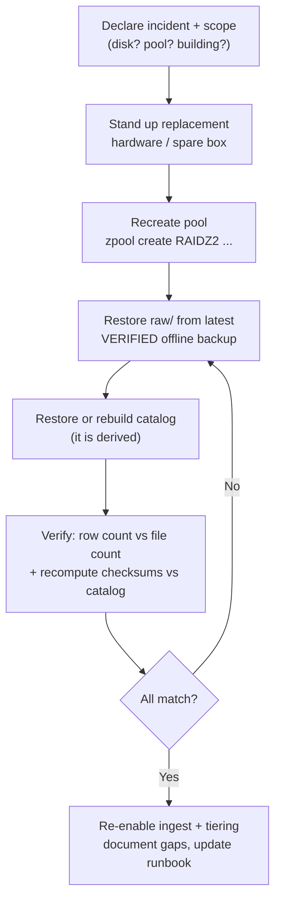

**Drills, on a schedule:**

- **Restore drill (quarterly):** restore a sample (or all) of a `restic`/`borg` repo to a scratch target and byte-compare.

```bash
restic check --read-data-subset=10%        # verify repo integrity incl. data
restic restore latest --target /scratch    # actually restore
borg check --verify-data /path/to/repo     # borg equivalent
```

- **Catalog-rebuild validation (monthly, rolling sample):** re-scan the tree, recompute checksums, and diff against the catalog to find missing rows, orphan files, and mismatches:

```bash
find /data/raw -type f -print0 | xargs -0 b3sum > /scratch/disk.b3
duckdb -c "
  CREATE TABLE disk AS SELECT * FROM read_csv('/scratch/disk.b3', columns={'checksum':'TEXT','path':'TEXT'}, delim=' ');
  -- in catalog but not on disk (missing), on disk but not in catalog (orphan), checksum drift:
  SELECT 'missing' t, path FROM read_parquet('/data/catalog/**/*.parquet', hive_partitioning = true) a
    WHERE NOT EXISTS (SELECT 1 FROM disk d WHERE d.path = a.path)
  UNION ALL SELECT 'orphan', path FROM disk d
    WHERE NOT EXISTS (SELECT 1 FROM read_parquet('/data/catalog/**/*.parquet') a WHERE a.path = d.path);"
```

- **Full DR rehearsal (annually):** rebuild a node from cold metal using only the air-gap install bundle and the offline backup.

> **Mining-server note:** Keep a **printed runbook and the `restic`/`borg` repo passphrase in the site safe**. An encrypted offline backup whose key lives only in the head of someone who has left the company is not recoverable. Schedule the restore drill like you schedule the scrub — an untested backup is an unproven one.

### Retention & Legal Hold

**What it is.** Retention *classes* per asset, a `retain_until` date, a `legal_hold` flag, and a defensible, logged deletion process. These extend the canonical `assets` catalog with operational columns.

**Why it matters.** "Keep everything forever" collides with finite disks; "delete to make room" collides with incidents and disputes that surface years later. You need a policy that **deletes on purpose** and **never deletes what is on hold**.

**What to do.**

- Assign a **retention class** and `retain_until` at ingest. Typical classes: **raw masters** (longest — years or indefinite), **golden/calibration** (keep longest of all), **derived caches** (shortest — regenerate on demand), **telemetry** (per policy).

```sql
ALTER TABLE assets ADD COLUMN retention_class TEXT;   -- raw_master | golden | derived | telemetry
ALTER TABLE assets ADD COLUMN retain_until    DATE;   -- earliest defensible deletion date
ALTER TABLE assets ADD COLUMN legal_hold      BOOLEAN DEFAULT FALSE;

-- defensible-deletion CANDIDATES: cold, past retention, and NOT on hold
SELECT asset_id, path, bytes FROM read_parquet('catalog/**/*.parquet', hive_partitioning = true)
WHERE tier = 'cold' AND retain_until < current_date AND NOT legal_hold;
```

- **Legal hold overrides retention:** a set `legal_hold` means **never delete**, regardless of age — for an incident investigation, dispute, or safety/environmental event that may need the footage frozen. Enforce it at the storage layer too (Object Lock/WORM legal-hold) so even an admin cannot prematurely delete.
- **Derived data is the first to go under pressure.** When the pool nears the high-water mark, purge `derived/` (regenerable) *before* touching `raw/` — the `raw/`-vs-`derived/` split makes this a one-liner. 
- **Defensible deletion** = a documented policy, automated enforcement that respects holds, and a **logged** deletion event (append-only). That is what lets you say "we deleted per policy," not "we destroyed evidence."

> **Mining-server note:** Mining incidents — equipment failure, environmental, safety — can trigger regulatory or legal holds **long after capture**. A `legal_hold` flag plus WORM means you can both *prove the footage was not altered* and *prove it was not prematurely deleted*. Wire the flag before you need it.

### Total Cost of Ownership (Rough $/TB)

**What it is.** A relative, decade-scale cost picture across the tiers — **not** a price list.

**Why it matters.** The case for tiering is economic: most archived data is cold and rarely read, and paying hot-tier prices (and **24/7 power**) to hoard years of untouched SVO2 is the expensive mistake. Reason in **TB-years**, including power and cooling, not just purchase price.

**What to do.** Order the tiers by **$/TB to keep a TB for the retention period**, and model it *relative to warm HDD* (set warm RAIDZ HDD media = **1.0**). These multipliers are **illustrative relative ordering, not quotes** — confirm against current vendor pricing:

| Tier | Media | Relative media $/TB | Idle power | Notes |
|---|---|---|---|---|
| **Hot** | NVMe SSD | ~4–6× | 24/7 | Keep only days–weeks; speed, not capacity |
| **Warm** | HDD in RAIDZ2 | **1.0** (reference) | 24/7 | Workhorse; parity + 80% fill raise *effective* $/TB |
| **Cold** | LTO tape | ~0.1–0.3× media **+ drive/library capex** | **~0 W on shelf** | Wins at volume; needs a compatible drive to read |
| **Cold** | Offline HDD | ~0.7–1× | **~0 W when disconnected** | Simplest cold; good *below* tape's capex crossover |

Why tiering pays over a decade:

- **Power dominates opex.** Spinning warm HDDs draw power for years; **shelved tapes and disconnected HDDs draw nothing**. Over 10 years the always-on opex of holding cold data on RAIDZ can exceed the media cost — exactly the data you should have moved to tape/offline HDD.
- **Tape's capex is the gotcha for small sites.** The drive (and any library) is a fixed cost amortized across tapes; **below a crossover volume, a stack of offline HDDs in a fireproof safe beats LTO**, above it tape wins decisively. The crossover is volume-dependent — model both.
- **Parity + headroom raise warm $/TB.** RAIDZ2 spends two disks on parity and you only fill to ~80%, so usable $/TB is meaningfully higher than the raw drive price.

> **Mining-server note:** Budget the **whole decade**: media + drives + power/cooling + the *spare drive to read old tapes* + the migration when a generation goes EOL. The cheapest sticker price (a big always-on RAIDZ holding everything) is rarely the cheapest TB-year.

These controls interlock: **encryption** defeats theft, **RAIDZ2 + SMART + ECC + scrub** defeat hardware decay, **UPS/NUT + ZFS** defeat power events, **time sync** keeps the partitions honest, **access control + WORM + audit** defeat fat fingers and bad actors, **retention/legal-hold** keeps you defensible, and **the DR runbook + offline tape/HDD** is the backstop when something defeats all of the above. None is sufficient alone.

### Air-Gap Install & Staging Playbook

**What it is.** One consolidated procedure to bootstrap and maintain the entire stack with **no internet**: stage everything on a connected host, verify it, carry it in on removable media, and — critically — keep a routine kernel upgrade from leaving the ZFS pool unmountable.

**Why it matters.** Offline, there is no `apt install`, no `pip install`, no `docker pull` to bail you out at 2 a.m. The one bundle you forgot to stage is the one that blocks the rebuild. And the classic way an air-gapped pool goes dark is a kernel update that the installed OpenZFS module does not support — with no internet to fetch the fix.

**What to do (checklist).** Do this on a **staging host with internet** (or a trusted mirror), verify checksums/signatures, then transfer:

- [ ] **OS packages** — full local mirror (`apt-mirror`/`reposync`) or at least all needed packages **with dependencies** (`apt-get download` / `dnf download --resolve`) so you can reinstall offline.
- [ ] **Static binaries** — prefer single statically-linked binaries: `ffmpeg` (static), `restic`, `borg`, `b3sum`, `duckdb`, `smartmontools`, `chrony`, `nut`, `par2`, `pdal`/`lastools`. Checksum and store each.
- [ ] **Container images** — `docker save`/`podman save` to tar, or `skopeo copy` into a dir, or stand up a **local registry** (`registry:2`/Harbor). Load offline with `docker load`.
- [ ] **ZED SDK + CUDA + driver** — stage the **exact** ZED SDK installer (`.run`) for your CUDA/JetPack version, **alongside the matching CUDA toolkit and NVIDIA driver** (driver must match the kernel headers). **Keep multiple SDK versions** if you must replay old SVO2 — depth is *recomputed*, so old recordings need their original SDK to reproduce results. Pin the SDK version per dataset.
- [ ] **FFmpeg build** — a static build with the codecs you actually use (`libx265`, `libsvtav1`, `ffv1`); verify offline with `ffmpeg -encoders | grep -E 'hevc|av1|ffv1'`.
- [ ] **HDF5 / Zarr codec plugins** — HDF5 libs and the Blosc/zstd/lz4 filter plugins; `numcodecs` and friends as a local **Python wheelhouse** (`pip download -d wheelhouse ...` → `pip install --no-index --find-links wheelhouse`). Build the wheelhouse on a matching Python/OS.
- [ ] **PIN & pre-stage OpenZFS DKMS against kernel upgrades** — the load-bearing step:
  - **Hold the kernel** so it cannot silently upgrade out from under ZFS: `apt-mark hold linux-image-generic linux-headers-generic` (Debian/Ubuntu) or `dnf versionlock add kernel\*` (RHEL family).
  - When you *do* move kernels, **pre-stage the matching `zfs-dkms`/`kmod-zfs`** package, confirm the OpenZFS↔kernel compatibility before installing, and **rebuild + test the module in a maintenance window** *before* rebooting.
  - **Keep the old kernel installed** as a fallback GRUB entry, and **verify `zpool import` on the new kernel** before committing. On RHEL, kABI-tracking kmods avoid per-kernel DKMS rebuilds.
- [ ] **Verify, then verify again** — check checksums/signatures on the staging host **and** after transfer to the air-gapped box.
- [ ] **Record a version manifest** — kernel, OpenZFS, ZED SDK, CUDA, driver, FFmpeg, codec plugins — and store it *with the data* so a future rebuild knows exactly what to stage.
- [ ] **Keep a "known-good bundle"** of the whole install set on **write-once media** so you can rebuild a node from cold metal during DR.

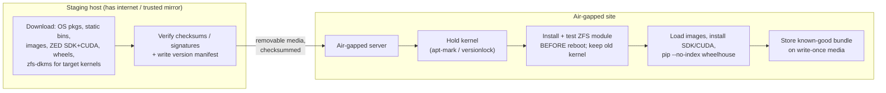

> **Mining-server note:** The **kernel-vs-ZFS mismatch** is how an air-gapped pool goes dark after a routine update — the system reboots into a kernel with no matching ZFS module and no internet to fetch one. Holding the kernel, pre-staging the DKMS package for the *next* kernel, testing the module before reboot, and keeping the old kernel bootable turns that outage into a non-event.

## Migrating an Existing Image Store

You already have a working debug-image store. It is full of real captures, pipelines read from it, and people know its paths by heart. **Do not rip it out.** The goal of this chapter is to adopt the canonical layout and catalog *around* what exists — indexing the old data where it sits, sending new captures into the new structure immediately, and only later (optionally) relocating the historical bytes. At every step the store stays readable and the work is resumable, so an interrupted migration is never a corrupted one.

> **Mining-server note:** A migration that requires "downtime" or "move everything this weekend" does not survive contact with a 24/7 plant on an isolated server with no second machine to stage on. The approach here moves **zero bytes** to get the benefits, then relocates in small, verified, reversible batches if and when you choose.

### Principle: Index in Place Before You Move a Byte

The catalog is an index over your data, not the data itself, and it stores **each asset's current `path`**. That single fact is what makes a safe migration possible: the moment the old tree is indexed, queries, retention, integrity checks, and tiering all work against it **without anything moving**. Relocation into the canonical `raw/image/<project>/<sensor>/YYYY/MM/DD/` tree becomes a *later, optional optimization* — done in batches, each verified, each reversible — rather than a prerequisite.

So the order is always:

1. **Inventory + checksum** the existing tree (know exactly what you have).
2. **Strangle**: point new captures at the new layout + catalog today.
3. **Backfill** the old tree into the catalog/sidecar model *in place* (no byte moves).
4. **Optionally relocate** the historical bytes into the canonical tree, in date batches.
5. **Verify** continuously (row count vs file count, checksum match).

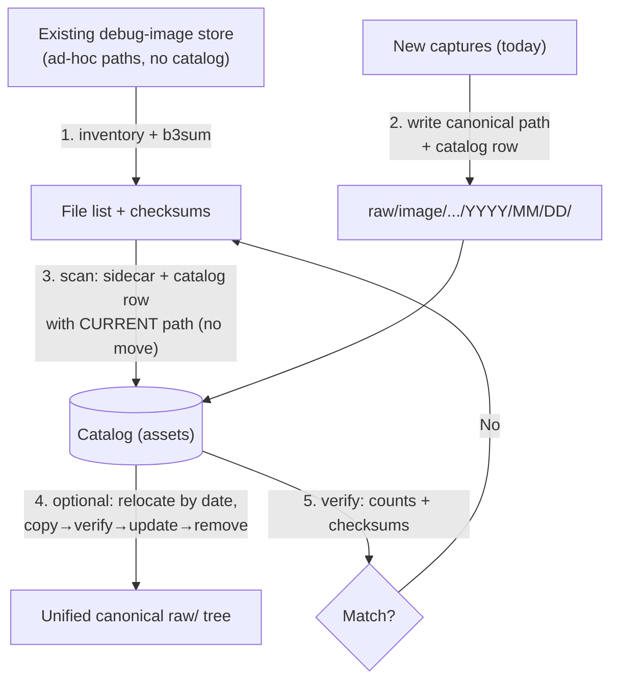

Throughout, the catalog uses the canonical `assets` schema and modality enum — for an image store every row is `modality = 'image'`.

### Step 1 — Assess What You Have (Inventory + Checksums)

**What it is.** A complete, checksummed inventory of the current store *before* you change anything — the baseline you verify every later step against.

**Why it matters.** You cannot prove a migration lost nothing if you never measured what was there. The inventory also surfaces the messy reality (duplicate files, zero-byte truncations, mixed extensions, mystery folders) while it is still cheap to deal with.

**What to do.** Count, size, and checksum the tree. Use `b3sum` for archive-wide hashing (multi-GB/s); keep `sha256sum` only where another party must verify.

```bash
# how many files, how big, what extensions?
find /debug/images -type f | wc -l
du -sh /debug/images
find /debug/images -type f | sed 's/.*\.//' | sort | uniq -c | sort -rn

# zero-byte / truncated files are worth catching now
find /debug/images -type f -size 0 -print

# checksum the whole tree (file-targeting form, never a directory glob)
find /debug/images -type f -print0 | xargs -0 b3sum > /scratch/inventory.b3
wc -l /scratch/inventory.b3            # this count is your baseline row target
```

Stash `inventory.b3` somewhere durable — it is both your migration baseline and a fixity record for data that has never had one.

> **Mining-server note:** Run the inventory off-peak and `ionice` it — checksumming the whole debug store competes with live capture I/O. The hash pass is also your first real **bit-rot audit** of years of images that were never checksummed; investigate anything that won't read.

### Step 2 — Strangler / Coexistence: New Captures, New Layout

**What it is.** The strangler-fig pattern: stand up the new layout and catalog and route **all new captures** into it *today*, while the old store keeps serving reads. The new system grows around the old one until the old one is just historical rows in the same catalog.

**Why it matters.** It stops the bleeding immediately — every capture from now on is correctly placed, checksummed, and catalogued — without waiting on the (slow, optional) historical relocation. Old and new coexist because the **catalog is the single query surface**: a consumer asks the catalog for images, and gets rows whose `path` may point at the legacy tree *or* the new tree, transparently.

**What to do.** Point the capture/ingest writer at the canonical structure and have it write a catalog row + sidecar per asset:

```text
# new captures, canonical dimension-first plain paths:
raw/image/flotation-cell-7/cam-froth-01/2026/06/29/cam-froth-01_20260629T141500Z_0001.jpg
raw/image/flotation-cell-7/cam-froth-01/2026/06/29/cam-froth-01_20260629T141500Z_0001.json   # sidecar
catalog/modality=image/ingest_date=2026-06-29/part-0000.parquet                              # key=value ONLY here
```

The legacy tree is now **read-only** (`chmod 0444` / read-only mount / `zfs set readonly=on`) so nothing new lands in the old shape and the historical bytes are frozen for safe indexing. From this point the catalog spans both trees; the rest of the migration is purely about pulling the *old* rows in (Step 3) and, optionally, tidying their bytes (Step 4).

> **Mining-server note:** Freezing the legacy tree read-only the moment new captures are diverted is what makes the backfill safe and idempotent — the file set under the old tree stops changing, so a scan you start tonight and finish tomorrow sees a stable target.

### Step 3 — Backfill the Catalog Without Moving Bytes

**What it is.** Walk the frozen legacy tree, generate a sidecar and checksum per file, and insert a catalog row whose `path` is the file's **current** location. No bytes move.

**Why it matters.** This is the step that delivers most of the value: the old images become queryable, integrity-checked, retention-managed, and tier-aware *in place*. Because nothing moves, it is fully reversible — if anything looks wrong, you drop the rows and the files are untouched.

**What to do.** For each legacy file: derive its dimensions, extract technical metadata, compute the checksum, write the sidecar, and upsert the catalog row.

- **`captured_at` (UTC):** prefer EXIF `DateTimeOriginal`; fall back to a parseable timestamp in the filename; last resort, file mtime. Record which source you used.
- **`project` / `sensor`:** map from the legacy path or filename (e.g. `/debug/images/froth1/...` → `project=flotation-cell-7`, `sensor=cam-froth-01`). Keep a small mapping table for the ad-hoc names.
- **`checksum` / `bytes`:** from the inventory pass (reuse `inventory.b3`) or compute now.
- **`tier`:** wherever the bytes physically live today (`warm`/`hot`).

```bash
# per-file metadata for the sidecar (technical facts are extracted, never typed)
exiftool -j -DateTimeOriginal -ImageWidth -ImageHeight -Make -Model old/IMG_0001.jpg
```

A backfilled sidecar keeps the canonical field names and the file's existing path:

```json
{
  "asset_id": "b6b1f0e2-...-9c",
  "path": "debug/images/froth1/2025-11-03/IMG_0001.jpg",
  "modality": "image",
  "project": "flotation-cell-7",
  "sensor": "cam-froth-01",
  "captured_at": "2025-11-03T13:22:07Z",
  "bytes": 4211233,
  "checksum": "af1349b9f5f9a1a6...",
  "tier": "warm",
  "pipeline_ver": null
}
```

Load the rows into the catalog (DuckDB over Parquet shown; SQLite works the same way). The insert is **idempotent** — keyed on `asset_id` (or `path`+`bytes`) so re-running skips what is already present:

```sql
-- one-time table, then upsert from the per-run sidecar dump (NDJSON/CSV the scanner emits)
CREATE TABLE IF NOT EXISTS assets (
  asset_id     TEXT PRIMARY KEY,
  path         TEXT NOT NULL,
  modality     TEXT,                 -- 'image' for this store
  project      TEXT,
  sensor       TEXT,
  captured_at  TIMESTAMP,            -- UTC
  bytes        BIGINT,
  checksum     TEXT,                 -- BLAKE3 hex
  tier         TEXT,                 -- hot | warm | cold
  pipeline_ver TEXT
);
INSERT OR IGNORE INTO assets
  SELECT * FROM read_json_auto('/scratch/backfill-batch.ndjson');
```

> **Mining-server note:** Write the sidecar atomically — `tmp` file + `fsync` + `rename` — so an interrupted scan never leaves a half-written `.json` next to a good image. The sidecars are the durable source of truth; the catalog is rebuildable from them by re-scanning if it is ever lost.

### Step 4 — Optionally Relocate Into the Canonical Tree (Batches by Date)

**What it is.** Moving the historical bytes from their ad-hoc locations into `raw/image/<project>/<sensor>/YYYY/MM/DD/` with canonical filenames — done in **date-bounded batches**, one `YYYY/MM` at a time.

**Why it matters.** It is genuinely optional: once Step 3 is done, everything *works*. Relocation buys you a single uniform tree (simpler tiering, backup, and human navigation) at the cost of I/O and risk — so do it gradually, per month, only when you want it, and make every file move **copy → verify → update → remove** so it is reversible at all times.

**What to do.** Never `mv` first. For each file in a month batch: copy to the canonical path, verify the checksum at the destination, update the catalog `path`, *then* remove the original. The original is the rollback until the new copy is proven and the catalog points at it.

```bash
# relocate one month, rename to <sensor>_<UTC-timestamp>_<seq>.<ext>, verify, then update catalog
dst="raw/image/flotation-cell-7/cam-froth-01/2025/11/03/cam-froth-01_20251103T132207Z_0001.jpg"
rsync -a --checksum "debug/images/froth1/2025-11-03/IMG_0001.jpg" "$dst"
b3sum -c <<<"$(grep IMG_0001.jpg /scratch/inventory.b3 | awk -v f="$dst" '{print $1"  "f}')" \
  && duckdb catalog.db "UPDATE assets SET path='$dst', tier='warm' WHERE checksum='af1349b9...';" \
  && rm "debug/images/froth1/2025-11-03/IMG_0001.jpg"     # only after copy verifies AND catalog updated
```

Work whole `YYYY/MM` slices so the unit of relocation matches the unit of tiering and backup. Keep `raw/` read-only between batches; only the active batch's destination is briefly writable.

> **Mining-server note:** The checksum from the inventory is what makes relocation provably lossless — the destination must hash to the *same* value the source had before you delete anything. A copy that doesn't verify halts the batch with both copies still present; you lose nothing.

### Step 5 — Verify (Row Count vs File Count, Checksum Match)

**What it is.** The reconciliation that proves the catalog and the bytes agree, run after backfill and after each relocation batch.

**Why it matters.** "It looked fine" is not verification. Three cheap checks catch every realistic migration error: a count mismatch (missed or double-counted files), an orphan (file with no row), and a checksum drift (corruption or a bad copy).

**What to do.**

```bash
# (a) row count vs file count
find /data/raw/image /debug/images -type f ! -name '*.json' | wc -l        # files on disk
duckdb catalog.db "SELECT COUNT(*) FROM assets WHERE modality='image';"     # rows in catalog

# (b) re-checksum and (c) diff against the catalog: missing rows, orphan files, drift
find /data/raw/image /debug/images -type f ! -name '*.json' -print0 \
  | xargs -0 b3sum > /scratch/verify.b3
duckdb -c "
  CREATE TABLE disk AS
    SELECT * FROM read_csv('/scratch/verify.b3', columns={'checksum':'TEXT','path':'TEXT'}, delim=' ');
  -- in catalog but not on disk:
  SELECT 'missing' AS issue, a.path FROM 'catalog.db'.assets a
    WHERE NOT EXISTS (SELECT 1 FROM disk d WHERE d.path = a.path)
  UNION ALL
  -- on disk but not in catalog:
  SELECT 'orphan', d.path FROM disk d
    WHERE NOT EXISTS (SELECT 1 FROM 'catalog.db'.assets a WHERE a.path = d.path)
  UNION ALL
  -- path matches but checksum drifted:
  SELECT 'checksum_drift', d.path FROM disk d JOIN 'catalog.db'.assets a USING (path)
    WHERE d.checksum <> a.checksum;"
```

A clean run returns the expected count and an empty issue set. The final number to confront is the original `wc -l /scratch/inventory.b3` baseline from Step 1 — the catalog's image-row count must reconcile with it (allowing for any duplicates or zero-byte files you deliberately pruned).

> **Mining-server note:** Keep these three queries as a scheduled job, not a one-off — they are exactly the **catalog-rebuild validation drill** from the operations chapter. After migration they keep proving, month after month, that the bytes and the catalog still agree.

### A Resumable, Rollback-Safe Migration Script

**What it is.** The outline of the script that drives Steps 3–4 — **idempotent** (safe to re-run), **resumable** (picks up where it stopped), and **rollback-safe** (never deletes an original until its copy is verified and catalogued), with **progress logged** to a journal.

**Why it matters.** On an isolated server a migration *will* be interrupted — a shift change, a reboot, a full disk. The script must treat interruption as normal: re-running it must skip completed work, never double-process, and never leave a file in a half-moved state.

**What to do.** Drive everything off a **journal** (a table or append-only file) that records one row per asset with a status (`scanned` → `cataloged` → `relocated` → `verified`). Resume = read the journal and skip anything already at the target status. Per file, enforce the safe ordering.

```bash
#!/usr/bin/env bash
set -euo pipefail
SRC=/debug/images ; DST=/data/raw/image ; JOURNAL=/scratch/migrate.journal ; DRYRUN=${DRYRUN:-0}
touch "$JOURNAL"
done() { grep -qF "DONE	$1" "$JOURNAL"; }                 # already verified this checksum?
mark() { printf '%s\t%s\t%s\n' "$1" "$2" "$(date -uIs)" >> "$JOURNAL"; }   # append-only progress

find "$SRC" -type f ! -name '*.json' -print0 | while IFS= read -r -d '' f; do
  sum=$(b3sum "$f" | awk '{print $1}')
  done "$sum" && { echo "skip (resumed): $f"; continue; }   # idempotent + resumable

  # 1. derive canonical path/metadata; write sidecar atomically (tmp+fsync+rename)
  dst=$(canonical_path "$f" "$sum")                          # raw/image/<project>/<sensor>/Y/M/D/<sensor>_<UTC>_<seq>.ext
  [ "$DRYRUN" = 1 ] && { echo "DRYRUN $f -> $dst"; continue; }
  write_sidecar "$f" "$dst" "$sum"

  # 2. catalog row with CURRENT path first (in place; reversible)
  upsert_catalog "$f" "$sum" ; mark "CATALOGED" "$sum"

  # 3. OPTIONAL relocate: copy -> verify -> update path -> remove original (rollback-safe order)
  if [ "${RELOCATE:-0}" = 1 ]; then
    mkdir -p "$(dirname "$dst")"
    rsync -a --checksum "$f" "$dst"
    [ "$(b3sum "$dst" | awk '{print $1}')" = "$sum" ] || { echo "VERIFY FAILED: $dst" >&2; continue; }
    update_catalog_path "$sum" "$dst"
    rm -- "$f"                                               # only now is the original removable
    mark "RELOCATED" "$sum"
  fi
  mark "DONE" "$sum"
done
```

Properties to hold the script to:

- **Idempotent:** keyed on the content checksum, so re-running re-derives nothing already `DONE`.
- **Resumable:** the journal is the resume point; kill it and re-run, it continues.
- **Rollback-safe:** the original is deleted **only after** the copy verifies *and* the catalog points at the new path. A failed verify leaves both copies and halts that file, losing nothing.
- **Observable:** the journal is your progress bar and your audit trail; `grep -c DONE` vs the inventory count tells you how far along you are.
- **Dry-runnable:** `DRYRUN=1` prints every intended action and moves nothing — run it first on a single month.

> **Mining-server note:** Run it one `YYYY/MM` at a time with `RELOCATE=0` first (pure backfill, zero risk), verify with Step 5, and only then flip `RELOCATE=1` per month. The journal plus the read-only legacy tree means an interrupted, power-cut, or aborted run is always a *resume*, never a *recovery*.

## Tooling Quick Reference

| Category | Tool | Role |
|---|---|---|
| **Storage engines** | OpenZFS | Checksumming filesystem + volume manager; RAIDZ, snapshots, `zpool scrub`, `zfs send` |
| | Btrfs | CoW filesystem with data checksums/snapshots (single/RAID1; **not** RAID5/6) |
| | XFS | High-throughput large-file FS; metadata CRC only, scales to billions of files |
| | ext4 | Simplest FS; no data checksums; enable `large_dir` for huge directories |
| | SeaweedFS | Apache-2.0 S3-compatible object store; small files + large blobs, EC, Object Lock |
| | Garage | AGPLv3 lightweight S3 store; 3× replication only, low RAM |
| | Ceph + RGW | Feature-complete object/block/file; 5+ nodes, ops team |
| **Embedded / KV** | SQLite | Single-file SQL catalog; WAL, atomic, small-blob storage |
| | LMDB | mmap CoW B+tree KV store; read-heavy, crash-proof |
| | RocksDB | LSM-tree KV store; write-heavy, built-in zstd |
| **Formats** | FFV1 + Matroska (MKV) | Lossless archival video master with per-frame CRC |
| | H.264 / H.265 (HEVC) | Lossy video masters + proxies (via FFmpeg) |
| | HDF5 / NetCDF-4 | Single-file chunked N-D arrays (depth, voxels); single-writer |
| | Zarr v3 | Parallel-write chunked arrays; sharding avoids tiny-file blowup |
| | TileDB | Dense + sparse arrays (point clouds); embeddable, versioned |
| | Apache Parquet | Columnar storage for catalogs / exploded point tables |
| | Apache Arrow / Feather | In-memory / interchange (not archival — use Parquet to store) |
| | Lance | ML-native columnar format with versioning |
| | E57 / LAZ / PLY / PCD | Point-cloud archival (E57, LAZ) and interchange (PLY, PCD) |
| | COPC | LAZ reorganized as a streamable octree |
| | OpenEXR / 16-bit PNG | Lossless depth-map storage |
| **Catalog / query** | DuckDB | Serverless SQL over Parquet; Hive partition pruning, `parquet_metadata()` |
| | SQLite | Single-file relational catalog for mutable flags |
| | PostgreSQL (JSONB) | Relational catalog for heterogeneous metadata |
| | DuckLake / delta-rs | Offline ACID + time-travel table layer |
| **Versioning** | DVC | Pointer files in Git; cache to local or S3-compatible (SeaweedFS/Garage) remote; `dvc.yaml` pipelines |
| | git-annex | Distributed KV over Git; special remotes, `fsck`, `numcopies` |
| | DataLad | git + git-annex with provenance capture and subdatasets |
| | lakeFS | Git-like branch/commit over object store (needs PostgreSQL) |
| **Backup / integrity** | restic / BorgBackup / Kopia | Encrypted, deduplicating backup; append-only, verification |
| | b3sum (BLAKE3) / sha256sum | Fixity checksums for multi-year verification |
| | par2 | Parity files for repairing offline/tape archives |
| | zstd | General-purpose lossless compression (text, JSON, Parquet) |
| **Media** | FFmpeg / ffprobe | Encode/transcode/segment/proxy; extract JSON metadata sidecars |
| | VLC | Offline playback of MKV/FFV1 and HEVC |
| **3D** | Stereolabs ZED SDK | Record SVO2; export depth/point clouds |
| | PDAL / LAStools | Point-cloud pipelines; LAS↔LAZ; COPC, pgpointcloud writers |
| | Entwine / Potree | Build octrees; serve point clouds offline (static files) |
| | Open3D / PCL / CloudCompare | Point-cloud I/O, processing, inspection |
| | libE57 | Read/write/inspect E57 |
| **Search / telemetry** | LanceDB / pgvector / Qdrant / Milvus | Embedding storage + ANN search |
| | TimescaleDB / InfluxDB 3 | Sensor telemetry time-series |
| | FiftyOne | Dataset curation (uses vector backends) |

## Further Reading

**Filesystems & embedded stores**
- OpenZFS — Checksums and Their Use in ZFS — https://openzfs.github.io/openzfs-docs/Basic%20Concepts/Checksums.html
- OpenZFS — Workload Tuning (recordsize, compression) — https://openzfs.github.io/openzfs-docs/Performance%20and%20Tuning/Workload%20Tuning.html
- Btrfs — Status (RAID5/6 stability) — https://btrfs.readthedocs.io/en/latest/Status.html
- SQLite — 35% Faster Than The Filesystem — https://sqlite.org/fasterthanfs.html
- SQLite — Internal Versus External BLOBs — https://sqlite.org/intern-v-extern-blob.html
- SQLite — As An Application File Format — https://sqlite.org/appfileformat.html
- sqlite-zstd (phiresky) — https://github.com/phiresky/sqlite-zstd
- LMDB — official documentation — http://www.lmdb.tech/doc/
- RocksDB — Overview (wiki) — https://github.com/facebook/rocksdb/wiki/RocksDB-Overview

**Object storage**
- MinIO vs Ceph RGW vs SeaweedFS vs Garage (Onidel, 2025) — https://onidel.com/blog/minio-ceph-seaweedfs-garage-2025
- MinIO GitHub in maintenance mode — what's next (InfoQ) — https://www.infoq.com/news/2025/12/minio-s3-api-alternatives/
- SeaweedFS — README / architecture — https://github.com/seaweedfs/seaweedfs/blob/master/README.md
- Garage — Goals and use cases — https://garagehq.deuxfleurs.fr/documentation/design/goals/
- Ceph — hardware recommendations — https://docs.ceph.com/en/reef/start/hardware-recommendations/
- What Is RustFS? (Sealos) — https://sealos.io/blog/what-is-rustfs/
- Amazon S3 — multipart upload limits — https://docs.aws.amazon.com/AmazonS3/latest/userguide/qfacts.html
- Amazon S3 — Object Lock (WORM) — https://docs.aws.amazon.com/AmazonS3/latest/userguide/object-lock.html
- Amazon S3 — Object Key Design Best Practices — https://hidekazu-konishi.com/entry/amazon_s3_object_key_design_best_practices.html

**Databases & catalogs**
- To BLOB or Not To BLOB (Microsoft Research, MSR-TR-2006-45) — https://www.microsoft.com/en-us/research/wp-content/uploads/2006/04/tr-2006-45.pdf
- Binary data performance in PostgreSQL (CYBERTEC) — https://www.cybertec-postgresql.com/en/binary-data-performance-in-postgresql/
- PostgreSQL — Large Objects (Chapter 33) — https://www.postgresql.org/docs/current/largeobjects.html
- MySQL 8.4 — The BLOB and TEXT Types — https://dev.mysql.com/doc/refman/8.4/en/blob.html
- MongoDB — GridFS for Self-Managed Deployments — https://www.mongodb.com/docs/manual/core/gridfs/
- Redis — Anti-Patterns Every Developer Should Avoid — https://redis.io/tutorials/redis-anti-patterns-every-developer-should-avoid/

**Scientific array & columnar formats**
- HDF5 — Single-Writer/Multiple-Reader (SWMR) — https://support.hdfgroup.org/documentation/hdf5-docs/advanced_topics/intro_SWMR.html
- Zarr-Python 3 release (Jan 2025) — https://zarr.dev/blog/zarr-python-3-release/
- ZEP 2 — Sharding codec — https://zarr.dev/zeps/accepted/ZEP0002.html
- netCDF-4/HDF5 File Format (NASA Earthdata) — https://www.earthdata.nasa.gov/about/esdis/esco/standards-practices/netcdf-4hdf5
- TileDB — LiDAR / point clouds — https://tiledb.com/data-types/lidar/
- TileDB 101: Point Clouds — https://medium.com/tiledb/tiledb-101-point-clouds-1de21fed3d49
- Apache Parquet — format spec — https://github.com/apache/parquet-format/
- Apache Arrow — Streaming, Serialization, IPC (Feather v2) — https://arrow.apache.org/docs/python/ipc.html
- Lance — Open Lakehouse Format for Multimodal AI — https://github.com/lance-format/lance

**Vector & time-series databases**
- LanceDB — https://github.com/lancedb/lancedb
- pgvector — https://github.com/pgvector/pgvector
- Qdrant — Quantization documentation — https://qdrant.tech/documentation/manage-data/quantization/
- Milvus — Deployment options (Lite / Standalone / Distributed) — https://milvus.io/docs/install-overview.md
- FAISS — Faiss on the GPU — https://github.com/facebookresearch/faiss/wiki/Faiss-on-the-GPU
- TimescaleDB — https://github.com/timescale/timescaledb
- InfluxData — Which InfluxDB 3 should I use? — https://docs.influxdata.com/influxdb3/which-influxdb-3/

**Versioning, catalogs & lakehouse**
- DVC — Remote Storage — https://dvc.org/doc/user-guide/data-management/remote-storage
- git-annex — special remotes — https://git-annex.branchable.com/special_remotes/
- DataLad (peer-reviewed, PMC) — https://pmc.ncbi.nlm.nih.gov/articles/PMC11514317/
- lakeFS — Architecture & local checkouts — https://docs.lakefs.io/understand/architecture/
- Hudi vs Delta vs Iceberg feature comparison (Onehouse) — https://www.onehouse.ai/blog/apache-hudi-vs-delta-lake-vs-apache-iceberg-lakehouse-feature-comparison
- DuckLake — integrated data lake + catalog — https://ducklake.select/

**Directory layout & partitioning**
- DuckDB — Hive Partitioning — https://duckdb.org/docs/current/data/partitioning/hive_partitioning
- DuckDB — Querying Parquet Metadata — https://duckdb.org/docs/lts/data/parquet/metadata
- PyArrow — Tabular Datasets — https://arrow.apache.org/docs/python/dataset.html
- Apache Spark — Parquet Partition Discovery — https://spark.apache.org/docs/latest/sql-data-sources-parquet.html
- Medallion lakehouse architecture (Microsoft Learn) — https://learn.microsoft.com/en-us/azure/databricks/lakehouse/medallion
- ISO 8601 (lexicographic = chronological) — https://en.wikipedia.org/wiki/ISO_8601
- ext4 — HTree indexing, large_dir (Wikipedia) — https://en.wikipedia.org/wiki/Ext4

**Video**
- Library of Congress — FFV1 codec sustainability — https://www.loc.gov/preservation/digital/formats/fdd/fdd000341.shtml
- Library of Congress — Matroska with FFV1 — https://www.loc.gov/preservation/digital/formats/fdd/fdd000343.shtml
- FFV1 — official codec specification — https://github.com/FFmpeg/FFV1/blob/master/ffv1.md
- FFmpeg — ffprobe documentation — https://ffmpeg.org/ffprobe.html
- SVT-AV1 — Common Questions / encoding guide — https://gitlab.com/AOMediaCodec/SVT-AV1/-/blob/master/Docs/CommonQuestions.md
- Why force fixed & closed GOPs in FFmpeg — https://marcinchmiel.com/articles/2020-10/why-you-should-force-fixed-closed-gops-and-how-to-do-it-in-ffmpeg/

**3D & point clouds**
- libE57 — tools for E57 (ASTM E2807) — http://libe57.org/
- COPC — Cloud Optimized Point Cloud spec 1.0 — https://copc.io/
- COPC — Cloud-Native Geospatial Formats Guide — https://guide.cloudnativegeo.org/copc/
- LASzip — Lossless Compression of Lidar Data (Isenburg) — https://lastools.osgeo.org/download/laszip.pdf
- Potree — WebGL point-cloud viewer — https://github.com/potree/potree
- PDAL — Entwine / EPT — https://pdal.io/en/stable/workshop/introduction/entwine.html
- pgpointcloud — PostgreSQL point-cloud extension — https://pgpointcloud.github.io/pointcloud/
- OpenEXR — Technical Introduction (PXR24 for depth) — https://openexr.com/en/latest/TechnicalIntroduction.html
- Khronos — glTF Draco geometry compression (mesh-only) — https://www.khronos.org/news/press/khronos-announces-gltf-geometry-compression-extension-google-draco
- Open3D — point cloud tutorial (voxel_down_sample) — https://www.open3d.org/docs/release/tutorial/geometry/pointcloud.html
- Point cloud file formats overview (E57, LAS, PLY, PCD) — https://www.thefuture3d.com/learn/point-cloud-file-formats/

**Integrity, backup & compression**
- Klara Systems — Understanding ZFS Scrubs and Data Integrity — https://klarasystems.com/articles/understanding-zfs-scrubs-and-data-integrity/
- restic — Working with repositories (check / check --read-data) — https://restic.readthedocs.io/en/latest/045_working_with_repos.html
- BorgBackup — init / encryption & append-only — https://borgbackup.readthedocs.io/en/stable/usage/init.html
- Zstandard — official site — http://facebook.github.io/zstd/

**ZED / Stereolabs (primary)**
- Stereolabs — Video Recording (SVO/SVO2 format, compression modes) — https://www.stereolabs.com/docs/video/recording
- Stereolabs — ZED SDK recording module — https://docs.stereolabs.com/docs/development/zed-sdk/modules/camera/recording
- Stereolabs Help Center — file size for ZED recordings — https://support.stereolabs.com/hc/en-us/articles/1500009124262
- Stereolabs Help Center — convert SVO to AVI / image/depth sequences — https://support.stereolabs.com/hc/en-us/articles/360009986754
- zed-sdk — SVO export sample (16-bit depth PNG) — https://github.com/stereolabs/zed-sdk/blob/master/recording/export/svo/README.md

## Glossary

- **Object storage** — A flat namespace of buckets and objects addressed by a single key string (the S3 model). "Folders" are a UI illusion built from key prefixes; there is no real directory tree. Strong at scale, rich per-object metadata, and parallel HTTP access; no in-place edit/append.
- **BLOB (Binary Large Object)** — An opaque chunk of binary data (a video, an SVO2 file, a point cloud). The guide's rule: store BLOBs as files/objects and keep only their metadata + path + checksum in a database.
- **Catalog / index** — A queryable record of every asset's location, capture metadata, checksum, and retention policy. Derived and disposable: rebuildable by re-scanning the tree, because human-readable sidecars are the source of truth.
- **Sidecar** — A small companion file (e.g. `clip.mkv.json`) holding metadata or a checksum next to the asset it describes, so the archive is self-describing without a database.
- **Chunking (content-defined)** — Splitting files into variable-length pieces by content so that unchanged regions deduplicate across backups; used by restic/Borg/Kopia.
- **GOP (Group of Pictures)** — The interval between video keyframes. You can only seek or cut cheaply at keyframes, so archives use closed, fixed-interval GOPs.
- **Proxy / master** — A *master* is the write-once, high-quality (often lossless) copy kept for years; a *proxy* is a small, regenerable low-resolution copy for fast browsing.
- **Partition key** — The field(s) used to split data into subdirectories (e.g. date). Order keys most-stable / most-filtered first; keep volatile fields out of the path.
- **Hive-style partitioning** — Encoding partition values as `key=value` directory names (`year=2026/month=06`) that DuckDB, Spark, and Arrow auto-detect and prune on.
- **Lakehouse** — A table format (Iceberg, Delta, Hudi, DuckLake) that adds ACID transactions, schema evolution, and time-travel over Parquet files. Stores structured tables, never raw video/SVO blobs.
- **Content-addressed storage** — Storing each object under a key derived from its hash (e.g. SHA-256 fanned out as `ab/cd/...`), giving automatic deduplication and built-in integrity verification.
- **Fixity / checksum** — A hash (SHA-256, BLAKE3) recorded per file and re-verified on a schedule to prove the bytes are unchanged. Checksums *detect* corruption but do not *repair* it.
- **Scrubbing** — A filesystem operation (ZFS/Btrfs `scrub`) that re-reads every block, verifies its checksum, and, with redundancy, self-heals from a good copy — the defense against silent bit-rot over years.
- **Bit-rot (silent corruption)** — A flipped bit returned with no drive error. The core multi-year threat, because ordinary copies propagate it into backups before anyone notices.
- **Erasure coding** — Splitting an object into *k* data + *m* parity shards (Reed–Solomon) so it survives losing any *m* shards, at far less overhead than full replication; the object-storage equivalent of RAID parity, with per-read checksums.
- **WORM / Object Lock** — Write-Once-Read-Many immutability. S3 Object Lock (Governance/Compliance/Legal Hold) prevents deletion or overwrite until an expiry, the strongest retention guarantee.
- **SVO / SVO2** — Stereolabs' proprietary single-file container (default since ZED SDK 4.1) storing stereo video plus timestamped sensor/IMU/custom data. It does **not** store depth or point clouds — those are recomputed on playback, so pin and archive the SDK version.
- **Point cloud** — A set of 3D points (X, Y, Z plus attributes like intensity/RGB). Archived as E57 or LAZ; queried via TileDB or Parquet; viewed offline with Potree.
- **Depth map** — A per-pixel distance image. Stored losslessly as OpenEXR (float) or 16-bit PNG (millimeters, range < 65.5 m) — never JPEG.
- **Embedding / vector** — A numeric array summarizing an image/frame for similarity search. Stored in a vector DB; comparable only within the same model version, so changing models forces a re-embed.
- **ANN (Approximate Nearest Neighbor)** — Index structures (HNSW, IVF) that find similar vectors fast without scanning every one; the engine behind near-duplicate detection.
- **3-2-1-1-0** — Backup rule: 3 copies, on 2 media types, 1 offsite, 1 offline/immutable, with 0 verified errors (proven by test restores).

---

*This guide was generated as a practical, vendor-neutral reference for storing large, heterogeneous sensor data on self-hosted and air-gapped infrastructure. Figures are content- and configuration-dependent estimates; verify tool status and limits against current upstream documentation before relying on them.*
