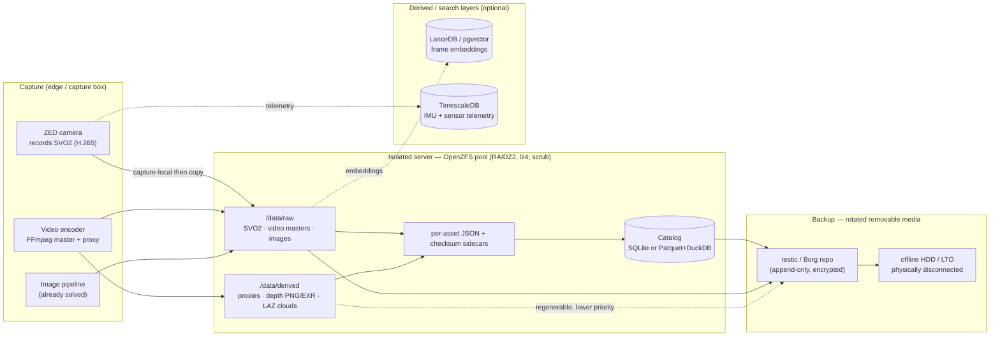

# Recommended Architecture for Production Sensor Data (Isolated Servers)

This is one opinionated, end-to-end design that fits an air-gapped mining server scaling from GBs to many TB over years. It is deliberately boring: a checksumming filesystem for bytes, a single-file (or Parquet) catalog for facts, and a deduplicating backup to rotated removable media. Add object storage and vector/time-series layers only when scale or a second node demands them.

**The shape of it:**

- **Storage engine:** OpenZFS pool (mirror or **RAIDZ2** for parity) with `compression=lz4`, `recordsize=1M` on the bulk media dataset, and a **monthly `zpool scrub`**. ZFS gives you the one thing ext4/XFS cannot: end-to-end data checksums that catch and self-heal silent bit-rot over multi-year retention.
- **Layout:** an immutable, write-once blob tree split `raw/` vs `derived/`, keyed most-stable-first (`modality / project / sensor / YYYY / MM / DD`). Volatile facts (labels, QA flags) stay **out of the path and in the catalog**, so re-labeling is an `UPDATE`, not a million file moves.
- **Catalog:** a **SQLite** file (single box) or **Parquet + DuckDB** (multi-TB) recording `asset_id`, path, size, SHA-256/BLAKE3 checksum, capture time, sensor/SDK version, and `retain_until`. It is *derived and disposable* — rebuildable by re-scanning the tree, because the JSON sidecars are the source of truth.
- **Backup:** **restic** or **BorgBackup** to external HDDs (or LTO), following **3-2-1-1-0** (3 copies, 2 media, 1 offsite, 1 offline/immutable, 0 verified errors). Rotate media so at least one copy is physically disconnected. Export the repo key to paper/QR.



**How each modality fits:**

- **Images:** Unchanged. Files on ZFS, sharded by date/hash, paths + checksums in the catalog. They are the model everything else copies.
- **Video:** Master (FFV1/MKV or H.265 CRF ~20) under `raw/video/`; H.264 proxies under `derived/video/`. Force **closed, fixed-interval GOPs** so seeking and segmenting are cheap. Each clip gets an `ffprobe` JSON sidecar. Proxies are regenerable, so they back up at lower priority.
- **3D (ZED):** The `.svo2` is the raw master under `raw/svo2/` (record the SDK version in the catalog — depth is *recomputed* on playback, not stored). Exported depth (16-bit PNG/EXR) and point clouds (E57/LAZ) live under `derived/depth/` and `derived/point_cloud/` and can be deleted and recomputed. Persist intrinsics, baseline, and disparity scale in the sidecar or conversions become irreproducible.

Example directory tree:

```text
/data                                        # single-project site; project level shown (flotation-cell-7)
├── raw/                                  # write-once, never mutated, top backup priority
│   ├── image/flotation-cell-7/cam-froth-01/2026/06/29/...jpg
│   ├── video/flotation-cell-7/cam-froth-01/2026/06/29/
│   │   ├── cam-froth-01_20260629T141500Z_0001.mkv          # FFV1 or H.265 CRF~20
│   │   └── cam-froth-01_20260629T141500Z_0001.mkv.json
│   └── svo2/flotation-cell-7/zed2i-sn12345/2026/06/29/
│       ├── zed2i-sn12345_20260629T141500Z_0001.svo2        # H.265 working master
│       └── zed2i-sn12345_20260629T141500Z_0001.svo2.json   # sdk_version, depth_mode, intrinsics
├── derived/                              # regenerable cache, lower backup priority
│   ├── video/flotation-cell-7/cam-froth-01/2026/06/29/...proxy_720p.mp4
│   ├── depth/flotation-cell-7/zed2i-sn12345/2026/06/29/
│   │   └── frame_000123_depth.png                          # 16-bit mm (scale in sidecar)
│   └── point_cloud/flotation-cell-7/zed2i-sn12345/2026/06/29/
│       └── cloud_000123.laz                                # lossless, ~7–25% of original
├── catalog/
│   └── assets.duckdb                     # or assets.sqlite
└── _sidecar_truth/                       # JSON sidecars are source of truth
```

Minimal catalog schema (SQLite/DuckDB):

```sql
CREATE TABLE assets (
  asset_id     TEXT PRIMARY KEY,   -- stable UUID, NOT the path
  path         TEXT NOT NULL,
  modality     TEXT,               -- image | video | svo2 | depth | point_cloud
  is_derived   BOOLEAN,
  sensor       TEXT,               -- device serial, not a role name
  captured_at  TIMESTAMP,          -- UTC
  bytes        BIGINT,
  checksum     TEXT,               -- sha256 / blake3
  sdk_version  TEXT,               -- ZED SDK + depth mode for 3D
  retain_until DATE
);
```

> **Mining-server note:** Verify, don't trust. Schedule `zpool scrub` monthly to catch bit-rot at the block level, re-hash a rolling sample of assets against the catalog (BLAKE3 is multi-GB/s, fast enough to re-verify TBs), and run a real **test restore** from removable media periodically — a backup is unproven until you restore and byte-compare. RAID is *not* a backup: it protects availability, not against `rm`, overwrite, or corruption replicated before detection.

> **Mining-server note:** When a second capture node or many concurrent writers appear, promote the bulk store from plain ZFS files to **SeaweedFS** (S3-compatible, versioning + Object Lock for WORM retention, erasure coding) — but keep the same catalog and the same `raw/`-vs-`derived/` discipline. The architecture grows by swapping the byte store, not by rewriting the index.
