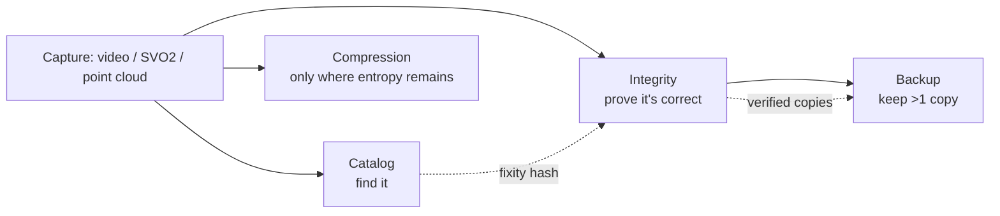
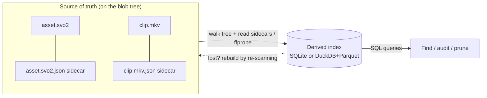
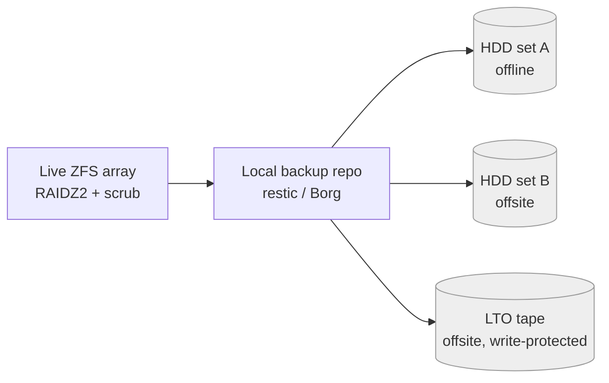

# Cross-Cutting Concerns

Once you have decided *where the bytes physically land*, four disciplines decide whether a multi-terabyte archive is still **usable and trustworthy** a decade from now: you can **find** data (catalog/index), the bytes are still **correct** (integrity), you have more than one **copy** (backup/dedup), and you are not **wasting** space or CPU (compression). These sit on top of every storage layout in this guide and matter most exactly where you have the least safety net.

> **Mining-server note:** Your debug *images* are already handled. The new pain — **video** and **Stereolabs ZED 3D data** (point clouds, depth maps, `.svo2` recordings) — is precisely the data that is biggest, hardest to re-acquire, and longest-lived. On isolated, air-gapped sites you cannot lean on a cloud provider's durability SLA or managed backups, so every recommendation below is offline-capable and built from static binaries.

These four concerns reinforce each other. A useful way to hold them in your head:



---

## The Catalog / Index in Practice

Files on disk are not a database. With tens of thousands of clips, point clouds, and SVO recordings spread over years, *"find every ZED capture from line 2 in March where depth-valid % < 60"* is impossible with `find` and `grep`. The fix is a **two-layer pattern**: sidecar metadata that travels *with* each asset, plus a derived index you can *query*.



The index is **derived and disposable**: if it is ever lost or corrupted, you rebuild it by walking the tree again. The sidecars are the durable truth.

### Sidecar metadata.json (the source of truth lives with the file)

- **What it is.** A small JSON file written next to every asset (or every capture session) carrying what the filename cannot — capture time, camera serial, site/line, pipeline version, calibration ID, labels, and a content checksum. Technical media facts are *extracted* with standard tools, never typed by hand.

- **Best for.** Self-describing archives that survive being copied to any medium (HDD, LTO) and read with no database present — the offline-first ideal.

- **Avoid when.** Never skip it; but do not treat the sidecar as your *query* surface — that is the index's job.

- **Tools.**
  - **`ffprobe`** (ships with FFmpeg) — codec, resolution, duration, frame rate, bitrate, stream layout for video and SVO-derived MP4s.
  - **`exiftool`** — EXIF/XMP for stills and many container formats.
  - **ZED SDK** — for `.svo2`: frame count, resolution, FPS, depth mode, and any *custom* timestamped channels you recorded. (See the 3D playbook for SVO2 specifics.)
  - **PDAL / `lasinfo`** — point count, extent, CRS for LAS/LAZ point clouds.

- **Trade-offs.** One extra small file per asset (mitigate sidecar drift by writing atomically — `tmp` + `fsync` + `rename` — and mirroring its contents into the index).

```bash
# Extract technical metadata into a sidecar at ingest
ffprobe -v quiet -print_format json -show_format -show_streams clip.mkv > clip.mkv.json
```

A worked sidecar for a ZED recording:

```json
{
  "asset_id": "9f3c1a7e-2b40-4d51-8a1e-0c7d6f2e9b11",
  "path": "raw/svo2/concentrator-A/zed2i-sn12345/2026/03/12/zed2i-sn12345_20260312T084122Z_0007.svo2",
  "modality": "svo2",
  "captured_at": "2026-03-12T08:41:22Z",
  "site": "concentrator-A", "line": 2,
  "sensor": "zed2i-sn12345",
  "camera": {"model": "ZED 2i", "serial": "SN12345", "fw": "1.5.2"},
  "zed": {"sdk": "4.1.3", "depth_mode": "NEURAL", "fps": 30, "frames": 5400,
          "resolution": "1920x1080"},
  "zed_depth_valid_pct": 71.4,
  "pipeline": {"name": "froth-3d", "git_sha": "a1b2c3d", "calib_id": "cal-2026-02"},
  "labels": ["overflow_event"],
  "bytes": 5123456789,
  "blake3": "af1349b9f5f9a1a6...",
  "schema_version": 2
}
```

### Fields worth storing (don't skip these)

| Field group | Examples | Why it earns its place |
|---|---|---|
| **Identity** | `asset_id` (UUID), relative `path` | Use a stable UUID as the key, *not* the path — files move across years and media |
| **Classification** | `modality`, `site`, `line`, `sensor` | The dimensions you filter on most |
| **Time** | `captured_at` (UTC) | Always UTC on air-gapped boxes with skewing clocks |
| **Technical** | `codec`, `width/height`, `fps`, `duration_s`, `frames`, `bytes` | Pulled from ffprobe/SDK; powers quality filters |
| **Integrity** | `blake3` / `sha256` + algorithm | Doubles as fixity record *and* dedup key |
| **Provenance** | `pipeline_sha`, `calib_id`, `zed.sdk` | You will thank yourself when reprocessing or re-deriving depth |
| **Operational** | `labels`, `retention_class`, `indexed_at`, `schema_version` | Mutable workflow state; lets the schema evolve |

> **Mining-server note:** Record the **ZED SDK version and depth mode** per dataset. SVO2 does not store depth or point clouds — the SDK *recomputes* them on playback, so the same recording yields different depth across SDK versions. Without the pinned version, your 3D results are not reproducible.

### The queryable index — SQLite vs DuckDB-over-Parquet

Build the index by **walking the tree once**, reading each sidecar (and/or running ffprobe), and writing rows. Re-scan incrementally: skip files whose `path + mtime + size` are unchanged. Two offline-friendly engines, both single static binaries:

| | **SQLite** | **DuckDB + Parquet** |
|---|---|---|
| **What it is** | Single-file embedded relational DB | Embedded analytical (OLAP) engine querying columnar Parquet directly |
| **Best for** | Up to a few million rows; point lookups, "open this asset"; *mutable* fields (labels, retention flags) | Millions–billions of rows; scans/aggregations/`GROUP BY` over the whole archive |
| **Storage** | One `.db` file | A directory of `.parquet`, partitioned by year/month/site |
| **Concurrency** | Single-writer | Read-optimized; rewrite a partition to update |
| **Offline** | Single static binary | Single static binary |

**Recommendation:** Start with **SQLite** for operational metadata you mutate — it is the simplest thing that works for a lone isolated box. Add a **DuckDB-over-Parquet** layer once you want fast analytics across the multi-TB tree or the index passes tens of millions of rows. They compose: keep the JSON sidecars as truth, mirror them into Parquet for analytics.

A schema that works in both:

```sql
CREATE TABLE assets (
  asset_id      TEXT PRIMARY KEY,      -- stable UUID, not the path
  path          TEXT NOT NULL,
  modality      TEXT,                  -- image | video | svo2 | depth | point_cloud
  captured_at   TIMESTAMP,             -- UTC
  site          TEXT,  line     INTEGER,
  camera_model  TEXT,  sensor   TEXT,
  codec         TEXT,  width INTEGER, height INTEGER,
  fps           DOUBLE, duration_s DOUBLE, frames INTEGER,
  bytes         BIGINT,
  checksum      TEXT,                  -- fixity + dedup key (BLAKE3)
  zed_depth_valid_pct DOUBLE,          -- nullable; ZED depth-valid %
  pipeline_sha  TEXT, calib_id TEXT, zed_sdk TEXT,
  labels        TEXT,                  -- JSON array
  retention_class TEXT,
  indexed_at    TIMESTAMP, schema_version INTEGER
);
CREATE INDEX idx_assets_time      ON assets(captured_at);
CREATE INDEX idx_assets_site_line ON assets(site, line);
```

Querying a Hive-partitioned Parquet catalog directly with DuckDB — no import step:

```sql
-- catalog laid out as catalog/year=*/month=*/site=*/*.parquet
SELECT site, line, COUNT(*) AS clips, SUM(bytes)/1e12 AS tb
FROM read_parquet('catalog/**/*.parquet', hive_partitioning = true, union_by_name = true)
WHERE modality = 'svo2' AND captured_at >= '2026-03-01'
GROUP BY site, line
ORDER BY tb DESC;

-- find low-quality 3D captures to prune
SELECT path, zed_depth_valid_pct
FROM read_parquet('catalog/**/*.parquet')
WHERE modality = 'svo2' AND zed_depth_valid_pct < 60;
```

DuckDB helpers when building or auditing the index: `glob('data/**/*')` enumerates files, `read_parquet(..., filename = true)` adds a source-file column, and `parquet_metadata()` / `parquet_schema()` inspect Parquet internals (row counts, row groups, min/max stats) *without* scanning the data.

> **Mining-server note:** Keep catalog Parquet files in the ~128 MB–1 GB range and partition only by stable, low-cardinality dimensions (year/month/site) — never by `frame_id` or hash. A thousand tiny Parquet files cripple scans. This sizing applies to the *catalog*, not your multi-GB media blobs, which stay at their natural sizes. See the partitioning chapter for layout details.

---

## Data Integrity Over Years

Disks fail loudly *and* quietly. **Silent bit-rot** — a flipped bit the drive returns with no error reported — is the killer for multi-year archives, because an ordinary copy faithfully propagates the corruption into your backups *before you notice*. Two complementary defenses: **fixity records** (prove a file is unchanged) and a **checksumming filesystem that scrubs and self-heals**.

### Fixity checksums (SHA-256 / BLAKE3)

- **What it is.** A cryptographic hash of every asset recorded at ingest (in the sidecar and the index), re-computed periodically and compared to detect rot, truncation, or accidental edits.

- **Best for.** Proving integrity *independent of the filesystem* and across media and copies; the hash doubles as a dedup key.

- **Avoid when.** Never skip recording one — but do not mistake a checksum for *repair*. It only **detects**; repair needs redundancy or a second copy.

- **Tools.**

| Algorithm | Throughput (typical) | Notes |
|---|---|---|
| **SHA-256** (`sha256sum`) | ~300–500 MB/s/core (faster with SHA-NI) | NIST/FIPS standard, universally available; the safe default for published/interop hashes |
| **BLAKE3** (`b3sum`) | Multiple GB/s; tree-structured, scales across cores | Far faster for re-hashing TBs; newer, less ubiquitous in package ecosystems |

- **Trade-offs.** Re-hashing many TB with SHA-256 is painfully slow, so prefer **BLAKE3** for archive-wide re-verification and keep **SHA-256** for hashes others must verify. Store both the value *and* the algorithm in the sidecar.

```bash
find raw/svo2 -type f -print0 | xargs -0 b3sum > CHECKSUMS.b3   # at ingest
b3sum --check CHECKSUMS.b3                   # quarterly audit
```

### Checksumming filesystems that scrub (ZFS / Btrfs)

- **What it is.** ZFS and Btrfs checksum every data *and* metadata block on write and verify it on read. A periodic **scrub** re-reads all blocks, recomputes checksums, and — *when you have redundancy* (mirror, RAIDZ, Btrfs RAID1/10) — **self-heals** by overwriting the bad copy from a good one. This is the single most effective defense against silent bit-rot for a self-hosted archive.

> Plain ext4/XFS checksum *metadata only* — they cannot detect silent corruption in your data blocks. For a multi-year archive that is the decisive difference. (See the filesystem chapter for the full ZFS/Btrfs/XFS comparison.)

- **Best for.** Multi-year local archives on isolated servers. ZFS is the conservative choice (mature RAIDZ, ~20 years in production); Btrfs is fine for single-disk checksumming and RAID1/10 self-healing.

- **Avoid when.** **Btrfs RAID5/6 is still not production-ready** (parity write-hole) — use ZFS RAIDZ2 for parity redundancy instead.

- **Tools.** `zpool scrub`, `btrfs scrub`, plus `cron` to schedule them.

- **Trade-offs.** ZFS wants a little planning (pools/vdevs) and prefers ECC RAM; Btrfs is simpler to start. Both let you pause, resume, and monitor scrubs.

```bash
# ZFS: scrub monthly (cron); weekly for critical pools
zpool scrub tank   && zpool status tank
# Btrfs:
btrfs scrub start /mnt/tank && btrfs scrub status /mnt/tank
```

**Cadence:** monthly for normal data, weekly for critical — the goal is to find rot *before* it reaches your only good copy.

### "RAID is not a backup"

RAID (or RAIDZ/mirroring) protects against **drive failure** and, with checksums, repairs bit-rot. It does **not** protect against accidental `rm`, a buggy pipeline overwriting files, ransomware, a controller that scrambles the array, fire/theft/flood, or corruption you replicate before noticing. A mirror dutifully mirrors your mistakes. Redundancy buys *availability*; you still need independent, ideally offline **backups** (next section) and **snapshots** for point-in-time recovery.

> **Mining-server note:** ZFS snapshots are nearly free and instant — schedule them so a fat-fingered pipeline that overwrites a day of SVO2 captures is a `zfs rollback` away, not a disaster. Snapshots still live on the same pool, so they complement, never replace, an offline backup.

---

## Backup & Deduplication

For an air-gapped mining site, "backup" means **encrypted, deduplicated, verifiable copies on removable media you physically rotate offsite** — not a cloud bucket. Three mature, self-hostable tools dominate; all do content-defined chunking, deduplication, and authenticated encryption.

### The 3-2-1 rule (and its hardened form)

- **3** copies of the data, on **2** different media types, with **1** offsite.
- Hardened **3-2-1-1-0**: add **1** offline/air-gapped (immutable or physically disconnected) copy, and **0** verified errors (you actually test restores).
- For an air-gapped site this maps cleanly to: **live array → local backup repo → rotated external HDDs / LTO tapes carried offsite**, each verified.



### Tool comparison

| | **restic** | **BorgBackup** | **Kopia** |
|---|---|---|---|
| Chunking | Content-defined (Rabin) | Content-defined (Buzhash) | Content-defined (configurable) |
| Encryption | AES-256, authenticated, on by default | repokey/keyfile; AES-256, BLAKE2 option | Per-repo, on by default |
| Compression | **zstd since v0.14.0 (2022)** | lz4 / zstd / zlib / lzma | zstd / others |
| Dedup scope | Global within repo | Within repo | Global within repo |
| Air-gap features | Many backends incl. local/USB; `check --read-data` | **append-only mode**; paper/QR key export | Append-only/immutability; built-in web UI |
| Best for | Mixed environments, simple cross-platform CLI, removable disks | Performance on local/USB targets; tends to produce slightly smaller repos | Teams wanting a GUI + snapshot policies |

> Typical real-world dedup lands around **~60–85%**, heavily workload-dependent. For large media that changes little between runs, all three perform similarly. Treat that range as *typical, not guaranteed*.

- **Best for.** **restic** as the simple, cross-platform default for removable disks; **Borg** when you want append-only protection and the smallest repos on local/USB targets; **Kopia** when a GUI helps a small team.

- **Avoid when.** None is a fit for *streaming* your hot capture path — back up the at-rest archive, not the live recorder.

### Important nuance for your data

Dedup shines on data with repeated blocks (VM images, document trees, incremental snapshots). **Already-compressed media (JPEG, H.264/H.265, lossy SVO2) deduplicates and compresses poorly** — backups of those are essentially "encrypted copies." That is fine; you still want versioning, encryption, and a second medium. Set the backup tool's compression to a cheap level (or off) for media-heavy repos so you do not burn CPU for ~0% gain.

### Air-gapped workflow (removable-media rotation)

1. Back up the live array to a **local repo** (`restic backup /tank/archive`).
2. Sync/copy that repo to **rotating external HDDs** (label A/B/C) or write to **LTO tape**; only one is connected at a time, the rest sit **offline** in a separate location.
3. Use **append-only** (Borg) or write-protected media so a compromised host cannot wipe history.
4. **Export/print the encryption key** and store it separately — with `repokey`, losing the key (or a corrupted repo) means no recovery.
5. **Verify, then test-restore.** A structural check is cheap; a content check reads every byte; only a restore proves the backup.

```bash
restic check                      # metadata/index consistency (cheap, often)
restic check --read-data          # re-reads & re-checksums every pack (slow, quarterly)
restic restore <snap> --target /tmp/restore-test   # the only real proof
borg key export /repo borg-key.txt --paper          # store the key OFF the repo
```

> **Mining-server note:** **LTO tape** is the classic true air gap — cheap per-TB, decades of shelf life, inherently offline — at the cost of slow random access. External HDDs are simpler and faster to restore for GB-to-low-TB; tape wins as you climb into many TB with strict multi-year retention. Whichever you pick, a backup is **unproven until you restore it and byte-compare**; put a test restore on the calendar.

---

## Compression

The number-one mistake is re-compressing data that is *already* compressed. JPEG, H.264/H.265 video, most SVO2 recordings, and PNG are already entropy-coded — running zstd or gzip over them yields ~0% and can *grow* the file from container overhead. Spend CPU only where entropy remains.

| Data type | Recompress at archive layer? | Use instead |
|---|---|---|
| JPEG / PNG images | No (already handled for you) | Store as-is |
| H.264 / H.265 video | No | Store as-is |
| ZED `.svo2` (lossy H.264/H.265 mode) | No | Store as-is; it's the master |
| Raw / lossless video masters | Yes, lossless codec | **FFV1 in Matroska** |
| Point clouds (LAS/XYZ/PLY ASCII) | Yes, big wins | **LAZ (LASzip)** lossless; **Draco** for lossy transmission |
| Depth maps (16-bit PNG) | Already compressed | Store as-is; or pack into FFV1 if sequential |
| Logs, CSV/JSON sidecars, Parquet, model files | Yes | **zstd** |
| Backup repos of mixed data | Tool-managed | restic/Borg/Kopia (zstd, *low* level for media) |

### General-purpose: zstd

- **What it is.** A modern lossless compressor with an excellent speed/ratio curve.

- **Best for.** Text, CSV/JSON sidecars, logs, Parquet (built-in zstd codec), config, and anything not already entropy-coded.

- **Avoid when.** Input is already-compressed media (see table) — you pay CPU for nothing.

- **Tools.** `zstd` CLI; native Parquet `CODEC zstd`.

- **Trade-offs.** Levels **1–19** (default 3); **20–22** need `--ultra` and more RAM; `--long` improves ratio on large files; `-T0` uses all cores. Defaults: `zstd -3` for fast/streaming, `zstd -19 --long` for cold archival of compressible data.

### Lossless video masters: FFV1 + Matroska

- **What it is.** FFV1 is an open, lossless, intra-frame codec with **per-frame/per-slice CRC checksums** (built-in fixity), paired with the Matroska `.mkv` container. The pairing is a recognized long-term preservation format.

- **Best for.** Footage you must keep *bit-exact* for re-analysis or forensics over years.

- **Avoid when.** The footage is already acceptable as H.264/H.265 and bit-exactness is not required — FFV1 masters are several times larger. (Codec details and proxy strategy live in the Video playbook.)

- **Tools.** FFmpeg.

- **Trade-offs.** Bit-exact and self-verifying, at a large size premium.

```bash
ffmpeg -i master.mov -c:v ffv1 -level 3 -g 1 -slicecrc 1 master.mkv
```

### Point clouds: LAZ (lossless) and Draco

- **What it is.** **LAZ** is the lossless compressed form of ASPRS LAS via LASzip — decompresses bit-for-bit, typically a large size reduction. **Draco** compresses point clouds/meshes with optional *lossy* attribute quantization, common in glTF/3D-tiles delivery.

- **Best for.** **LAZ** as the archival master for ZED-derived point clouds (lossless, well supported by PDAL/LAStools); **Draco** only for transmission/web delivery where some quantization is acceptable.

- **Avoid when.** Never use lossy Draco as the *master* of measurement-grade 3D data — keep a lossless copy. (Format internals are in the 3D & Point-Cloud playbook.)

- **Tools.** LASzip/LAStools, PDAL; Draco.

- **Trade-offs.** LAZ is lossless and widely readable; Draco trades fidelity for the smallest transfer size.

> **Mining-server note:** Treat the original **`.svo2` as the 3D master** and regenerate point clouds and depth maps on demand — the SDK exports point clouds (PLY/PCD/XYZ/VTK) and depth (16-bit PNG/PFM/PGM) from it. Store any point-cloud *derivatives* you keep as **LAZ**. This keeps the authoritative, reproducible source compact and your derivatives cheap to rebuild — and it pairs with the partitioning chapter's "raw vs. derived" split, where derived 3D exports belong in a disposable tree.

### Default stack (tying the four together)

A pragmatic, fully offline default for a multi-year, multi-TB machine-vision + ZED archive:

- **Integrity filesystem:** ZFS (mirror at GB scale, **RAIDZ2** as you grow) with **monthly scrub** (weekly for critical) and periodic snapshots; avoid Btrfs RAID5/6.
- **Catalog:** `metadata.json` sidecar per asset (ffprobe/exiftool/ZED-SDK extracted) carrying a **BLAKE3** hash; scan the tree into **SQLite** for mutable metadata and mirror into **Parquet** for **DuckDB** analytics.
- **Fixity:** `b3sum` sidecars re-verified quarterly *plus* ZFS scrub for self-healing. Remember RAID/RAIDZ ≠ backup.
- **Backup:** **restic or Borg**, encrypted, following **3-2-1-1-0**: live array → local repo → rotated external HDDs and/or LTO carried offsite; append-only/write-protected; **export the key**; run `check --read-data` and a test restore on a schedule.
- **Compression:** store media as-is; `zstd -19 --long` for logs/CSV/JSON/Parquet; **FFV1/MKV** only for must-be-lossless footage; **LAZ** for point-cloud masters; keep `.svo2` as the 3D master and regenerate derivatives.

This stack is entirely open-source, runs offline as static binaries, scales from a single disk to many-TB pools, and gives you detectable-and-repairable integrity, fast search, and verifiable backups for the long haul.
