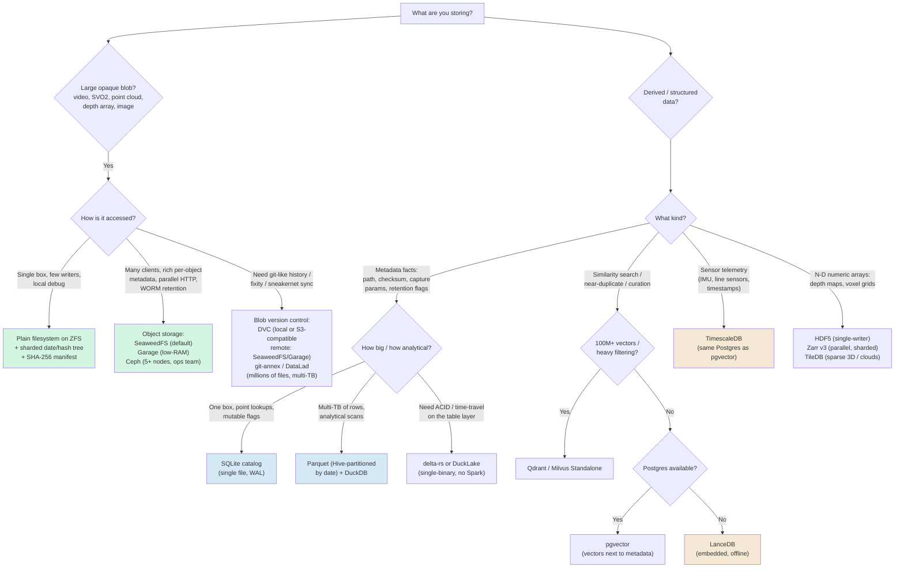

# Decision Guide

Use this guide to route from what you are storing to a concrete pick. The golden rule across every branch: **bytes live on the filesystem or in object storage; facts live in a catalog.** A database is an index over your data, not a place to dump multi-gigabyte blobs.

## Decision Tree

> **Mining-server note:** Your debug images already work, so most new traffic enters this tree on the left (large blobs: video and ZED 3D) and routes to ZFS-backed files or SeaweedFS, with everything indexed by the catalog on the right. You rarely need more than three or four of these boxes in one deployment.

## Comparison Matrix

| Option | Best for | Scale | Query / Index | Offline / Self-host | Integrity features | Complexity |
|---|---|---|---|---|---|---|
| **Plain filesystem (ZFS / XFS)** | Large write-once blobs: video, SVO2, point clouds | GB → many TB | None native (pair with a catalog) | Excellent (POSIX, rsync, tar) | ZFS: per-block checksums + scrub + self-heal. XFS: metadata CRC only | Low–medium |
| **Embedded store (SQLite / LMDB / RocksDB)** | Single-file catalog; small blobs (<100 KB) | Up to ~millions of rows | SQL (SQLite) / KV (LMDB, RocksDB) | Excellent (one file, no server) | App-level checksums; atomic writes | Low |
| **Object storage (SeaweedFS / Garage / Ceph)** | Video + 3D at scale, rich metadata, WORM retention | TB → PB | Key/prefix lookup; metadata per object | Excellent (static binaries, no phone-home) | Erasure coding + per-read checksums; Object Lock | Medium (Ceph: high) |
| **Relational DB (PostgreSQL)** | Catalog + relational metadata; JSONB for heterogeneous fields | GB → TB of metadata | Full SQL, rich indexes | Excellent | WAL, constraints; store checksum column | Medium |
| **Document store (MongoDB / GridFS)** | Highly heterogeneous capture metadata | GB → TB | Document queries, secondary indexes | Good | Replica-set durability; no atomic file-content update (GridFS) | Medium |
| **Scientific array (HDF5 / Zarr / TileDB)** | N-D numeric arrays: depth maps, voxel grids | GB → TB | Slicing by index; TileDB spatial index | Good (pin reader libs!) | Fletcher32 / crc32c per chunk; TileDB fragments | Medium |
| **Columnar / tabular (Parquet / Lance)** | Metadata catalogs; exploded point tables | TB+ of rows | DuckDB/Spark predicate pushdown | Excellent (DuckDB single binary) | Per-column stats; immutable files | Low–medium |
| **Vector DB (LanceDB / pgvector / Qdrant)** | Embeddings: similarity, near-dup, curation | M → 100M+ vectors | ANN (HNSW/IVF) + metadata filter | Excellent (LanceDB embedded; others self-host) | Index rebuild after large ingest | Low (LanceDB) → medium |
| **Time-series DB (TimescaleDB / InfluxDB)** | Sensor telemetry, IMU, timestamps | Billions of points | SQL/time functions, continuous aggregates | Excellent | Compression + retention policies | Medium |
| **Lakehouse table format (Iceberg / Delta / DuckLake)** | ACID + time-travel over structured tables | TB+ | SQL via DuckDB/Spark | Good (delta-rs / DuckLake offline) | Snapshot history; relies on store for byte integrity | Medium (Iceberg multi-engine: high) |
| **Data version control (DVC / git-annex / DataLad)** | Versioning opaque assets; provenance; sneakernet | GB → tens of TB | Pointer files in Git + catalog | Excellent (USB/dir remotes) | Content-addressed fixity (md5/sha), `numcopies`, fsck | Medium |

> **Mining-server note:** "Offline / Self-host" is a hard gate for you, not a nice-to-have. Every row above runs fully air-gapped, but two carry deployment traps: **OpenZFS is out-of-tree** (CDDL/DKMS — pre-stage the matching module before any kernel upgrade), and **MinIO's community repository was reported (as of early 2026) to be moving to maintenance/archival** with no guaranteed security patches — verify its current status, and for new long-retention object storage prefer SeaweedFS or Garage instead.

## What Should I Use? (By Scenario)

- **Millions of debug images (already solved):** Keep them as files on a checksumming filesystem (**ZFS** or Btrfs single/RAID1), sharded into `YYYY/MM/DD` or hash-prefix subtrees — never one flat directory. Index paths + checksums in the catalog. No change needed; this is the model the rest of the stack extends.
- **Long videos for human review / debugging:** Split into two tiers. Keep a write-once **master** (FFV1-in-MKV when bit-exact, else H.265 CRF ~20) and generate cheap **480p–720p H.264 proxies** for browsing. Store both as files; write a per-clip `ffprobe` JSON sidecar so the archive is searchable with `find` + `jq` even if the index is lost.
- **ZED 3D capture (the new pain):** Record **SVO2 with H.265** as the working master (~7 GB/hr at HD2K@15fps); reserve lossless (~180 GB/hr) for golden/calibration clips only. Archive the matching **ZED SDK installer offline** — SVO is proprietary and SDK-locked. For frames that matter, export durable open formats: depth to **16-bit PNG or OpenEXR**, point clouds to **E57 or LAZ**. Treat regenerated depth/clouds as a disposable `derived/` cache.
- **ZED point clouds you need to query/analyze:** **TileDB** sparse 3D arrays (MIT, embeddable, spatial index) or flatten to **Parquet/GeoParquet** for DuckDB analytics. For offline web viewing, build a **COPC/Entwine octree** and serve with **Potree** (static files, no server runtime).
- **Searchable metadata catalog over everything:** One box → **SQLite**. Multi-TB of rows / analytical scans → **Parquet partitioned by date + DuckDB**. Want relational joins and JSONB flexibility → **PostgreSQL**. Always store `asset_id`, path/URI, size, **checksum**, capture time, and a `retain_until` column.
- **Similarity search / near-duplicate detection over frames:** Compute embeddings and store the **vectors**, never the blobs. Standalone box → **LanceDB** (embedded, offline). Already running Postgres → **pgvector** (CLIP/ViT/DINOv2 dims fit under HNSW's 2,000-d limit). 100M+ vectors with heavy metadata filtering → **Qdrant** or **Milvus Standalone**.
- **Sensor telemetry alongside media (ZED IMU, line sensors):** **TimescaleDB** in the same Postgres instance as pgvector — one service, one backup, SQL joins across embeddings + telemetry + relational metadata.
- **You want git-like history of raw assets / provenance:** **DVC** with a local or S3-compatible (SeaweedFS/Garage) remote for moderate file counts; **git-annex / DataLad** for millions of files and multi-TB (DataLad's provenance capture and sneakernet via USB special remotes shine on air-gapped sites).
- **ACID / time-travel on structured tables (detections, point tables):** **delta-rs** or **DuckLake** (single-binary, SQLite/Parquet, no Spark/Java). A full multi-engine Iceberg + REST-catalog stack is overkill for one isolated, append-mostly server.
