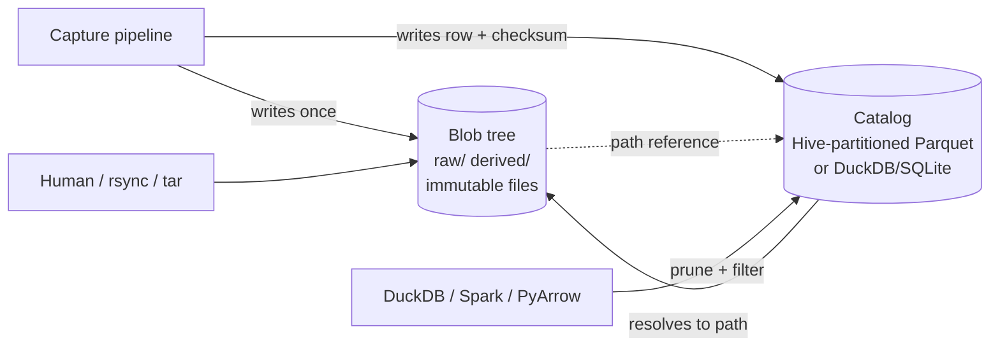
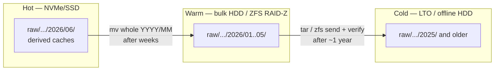

# Directory Layout & Partitioning Strategies

> **Scope.** How to physically organize a multi-terabyte, multi-year archive of **images, video, and Stereolabs ZED 3D data (SVO/SVO2, depth maps, point clouds)** on **self-hosted, air-gapped servers**. Your image debug storage already works; the new pressure is video and 3D, which are far larger and have a *raw → derived* relationship the layout must exploit.

One idea drives everything in this chapter: **the directory layout is the physical truth, and a separate catalog is the queryable view.** Large binaries (a multi-GB SVO, a video segment, a point cloud) do not belong inside a columnar table. Keep two layers cleanly separated:

| Layer | What it holds | Where it lives | Who reads it |
|---|---|---|---|
| **Blob tree** | The actual files, write-once / immutable | Plain filesystem (ext4/XFS/ZFS) in a hierarchical, partitioned directory tree | `ls`, `rsync`, `tar`, your pipeline, FFmpeg, the ZED SDK |
| **Catalog / index** | One row per blob: path, checksum, size, modality, project, sensor, UTC timestamp, **labels**, pipeline version, storage tier | A small set of **Hive-partitioned Parquet** files (or a single DuckDB/SQLite file) sitting next to the blobs | DuckDB, Spark, PyArrow |

The layout answers *"where is the file?"*. The catalog answers *"which files match this query?"*. Pushing query-only, **volatile** dimensions (content labels, QA pass/fail, the model that produced a detection) into the **catalog instead of the path** is exactly what keeps the blob tree immutable: re-labeling a million frames becomes an `UPDATE` in the catalog, not a million `mv` operations.



> **Mining-server note:** On an isolated box there is no managed metastore and no cloud catalog service. The blob tree plus a single DuckDB/Parquet catalog is the offline sweet spot — both are static binaries with nothing to administer, and the catalog can always be rebuilt by re-walking the tree if it is ever lost.

## Partitioning Dimensions

Pick your dimensions first, then decide for each one whether it belongs **in the path** or **in the catalog**. The deciding test is simple: a dimension earns a place in the path only if it is **(a) stable for the life of the file** and **(b) frequently filtered**. Everything else goes in the catalog.

| Dimension | In path or catalog? | Why | Cardinality |
|---|---|---|---|
| **Raw vs. derived** | Path (top level) | Different lifecycle and immutability rules; derived is disposable | 2 |
| **Modality** (image / video / svo2) | Path | Stable forever; different tools per modality | low (3–6) |
| **Project / site / line** (e.g. `flotation-cell-7`) | Path | Stable; nearly every query filters by it | low–med |
| **Sensor / device** (camera serial) | Path | Stable; "everything from camera X" is a constant query | med |
| **Time** (capture date, UTC) | Path | Append-only, never rewritten; natural archival and tiering boundary | high but ordered |
| **Content / label** (froth class, defect, has-person) | **Catalog only** | **Volatile** — labels get added, corrected, and are multi-valued; in the path they force file moves and break immutability | very high |
| **Quality / QA flag** | Catalog only | Volatile | low |
| **Content hash** (SHA-256 / BLAKE3) | Catalog always; *optionally* a separate content-addressed store | Enables integrity checking and dedup | unique |

The recurring trap is putting **content labels or QA flags in the path**. Labels are volatile and multi-valued, so encoding them in directory names forces a file move on every re-label and destroys the write-once guarantee. Keep them as columns the catalog can `UPDATE` in place.

## Composite Hierarchical Keys

Order path levels **most-stable and most-filtered first, most-volatile last**. There are two payoffs:

1. **Stability first** → you almost never move a file once it is written, so immutability is cheap to enforce.
2. **Selectivity first** → query engines prune whole subtrees early, and a human or `rsync` can grab a coherent slice with a single glob.

The recommended order for this reader:

```
raw|derived / modality / project / sensor / YYYY / MM / DD[/ HH]
```

- `raw|derived` is first because it cleanly splits "never touch" from "safe to delete and recompute."
- `time` is last because it is the only append-only, ever-growing axis and the natural backup/tiering boundary.
- Labels are deliberately absent — they live in the catalog.

> **Mining-server note:** Resist the instinct to put the date at the very top (`/2026/06/29/...`). Time-first scatters every project and sensor across every date directory, so "all of camera X" or "all of project Y" becomes a full-tree walk, and you cannot tier or archive a single line's data independently — a real problem when one line's footage ages out faster than another's.

Four concrete layout schemes are worth weighing. Use the same template for each.

**Positional time-first tree** (`/YYYY/MM/DD/...`)
- **What it is:** capture date at the top of the path.
- **Best for:** single-stream, append-only logging where you only ever query by time.
- **Avoid when:** you filter by project or sensor, or need per-project tiering — i.e. this reader.
- **Tools:** any filesystem; `find`, `rsync`.
- **Trade-offs:** trivially simple to write; terrible for "all of camera X"; cannot archive a project independently.

**Positional dimension-first tree** (`raw/modality/project/sensor/YYYY/MM/DD/`) — **recommended for the blob tree**
- **What it is:** stable dimensions first, time last, plain human-readable directory names.
- **Best for:** browsing, `rsync`/`tar` slices, tiering whole subtrees, pure filesystem operations.
- **Avoid when:** you need an engine to auto-map directory names to query columns (pair it with a catalog instead).
- **Tools:** ext4/XFS/ZFS, `ls`, `rsync`, `tar`, the ZED SDK, FFmpeg.
- **Trade-offs:** human-friendly and portable; engines will not infer columns from it, so it relies on the sidecar catalog.

**Hive `key=value` tree** — **recommended for the catalog (and any derived columnar exports)**
- **What it is:** every path level is encoded as `key=value`.
- **Best for:** automatic discovery and partition pruning in DuckDB / Spark / PyArrow.
- **Avoid when:** naming raw media blobs no engine reads as a dataset — you get verbose paths for no benefit.
- **Tools:** DuckDB, Apache Spark, PyArrow / Arrow Datasets.
- **Trade-offs:** zero-config querying and pushdown; longer paths; you must zero-pad values and cap the partition count.

**Content-addressed store** (`cas/sha256/ab/cd/<hash>`)
- **What it is:** files named by their hash, fanned out by a short hash prefix.
- **Best for:** dedup across redundant captures, integrity by construction, immutability by construction.
- **Avoid when:** you want it as the *primary* human-browsable layout — hashes carry no time or project ordering.
- **Tools:** `sha256sum`/`b3sum`, plus the catalog to map hash → meaning.
- **Trade-offs:** perfect dedup, built-in verification, and an evenly balanced tree (Git-style 2-char fan-out gives 256 buckets per level, 65,536 over two); but it is unreadable to humans and useless without the catalog.

> **Net recommendation:** the **dimension-first tree** for blobs, **Hive** for the catalog, and **content-addressing optionally underneath** for dedup.

## Time-Based Partitioning in Depth

**Use ISO 8601, zero-padded, so lexical sort equals chronological sort.** Always pad: `06`, never `6`; `01`, never `1`. With fixed-width components, the plain alphabetical ordering that `ls`, globbing, directory listings, and Hive value sorting all use is automatically chronological — `2026/01/15` sorts before `2026/06/29` before `2027/01/01` with no date parsing anywhere.

- **Directory levels:** split components into nested directories — `2026/06/29/` — so each level stays small and you can move a whole month with one `mv`.
- **In filenames:** use the **basic (compact) ISO form with `Z`** — `20260629T141500Z` — which avoids the `:` character (illegal or awkward on some filesystems and in URLs) while staying sortable. Always store **UTC**: air-gapped sites often have skewed or hand-corrected local clocks, and UTC keeps ordering correct across DST changes and clock fixes.

**Granularity is your file-count balancer.** Match the time leaf to each sensor's data rate so leaf directories stay a sane size:

| Per-sensor capture rate | Time leaf | Files per leaf (target) |
|---|---|---|
| A few clips/day (ZED SVO chunked hourly) | `YYYY/MM/DD` | ~24–100 |
| Continuous video in N-minute segments | `YYYY/MM/DD` | hundreds |
| High-rate image bursts (thousands/day) | `YYYY/MM/DD` or `YYYY/MM/DD/HH` | a few thousand |
| Very high frequency | `.../HH` | keep at or below ~10k–100k |

**Archival and backup boundaries fall out for free.** Because time is the last path level, a whole `YYYY/MM` (or `YYYY/MM/DD`) directory is a self-contained unit you can snapshot, `tar`, checksum, `rsync` to cold storage, or write to LTO tape as one atomic job without touching anything older. Align backup cadence and retention rules to these boundaries.

> **Mining-server note:** For multi-year retention, treat each completed `YYYY/MM` as frozen the moment it rolls over. Generate a SHA-256 (or BLAKE3) manifest for it, store that manifest both alongside the data and in the catalog, and let your monthly ZFS scrub plus optional `par2` parity on offline copies prove the bytes are still intact years later.

## Hive-Style Partitioning (key=value)

Hive partitioning encodes each level as `key=value` in the directory name:

```
catalog/modality=svo2/project=conveyor-scan/ingest_date=2026-06-29/part-0000.parquet
```

It is worth using for the **catalog** (and for any derived columnar exports) because the offline engines you would actually run on an air-gapped box read it automatically.

| Engine | Auto-reads Hive? | How / notes |
|---|---|---|
| **DuckDB** | **Yes, on by default.** | `SELECT * FROM read_parquet('catalog/**/*.parquet', hive_partitioning=true)`. Detects the `key=value` pattern, does partition pruning and filter pushdown (a `WHERE ingest_date='2026-06-29'` skips other directories), and auto-casts `DATE`/`TIMESTAMP`/`BIGINT` (override with `hive_types={...}`). Writes via `COPY t TO 'catalog' (FORMAT parquet, PARTITION_BY (modality, ingest_date))`. **Best offline choice — single binary, no server.** |
| **PyArrow / Arrow Datasets** | **Yes.** | `ds.dataset(path, partitioning="hive")`, or it infers Hive by default. Guidance: avoid more than ~10,000 distinct partitions; partition field *order* in the path is ignored. |
| **Apache Spark** | **Yes.** | All file sources auto-discover `key=value` partitions. If you point at a *sub*-partition, set `basePath` so the upper keys are still recognized as columns; inconsistent directory depth causes partition-discovery conflicts. |

Hive caveats that bite:

- **Zero-pad values too** (`month=06`, not `month=6`) so lexical value order stays chronological across every tool.
- **Do not also store the partition column inside the file** — it is redundant; engines reconstruct it from the path.
- **Never** put a high-cardinality field (frame id, content hash) in a Hive key, or you create millions of directories. PyArrow's ~10,000-partition ceiling is the practical guardrail.
- For **raw binaries** (images, video, SVO), Hive directory names only become query columns *if a tool reads them as a dataset*. The robust, tool-agnostic pattern is a plain dimension-first blob tree plus a sidecar Parquet catalog that carries those columns explicitly. Use Hive for the catalog, not necessarily for every blob folder.

## Raw vs. Derived

This is the highest-leverage decision for ZED data specifically. Split the tree at the top into two lifecycles and enforce them differently.

- **`raw/` is write-once and immutable.** SVO/SVO2 files, original video, original images. Mount it read-only where you can; set files to `0444`; verify with stored checksums. Never edit in place — corrections become *new* files, never overwrites (the medallion "bronze" rule: append-only, nothing mutated or deleted).
- **`derived/` is reproducible and disposable.** Depth maps, exported point clouds (PLY/PCD), rectified frames, thumbnails, detections, transcodes. Anything regenerable from `raw/` plus your pipeline code lives here and can be deleted under storage pressure and recomputed later.

**Why this matters enormously for ZED:** an `.svo/.svo2` stores **only the essential sensor streams** (rectified stereo video plus IMU/sensor data) — roughly **7 GB per hour with H.265 at HD2K 15 fps, versus around 180 GB per hour in lossless mode** (Stereolabs figures; rates scale with resolution, FPS, and bitrate). **Depth maps and point clouds are not stored in the SVO at all — the ZED SDK regenerates them from the stereo pair at replay.** The consequences for layout:

- Keep the **SVO/SVO2 as the single raw artifact** — it is compact, complete, and replayable. SVO2 (default since ZED SDK 4.1) additionally records high-frequency and custom/external-sensor data, making it an even stronger single source of truth.
- Put any materialized depth or point-cloud exports in `derived/` and treat them as a **cache**. Do not back them up like raw data — back up the SVO and the export recipe (pipeline version) instead.
- Tag every derived artifact with the **pipeline version** that produced it (both in the filename suffix and in the catalog) so you can distinguish stale caches and recompute deterministically.

> **Mining-server note:** Materializing and backing up regenerated depth/point-cloud dumps as if they were raw is one of the fastest ways to fill a mine-site disk. The SVO is the small, durable master; the depth and clouds are a disposable cache derived from it.

## Naming Conventions & File-Count Limits

A filename should be **sortable, unique, parseable, and portable** with no catalog lookup required.

**Template:** `<sensor-id>_<UTC-timestamp>_<seq>[__<tag>][.<ext>]`

```
cam-froth-01_20260629T141500Z_0001.jpg
cam-overview-02_20260629T141500Z_0007.mkv
zed2i-sn12345_20260629T141500Z.svo2
zed2i-sn12345_20260629T141500Z__depth-v2.npz      # derived, versioned
zed2i-sn12345_20260629T141500Z.svo2.sha256        # integrity sidecar
zed2i-sn12345_20260629T141500Z.json               # metadata sidecar (same basename)
```

Rules:

- **No spaces, no special characters.** Restrict to `[A-Za-z0-9._-]`. Spaces and `:` break shell globs, scripts, URLs, and some filesystems.
- **Stable IDs only.** Use the **camera serial** (`zed2i-sn12345`), never `"left-camera"` or a role that can be reassigned when hardware is swapped.
- **Zero-padded sequence numbers** (`_0001`) so lexical order equals numeric order.
- **Compact ISO-8601 UTC** timestamp with `Z`, no colons.
- **Versions on derived data** (`__depth-v2`, or a full pipeline semver `__pipe-1.4.0`) so caches are self-describing.
- **Sidecars share the basename** plus a new extension (`.json`, `.sha256`) so they sort adjacent and associate trivially.
- Filenames are **stable identifiers** — once written, never renamed.

**File-count limits and tree balancing.** The rule of thumb is **a few thousand files per leaf directory, and at most ~10k–100k.** ext4 with HTree indexing (and the `large_dir` feature on Linux 4.13+) and XFS can technically hold millions of entries — ext4's index reaches roughly 10–12M, billions with `large_dir` — but `ls`, `rsync`, backup scans, and globbing degrade long before the filesystem does. Treat the filesystem ceiling as irrelevant; **performance, not capacity, is the real limit.**

| Concern | Practical guidance |
|---|---|
| Files per leaf directory | Target a few thousand; stay at or below ~10k–100k for fast `ls`/`rsync`/backup |
| ext4 raw capacity | HTree ~10–12M entries; `large_dir` (Linux 4.13+) extends to billions — but perf is the binding constraint |
| Distinct Hive partitions (catalog) | Keep under ~10,000 (PyArrow guidance) |
| Parquet **catalog** file size | 128 MB–1 GB per file; compact small files; row groups 128–512 MB |
| Blob files | Their natural size (GBs) is fine — the small-files problem is about the *catalog*, not the media |

Balancing tactics: tune time granularity per the table in *Time-Based Partitioning in Depth*; for a content-addressed store, use Git-style hex fan-out (`ab/cd/abcd…`) — one or two 2-char levels give 256 or 65,536 buckets so even billions of blobs spread evenly. On huge directories, prefer `ls -f`/`ls -U` or `find` over a default sorted `ls -l`, which triggers a sort and a `stat` storm.

## Storage Tiering (Hot / Warm / Cold)

Because time is the deepest path level, tiers map directly onto **time slices** and move as whole directories.

| Tier | Holds | Media (offline-friendly) | Move operation |
|---|---|---|---|
| **Hot** | Last days–weeks; active debugging; all derived caches | NVMe / SSD | written here by the pipeline |
| **Warm** | Last ~1 year of raw | Bulk HDD / RAID (ZFS / RAID-Z) | `mv` whole `YYYY/MM` from hot |
| **Cold** | Older raw; rarely accessed | High-density HDD, **LTO tape**, or external drives kept offline | `tar`/`zfs send` a `YYYY/MM`, verify, then drop from warm |



Implementation on air-gapped servers:

- A nightly job walks `raw/**/YYYY/MM` directories older than the tier threshold, computes or verifies a **checksum manifest**, copies the slice to the next tier, re-verifies, then frees the space. Update the catalog's `tier` column so queries know where a blob currently lives.
- **Whole-month moves are the unit of work.** Because each `YYYY/MM` is self-contained, tiering is a single `mv`, `tar`, or `zfs send` per slice with nothing older disturbed.
- **Multi-year integrity:** ZFS snapshots plus a scheduled `scrub` detect and repair bit-rot on spinning tiers; for offline/tape archives, add **`par2` parity files** so you can repair without the original. Store the checksum manifest *with* the archive and keep a copy in the catalog so integrity is provable independent of any single medium.

> **Mining-server note:** "RAID is not a backup." Tiering moves data for cost and access speed, but a true air gap means the cold copy is physically disconnected (offline HDD or LTO) so a bad job, a bad command, or ransomware on the live host cannot reach it. Verify a restore from cold media on a schedule — an unread tape is an unproven backup.

### Worked example: combined images + video + ZED-3D tree

```
/data
├── raw/                                   # immutable, write-once (chmod 0444 / RO mount)
│   ├── image/                             # already-handled modality, same scheme
│   │   └── flotation-cell-7/
│   │       └── cam-froth-01/
│   │           └── 2026/06/29/
│   │               ├── cam-froth-01_20260629T141500Z_0001.jpg
│   │               └── cam-froth-01_20260629T141500Z_0001.json
│   ├── video/
│   │   └── flotation-cell-7/
│   │       └── cam-overview-02/
│   │           └── 2026/06/29/
│   │               ├── cam-overview-02_20260629T141500Z_0007.mkv
│   │               └── cam-overview-02_20260629T141500Z_0007.json
│   └── svo2/
│       └── conveyor-scan/
│           └── zed2i-sn12345/
│               └── 2026/06/29/
│                   ├── zed2i-sn12345_20260629T141500Z.svo2          # raw, replayable
│                   └── zed2i-sn12345_20260629T141500Z.svo2.sha256
│
├── derived/                               # reproducible cache; safe to delete & recompute
│   └── svo2/
│       └── conveyor-scan/
│           └── zed2i-sn12345/
│               └── 2026/06/29/
│                   ├── zed2i-sn12345_20260629T141500Z__depth-v2.npz
│                   └── zed2i-sn12345_20260629T141500Z__cloud-v2.ply
│
├── cas/                                   # optional content-addressed dedup store
│   └── sha256/ab/cd/abcd…ef.bin
│
└── catalog/                               # Hive-partitioned Parquet index (DuckDB-queryable)
    └── modality=svo2/
        └── ingest_date=2026-06-29/
            └── part-0000.parquet          # cols: path, checksum, bytes, project, sensor,
                                            #       captured_at, labels[], pipeline_ver, tier
```

Example offline query (DuckDB, no server, on the air-gapped box):

```sql
-- All ZED captures from one camera in June 2026 that a model flagged 'overflow'
SELECT path, captured_at, bytes
FROM read_parquet('catalog/**/*.parquet', hive_partitioning = true)
WHERE modality = 'svo2'
  AND sensor   = 'zed2i-sn12345'
  AND ingest_date BETWEEN DATE '2026-06-01' AND DATE '2026-06-30'
  AND list_contains(labels, 'overflow');
```

`modality=` and `ingest_date=` are pruned straight from the path; `labels` (volatile) is filtered as a column — and no file under `raw/` ever moved.
