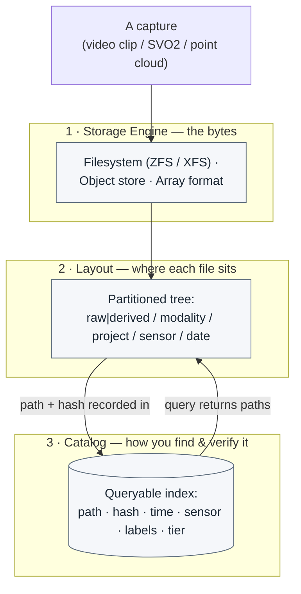

# The Mental Model: Storage Engine vs. Layout vs. Catalog

Most storage confusion comes from collapsing three *independent* decisions into one. They are not the same question, they are solved by different tools, and you can change any one of them without rebuilding the others. Separate them on purpose:

1. **Storage engine — the bytes, and where they physically live.** This is the substrate that actually holds the data: a POSIX filesystem (ideally on a checksumming volume manager like ZFS), a self-hosted object store, a database, or a specialized array/columnar format. The engine decides durability, throughput, and integrity guarantees. *Big opaque blobs — video, SVO2, point clouds — almost always belong as files on a filesystem or as objects in an object store, never inside a database.*

2. **Layout — how the files are arranged.** Given an engine, this is the directory tree (or key namespace): the partitioning scheme, the `raw/` vs `derived/` split, the naming convention, the time granularity. Layout determines whether you can grab "all of camera X in March" with one glob and whether a whole month can be moved to cold storage as a single unit. Layout is pure organization; it stores no extra data.

3. **Catalog — how you find and verify the bytes.** A small, queryable index with one row per asset: its path, content hash, capture time, sensor, project, labels, and storage tier. The catalog answers *"which files match this query?"* without walking the tree, and its stored checksums let you prove a file is intact years later. Crucially, **volatile facts (labels, QA flags, detections) live in the catalog, not in the path** — so re-labeling a million files is an `UPDATE`, not a million `mv`s.

The connective rule for everything that follows is **"files for the bytes, a database for the facts."** The engine holds the bytes, the layout places them, and the catalog points at them and describes them.

> **Mining-server note:** Keeping these three separate is what lets you evolve safely on an air-gapped box. You can move old data from NVMe to bulk HDD to tape (layout/engine) without changing a single catalog query, and you can re-run a better detector and rewrite labels (catalog) without touching one immutable `raw/` byte.
