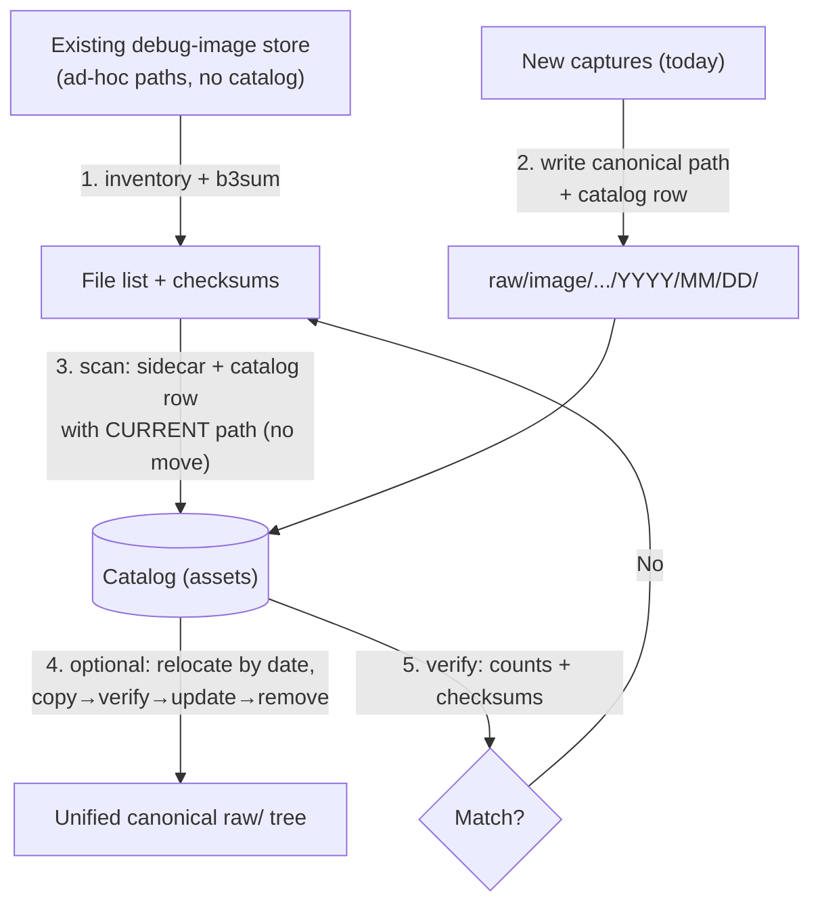

# Migrating an Existing Image Store

You already have a working debug-image store. It is full of real captures, pipelines read from it, and people know its paths by heart. **Do not rip it out.** The goal of this chapter is to adopt the canonical layout and catalog *around* what exists — indexing the old data where it sits, sending new captures into the new structure immediately, and only later (optionally) relocating the historical bytes. At every step the store stays readable and the work is resumable, so an interrupted migration is never a corrupted one.

> **Mining-server note:** A migration that requires "downtime" or "move everything this weekend" does not survive contact with a 24/7 plant on an isolated server with no second machine to stage on. The approach here moves **zero bytes** to get the benefits, then relocates in small, verified, reversible batches if and when you choose.

## Principle: Index in Place Before You Move a Byte

The catalog is an index over your data, not the data itself, and it stores **each asset's current `path`**. That single fact is what makes a safe migration possible: the moment the old tree is indexed, queries, retention, integrity checks, and tiering all work against it **without anything moving**. Relocation into the canonical `raw/image/<project>/<sensor>/YYYY/MM/DD/` tree becomes a *later, optional optimization* — done in batches, each verified, each reversible — rather than a prerequisite.

So the order is always:

1. **Inventory + checksum** the existing tree (know exactly what you have).
2. **Strangle**: point new captures at the new layout + catalog today.
3. **Backfill** the old tree into the catalog/sidecar model *in place* (no byte moves).
4. **Optionally relocate** the historical bytes into the canonical tree, in date batches.
5. **Verify** continuously (row count vs file count, checksum match).



Throughout, the catalog uses the canonical `assets` schema and modality enum — for an image store every row is `modality = 'image'`.

## Step 1 — Assess What You Have (Inventory + Checksums)

**What it is.** A complete, checksummed inventory of the current store *before* you change anything — the baseline you verify every later step against.

**Why it matters.** You cannot prove a migration lost nothing if you never measured what was there. The inventory also surfaces the messy reality (duplicate files, zero-byte truncations, mixed extensions, mystery folders) while it is still cheap to deal with.

**What to do.** Count, size, and checksum the tree. Use `b3sum` for archive-wide hashing (multi-GB/s); keep `sha256sum` only where another party must verify.

```bash
# how many files, how big, what extensions?
find /debug/images -type f | wc -l
du -sh /debug/images
find /debug/images -type f | sed 's/.*\.//' | sort | uniq -c | sort -rn

# zero-byte / truncated files are worth catching now
find /debug/images -type f -size 0 -print

# checksum the whole tree (file-targeting form, never a directory glob)
find /debug/images -type f -print0 | xargs -0 b3sum > /scratch/inventory.b3
wc -l /scratch/inventory.b3            # this count is your baseline row target
```

Stash `inventory.b3` somewhere durable — it is both your migration baseline and a fixity record for data that has never had one.

> **Mining-server note:** Run the inventory off-peak and `ionice` it — checksumming the whole debug store competes with live capture I/O. The hash pass is also your first real **bit-rot audit** of years of images that were never checksummed; investigate anything that won't read.

## Step 2 — Strangler / Coexistence: New Captures, New Layout

**What it is.** The strangler-fig pattern: stand up the new layout and catalog and route **all new captures** into it *today*, while the old store keeps serving reads. The new system grows around the old one until the old one is just historical rows in the same catalog.

**Why it matters.** It stops the bleeding immediately — every capture from now on is correctly placed, checksummed, and catalogued — without waiting on the (slow, optional) historical relocation. Old and new coexist because the **catalog is the single query surface**: a consumer asks the catalog for images, and gets rows whose `path` may point at the legacy tree *or* the new tree, transparently.

**What to do.** Point the capture/ingest writer at the canonical structure and have it write a catalog row + sidecar per asset:

```text
# new captures, canonical dimension-first plain paths:
raw/image/flotation-cell-7/cam-froth-01/2026/06/29/cam-froth-01_20260629T141500Z_0001.jpg
raw/image/flotation-cell-7/cam-froth-01/2026/06/29/cam-froth-01_20260629T141500Z_0001.json   # sidecar
catalog/modality=image/ingest_date=2026-06-29/part-0000.parquet                              # key=value ONLY here
```

The legacy tree is now **read-only** (`chmod 0444` / read-only mount / `zfs set readonly=on`) so nothing new lands in the old shape and the historical bytes are frozen for safe indexing. From this point the catalog spans both trees; the rest of the migration is purely about pulling the *old* rows in (Step 3) and, optionally, tidying their bytes (Step 4).

> **Mining-server note:** Freezing the legacy tree read-only the moment new captures are diverted is what makes the backfill safe and idempotent — the file set under the old tree stops changing, so a scan you start tonight and finish tomorrow sees a stable target.

## Step 3 — Backfill the Catalog Without Moving Bytes

**What it is.** Walk the frozen legacy tree, generate a sidecar and checksum per file, and insert a catalog row whose `path` is the file's **current** location. No bytes move.

**Why it matters.** This is the step that delivers most of the value: the old images become queryable, integrity-checked, retention-managed, and tier-aware *in place*. Because nothing moves, it is fully reversible — if anything looks wrong, you drop the rows and the files are untouched.

**What to do.** For each legacy file: derive its dimensions, extract technical metadata, compute the checksum, write the sidecar, and upsert the catalog row.

- **`captured_at` (UTC):** prefer EXIF `DateTimeOriginal`; fall back to a parseable timestamp in the filename; last resort, file mtime. Record which source you used.
- **`project` / `sensor`:** map from the legacy path or filename (e.g. `/debug/images/froth1/...` → `project=flotation-cell-7`, `sensor=cam-froth-01`). Keep a small mapping table for the ad-hoc names.
- **`checksum` / `bytes`:** from the inventory pass (reuse `inventory.b3`) or compute now.
- **`tier`:** wherever the bytes physically live today (`warm`/`hot`).

```bash
# per-file metadata for the sidecar (technical facts are extracted, never typed)
exiftool -j -DateTimeOriginal -ImageWidth -ImageHeight -Make -Model old/IMG_0001.jpg
```

A backfilled sidecar keeps the canonical field names and the file's existing path:

```json
{
  "asset_id": "b6b1f0e2-...-9c",
  "path": "debug/images/froth1/2025-11-03/IMG_0001.jpg",
  "modality": "image",
  "project": "flotation-cell-7",
  "sensor": "cam-froth-01",
  "captured_at": "2025-11-03T13:22:07Z",
  "bytes": 4211233,
  "checksum": "af1349b9f5f9a1a6...",
  "tier": "warm",
  "pipeline_ver": null
}
```

Load the rows into the catalog (DuckDB over Parquet shown; SQLite works the same way). The insert is **idempotent** — keyed on `asset_id` (or `path`+`bytes`) so re-running skips what is already present:

```sql
-- one-time table, then upsert from the per-run sidecar dump (NDJSON/CSV the scanner emits)
CREATE TABLE IF NOT EXISTS assets (
  asset_id     TEXT PRIMARY KEY,
  path         TEXT NOT NULL,
  modality     TEXT,                 -- 'image' for this store
  project      TEXT,
  sensor       TEXT,
  captured_at  TIMESTAMP,            -- UTC
  bytes        BIGINT,
  checksum     TEXT,                 -- BLAKE3 hex
  tier         TEXT,                 -- hot | warm | cold
  pipeline_ver TEXT
);
INSERT OR IGNORE INTO assets
  SELECT * FROM read_json_auto('/scratch/backfill-batch.ndjson');
```

> **Mining-server note:** Write the sidecar atomically — `tmp` file + `fsync` + `rename` — so an interrupted scan never leaves a half-written `.json` next to a good image. The sidecars are the durable source of truth; the catalog is rebuildable from them by re-scanning if it is ever lost.

## Step 4 — Optionally Relocate Into the Canonical Tree (Batches by Date)

**What it is.** Moving the historical bytes from their ad-hoc locations into `raw/image/<project>/<sensor>/YYYY/MM/DD/` with canonical filenames — done in **date-bounded batches**, one `YYYY/MM` at a time.

**Why it matters.** It is genuinely optional: once Step 3 is done, everything *works*. Relocation buys you a single uniform tree (simpler tiering, backup, and human navigation) at the cost of I/O and risk — so do it gradually, per month, only when you want it, and make every file move **copy → verify → update → remove** so it is reversible at all times.

**What to do.** Never `mv` first. For each file in a month batch: copy to the canonical path, verify the checksum at the destination, update the catalog `path`, *then* remove the original. The original is the rollback until the new copy is proven and the catalog points at it.

```bash
# relocate one month, rename to <sensor>_<UTC-timestamp>_<seq>.<ext>, verify, then update catalog
dst="raw/image/flotation-cell-7/cam-froth-01/2025/11/03/cam-froth-01_20251103T132207Z_0001.jpg"
rsync -a --checksum "debug/images/froth1/2025-11-03/IMG_0001.jpg" "$dst"
b3sum -c <<<"$(grep IMG_0001.jpg /scratch/inventory.b3 | awk -v f="$dst" '{print $1"  "f}')" \
  && duckdb catalog.db "UPDATE assets SET path='$dst', tier='warm' WHERE checksum='af1349b9...';" \
  && rm "debug/images/froth1/2025-11-03/IMG_0001.jpg"     # only after copy verifies AND catalog updated
```

Work whole `YYYY/MM` slices so the unit of relocation matches the unit of tiering and backup. Keep `raw/` read-only between batches; only the active batch's destination is briefly writable.

> **Mining-server note:** The checksum from the inventory is what makes relocation provably lossless — the destination must hash to the *same* value the source had before you delete anything. A copy that doesn't verify halts the batch with both copies still present; you lose nothing.

## Step 5 — Verify (Row Count vs File Count, Checksum Match)

**What it is.** The reconciliation that proves the catalog and the bytes agree, run after backfill and after each relocation batch.

**Why it matters.** "It looked fine" is not verification. Three cheap checks catch every realistic migration error: a count mismatch (missed or double-counted files), an orphan (file with no row), and a checksum drift (corruption or a bad copy).

**What to do.**

```bash
# (a) row count vs file count
find /data/raw/image /debug/images -type f ! -name '*.json' | wc -l        # files on disk
duckdb catalog.db "SELECT COUNT(*) FROM assets WHERE modality='image';"     # rows in catalog

# (b) re-checksum and (c) diff against the catalog: missing rows, orphan files, drift
find /data/raw/image /debug/images -type f ! -name '*.json' -print0 \
  | xargs -0 b3sum > /scratch/verify.b3
duckdb -c "
  CREATE TABLE disk AS
    SELECT * FROM read_csv('/scratch/verify.b3', columns={'checksum':'TEXT','path':'TEXT'}, delim=' ');
  -- in catalog but not on disk:
  SELECT 'missing' AS issue, a.path FROM 'catalog.db'.assets a
    WHERE NOT EXISTS (SELECT 1 FROM disk d WHERE d.path = a.path)
  UNION ALL
  -- on disk but not in catalog:
  SELECT 'orphan', d.path FROM disk d
    WHERE NOT EXISTS (SELECT 1 FROM 'catalog.db'.assets a WHERE a.path = d.path)
  UNION ALL
  -- path matches but checksum drifted:
  SELECT 'checksum_drift', d.path FROM disk d JOIN 'catalog.db'.assets a USING (path)
    WHERE d.checksum <> a.checksum;"
```

A clean run returns the expected count and an empty issue set. The final number to confront is the original `wc -l /scratch/inventory.b3` baseline from Step 1 — the catalog's image-row count must reconcile with it (allowing for any duplicates or zero-byte files you deliberately pruned).

> **Mining-server note:** Keep these three queries as a scheduled job, not a one-off — they are exactly the **catalog-rebuild validation drill** from the operations chapter. After migration they keep proving, month after month, that the bytes and the catalog still agree.

## A Resumable, Rollback-Safe Migration Script

**What it is.** The outline of the script that drives Steps 3–4 — **idempotent** (safe to re-run), **resumable** (picks up where it stopped), and **rollback-safe** (never deletes an original until its copy is verified and catalogued), with **progress logged** to a journal.

**Why it matters.** On an isolated server a migration *will* be interrupted — a shift change, a reboot, a full disk. The script must treat interruption as normal: re-running it must skip completed work, never double-process, and never leave a file in a half-moved state.

**What to do.** Drive everything off a **journal** (a table or append-only file) that records one row per asset with a status (`scanned` → `cataloged` → `relocated` → `verified`). Resume = read the journal and skip anything already at the target status. Per file, enforce the safe ordering.

```bash
#!/usr/bin/env bash
set -euo pipefail
SRC=/debug/images ; DST=/data/raw/image ; JOURNAL=/scratch/migrate.journal ; DRYRUN=${DRYRUN:-0}
touch "$JOURNAL"
done() { grep -qF "DONE	$1" "$JOURNAL"; }                 # already verified this checksum?
mark() { printf '%s\t%s\t%s\n' "$1" "$2" "$(date -uIs)" >> "$JOURNAL"; }   # append-only progress

find "$SRC" -type f ! -name '*.json' -print0 | while IFS= read -r -d '' f; do
  sum=$(b3sum "$f" | awk '{print $1}')
  done "$sum" && { echo "skip (resumed): $f"; continue; }   # idempotent + resumable

  # 1. derive canonical path/metadata; write sidecar atomically (tmp+fsync+rename)
  dst=$(canonical_path "$f" "$sum")                          # raw/image/<project>/<sensor>/Y/M/D/<sensor>_<UTC>_<seq>.ext
  [ "$DRYRUN" = 1 ] && { echo "DRYRUN $f -> $dst"; continue; }
  write_sidecar "$f" "$dst" "$sum"

  # 2. catalog row with CURRENT path first (in place; reversible)
  upsert_catalog "$f" "$sum" ; mark "CATALOGED" "$sum"

  # 3. OPTIONAL relocate: copy -> verify -> update path -> remove original (rollback-safe order)
  if [ "${RELOCATE:-0}" = 1 ]; then
    mkdir -p "$(dirname "$dst")"
    rsync -a --checksum "$f" "$dst"
    [ "$(b3sum "$dst" | awk '{print $1}')" = "$sum" ] || { echo "VERIFY FAILED: $dst" >&2; continue; }
    update_catalog_path "$sum" "$dst"
    rm -- "$f"                                               # only now is the original removable
    mark "RELOCATED" "$sum"
  fi
  mark "DONE" "$sum"
done
```

Properties to hold the script to:

- **Idempotent:** keyed on the content checksum, so re-running re-derives nothing already `DONE`.
- **Resumable:** the journal is the resume point; kill it and re-run, it continues.
- **Rollback-safe:** the original is deleted **only after** the copy verifies *and* the catalog points at the new path. A failed verify leaves both copies and halts that file, losing nothing.
- **Observable:** the journal is your progress bar and your audit trail; `grep -c DONE` vs the inventory count tells you how far along you are.
- **Dry-runnable:** `DRYRUN=1` prints every intended action and moves nothing — run it first on a single month.

> **Mining-server note:** Run it one `YYYY/MM` at a time with `RELOCATE=0` first (pure backfill, zero risk), verify with Step 5, and only then flip `RELOCATE=1` per month. The journal plus the read-only legacy tree means an interrupted, power-cut, or aborted run is always a *resume*, never a *recovery*.
