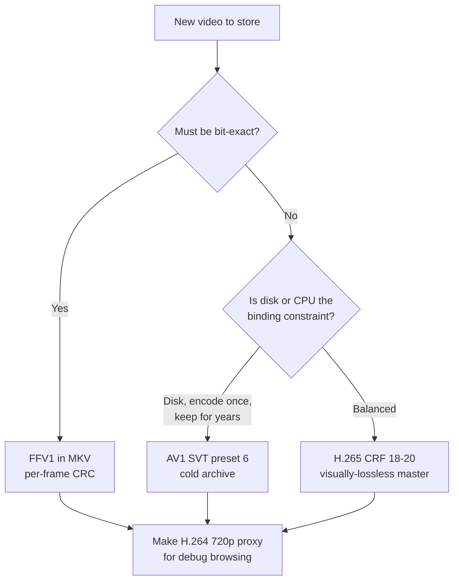
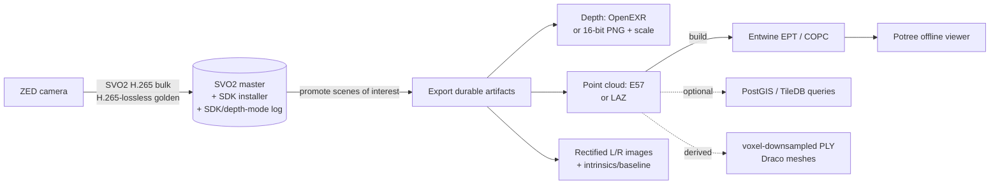

# Modality-Specific Playbooks

This is where the format theory meets your three data types. The reader already has images under control, so the **Images** section is a short validation. **Video** is your main pain and gets the most depth. **3D & Point-Cloud Data** covers the awkward ZED outlier. Everything here is self-hosted and offline: the whole stack is FFmpeg + Matroska/MP4 for video, and the ZED SDK + open exporters for 3D. Install once from a local mirror and you never touch the network again.

> **Mining-server note:** the connective tissue across all three modalities is the same hybrid you'll see throughout this guide — **bytes on the filesystem, facts in a catalog**. Each blob gets a checksum and a sidecar so it stays findable and verifiable for years even if your index DB is lost.

## Images

You already do this well. The goal here is to confirm the good habits and name the one practice that crosses over into the video and 3D sections: **packing many small files**.

- **Formats.** Lossy JPEG for debug captures where a little artifacting is fine; PNG (lossless) for anything you'll measure against, for masks/labels, and for any 16-bit data (depth-as-image lives in the 3D section, not here). WebP/AVIF can shave bytes but add a decoder dependency — for an air-gapped box, the universality of JPEG/PNG usually wins. Don't re-encode JPEGs you already have; it only compounds loss.
- **Sidecars.** Keep a small `.json` next to each image (or a batch manifest) with capture timestamp, camera serial, line/shift, exposure, and a checksum. This is the same pattern video and 3D use — write it atomically (`tmp` → `fsync` → `rename`) and roll its contents into the catalog so you can query without walking the tree.
- **Thumbnails / proxies for debug browsing.** A tiny downscaled preview per image (or a periodic contact sheet) lets you scan a TB-scale archive on a modest workstation. Keep previews under `/working/` and treat them as disposable — regenerable from the masters at any time.

The genuinely important image lesson for the rest of this guide is the **small-file problem**. Millions of individual files crush directory listing, `rsync`, backups, and inode budgets — and you will hit this again with extracted video frames, ZED depth-PNG sequences, and Zarr chunks. The fix is to **pack** them.

**Packing many small files**

- **What it is.** Bundling thousands of small files into a smaller number of large container files (uncompressed `tar` shards, or the WebData­set convention of sequential `.tar` shards keyed by sample), read sequentially at training/processing time.
- **Best for.** ML training/eval sets and any "millions of tiny files" situation where you stream rather than random-access individual files; dramatically faster backups and copies.
- **Avoid when.** You need frequent random access to, or in-place edits of, individual members — a tar shard is read start-to-finish, not seeked into cheaply.
- **Tools.** `tar` (plain shards), WebDataset (PyTorch-native tar sharding), or any archive format; pair with a manifest listing shard → sample offsets.
- **Trade-offs.** Turns an inode/listing nightmare into a handful of big sequential reads (great for HDD and tape tiers); the cost is that updating one sample means rewriting (or appending a new) shard.

```
# Instead of 2,000,000 loose files, ship ~2,000 shards of ~1,000 samples each:
dataset/
  train/
    shard-000000.tar   # img00000.jpg img00000.json img00001.jpg img00001.json ...
    shard-000001.tar
    ...
  shards.manifest      # shard -> {count, sha256, byte ranges}
```

> **Mining-server note:** sharding images is the same lever you'll reach for to tame extracted frames and depth-PNG sequences. Whenever a workflow threatens to emit "a file per frame," ask whether the frames can stay inside their source video/SVO and be extracted on demand instead (see below).

## Video

Video is the reader's main pain because, unlike images, **file size is dominated almost entirely by encoding choices — codec, quality target, and GOP — not by raw resolution.** Video adds *temporal* compression: instead of storing every frame, the codec stores occasional full frames (keyframes / I-frames) and, in between, only the *differences* (P/B-frames). A static conveyor belt compresses far better than turbulent froth or a fast pan, so all numbers below are order-of-magnitude, not promises.

**The single principle that matters most:** separate write-once **archival masters** (integrity-checked, never re-encoded) from cheap, regenerable **working / proxy copies**. Re-encoding lossy video repeatedly compounds quality loss ("generation loss"); a master should be encoded exactly once, and every derivative should be made with `-c copy` (lossless repackage) wherever possible.

### TL;DR defaults (video)

| Need | Default choice | Why |
|---|---|---|
| **Archival master, must be bit-exact** | **FFV1 in MKV** | Lossless, open, per-frame CRC catches silent bit-rot |
| **Archival master, "looks identical" is enough** | **H.265/HEVC, CRF ~18–20, in MKV/MP4** | ~2× smaller than H.264 at equal quality; often 10×+ less disk than FFV1 (content-dependent) |
| **Working / debug-browsing copy** | **H.264, 480p–720p proxy, CRF 28, preset fast** | Tiny, plays everywhere, scrubs instantly, no GPU |
| **Maximum cold-storage compression** | **AV1 via SVT-AV1, preset 6** | ~30% smaller than HEVC; only when CPU time is cheaper than disk |
| **Long recordings (hours)** | **Segment into fixed, closed-GOP chunks** | Cheap partial reads + fast seek + damage isolation |
| **ZED stereo camera** | **Keep the `.svo2` master; export MP4/PNG derivatives** | SVO is proprietary; see the 3D section |

### The three knobs, in order of impact

1. **Codec** — H.264 → H.265 → AV1 each roughly cuts size again at equal quality.
2. **Quality target (CRF, Constant Rate Factor)** — your main dial; lower = bigger + better. Prefer CRF over a fixed bitrate for archives: it spends bits where the scene needs them.
3. **GOP / keyframe interval** — affects seeking and partial access more than size.

A back-of-envelope feel for **1080p30, one hour** (content-dependent — treat as ranking, not benchmark):

| Form | Approx. 1-hour size | Notes |
|---|---|---|
| Uncompressed / raw | ~670 GB (RGB24) / ~340 GB (YUV 4:2:0 8-bit) | Never store this; YUV 4:2:0 is the FFV1 baseline below |
| FFV1 (lossless) | ~120–230 GB | Intra-only; ~35–65% of the YUV 4:2:0 raw |
| H.264, CRF 23 | ~2–5 GB | The universal baseline |
| H.265, CRF 20 | ~1–2.5 GB | Visually lossless, ~half of H.264 |
| AV1 (SVT, preset 6) | ~0.7–1.8 GB | Best ratio, slowest encode |
| 720p H.264 proxy, CRF 28 | ~0.3–0.6 GB | Browsing only |

### Codecs (the core decision)

**H.264 / AVC**
- **What it is.** The 2003-era universal codec; decodes on essentially everything, hardware-accelerated everywhere.
- **Best for.** Proxies, working copies, real-time/live capture, anything that must "just play" on any plant laptop without installing codecs.
- **Avoid when.** Minimizing TB on a multi-year archive — it's the least efficient modern codec.
- **Tools.** `libx264` (software), `h264_nvenc` (NVIDIA GPU).
- **Trade-offs.** Largest files of the modern codecs, but unbeatable compatibility and fastest software encode.

**H.265 / HEVC**
- **What it is.** Roughly **2× the compression of H.264** at equal quality (a 6 Mbps H.264 stream ≈ 3–3.5 Mbps HEVC).
- **Best for.** The primary "visually lossless" master when bit-exactness isn't required; 4K; long retention where you want strong compression without AV1's encode cost.
- **Avoid when.** You need bit-exact preservation (use FFV1), or playback hardware is ancient. There is patent-licensing complexity, but for an internal, air-gapped pipeline that's a practical non-issue.
- **Tools.** `libx265` (software), `hevc_nvenc` (GPU). The ZED SDK uses HEVC via NVENC for SVO.
- **Trade-offs.** Half the size of H.264; slower software encode; near-universal modern playback, slightly less ubiquitous than H.264.

**AV1**
- **What it is.** Royalty-free, the current compression champion — roughly **30% smaller than HEVC** at equal quality (and ~30–50% lower bitrate than H.264 on real content).
- **Best for.** Cold, long-term archives you encode once and keep for years; the savings compound across a multi-TB corpus, and CPU spent once is cheap relative to disk held forever.
- **Avoid when.** Fast turnaround or real-time encode — software AV1 is **5–10× slower than H.265**.
- **Tools.** `libsvtav1` (SVT-AV1, the fastest *software* AV1 encoder — use this), `libaom-av1` (reference, slower). GPU AV1 needs recent hardware (NVIDIA RTX 40-series / Intel Arc).
- **Trade-offs.** Best ratio, worst encode speed. **SVT-AV1 presets** run slow/small → fast/large; **preset 6 is the recommended starting point**, 4–8 is the sane range, ≥8 for real-time. Dropping preset 6 → 4 roughly doubles CPU for only ~5–8% smaller files — usually not worth it.

**VP9**
- **What it is.** Google's royalty-free pre-AV1 codec, between H.264 and HEVC/AV1 in efficiency.
- **Best for.** Mostly legacy interop only.
- **Avoid when.** Starting fresh — AV1 supersedes it.
- **Tools.** `libvpx-vp9`.
- **Trade-offs.** Slow software encode, efficiency now beaten by AV1; little reason to choose it new.

**FFV1 (the archival workhorse)**
- **What it is.** A mathematically **lossless**, intra-frame (every frame is a keyframe) codec from the FFmpeg project, standardized by IETF (RFC 9043, 2021). The **Library of Congress lists FFV1 v3 in MKV as a "Preferred" preservation format** (upgraded from "Acceptable" in Dec 2023).
- **Best for.** Master copies that must be bit-exact — e.g. source footage feeding ML training/labeling where you cannot tolerate codec artifacts becoming "ground truth," or anything you may need to re-derive from later.
- **Avoid when.** Disk is the binding constraint and visually-lossless HEVC is good enough — FFV1 masters are often 10×+ larger than a visually-lossless HEVC encode (highly content-dependent).
- **Tools.** Native `ffv1` encoder in FFmpeg (slice-based multithreading).
- **Trade-offs.** Lossless + **built-in per-frame CRC checksums** (storage corruption years later is *detectable*, not silent — decisive for multi-year retention) + open and non-proprietary. Cost: large files (~35–65% of the YUV 4:2:0 raw; intra-only, no temporal savings).

**Codec comparison at a glance**

| Codec | Rel. size @ equal quality | SW encode speed | Playback ubiquity | Royalty-free | Best role here |
|---|---|---|---|---|---|
| H.264 | 100% (baseline) | Fastest | Universal | No | Proxies, live, compatibility |
| H.265 | ~50% | Medium | Very wide (modern) | No | Primary visually-lossless master |
| VP9 | ~50–60% | Slow | Wide | Yes | (skip — AV1 supersedes) |
| AV1 (SVT) | ~50% | Slowest (5–10× H.265) | Growing | Yes | Cold long-term archive |
| FFV1 | Lossless (~35–65% of YUV 4:2:0 *raw*) | Fast | FFmpeg/VLC | Yes | Bit-exact preservation master |



### Bitrate vs quality vs CPU

- **CRF (quality-targeted) vs fixed bitrate.** For archives, prefer **CRF**: you pin a quality level and the encoder uses only the bits the scene needs. Fixed bitrate wastes bits on easy scenes and starves hard ones; reserve it for streaming pipes with a hard bandwidth ceiling (not your case on local disk).
- **Encoder preset = CPU vs size.** Slower presets squeeze out a few more percent at large CPU cost. For x264/x265, `-preset medium` is a sane default for masters; `-preset fast`/`veryfast` for proxies. The same diminishing-returns curve applies to SVT-AV1 presets.
- **Hardware (NVENC) vs software (libx26x).** GPU encoders (`h264_nvenc`, `hevc_nvenc`) keep CPU free and are ideal at capture time; software encoders give better quality-per-byte for the one-time master encode. A common split: capture with NVENC, re-encode "promoted" masters with software libx265/SVT-AV1 when CPU is idle.

### Containers (the envelope vs the letter)

| Container | Strengths | Weaknesses | Use it for |
|---|---|---|---|
| **MKV (Matroska)** | Open; holds *any* codec incl. FFV1; multiple tracks + timed metadata/attachments; robust to truncation; LoC-preferred with FFV1 | Slightly less ubiquitous in consumer players (VLC/FFmpeg fine) | **Archival masters**, FFV1, rich-metadata recordings |
| **MP4 (MPEG-4)** | Universal playback; small overhead; supports fragmentation (fMP4) for partial reads | No FFV1; a non-fragmented MP4 whose `moov` atom is lost = unplayable | **Proxies & working copies**, HLS/DASH segments |
| **MOV (QuickTime)** | Apple/pro-video native; MP4's ancestor | Apple-centric, no advantage over MP4 here | Only if a tool demands it |

**Rule of thumb:** FFV1 → MKV. Lossy masters → MKV or MP4. Proxies/segments → MP4.

> **Mining-server note:** for any MP4 you'll seek into, always pass `-movflags +faststart` so the index (`moov`) sits at the front of the file. For huge single recordings prefer MKV or fragmented MP4 — a plain MP4 with the `moov` at the end seeks poorly and is fragile to truncation.

### GOP / keyframe interval — the seeking & partial-access knob

A **GOP (Group of Pictures)** begins at a keyframe followed by inter-frames. You can only seek to, or cut at, a keyframe cheaply; to show any other frame the decoder must walk back to the previous keyframe.

- **Long GOP** (e.g. 250 frames) → smaller files, coarse seeking.
- **Short GOP** (e.g. 1–2 s) → bigger files, fast scrubbing — what you want for debug browsing.
- **Closed GOP** (no references across boundaries) → reliable seeking and clean cutting. **Open GOP** can stall or artifact on seek. **Always force closed, fixed-interval GOPs for archives and segments**, or your HLS segments won't line up on keyframes.

```bash
# 2-second closed GOP at 30 fps, fixed keyframe interval, no scene-cut keyframes
ffmpeg -i in.mp4 -c:v libx264 -crf 20 \
  -g 60 -keyint_min 60 -sc_threshold 0 \
  -x264-params "keyint=60:min-keyint=60:scenecut=0:open-gop=0" \
  -movflags +faststart out.mp4
```

`-g 60` = a keyframe every 60 frames (2 s @30fps). `sc_threshold 0` / `scenecut=0` make keyframes predictable so segments align.

### Segmentation / chunking — partial reads on huge recordings

A single 4-hour file is awkward: any read or recovery touches the whole thing. Splitting gives **partial access, parallel processing, and damage isolation** (one corrupt 6 s segment ≠ a lost 4 h recording). All three options below are pure repackaging with `-c copy` — lossless and near-instant, no re-encode.

**Fragmented MP4 (fMP4)**
- **What it is.** One MP4 internally broken into self-describing fragments (moof/mdat) instead of one monolithic `moov`.
- **Best for.** Streaming-style partial reads and truncation resilience while keeping a single file.
- **Avoid when.** You want maximal player compatibility for a tiny clip (a plain MP4 is marginally simpler).
- **Tools.** FFmpeg `-movflags +frag_keyframe+empty_moov+default_base_moof`.
- **Trade-offs.** Slightly larger; broadly compatible; survives truncation better than a monolithic MP4.

```bash
ffmpeg -i in.mp4 -c copy \
  -movflags +frag_keyframe+empty_moov+default_base_moof frag.mp4
```

**HLS / DASH segment sets**
- **What it is.** A playlist (`.m3u8` for HLS, `.mpd` for DASH) plus many small segment files (MPEG-TS or fMP4/CMAF). Fully self-hostable — just files served by any static web server.
- **Best for.** Browsing long recordings in a local debug web UI; jumping to a timestamp loads only the relevant segments. One fMP4/CMAF segment set can feed both HLS and DASH.
- **Avoid when.** You can't tolerate large file counts (each recording explodes into many small segments — mind inode budgets and the small-file problem from the Images section).
- **Tools.** FFmpeg HLS/DASH muxers; any static web server (even `python -m http.server`).
- **Trade-offs.** Clean partial access; many small files. **Segment duration must align with GOP** — set GOP to a divisor of `hls_time`.

```bash
ffmpeg -i master.mkv -c copy \
  -f hls -hls_time 6 -hls_segment_type fmp4 \
  -hls_playlist_type vod -hls_list_size 0 \
  out.m3u8
```

**Plain time-split files**
- **What it is.** Cut the master into N independent files (e.g. 10-minute MKVs).
- **Best for.** The simplest possible partial access + damage isolation with zero playlist machinery.
- **Avoid when.** You need single-file playback or timestamp-jump UX.
- **Tools.** FFmpeg `segment` muxer.
- **Trade-offs.** Dead simple and robust; no unified single-file playback.

```bash
ffmpeg -i master.mkv -c copy -f segment -segment_time 600 \
  -reset_timestamps 1 part_%04d.mkv
```

> **Mining-server note:** segment **at capture time** when you can (record straight into N-minute chunks) so you never hold a single giant file in the first place — easier rsync, easier tiering, and a corrupt sector damages one chunk, not the whole shift.

### Whole clips vs extracted frames vs proxies

Three distinct storage forms — keep them on separate tiers:

| Form | Pros | Cons | Keep for |
|---|---|---|---|
| **Whole clip (master)** | Smallest per second; full temporal context | Need decode to view a frame | Long-term truth |
| **Extracted frames (PNG/JPEG)** | Random access, feed image tools directly | **Huge** — no temporal compression (the same small-file pain you know from debug images) | Only the few frames you actually need |
| **Low-res proxy** | Instant browse/scrub, tiny | Lossy, not for analysis | Day-to-day debugging |

**Low-resolution proxy copies (do this for debug browsing)**
- **What it is.** A small, lossy 480p–720p H.264 copy used purely to *find* the moment of interest; you then pull exact frames/clips from the master.
- **Best for.** Fast browsing of a TB-scale archive on a modest, GPU-less workstation.
- **Avoid when.** Any measurement or analysis — proxies are lossy and downscaled.
- **Tools.** FFmpeg `libx264` with a scale filter.
- **Trade-offs.** ~10–20× smaller than the master; never for analysis.

```bash
ffmpeg -i master.mkv -vf "scale=-2:720" \
  -c:v libx264 -crf 28 -preset fast -an proxy_720p.mp4
```

**On-demand vs precomputed frame extraction**
- **On-demand** (extract frames only when a debugging session needs them): zero extra storage, costs CPU each time, needs FFmpeg/the SDK present. **Default to this** for a frame-rarely-needed archive.
- **Precomputed** (extract and store frames up front): instant access, but explodes storage. Only justified for a *small, hot* set you hit repeatedly (e.g. a labeled eval set) — and pack it into shards (see Images).

```bash
# Fast seek to 00:12:30 and grab one frame on demand
ffmpeg -ss 00:12:30 -i master.mkv -frames:v 1 -q:v 2 frame.png

# 1 frame/second as a low-res contact sheet for scanning a long clip
ffmpeg -i master.mkv -vf "fps=1,scale=-2:360" sheet_%05d.jpg
```

> **Mining-server note:** seek tip — put `-ss` *before* `-i` for a fast keyframe seek; *after* `-i` for a frame-accurate (slower) seek. Short GOPs make the fast seek land close to your target.

### Metadata: ffprobe + per-clip sidecars

On an air-gapped server you have no catalog service, so make every clip **self-describing**. Write a JSON sidecar next to each master, plus a whole-file checksum.

```bash
# clip.mkv -> clip.mkv.json (codec, duration, resolution, fps, bitrate, frame count...)
ffprobe -v quiet -print_format json -show_format -show_streams \
  clip.mkv > clip.mkv.json

# whole-file fixity to complement FFV1's per-frame CRC
sha256sum clip.mkv > clip.mkv.sha256
```

Extend the JSON with operational metadata (camera ID, shift, line, plant location, capture timestamp). This makes a multi-year archive searchable with just `find`/`jq` and survivable if your indexing DB is ever lost. FFV1's per-frame CRC covers in-stream decode; the file checksum covers the whole object during scheduled scrubs.

### Recommended defaults & a concrete two-tier layout

```
/archive/                 # write-once masters; integrity-scrubbed; never re-encoded
  line3/2026-06-29/
    cam-froth-01_0930.mkv            # FFV1 (bit-exact) or H.265 CRF20 (visually lossless)
    cam-froth-01_0930.mkv.json       # ffprobe + operational metadata
    cam-froth-01_0930.mkv.sha256     # whole-file checksum
    zed2i-sn12345/
      zed2i-sn12345_0930.svo2        # ZED master stays native (see 3D section)
      zed2i-sn12345_0930.svo2.json   # + SDK version, serial, calibration

/working/                 # disposable, regenerable from masters
  line3/2026-06-29/
    cam-froth-01_0930_720p.mp4       # H.264 proxy for browsing
    cam-froth-01_0930.m3u8 + seg*/   # HLS/fMP4 segments for timestamp jumps
    zed2i-sn12345_0930_left.mp4      # exported ZED derivatives, on demand
```

Operational habits for isolated servers and multi-year retention:

- Masters are **write-once**; everything under `/working/` is regenerable and can be deleted freely.
- Prefer **MKV + FFV1** (or H.265) for masters — open, documented, decodable by FFmpeg/VLC long term.
- **Encode once, repackage many:** segmenting, fragmenting, and proxy creation with `-c copy` are lossless and fast; reserve real re-encoding for one-time master creation.
- **Scheduled integrity scrubs** verify the `.sha256`; pair with a checksumming filesystem (ZFS/Btrfs) where available.
- **Archive your tools** (the FFmpeg build, the ZED SDK installer + version) next to the data — air-gapped means no `apt install` later.

## 3D & Point-Cloud Data (ZED, LiDAR)

This is the awkward outlier. The central decision is **keep the raw ZED SVO vs. extract durable open-format artifacts** — and the honest answer is *both*, for different reasons.

> **Mining-server note:** SVO/SVO2 is a **proprietary** Stereolabs container that requires the ZED SDK to read, and depth/point clouds are **recomputed on playback**, not stored. Two consequences drive everything below: (1) archive the exact SDK installer offline alongside the data, and (2) for anything you must guarantee readable in a decade, export to open formats. Pin and log the SDK version *and depth mode* per dataset — the same SVO yields different depth as the neural models change.

### TL;DR defaults (3D)

| Need | Default choice | Why |
|---|---|---|
| Capture raw from ZED | **SVO2, H.265 (lossy)** for bulk; **H.265-lossless / PNG-ZSTD-lossless** only for "golden"/calibration clips | SVO2 is the native master; PNG/ZSTD lossless runs ~3 GB/min (~180 GB/hr) and will eat disks |
| Long-term safety net for SVO | **Archive the exact ZED SDK installer offline** + export open artifacts | SVO is proprietary, version-coupled; depth is *recomputed*, not stored |
| Depth map (single frame) | **OpenEXR 32-bit float** (lossless); or **16-bit PNG in mm** if range < 65.5 m | EXR keeps full range/precision; PNG is universal but range-limited |
| Depth as bulk arrays | **HDF5** (single server) or **Zarr v3** (parallel/sharded) | Chunked, compressed N-D arrays |
| Point cloud — working / interchange | **PLY** or **PCD** | Simple, ubiquitous in Open3D/PCL |
| Point cloud — archival | **E57** (self-contained, standard) or **LAZ** (max lossless compression) | Durable, open, vendor-neutral |
| Point cloud — offline web viewing | **Potree + Entwine EPT**, or **COPC** | Static files, no server runtime — ideal for air-gapped |
| Point cloud — query / analytics | **PostGIS pointcloud** or **TileDB** | Spatial queries / array analytics |
| Derived 3D *meshes* for web | **glTF/GLB + Draco** | 60–90% smaller; **not** for raw point clouds |

### The ZED SVO / SVO2 master

- **What it is.** Stereolabs' native recording container: rectified left + right streams, timestamps, and high-frequency IMU/sensor data; SVO2 (default since ZED SDK 4.1) adds native-rate sensor recording, timestamped custom data (GPS, external sensors), and optional AES-256 encryption. It does **not** store depth or point clouds.
- **Best for.** The working master — full synchronized stereo + sensors, and the ability to re-derive better depth later as neural models improve. Keep it as the system of record for any "scene of interest."
- **Avoid when.** You need a format guaranteed readable without the SDK, or a metrology/ground-truth product you must reproduce exactly across SDK versions — extract open artifacts for those.
- **Tools.** ZED SDK (recording API, `svo_export`, depth/point-cloud export samples), ZED Explorer / ZED Studio.
- **Trade-offs.** Native, lossless option available, full sensor sync, re-derivable depth — but proprietary, version-coupled, and lossless is enormous.

**Lossless vs lossy SVO — the storage-planning trap.** SVO compression as a share of RAW size (Stereolabs figures, HD2K @ 15 FPS):

| Mode | Lossy? | Size vs RAW | Approx. rate |
|---|---|---|---|
| H.264 / H.265 (lossy) | Yes | **~1%** | **~7 GB/hour** (~0.12 GB/min) |
| H.265-lossless | No | ~25% | between lossy and PNG/ZSTD (no vendor figure) |
| LOSSLESS (PNG/ZSTD) | No | ~42% | **~180 GB/hour** (~3 GB/min) |

*Note: the "Size vs RAW" percentages and the absolute GB/hr rates come from different Stereolabs configurations and do not reconcile exactly with one another — treat the absolute GB/hr rates as authoritative and the percentages as approximate.*

Lossless and HEVC modes use NVIDIA NVENC hardware (desktop GPUs and Jetson), so the CPU stays free during capture. Over multi-year retention the lossy/lossless gap is the difference between a few TB and petabytes — **record bulk capture as H.265 lossy and reserve lossless for golden/calibration sequences only.** Note that depth recomputed from a lossy stereo pair is less accurate, so use lossless (or extract artifacts) for any metrology work.

### Depth maps & disparity

**16-bit PNG (depth in millimeters)**
- **What it is.** Single-channel 16-bit grayscale PNG, lossless DEFLATE; the ZED SDK exports it directly.
- **Best for.** Universal interchange, indoor/short-range scenes, quick debugging, smallest tooling footprint.
- **Avoid when.** Range exceeds **65,535 mm (~65.5 m)** — values clip; or sub-mm precision matters.
- **Tools.** OpenCV, Pillow, the ZED SDK, any image viewer.
- **Trade-offs.** Tiny dependency surface, lossless, ubiquitous — but the **mm scale factor is NOT embedded in the file**; record it in a sidecar or lose physical meaning. Limited dynamic range.

**OpenEXR (16-bit half or 32-bit float)**
- **What it is.** A floating-point image container with lossless codecs (ZIP/PIZ), plus PXR24, a near-lossless codec that reduces 32-bit floats to 24 bits (lossless only for half-float/integer channels).
- **Best for.** Full-range outdoor depth, float depth in meters, preserving precision; can carry extra channels (confidence, normals).
- **Avoid when.** Consumers only speak PNG/NumPy, or you want the absolute simplest pipeline.
- **Tools.** OpenEXR / OpenImageIO, `imageio`, OpenCV (with EXR enabled).
- **Trade-offs.** No range clipping, lossless, multi-channel — but a heavier dependency, and not every viewer opens it.

**Arrays in HDF5 / Zarr / npz**
- **What it is.** Depth (plus disparity, confidence) stored as chunked, compressed N-D arrays.
- **Best for.** Bulk depth across many frames, time-series, batched ML I/O.
- **Avoid when.** You need a single self-describing frame to hand to a non-array tool (use EXR/PNG).
- **Tools.** `h5py`/PyTables (HDF5), `zarr`/`xarray` (Zarr), NumPy (`npz`).
- **Trade-offs.** HDF5 = one portable, broadly-supported file, single-writer, strong archival default (but an interrupted write can corrupt the whole file — keep checksums/backups). Zarr v3 = parallel writes and partial reads, but a directory of many small files unless you use the **sharding** codec. `npz` is fine for ad-hoc dumps, not archival.

> **Mining-server note:** always persist **camera intrinsics/baseline (and the disparity scale)** with every depth/cloud artifact, or downstream disparity ↔ depth ↔ point-cloud conversions become irreproducible. For 16-bit PNG depth, the sidecar must record the mm-per-unit scale.

### Point-cloud file formats

| Format | Open / Std | Compression | Stores | Best role |
|---|---|---|---|---|
| **PLY** | Open (Stanford) | None (ASCII/binary) | XYZ, RGB, normals, custom | Working / interchange, meshes |
| **PCD** | Open (PCL) | binary / binary-compressed | XYZ + arbitrary fields | Robotics / PCL processing |
| **LAS** | ASPRS std | None | XYZ, intensity, class, GPS time | Geospatial / lidar-style |
| **LAZ** | Open (LASzip) | **Lossless, ~7–25% of LAS** | same as LAS | **Archival** of lidar-style clouds |
| **E57** | **ASTM E2807** | Lossless (~40–60%) | XYZ, RGB, intensity, **images + scan poses**, metadata | **Self-contained archival / exchange** |
| **COPC** | Open (LAZ 1.4) | Lossless (LAZ) | LAS fields + **octree index** | Streamed/served archival |
| **glTF/GLB + Draco** | Khronos | Draco | **meshes** (point `POINTS` *not* in the extension) | Derived web meshes, not raw clouds |

**PLY / PCD**
- **What it is.** Simple, ubiquitous working formats — PLY (ASCII/binary, arbitrary per-point properties), PCD (PCL-native, supports binary-compressed).
- **Best for.** Open3D/MeshLab/CloudCompare interchange (PLY); robotics/PCL pipelines (PCD); derived products.
- **Avoid when.** You need standardized geospatial metadata or maximal compression (use LAZ/E57).
- **Tools.** Open3D, PCL, CloudCompare, MeshLab.
- **Trade-offs.** Dead-simple and universal — but no built-in compression and no standardized CRS/metadata (PLY); niche outside robotics (PCD).

**LAS / LAZ**
- **What it is.** The ASPRS lidar standard; **LAZ is LASzip-compressed LAS that decompresses bit-for-bit**, typically ~7–25% of original size, with random access.
- **Best for.** Large surveys, size-bound archival, geospatial tooling (QGIS/PDAL).
- **Avoid when.** You need embedded imagery/scan poses (use E57).
- **Tools.** LAStools / LASzip, PDAL, QGIS.
- **Trade-offs.** Excellent lossless compression, huge ecosystem, patent-free — but a lidar-centric schema and no embedded panoramic images.

**E57**
- **What it is.** The ASTM E2807 vendor-neutral container (hybrid XML + binary) holding XYZ, RGB, intensity, calibrated images, per-scan pose matrices, and metadata in one file; ~40–60% lossless compression. v1.0 (E2807-11, reaffirmed 2019) is the only standardized version as of 2026; reference impl is libE57.
- **Best for.** Multi-year archival — the "format you'll still read in a decade" — and handing data to unknown downstream tools.
- **Avoid when.** You need extreme compression (LAZ wins) or a GIS-native load (LAS).
- **Tools.** libE57, e57inspector, CloudCompare.
- **Trade-offs.** Open standard, self-contained, durable — but moderate compression and fewer ultra-fast loaders.

**COPC**
- **What it is.** A LAZ 1.4 file whose points are reorganized into a clustered octree (described in a VLR); backward-compatible with any LAZ 1.4 reader.
- **Best for.** One-file archival that *also* streams by level-of-detail (PDAL 2.4+, QGIS 3.32+, Potree).
- **Avoid when.** Tools predate LAZ 1.4.
- **Tools.** PDAL (build), untwine (>500M points), QGIS, Potree.
- **Trade-offs.** Archive + serve in a single file, no tiling sprawl — but it needs a build step.

**glTF/GLB + Draco**
- **What it is.** Web 3D delivery; Draco (`KHR_draco_mesh_compression`) shrinks **meshes** 60–90%.
- **Best for.** Derived **meshes** for offline web/AR viewers.
- **Avoid when.** Archiving raw point clouds — **point-cloud `POINTS` are NOT part of the glTF Draco extension** (mode must be TRIANGLES/TRIANGLE_STRIP), and library-level Draco point compression is lossy/quantized.
- **Tools.** Google Draco, glTF tooling.
- **Trade-offs.** Tiny meshes, browser-native — but needs a WASM decoder and has no standardized point-cloud path. **Never use glTF as a point-cloud archive.**

### Serving & querying large point clouds (offline)

| Tool | Type | Runtime needed? | Best for |
|---|---|---|---|
| **Potree** | WebGL viewer | **No server runtime** — static files | Offline browser viewing of huge clouds |
| **Entwine / EPT** | Lossless octree tiles | Build-time only, serve static | Web-scale rendering + lossless archive |
| **COPC** | Single-file octree | None (static) | Same as EPT but one file |
| **PostGIS pointcloud** | PostgreSQL ext | Postgres server | SQL spatial queries; patches of ~400–600 pts |
| **TileDB** | Sparse N-D array | Library / embedded | Massive sparse 3D (X/Y/Z) analytics |

- **Potree** is ideal for an air-gapped box: serve the static folder with any web server (even `python -m http.server`); no Node.js runtime required.
- **Entwine** rearranges points into a lossless **EPT** octree that doubles as archive and render source; Potree reads it directly. **COPC** gives the same LOD streaming from a single `.copc.laz`.
- **PostGIS pointcloud** + PDAL (`writers.pgpointcloud`) when you need SQL/spatial joins; **TileDB** models a cloud as a 3D sparse array (X,Y,Z) with lock-free parallel writes and built-in versioning, embeddable with no server.

### Downsampling / voxelization for derived products

- **What it is.** `open3d` `voxel_down_sample(voxel_size=...)` averages points per voxel into a uniform, much smaller cloud.
- **Best for.** Visualization, lightweight viewers, and analytics where full density isn't needed.
- **Avoid when.** Anything measurement-grade — voxelization introduces quantization error.
- **Tools.** Open3D, PCL, PDAL.
- **Trade-offs.** Big size reduction for fast viewing — but **keep it as a derived, regenerable product; never overwrite the raw master cloud.**

### Recommended reference pipeline for the mine



1. **Capture.** ZED → SVO2 H.265 for bulk; H.265-lossless for golden/calibration. Log **SDK version + depth mode** per recording.
2. **Triage.** Keep all SVO short-term on the debug disk; promote "scenes of interest" to the archive tier.
3. **Extract durable artifacts** for promoted scenes — rectified L/R images, depth as OpenEXR (or 16-bit PNG + scale sidecar), point cloud as E57 (or LAZ if size-bound). Store intrinsics/baseline alongside.
4. **Archive masters.** SVO2 (+ offline SDK installer) and E57/LAZ on the long-term volume; add per-file SHA-256 and a manifest for multi-year integrity.
5. **Serve / inspect offline.** Build EPT (Entwine) or COPC and view with Potree; push to PostGIS/TileDB only if you need queries.
6. **Derived / regenerable layer.** Voxel-downsampled PLY, Draco meshes for lightweight viewers — never the system of record.

> **Mining-server note:** the decade-scale copy should be **open and self-describing** (E57/LAZ + EXR/PNG depth), with the SVO2 kept as a re-derivable bonus rather than the sole copy. Checksum every master and verify on a schedule — on isolated servers there is no cloud durability backstop, so your sidecars, manifests, and scrubs *are* the durability story.
