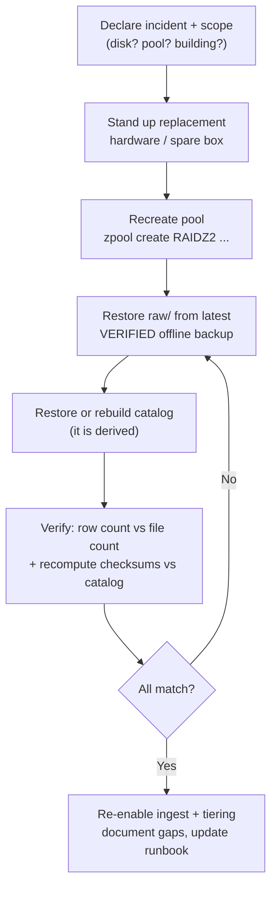
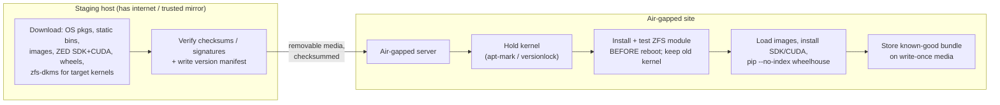

# Operations & Hardening for Isolated Sites

A storage layout and a catalog tell you *where the bytes go*. This chapter is about keeping those bytes **correct, available, and recoverable for years** on a server nobody can SSH into from the outside. On an air-gapped mining site you are the durability SLA, the on-call engineer, and the data-recovery vendor — so every control below has to work with no cloud, static binaries, and the assumption that the next person to touch the machine is doing it in a noisy MCC room six months from now.

> **Mining-server note:** Treat the box as *unattended infrastructure*, not a workstation. Anything that needs a human to notice a blinking light, remember a passphrase, or "just run the upgrade" will eventually fail silently. Automate the checks, write the runbook down, and store the keys where a second person can find them.

## Encryption at Rest

**What it is.** Transparent encryption of the data on the disks so that a drive removed from the chassis is opaque ciphertext. Two production-grade options on Linux: **LUKS/dm-crypt** (block layer, below the filesystem) and **ZFS native encryption** (per-dataset, inside the pool).

**Why it matters.** The realistic threat at a remote site is **physical theft of disks** — a drive pulled from a rack in an unmanned building, or a "failed" disk that walks off during an RMA. Encryption at rest defeats *that* threat. It does **not** protect a running system: once the pool is unlocked the keys live in RAM and the plaintext is readable, so this is orthogonal to access control (below). There is no cloud KMS here, so key management is entirely yours.

**What to do.**

| | **LUKS / dm-crypt** | **ZFS native encryption** |
|---|---|---|
| Layer | Block device, beneath any FS (ext4/XFS/ZFS-on-LUKS) | Per-dataset, inside the pool |
| Algorithm | AES-XTS (AES-NI accelerated) | AES-256-GCM/CCM |
| Encrypts | Whole device incl. all metadata + free space | Data + most metadata (**not** dataset names, pool layout, snapshot/clone structure) |
| Compression | FS compresses *plaintext* under LUKS (full ratio) | Compresses **before** encrypting (full ratio) |
| Dedup | Block dedup works on plaintext | Dedup works **only within one key/dataset** (no cross-key dedup) |
| Backup win | — | `zfs send --raw` ships **still-encrypted** streams to untrusted tape/HDD without unlocking |
| Granularity | Per disk/partition | Per dataset — encrypt `raw/`, leave scratch clear |

- For a single isolated ZFS server, **ZFS native encryption** is usually the better fit: per-dataset keys, and `zfs send --raw` lets you back up to removable media that never sees a key. Use **LUKS** when you want the whole device (including ZFS pool metadata and free space) opaque, or when the array is not ZFS.
- **Order matters for ratio:** both options compress *then* encrypt, so `compression=lz4` still pays off. Encryption does, however, defeat *downstream* dedup — a `restic`/`borg` repo written from already-encrypted `zfs send --raw` streams cannot dedup against plaintext, so pick one dedup layer and let it see plaintext.
- **Offline key management (no KMS):** keep the keyfile/passphrase **off the array it unlocks**. Practical pattern: a high-entropy keyfile on a hardware token (YubiKey/smartcard) or a small USB key kept in a site safe, *plus* a paper/QR escrow of the master passphrase in a second location, optionally Shamir-split so no single person can unlock or lose it. **Losing the key is total, unrecoverable loss** — back the key up more carefully than the data.

```bash
# ZFS dataset encrypted at creation; key loaded from a removable keyfile
zfs create -o encryption=aes-256-gcm \
           -o keyformat=raw -o keylocation=file:///mnt/usb-token/raw.key \
           -o compression=lz4 -o recordsize=1M tank/raw
zfs load-key tank/raw && zfs mount tank/raw      # at boot, with the token inserted

# LUKS alternative on a bare disk before building the pool/FS on top
cryptsetup luksFormat /dev/sdb
cryptsetup open /dev/sdb cryptraw      # then create ZFS/ext4/XFS on /dev/mapper/cryptraw
```

> **Mining-server note:** SVO2 itself supports **optional AES-256 encryption of the recording** in the ZED SDK. That is useful defense-in-depth if a capture box is more exposed than the server, but it adds *another* key to manage and makes the file opaque to `ffprobe`-style tooling. Treat it as a complement to full-volume encryption, never your only layer — and record (out of band) which datasets are SVO2-encrypted and with which key.

## RAID Is Not Backup — and Rebuild/URE Risk

**What it is.** Parity redundancy (ZFS RAIDZ, hardware/software RAID) lets a vdev survive disk failures. The question at large drive sizes is **how many failures**, because a *rebuild* (resilver) is a stress test of every surviving disk at exactly the moment you have the least redundancy.

**Why it matters.** Two numbers conspire against single parity:

- **Resilver windows are now multi-day.** Reconstructing a 16–22 TB drive means reading the equivalent of the whole vdev; on a busy, fairly full pool that is hours to **several days**. ZFS resilvers only live data (faster on a half-empty pool) but fragmentation and ongoing writes stretch it. Throughout that window a **RAIDZ1** vdev has **zero** remaining redundancy.
- **URE math.** Spinning disks specify an unrecoverable-read-error rate — commonly **~1 in 10¹⁴ bits** (consumer, ≈ one bad sector per ~12.5 TB read) to **~1 in 10¹⁵** (enterprise). A RAIDZ1 rebuild of an 8×18 TB vdev must read ~126 TB of survivors. At 10¹⁴ the probability of hitting at least one URE during that read is **uncomfortably high** — and on single parity a URE mid-rebuild is an unrecoverable block (classic hardware RAID5 would fail the whole array; ZFS degrades more gracefully and tells you *which file* it lost, but it is still data loss).

Treat these as intuition, not a benchmark: the point is that **as drives grew past ~8–12 TB, single parity stopped being safe**, because the second failure or the URE arrives *during* a rebuild that now lasts days.

**What to do.**

- Use **RAIDZ2 (double parity)** as the default for any bulk vdev of large drives — it survives a *second* whole-disk failure or a URE during the resilver. Consider **RAIDZ3** for very wide vdevs of the biggest drives, or **3-way mirrors** when fast resilver matters more than capacity. Avoid **Btrfs RAID5/6** (parity write-hole, not production-ready) — use ZFS RAIDZ.
- Keep vdevs a sane width (≈6–12 disks) and keep a **hot/cold spare** on the shelf so a resilver starts immediately, not after a parts order.
- **RAID is not a backup.** Parity protects *availability* against disk death; it does nothing against `rm -rf`, a buggy pipeline overwriting a day of SVO2, a controller that scrambles the array, or fire/theft/flood. Redundancy plus snapshots plus an **independent offline copy** (LTO/offline HDD, see the cold tier and DR runbook) is the actual safety story.

> **Mining-server note:** A degraded RAIDZ1 mid-resilver at 2 a.m. on an unmanned site, with the nearest spare a day's drive away, is the scenario RAIDZ2 buys you out of. Pay the one-disk capacity tax up front.

## Drive Health Monitoring (SMART)

**What it is.** `smartmontools` (`smartctl` + the `smartd` daemon) reads the drive's self-reported health and runs on-disk self-tests, so disks announce trouble *before* they die in a resilver.

**Why it matters.** A disk rarely fails cleanly; it first accumulates reallocated and pending sectors. Catching the trend lets you replace a disk on your schedule instead of during a multi-day rebuild with no redundancy.

**What to do.** Schedule **short tests** (daily) and **long tests** (weekly), and watch the attributes that actually predict failure:

| Attribute (ID) | What it means | Action |
|---|---|---|
| `Reallocated_Sector_Ct` (5) | Sectors remapped to spares | Any rising count → plan replacement |
| `Current_Pending_Sector` (197) | Suspect sectors awaiting remap | Rising → replace soon |
| `Offline_Uncorrectable` (198) | Unrecoverable on offline scan | Replace |
| `UDMA_CRC_Error_Count` (199) | Bus/cabling errors | Reseat/replace cable first |
| `Command_Timeout` / `Spin_Retry` | Mechanical/power weakness | Investigate |
| SSD `Percentage_Used` / `Media_Wearout` | Flash wear | Replace before 100% |

```bash
smartctl -H /dev/sda                # quick health summary (PASSED is necessary, not sufficient)
smartctl -a /dev/sda               # full attribute table
smartctl -t short /dev/sda         # start a short self-test; -t long for the full surface scan
smartctl -l selftest /dev/sda      # self-test history
smartctl -x /dev/sda               # everything, incl. error logs and temperatures
```

`/etc/smartd.conf` for unattended scheduling and **local** alerting:

```conf
# short test daily 02:00, long test Saturdays 03:00, temp warn at 45C/crit 55C
DEVICESCAN -a -o on -S on \
  -s (S/../.././02|L/../../6/03) \
  -W 0,45,55 \
  -m root -M exec /usr/local/sbin/smart-alert.sh
```

**Alerting on an offline host** has no Slack/email-to-cloud — so route alerts locally: a local MTA delivering `-m root` to an on-site mailbox; or `-M exec` calling a script that writes syslog, lights a panel LED, and appends to a status file; or scrape into **Prometheus `node_exporter`** via the textfile collector and alert with a local Alertmanager. Whatever you pick, make the signal *visible without leaving the room*.

> **Mining-server note:** Watch the **trend**, not the PASS/FAIL bit. A disk reporting `PASSED` while its reallocated count climbs every week is the disk that will URE during your next RAIDZ2 resilver. Replace on the slope, not the cliff.

## ECC RAM

**What it is.** Error-Correcting Code memory detects and corrects single-bit RAM errors (and detects multi-bit ones) in hardware, logging each correction.

**Why it matters.** This is the silent gap in an otherwise airtight integrity story. A bit flip in non-ECC RAM — cosmic ray, marginal DIMM, heat — corrupts data **in flight, before ZFS computes its checksum**. ZFS then dutifully checksums the *already-corrupted* bytes, stores the corruption as "correct," and every future scrub confirms it. The fixity hash in your catalog is computed over the same bad data. You have cryptographic proof that garbage is unchanged. No amount of RAIDZ2, scrubbing, or BLAKE3 catches an error that happened upstream of the checksum.

**What to do.**

- Use **ECC RAM for any long-retention server** that is the source of truth. The "ZFS *requires* ECC / scrub-of-death" claim is overstated — ZFS runs fine without ECC — but ECC matters *more*, not less, for data you intend to trust for years. It is cheap insurance relative to a silently corrupted multi-TB archive.
- Choose a CPU + board that genuinely support ECC (most server boards; many AMD Ryzen boards with the right BIOS; EPYC/Xeon by default) and **verify it is active** — a DIMM in a non-ECC slot is just expensive RAM.

```bash
sudo dmidecode -t memory | grep -i -E "error correction|^\s*Type:"   # board/DIMM capability
edac-util -v                                                          # report EDAC-tracked errors
sudo ras-mc-ctl --summary                                            # rasdaemon: corrected/uncorrected counts
```

> **Mining-server note:** Corrected-error counts from `rasdaemon`/EDAC are an early warning of a failing DIMM, the same way SMART pending-sectors warn of a failing disk. Log them next to your SMART data and replace the DIMM before it starts producing *uncorrectable* errors.

## Time Synchronization Offline

**What it is.** Disciplining the system (and hardware) clock to correct UTC without internet NTP, using a **local stratum-1 source** and `chrony` as a local server.

**Why it matters.** Your entire model is UTC-first: `captured_at` is UTC, and the blob tree partitions on `YYYY/MM/DD`. If a capture box's clock is wrong, captures land in the **wrong day directory**, `captured_at BETWEEN ...` queries miss them, IMU/sensor fusion timestamps drift apart, dedup/ordering breaks, and your **audit-log timestamps become untrustworthy** — exactly when you need them. RTC hardware clocks drift seconds per day, so "set it once" is not a plan.

**What to do.**

- Provide a **local stratum-1 reference**: a **GPS receiver with PPS** (pulse-per-second) feeding `gpsd` → `chrony`, or a **GPS-disciplined NTP appliance** on the LAN. A cheap USB GPS puck with PPS and a sky-facing antenna gives microsecond-class UTC with no internet.
- Run **`chrony` as the local NTP server** for every capture box and the storage server, so the whole site agrees even when offline. Keep the **RTC in UTC** (`timedatectl set-local-rtc 0`) and sync it from the disciplined system clock.

```bash
# /etc/chrony/chrony.conf on the storage server (the local time master)
refclock SHM 0 refid GPS precision 1e-1 offset 0.0          # gpsd shared-memory source
refclock PPS /dev/pps0 lock GPS refid PPS                    # PPS for sub-ms discipline
local stratum 10                                            # still serve the LAN if GPS drops
allow 10.0.0.0/24                                           # capture boxes on the isolated LAN

chronyc sources -v        # confirm GPS/PPS is selected
chronyc tracking          # current offset, stratum, drift
```

> **Mining-server note:** Without an external reference, capture boxes and the server **drift apart** — and a froth event recorded at "08:41" on a camera that is 90 s ahead will not line up with the SVO2 from the camera next to it. One GPS source feeding a `chrony` master fixes this for the whole site, and costs less than a single disk.

## Power Protection & Write Integrity

**What it is.** A UPS driving an automatic **clean shutdown** via **NUT (Network UPS Tools)**, combined with ZFS's transactional write semantics so an abrupt power loss is survivable.

**Why it matters.** Remote sites have *dirty power* — brownouts, generator switchover, lightning. The failure mode you fear is a power cut **mid-write**. On `ext4`/`XFS` the journal protects *metadata*, not your data blocks, so you can get torn writes, half-written files, or the RAID5/6 **write-hole** (parity and data inconsistent after a crash). ZFS is **copy-on-write and transactional**: a block is either fully the old version or fully the new — there is no in-place overwrite and no write hole, so a power loss costs you at most the **last few seconds of unsynced writes**, never a corrupt pool.

**What to do.**

- Put the server (and ideally the capture boxes) on a **UPS** and wire **NUT** to shut down cleanly before the battery dies:

```bash
upsc myups                 # battery charge, runtime, status
# /etc/nut/upsmon.conf — shut down when battery is critical
# MONITOR myups@localhost 1 upsmon mypass master
# SHUTDOWNCMD "/sbin/shutdown -h +0"
```

- Understand **ZFS sync semantics**: `sync=standard` (default) honors `fsync`/`O_SYNC`; `sync=always` is safest but slow; `sync=disabled` *never* flushes synchronously — only for throwaway scratch, never for `raw/`.
- A **SLOG/ZIL** device accelerates *synchronous* writes (databases, the catalog, NFS) by giving the ZFS Intent Log a fast home. Bulk sequential media ingest is mostly asynchronous, so a SLOG often is not needed. **If you add one, it must be an SSD with power-loss protection (PLP capacitors)** — a non-PLP SLOG defeats the entire point, because it can lose the acknowledged writes you put it there to protect.

> **Mining-server note:** Hardware RAID controllers need a working BBU/flash-backed cache, and any SSD acting as a write cache needs PLP — on generator power these are the components that turn a brownout into silent data loss. ZFS + a UPS + NUT clean shutdown is the boring combination that survives it. **Test it** by pulling mains and confirming the box shuts down and the pool imports clean.

## Capacity & Growth Planning

**What it is.** Turning per-hour capture rates into a multi-year sizing model, then mapping that onto vdevs, tiers, and an expansion plan.

**Why it matters.** Video and SVO2 rates are *per hour per sensor*; multiplied by fleet size, shifts, and years, they decide whether you provision one vdev or a tape library. Everything here is **content- and configuration-dependent** — froth turbulence, codec, CRF, resolution, and FPS all move the numbers — so size with a band, not a point.

**What to do.** Build a per-stream table from the rates this guide uses (SVO2 lossy H.265 ≈ **~7 GB/hr**, SVO2 PNG/ZSTD-lossless ≈ **~180 GB/hr ≈ ~3 GB/min**, both HD2K @ 15 FPS; visually-lossless H.265 CRF ~20 video at 1080p30 ≈ **~5 GB/hr**, content-dependent within a ~3–15 GB/hr band).

**Worked example** — a flotation circuit, two 8 h shifts (16 capture-hours/day). Figures are **estimates**, decimal TB (1 TB = 1000 GB):

| Stream | Sensors | Rate (GB/hr) | Hr/day | GB/day | TB/year | TB/5 yr |
|---|---|---|---|---|---|---|
| SVO2 lossy H.265 (HD2K@15FPS) | 4 | 7 | 16 | 448 | 163 | 817 |
| Video H.265 CRF~20 (1080p30) | 2 | 5 | 16 | 160 | 58 | 292 |
| **Bulk subtotal (raw bytes)** | | | | **608** | **222** | **1,109** |

- **Why lossless is rationed:** a **single** ZED at PNG/ZSTD-lossless (~180 GB/hr) for the same 16 hr/day = **2,880 GB/day ≈ ~1,051 TB/year** — more than the entire lossy fleet above. Reserve lossless for golden/calibration clips; otherwise it eats petabytes.
- **From raw bytes to disks you must buy:** usable capacity ≈ raw drive capacity × (data drives ÷ total drives in the vdev) × **~0.8 fill headroom** (ZFS degrades past ~80%). An 8×18 TB **RAIDZ2** vdev ≈ 144 TB raw → ~108 TB data → **~86 TB usable** at the 80% line. At ~222 TB/yr of bulk you fill that vdev in **well under a year**, so the warm tier must roll older `YYYY/MM` slices to the **cold tier** (LTO/offline HDD) on a schedule — see Storage Tiering and Writing to Tape.
- **Growth paths and their limits:** **RAIDZ expansion** (OpenZFS **2.3**) lets you add a single disk to an existing RAIDZ vdev and grow it online. The caveats: you **cannot remove** a disk from a RAIDZ vdev, **cannot change the parity level**, and **cannot shrink**; data written *before* the expansion keeps its old data:parity ratio until rewritten, so you do not instantly reclaim the full new capacity. The other growth path is **adding whole vdevs** to the pool (the pool stripes across them). Plan the vdev geometry up front, because the easy lever later is "add a vdev (or a disk) and tier the old months out."

> **Mining-server note:** Size for **TB-years**, not peak TB. Most of this data goes cold and is rarely read; provisioning enough always-on RAIDZ to hold five years is far more expensive than a year of warm HDD plus a cold tier. Re-measure your *actual* GB/hr after a week of real capture — the froth, the codec, and the FPS will move these numbers more than any spreadsheet.

## Writing to Tape (LTFS/LTO)

**What it is.** LTO tape as the cold/offline tier, written either as a self-describing **LTFS** filesystem or as a **tar/zfs-send stream** straight to the drive.

**Why it matters.** Tape is the cheapest **$/TB** for cold data, draws **zero power on the shelf**, and is genuinely air-gapped when ejected. But tape has sharp edges — generation compatibility and drive availability — that bite years later.

**What to do.**

| | **LTFS** | **tar / zfs send to tape** |
|---|---|---|
| On-tape format | Self-describing (index + data partitions); mount and drag-and-drop | Opaque sequential stream |
| Catalog needed? | No — tape carries its own index, readable on any LTFS system | **Yes** — you must keep an external index of what is on which tape |
| Random access | Per-file (slow but possible) | Poor (sequential) |
| Throughput / simplicity | Slightly more overhead | Maximum streaming throughput |
| Best for | Archival **exchange/handoff**, browsable archives | Bulk streaming of whole `YYYY/MM` slices (our tiering unit) |

```bash
mkltfs -d /dev/nst0                       # format a tape as LTFS
ltfs /mnt/tape                            # mount it; copy files; then unmount + eject
# or stream a whole month slice with no filesystem:
tar -cf /dev/nst0 raw/svo2/flotation-cell-7/zed2i-sn12345/2026/03/
mt -f /dev/nst0 rewind                    # tape control (status/rewind/eject)
find raw/.../2026/03 -type f -print0 | xargs -0 b3sum > 2026-03.b3   # verify by read-back
```

- **Generation compatibility is the trap:** LTO drives historically read **2** generations back and write **1** back, but since **LTO-8** the read-2-back was dropped (an LTO-8 drive reads/writes only LTO-8 and LTO-7). Translation: **keep a working drive of the right generation to read your old tapes**, and plan a migration *before* your drive generation goes end-of-life.
- **Lifespan:** archival shelf life is long (well over a decade in cool, dry, stable conditions), but the practical limit is **drive availability**, not the media. Recertify/migrate periodically, store the **checksum manifest with the tape** (and in the catalog), and add **`par2` parity** so a single read error is repairable without the original.

> **Mining-server note:** Keep a **spare drive of the same generation in the safe**. An LTO archive you cannot read — because the only drive died and the generation is EOL with no internet to source a replacement — is not a backup. Verify a restore from a randomly chosen tape on a schedule.

## Access Control & Audit Logging

**What it is.** Filesystem/object permissions, read-only `raw/`, and an append-only record of who wrote or deleted what on a server with shared logins.

**Why it matters.** On an unmanned site, multiple people and pipelines share one box. The two questions you must be able to answer months later are *"can a normal account delete `raw/`?"* (it must not) and *"who deleted March?"* (the audit trail must say).

**What to do.**

- **Least-privilege accounts:** an *ingest* service account writes `raw/`; a *pipeline* account writes `derived/` and reads `raw/`; *analysts* are read-only; *admin* is separate and rarely used.
- **Make `raw/` write-once.** Seal each completed slice: `chmod 0444` files, or set the dataset read-only (`zfs set readonly=on tank/raw`), or expose it via a **read-only bind/NFS mount** to consumers. Pipelines write only to the read-write `derived/` tree. On an object store, use **bucket policies + Object Lock/WORM** (e.g. SeaweedFS object lock) so objects cannot be overwritten or deleted before their retention expires.

```bash
zfs set readonly=on tank/raw                      # raw is immutable to everyone
setfacl -R -m g:analysts:rx /data/raw             # analysts read-only via ACL
mount -o bind,ro /data/raw /srv/raw-ro            # read-only view for consumers
```

- **Append-only audit trail:** turn on Linux `auditd` to watch the trees and key the events so they are greppable:

```bash
auditctl -w /data/raw -p wa -k raw_write          # log writes/attr-changes under raw
auditctl -w /data/catalog -p wa -k catalog_write
ausearch -k raw_write -i                           # who touched raw/, when
```

Ship the audit log (and your ingest log) to an **append-only / write-once** destination, and never allow `UPDATE`/`DELETE` on `raw` rows in the catalog — `indexed_at` and a `created_by` column give you an immutable provenance record alongside `auditd`.

> **Mining-server note:** WORM at the storage layer plus an `auditd` trail is how you make `raw/` **un-deletable by normal accounts** and still answer "who deleted March?" after the fact. Without it, a shared login and one bad `rm` is unattributable and unrecoverable.

## Disaster-Recovery Runbook

**What it is.** Written, *tested* objectives and procedures for getting back to a known-good state after a disk, pool, or site-level loss.

**Why it matters.** A backup you have never restored is a hypothesis. DR is the discipline of converting that hypothesis into a tested procedure, with explicit targets.

**What to do.** Define and document:

- **RPO (Recovery Point Objective):** how much data you can afford to lose = the gap between backups. A workable split: **RPO ≈ 24 h** for `raw/` (nightly verified backup); **RPO = "recompute"** for `derived/` (regenerable — accept its loss). 
- **RTO (Recovery Time Objective):** how long to be back. On an isolated site, honestly **hours-to-days**, bounded by hardware swap and reading from rotated media.



**Drills, on a schedule:**

- **Restore drill (quarterly):** restore a sample (or all) of a `restic`/`borg` repo to a scratch target and byte-compare.

```bash
restic check --read-data-subset=10%        # verify repo integrity incl. data
restic restore latest --target /scratch    # actually restore
borg check --verify-data /path/to/repo     # borg equivalent
```

- **Catalog-rebuild validation (monthly, rolling sample):** re-scan the tree, recompute checksums, and diff against the catalog to find missing rows, orphan files, and mismatches:

```bash
find /data/raw -type f -print0 | xargs -0 b3sum > /scratch/disk.b3
duckdb -c "
  CREATE TABLE disk AS SELECT * FROM read_csv('/scratch/disk.b3', columns={'checksum':'TEXT','path':'TEXT'}, delim=' ');
  -- in catalog but not on disk (missing), on disk but not in catalog (orphan), checksum drift:
  SELECT 'missing' t, path FROM read_parquet('/data/catalog/**/*.parquet', hive_partitioning = true) a
    WHERE NOT EXISTS (SELECT 1 FROM disk d WHERE d.path = a.path)
  UNION ALL SELECT 'orphan', path FROM disk d
    WHERE NOT EXISTS (SELECT 1 FROM read_parquet('/data/catalog/**/*.parquet') a WHERE a.path = d.path);"
```

- **Full DR rehearsal (annually):** rebuild a node from cold metal using only the air-gap install bundle and the offline backup.

> **Mining-server note:** Keep a **printed runbook and the `restic`/`borg` repo passphrase in the site safe**. An encrypted offline backup whose key lives only in the head of someone who has left the company is not recoverable. Schedule the restore drill like you schedule the scrub — an untested backup is an unproven one.

## Retention & Legal Hold

**What it is.** Retention *classes* per asset, a `retain_until` date, a `legal_hold` flag, and a defensible, logged deletion process. These extend the canonical `assets` catalog with operational columns.

**Why it matters.** "Keep everything forever" collides with finite disks; "delete to make room" collides with incidents and disputes that surface years later. You need a policy that **deletes on purpose** and **never deletes what is on hold**.

**What to do.**

- Assign a **retention class** and `retain_until` at ingest. Typical classes: **raw masters** (longest — years or indefinite), **golden/calibration** (keep longest of all), **derived caches** (shortest — regenerate on demand), **telemetry** (per policy).

```sql
ALTER TABLE assets ADD COLUMN retention_class TEXT;   -- raw_master | golden | derived | telemetry
ALTER TABLE assets ADD COLUMN retain_until    DATE;   -- earliest defensible deletion date
ALTER TABLE assets ADD COLUMN legal_hold      BOOLEAN DEFAULT FALSE;

-- defensible-deletion CANDIDATES: cold, past retention, and NOT on hold
SELECT asset_id, path, bytes FROM read_parquet('catalog/**/*.parquet', hive_partitioning = true)
WHERE tier = 'cold' AND retain_until < current_date AND NOT legal_hold;
```

- **Legal hold overrides retention:** a set `legal_hold` means **never delete**, regardless of age — for an incident investigation, dispute, or safety/environmental event that may need the footage frozen. Enforce it at the storage layer too (Object Lock/WORM legal-hold) so even an admin cannot prematurely delete.
- **Derived data is the first to go under pressure.** When the pool nears the high-water mark, purge `derived/` (regenerable) *before* touching `raw/` — the `raw/`-vs-`derived/` split makes this a one-liner. 
- **Defensible deletion** = a documented policy, automated enforcement that respects holds, and a **logged** deletion event (append-only). That is what lets you say "we deleted per policy," not "we destroyed evidence."

> **Mining-server note:** Mining incidents — equipment failure, environmental, safety — can trigger regulatory or legal holds **long after capture**. A `legal_hold` flag plus WORM means you can both *prove the footage was not altered* and *prove it was not prematurely deleted*. Wire the flag before you need it.

## Total Cost of Ownership (Rough $/TB)

**What it is.** A relative, decade-scale cost picture across the tiers — **not** a price list.

**Why it matters.** The case for tiering is economic: most archived data is cold and rarely read, and paying hot-tier prices (and **24/7 power**) to hoard years of untouched SVO2 is the expensive mistake. Reason in **TB-years**, including power and cooling, not just purchase price.

**What to do.** Order the tiers by **$/TB to keep a TB for the retention period**, and model it *relative to warm HDD* (set warm RAIDZ HDD media = **1.0**). These multipliers are **illustrative relative ordering, not quotes** — confirm against current vendor pricing:

| Tier | Media | Relative media $/TB | Idle power | Notes |
|---|---|---|---|---|
| **Hot** | NVMe SSD | ~4–6× | 24/7 | Keep only days–weeks; speed, not capacity |
| **Warm** | HDD in RAIDZ2 | **1.0** (reference) | 24/7 | Workhorse; parity + 80% fill raise *effective* $/TB |
| **Cold** | LTO tape | ~0.1–0.3× media **+ drive/library capex** | **~0 W on shelf** | Wins at volume; needs a compatible drive to read |
| **Cold** | Offline HDD | ~0.7–1× | **~0 W when disconnected** | Simplest cold; good *below* tape's capex crossover |

Why tiering pays over a decade:

- **Power dominates opex.** Spinning warm HDDs draw power for years; **shelved tapes and disconnected HDDs draw nothing**. Over 10 years the always-on opex of holding cold data on RAIDZ can exceed the media cost — exactly the data you should have moved to tape/offline HDD.
- **Tape's capex is the gotcha for small sites.** The drive (and any library) is a fixed cost amortized across tapes; **below a crossover volume, a stack of offline HDDs in a fireproof safe beats LTO**, above it tape wins decisively. The crossover is volume-dependent — model both.
- **Parity + headroom raise warm $/TB.** RAIDZ2 spends two disks on parity and you only fill to ~80%, so usable $/TB is meaningfully higher than the raw drive price.

> **Mining-server note:** Budget the **whole decade**: media + drives + power/cooling + the *spare drive to read old tapes* + the migration when a generation goes EOL. The cheapest sticker price (a big always-on RAIDZ holding everything) is rarely the cheapest TB-year.

These controls interlock: **encryption** defeats theft, **RAIDZ2 + SMART + ECC + scrub** defeat hardware decay, **UPS/NUT + ZFS** defeat power events, **time sync** keeps the partitions honest, **access control + WORM + audit** defeat fat fingers and bad actors, **retention/legal-hold** keeps you defensible, and **the DR runbook + offline tape/HDD** is the backstop when something defeats all of the above. None is sufficient alone.

## Air-Gap Install & Staging Playbook

**What it is.** One consolidated procedure to bootstrap and maintain the entire stack with **no internet**: stage everything on a connected host, verify it, carry it in on removable media, and — critically — keep a routine kernel upgrade from leaving the ZFS pool unmountable.

**Why it matters.** Offline, there is no `apt install`, no `pip install`, no `docker pull` to bail you out at 2 a.m. The one bundle you forgot to stage is the one that blocks the rebuild. And the classic way an air-gapped pool goes dark is a kernel update that the installed OpenZFS module does not support — with no internet to fetch the fix.

**What to do (checklist).** Do this on a **staging host with internet** (or a trusted mirror), verify checksums/signatures, then transfer:

- [ ] **OS packages** — full local mirror (`apt-mirror`/`reposync`) or at least all needed packages **with dependencies** (`apt-get download` / `dnf download --resolve`) so you can reinstall offline.
- [ ] **Static binaries** — prefer single statically-linked binaries: `ffmpeg` (static), `restic`, `borg`, `b3sum`, `duckdb`, `smartmontools`, `chrony`, `nut`, `par2`, `pdal`/`lastools`. Checksum and store each.
- [ ] **Container images** — `docker save`/`podman save` to tar, or `skopeo copy` into a dir, or stand up a **local registry** (`registry:2`/Harbor). Load offline with `docker load`.
- [ ] **ZED SDK + CUDA + driver** — stage the **exact** ZED SDK installer (`.run`) for your CUDA/JetPack version, **alongside the matching CUDA toolkit and NVIDIA driver** (driver must match the kernel headers). **Keep multiple SDK versions** if you must replay old SVO2 — depth is *recomputed*, so old recordings need their original SDK to reproduce results. Pin the SDK version per dataset.
- [ ] **FFmpeg build** — a static build with the codecs you actually use (`libx265`, `libsvtav1`, `ffv1`); verify offline with `ffmpeg -encoders | grep -E 'hevc|av1|ffv1'`.
- [ ] **HDF5 / Zarr codec plugins** — HDF5 libs and the Blosc/zstd/lz4 filter plugins; `numcodecs` and friends as a local **Python wheelhouse** (`pip download -d wheelhouse ...` → `pip install --no-index --find-links wheelhouse`). Build the wheelhouse on a matching Python/OS.
- [ ] **PIN & pre-stage OpenZFS DKMS against kernel upgrades** — the load-bearing step:
  - **Hold the kernel** so it cannot silently upgrade out from under ZFS: `apt-mark hold linux-image-generic linux-headers-generic` (Debian/Ubuntu) or `dnf versionlock add kernel\*` (RHEL family).
  - When you *do* move kernels, **pre-stage the matching `zfs-dkms`/`kmod-zfs`** package, confirm the OpenZFS↔kernel compatibility before installing, and **rebuild + test the module in a maintenance window** *before* rebooting.
  - **Keep the old kernel installed** as a fallback GRUB entry, and **verify `zpool import` on the new kernel** before committing. On RHEL, kABI-tracking kmods avoid per-kernel DKMS rebuilds.
- [ ] **Verify, then verify again** — check checksums/signatures on the staging host **and** after transfer to the air-gapped box.
- [ ] **Record a version manifest** — kernel, OpenZFS, ZED SDK, CUDA, driver, FFmpeg, codec plugins — and store it *with the data* so a future rebuild knows exactly what to stage.
- [ ] **Keep a "known-good bundle"** of the whole install set on **write-once media** so you can rebuild a node from cold metal during DR.



> **Mining-server note:** The **kernel-vs-ZFS mismatch** is how an air-gapped pool goes dark after a routine update — the system reboots into a kernel with no matching ZFS module and no internet to fetch one. Holding the kernel, pre-staging the DKMS package for the *next* kernel, testing the module before reboot, and keeping the old kernel bootable turns that outage into a non-event.
