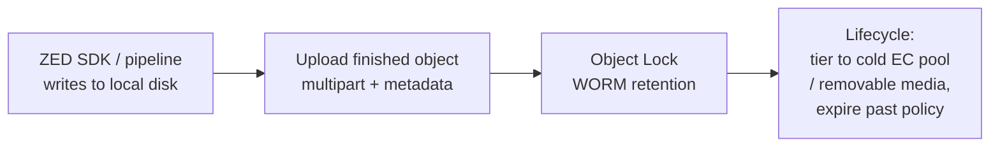
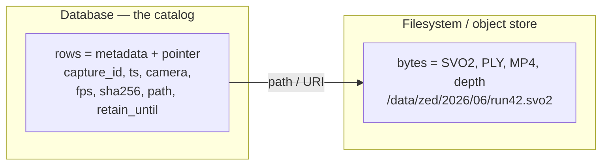
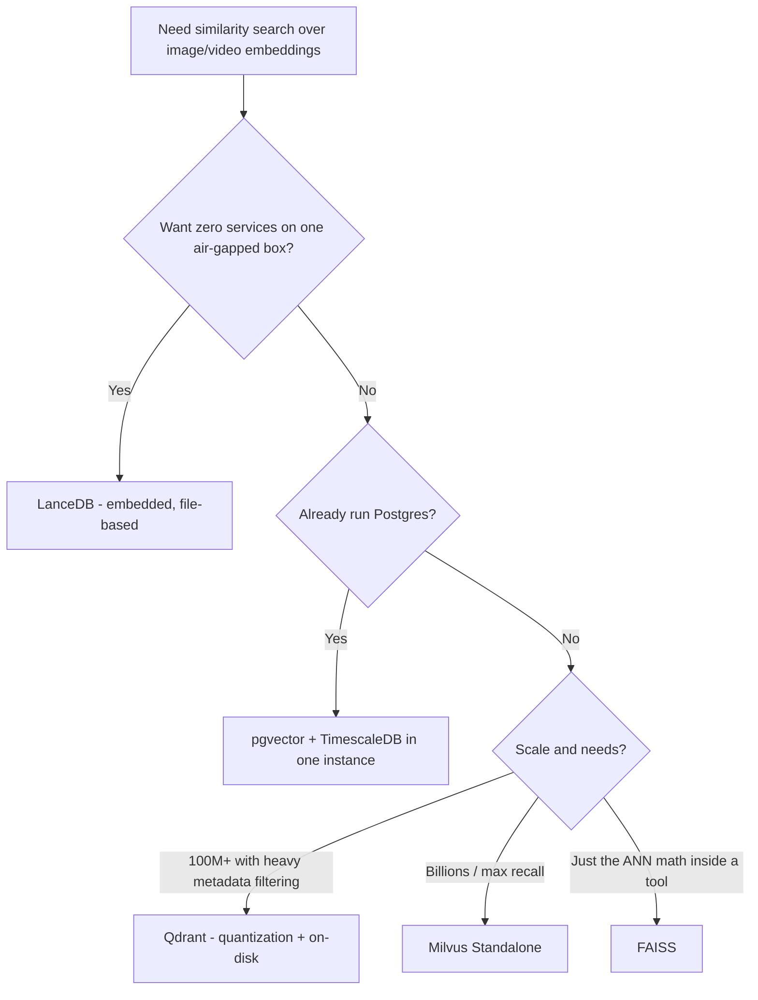
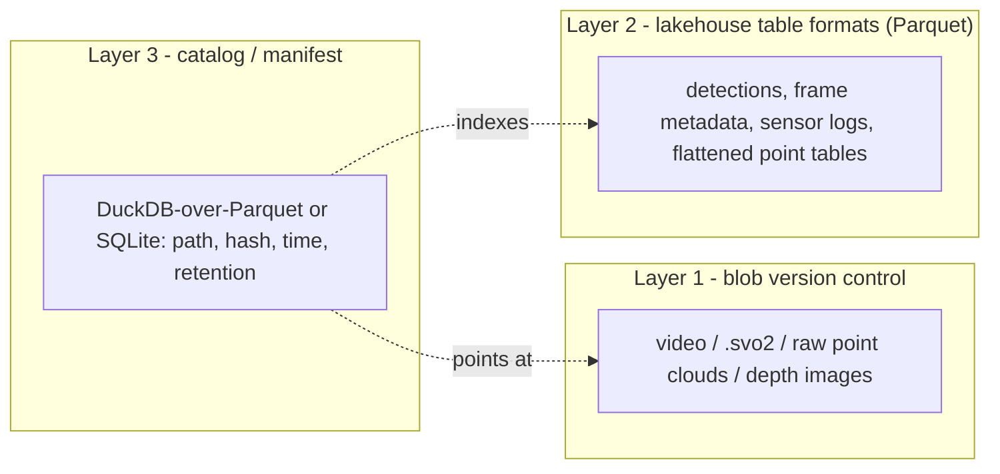

# Storage Options: The Landscape

There is no single "best" store for heterogeneous sensor data — there is a *foundation layer* that holds the bytes and an *index layer* that makes them findable, plus specialized formats for specific modalities. The guiding rule that runs through every option below is **"files for bytes, a database for facts"**: keep large opaque blobs (video, SVO2, point clouds) on a filesystem or object store, and keep metadata + paths + checksums in something you can query. The table below maps every family covered in this guide so you can see where each fits before diving in; the first five families form the byte-and-catalog foundation; the remaining subsections below cover modality-specific and analytical formats.

| Family | Sweet spot | Scale | Offline / Self-host |
|---|---|---|---|
| **Plain Filesystem** (Direct Files) | The byte store of record for large opaque blobs (video, SVO2, point clouds) | GB → many TB (PB on ZFS/XFS) | Native — nothing to run |
| **Embedded Single-File Stores** (SQLite, LMDB, RocksDB) | Server-less local index/catalog of those files | KB → tens of GB of *metadata* | Native — in-process, no daemon |
| **Object Storage** (S3, MinIO, Ceph) | Durable archive + multi-client serving of big blobs at scale | TB → PB, billions of objects | Yes — SeaweedFS / Garage / Ceph |
| **Relational Databases** (PostgreSQL, MySQL) | The catalog / system-of-record for metadata + paths | Millions of rows | Yes — run fully air-gapped |
| **Document & NoSQL** (MongoDB, GridFS) | Highly heterogeneous, schema-churning capture metadata | Millions of documents | Yes — self-hosted |
| **Scientific & Array Formats** (HDF5, Zarr, NetCDF, TileDB) | N-D numeric arrays (depth maps, voxel grids) | GB → TB per array | Yes — file formats + embedded libs |
| **Columnar & Tabular** (Parquet, Arrow, Lance) | Analytical catalogs and flattened point tables | Many TB of rows | Yes — Parquet + DuckDB |
| **Vector Databases** (LanceDB, Qdrant, Milvus, pgvector) | Embeddings for near-duplicate / similarity / curation | Millions → billions of vectors | Yes — embedded or single-binary |
| **Time-Series Databases** (InfluxDB, TimescaleDB) | Sensor / IMU telemetry with timestamps | Billions of points | Yes — Postgres ext. or single binary |
| **Data Lakes & Lakehouse** (Iceberg, Delta, Hudi) | ACID + time-travel over *tabular* data | Many TB | Yes — Delta-rs / DuckLake offline |
| **Data Version Control** (DVC, git-annex, DataLad, lakeFS) | Versioning opaque assets + provenance | GB → tens of TB | Yes — local / USB / S3-compatible remotes |

> **Mining-server note:** Your debug images already work, so do not rip anything out. The new video and ZED 3D data is a *byte-store-plus-catalog* problem: a checksumming filesystem (or self-hosted object store) for the blobs, and an embedded or relational catalog for the facts. The lower the row in this table, the more it is a *derived* layer — none of them should ever hold the raw blobs.

## Plain Filesystem (Direct Files)

- **What it is.** Files written directly into a directory tree on a POSIX filesystem. This is the simplest thing that works, and for large opaque blobs it is usually the *right* thing.
- **Best for.** The byte store of record for big, write-once objects — SVO/SVO2 recordings, MP4/MKV video, PLY/PCD point clouds, EXR/16-bit-PNG depth maps. Sequential I/O is fast, every standard offline tool (`rsync`, `cp`, `tar`, `ffmpeg`, the ZED SDK, `find`) operates on it directly, and there is no lock-in.
- **Avoid when.** You need rich queries over the data ("all clips from camera 3 last March"), cross-file transactional atomicity, or you would otherwise dump millions of *small* files into one directory. Pair it with a catalog (next section) and shard the namespace.
- **Tools.** The filesystem itself plus POSIX/offline tooling: `rsync`, `tar`, `find`, `ls -f`/`ls -U`, `ffmpeg`, `cron` for scheduled scrubs.
- **Trade-offs.** Filesystems beat databases for blobs past roughly 100 KB–1 MB and have zero operational overhead, but they offer no built-in metadata query layer and — depending on which filesystem you pick — no defense against silent corruption.

### Picking the filesystem: integrity is the deciding factor

For a **multi-year** archive the single most important property is **end-to-end data checksumming with scrub-and-repair**. Disks suffer silent corruption ("bit rot") that ordinary filesystems never notice. `ext4` and `XFS` checksum only their *metadata*; **ZFS and Btrfs checksum the actual data blocks** and can repair them from redundancy. Over years this is the difference between *detecting* a corrupt SVO and *silently serving* one.

| Feature | ext4 | XFS | Btrfs | OpenZFS |
|---|---|---|---|---|
| Data checksums (catch bit rot) | No | No (metadata only) | **Yes** | **Yes** |
| Self-heal from redundancy | No | No | Yes (RAID1/10/DUP) | **Yes** (mirror / RAID-Z) |
| Scrub | No | No | **Yes** | **Yes** |
| Snapshots | No | No | **Yes** | **Yes** |
| Transparent compression | No | No | **Yes** | **Yes** |
| In mainline kernel | Yes | Yes | Yes | **No** (DKMS / CDDL) |
| Parity RAID safe to use | via md/hw | via md/hw | **No (RAID5/6)** | **Yes (RAID-Z)** |
| Inode allocation | static | **dynamic** | dynamic | dynamic |
| Best at | simplicity | big files / huge counts | snapshots + integrity (no parity) | **integrity-first archive** |

- **OpenZFS — first choice for the archive tier.** A combined filesystem + volume manager with copy-on-write, per-block checksums, redundancy (mirror, RAID-Z1/2/3), instant snapshots, transparent compression, and `zfs send`/`recv` replication. A `scrub` reads every block, verifies its checksum, and *self-heals* from parity on RAID-Z/mirror pools — schedule it monthly; this is your bit-rot defense. RAID-Z avoids the parity "write hole" via variable-width stripes + CoW. Caveats: it ships as an out-of-tree DKMS module (CDDL license), and dedup is RAM-expensive (~5 GB RAM per TB of pool) — avoid dedup unless you have 128 GB+ RAM and genuinely duplicate data; compression + snapshots usually give the wins you want.
- **Btrfs — ZFS-like integrity, in the mainline kernel.** Data + metadata checksums, snapshots, and `compress=zstd`, on **single / DUP / RAID1 / RAID10** layouts. The headline caveat: **Btrfs RAID5/6 is still not production-ready** (write hole; upstream actively discourages it). For parity, prefer ZFS RAID-Z, or run Btrfs *single* on top of `mdadm`/hardware RAID (you keep corruption *detection* but lose Btrfs self-heal).
- **XFS — best plain, high-throughput choice.** Mature, large-file-optimized, with **dynamic inode allocation** and B+tree directories that scale to *billions* of files (default on RHEL/Rocky 9). It has **no** data checksums, snapshots, or compression (metadata CRC only) and **cannot shrink** — use it only when integrity is handled by another layer (hardware RAID with scrubbing, or application-level SHA-256 verification).
- **ext4 — simplest, smallest setups only.** Ubiquitous and conservative, but **inodes are fixed at `mkfs` time** (you can run out despite free space), and very large directories can hit the HTree height ceiling (*"index full, reach max htree level"*) unless you enable `large_dir` — or simply shard directories.

```bash
# OpenZFS dataset tuned for large ZED/video blobs
zfs create -o recordsize=1M -o compression=lz4 -o atime=off tank/zed
# higher-ratio alternative (more CPU): -o compression=zstd-3
zpool scrub tank                    # run monthly via cron; check `zpool status`
zfs snapshot tank/zed@2026-06-29    # instant, space-efficient point-in-time
```

Two practical knobs matter for this data: set **`recordsize=1M`** for large sequential media/3D files (better throughput *and* compression ratio), and turn compression **on** (`lz4` is the safe ~2:1 default; `zstd` trades CPU for ratio). Already-compressed H.264/H.265 SVO and JPEG will not shrink, but lossless SVO, depth maps, and PLY/PCD point clouds often do.

> **Mining-server note:** OpenZFS being out-of-tree (CDDL/DKMS) is a real air-gap hazard — a kernel upgrade can break the module if the matching ZFS package was not staged offline first. Pin and pre-stage matching versions before any kernel bump. And never put millions of files in one directory: shard by time (`cam03/2026/06/29/...`) or hash-prefix (`ab/cd/abcd...`), and use `ls -f`/`ls -U`/`find` instead of a sorted `ls -l` that triggers a `stat()` storm.

## Embedded Single-File Stores (SQLite, LMDB, RocksDB)

These run **in-process** — no daemon, no network port, no auth to manage — which makes them ideal for **air-gapped** servers. Use them to *index* the files from the filesystem layer: paths, sizes, capture time, camera ID, calibration, stored content checksums, processing status, and small previews. Keep the large blobs themselves external; store the path, not the bytes.

### SQLite — the default catalog

- **What it is.** A serverless, zero-config, single-file SQL database — the most widely deployed database in the world and an explicitly supported *application file format*.
- **Best for.** The metadata catalog/index for your files; small derived blobs (thumbnails, sidecar contents); anything you will *query*. Crash-safe and trivially portable — back it up by copying one file.
- **Avoid when.** You need many concurrent *writers* (writes serialize), multi-node access, or you want to store the *large* blobs inside it.
- **Tools.** `sqlite3` CLI; WAL mode (`PRAGMA journal_mode=WAL`) for concurrent reads during writes; `.backup` / `VACUUM INTO` for safe offline backups; the optional `sqlite-zstd` extension for transparent row-level compression (vendor/compile it offline — it is third-party).
- **Trade-offs.** Per SQLite's own benchmarks, small blobs (~10 KB) read/write **~35% faster** than individual files and use **~20% less disk** (rows pack tightly; files pad to block size) — present this as guidance, not a guarantee, since results vary by hardware/OS/cache. The internal-vs-external break-even is near **~100 KB**: store blobs smaller than that inside, keep anything larger as files and store the path. (Single-blob hard limit ~2 GB; your MB–GB media is always external.)

```sql
-- Catalog pattern: bytes on disk, facts in SQLite
CREATE TABLE captures(
  id          INTEGER PRIMARY KEY,
  path        TEXT NOT NULL,   -- raw/svo2/flotation-cell-7/zed2i-sn12345/2026/06/29/zed2i-sn12345_20260629T153000Z_0001.svo2
  modality    TEXT,            -- 'image' | 'video' | 'svo2' | 'depth' | 'point_cloud'
  bytes       INTEGER,
  checksum    TEXT,            -- stored hash (BLAKE3/sha256) for periodic re-verification
  captured_at TEXT,
  sensor      TEXT,            -- stable serial-style id, e.g. zed2i-sn12345
  thumb       BLOB             -- small (<100 KB) preview kept inline
);
```

### LMDB (Lightning Memory-Mapped Database)

- **What it is.** A tiny embedded, memory-mapped copy-on-write B+tree key-value store with full ACID transactions.
- **Best for.** **Read-heavy** `key → metadata/path` lookups where you want *zero tuning* — e.g., a hot index consulted constantly by inference jobs.
- **Avoid when.** Write-heavy ingest, values you need SQL over, or datasets far larger than RAM.
- **Tools.** C library plus bindings (Python `lmdb`, etc.); single data file + lock file.
- **Trade-offs.** Reads return pointers directly into mapped memory (no copy). **Single writer**, but readers never block writers and vice versa (MVCC). **Crash-proof by design** — CoW means the on-disk structure is always valid, with no recovery step after a power cut (excellent for a mining site). No built-in compression; set the max map size up front (effectively unbounded on 64-bit).

### RocksDB

- **What it is.** An embedded LSM-tree key-value store built for high write throughput and datasets larger than RAM.
- **Best for.** **Write-heavy / high-ingest** indexing — per-frame events, IMU/sensor streams, or rapid metadata from many capture nodes — where the index itself grows into the hundreds of GB.
- **Avoid when.** You want simplicity/zero-config, lowest read latency on a small dataset, or SQL.
- **Tools.** C++ library plus bindings; column families (separate hot/cold data); `ldb` / `sst_dump` utilities.
- **Trade-offs.** LSM design favors writes via in-memory buffering + background compaction, at the cost of **write amplification** and more RAM/CPU. **Built-in compression** (Snappy/LZ4/ZSTD) — a common pattern is no compression on L0/L1 and ZSTD on L2+. More knobs than LMDB/SQLite.

| | SQLite | LMDB | RocksDB |
|---|---|---|---|
| Model | SQL (relational) | KV, mmap B+tree | KV, LSM-tree |
| Optimized for | balanced + queries | **reads** | **writes / ingest** |
| Concurrency | serialized writes; WAL readers | 1 writer, many readers (MVCC) | concurrent, tunable |
| Config effort | very low | **none** | high |
| Compression | via `sqlite-zstd` | none | **built-in** (zstd/lz4) |
| Crash safety | atomic txns | **no-recovery CoW** | WAL + recovery |
| Best role here | **the catalog** | hot path → metadata lookups | high-rate event ingest |

> **Mining-server note:** Start with SQLite as the catalog — it covers ~95% of needs, is the easiest to back up and inspect offline, and proves the "files for bytes, DB for facts" split. Reach for LMDB only if a hot read path needs lower latency, or RocksDB only if concurrent ingest outgrows SQLite's single-writer model. None of these are multi-writer shared stores; for that, graduate to PostgreSQL.

## Object Storage (S3, MinIO, Ceph)

A POSIX filesystem is fine until you have millions of files spread over years. **Object storage** — the S3 model — is the strongest fit for your *new* pain (video and ZED 3D data piling up for years) once these pressures appear:

| Pressure | Filesystem | Object storage |
|---|---|---|
| Scale to billions of objects | Listing / lookups degrade on huge trees | Flat namespace; key lookup is independent of object count |
| Rich, queryable metadata | Fixed (timestamps, owner, size) | Arbitrary per-object metadata (camera_id, scene, GPS, run_id) |
| Parallel / multi-client access | NFS/SMB locking gets fragile | Stateless HTTP GET/PUT; many concurrent clients |
| Large immutable blobs | One big file; resume is manual | Multipart upload: parallel, resumable, checksum-verified parts |
| Multi-year integrity | Silent bit rot unless ZFS/Btrfs | Erasure coding + per-object checksums + per-object self-heal |
| Retention / tamper-resistance | Anyone with write access can overwrite | Versioning + WORM Object Lock |

It is **not** a working/scratch filesystem: no in-place edit or append, and the ZED SDK records SVO2 to a *local path*, not an S3 URL. The pattern is **capture-local → upload (multipart) → optionally lock for retention → tier/expire via lifecycle**.



The S3 data model is shared by every option below: a **bucket** holds **objects** addressed by a single string **key** — `zed/2026/06/29/cam01/run_1234.svo2` is one flat key, and the `/` characters are just part of the string ("folders" are a UI illusion built from prefixes). Lead keys with a stable, low-cardinality dimension (data type/camera), then date. Two integrity features matter most for years of retention: **erasure coding** (Reed–Solomon *k* data + *m* parity shards gives per-object healing and per-read checksum verification; e.g. 8+4 costs ~1.5x raw vs 3x for replication) and **Object Lock** (WORM built on versioning — Governance mode lets privileged users remove the lock; Compliance mode lets *no one*, including root, delete until expiry).

**Multipart upload** is essential for multi-GB SVO2/video files:

| S3 limit | Value |
|---|---|
| Max object size | 5 TB |
| Single `PUT` max | 5 GB (use multipart above this) |
| Recommended multipart threshold | ~100 MB |
| Part size | 5 MB – 5 GB |
| Max parts per object | 10,000 |

Each part uploads independently (parallel, resumable on a flaky link) and is checksum-verified; `aws s3 cp`, `mc cp`, and `rclone` all do this automatically above a threshold.

> **Warning — MinIO status (2026):** MinIO was the default self-hosted S3, but it changed dramatically. In 2025 features were removed from the Community Edition console, and as of early 2026 the community repository was reported to be moving toward maintenance/archival with no guaranteed security patches — verify its current status before relying on it. An existing AGPLv3 install still runs offline and can be pinned short-term, but **do not start a new long-retention deployment on it** — and do not adopt MinIO Enterprise/AIStor on an air-gapped box if it requires online license validation. For new isolated deployments, prefer SeaweedFS or Garage below.

### SeaweedFS — primary recommendation for isolated servers

- **What it is.** Apache-2.0, Go, distributed store on Facebook's *Haystack* design; separates the metadata path from the data path for O(1) disk seek (~40 bytes metadata/file). Components: Master, Volume servers, optional Filer, and an S3 gateway.
- **Best for.** Mixed workloads exactly like yours — **billions of small files** (depth maps, point-cloud frames) *and* **large blobs** (SVO2/video); single-node start that scales out.
- **Avoid when.** You want a turnkey GUI/IAM console out of the box, or the absolute minimum number of moving parts.
- **Tools.** Full S3 API including versioning, lifecycle, Object Lock/WORM, multipart; replication for hot data plus optional rack-aware erasure coding for warm data; cloud/remote tiering; `weed` single static binary or container image.
- **Trade-offs.** More components than Garage, but each is simple — and it is the richest actively-maintained open-source feature set now that MinIO's community edition is winding down. Budget ~2–4 GB RAM per volume server.

### Garage — simplest / lightest

- **What it is.** AGPLv3, Rust, by Deuxfleurs; in production since 2020. Consistent-hashing ring for small, self-hosted clusters on modest hardware.
- **Best for.** Operational minimalism — a backup/archive target on a few low-RAM machines (~1–2 GB RAM/node), or multi-site copies in separate buildings.
- **Avoid when.** You need maximum storage efficiency (it does **3x replication only — no erasure coding by design**), very high throughput, or advanced S3 features.
- **Tools.** Core S3 — GET/PUT/DELETE, multipart, listing, presigned URLs, static-site hosting; single static binary.
- **Trade-offs.** The easiest to operate, at the cost of features and **3x raw storage** — budget disks accordingly at many-TB scale.

### Ceph + RADOS Gateway (RGW) — central, staffed sites only

- **What it is.** The battle-tested unified platform (object + block + file) on RADOS; RGW provides the S3 endpoint, with flexible K+M erasure coding across drives/hosts/racks.
- **Best for.** Large, long-lived deployments (many TB → PB) with a **dedicated ops team**.
- **Avoid when.** Small isolated servers or a small team — **Ceph does not scale down**: technical minimum 3 nodes, 5–9 recommended for real production resilience, ~4 GB RAM per OSD, high operational complexity.
- **Tools.** Most complete S3 feature set; deploy via `cephadm` container images (mirror them for air-gap).
- **Trade-offs.** Maximum capability and durability, maximum operational cost — overkill for a one-or-two-box mining edge.

> **A note on RustFS:** it is an Apache-2.0, drop-in MinIO replacement in Rust — promising and permissively licensed, but **alpha** (upstream says do not use in production; a hardcoded gRPC token, CVE-2025-68926 at CVSS 9.8, affected alpha.13–alpha.77). Watch it, do not deploy it for multi-year data yet.

| | SeaweedFS | Garage | Ceph RGW | MinIO (community) |
|---|---|---|---|---|
| License | Apache 2.0 | AGPLv3 | LGPL | AGPLv3 |
| Maintained (2026) | Active | Active | Active | **Maintenance/archival (verify)** |
| Redundancy | Replication + optional EC | **3x replication only** | Flexible K+M EC | Reed–Solomon EC |
| Small-file efficiency | Excellent (Haystack) | OK | Moderate | Good |
| Min footprint | 1 node, ~2–4 GB/server | 1+ node, ~1–2 GB | **5–9 nodes** prod | 1 node |
| Best role here | **Primary store** | **Simple archive target** | Central DC w/ ops team | Existing only — migrate off |

> **Mining-server note:** All recommended options install fully offline from mirrored static binaries or container images, with no license phone-home in the OSS builds — verify the storage hosts have no network egress. Throughput numbers circulating in community blog comparisons are single-source single-node benchmarks; treat them as rough relative ordering and benchmark on your own hardware. Self-hosted systems do **not** replicate AWS's per-prefix auto-scaling, so design keys with a stable low-cardinality dimension first and skip hashed prefixes.

## Relational Databases (PostgreSQL, MySQL): BLOB vs. Path Pattern

The default architecture for large, heterogeneous data is the **catalog (metadata-index) pattern**: store **metadata + a path/URI + a checksum** in the database, and keep the bytes on the filesystem or object store. The database is an *index*, not a blob container.



This wins for GB-to-TB, multi-year, offline workloads because the database stays small and fast (indexes, backups, and `VACUUM`/`OPTIMIZE` operate on kilobytes of metadata, not terabytes of pixels), reads are roughly **10x faster** straight from the filesystem than streaming the same bytes out of a relational DB, and retention becomes a row update plus a file delete rather than a database rewrite. It is also exactly how lakehouse catalogs (Iceberg/Delta, DuckLake) work — you are building a small, purpose-specific version of the same idea.

**When is it worth putting bytes *in* the database?** Only when the blob is *small*, you need the blob and its metadata to commit/rollback **atomically**, and you value a single backup artifact over throughput. The classic empirical study (Microsoft Research, *"To BLOB or Not To BLOB"*) found:

| Blob size | Winner | Notes |
|---|---|---|
| **< 256 KB** | **Database** | Fewer open/close syscalls; transactional |
| 256 KB – 1 MB | Gray zone | Depends on engine, filesystem, workload |
| **> 1 MB** | **Filesystem / object store** | DB overhead and bloat dominate |

Per-engine ceilings (hard limits are *not* recommendations):

| Engine | Hard max per value | Keep it under | What goes wrong above |
|---|---|---|---|
| PostgreSQL `BYTEA` | 1 GB | a few MB | Whole value loaded in memory; TOAST bloat; ~10x slower than file |
| PostgreSQL Large Object | 4 TB (2 GB pre-9.3) | streamed >1 GB only | Orphans, txn-scoped reads, non-portable API |
| MySQL/MariaDB `LONGBLOB` | 4 GB | a few MB | Bounded by `max_allowed_packet`; replication bloat |
| MongoDB document | 16 MiB | well under 16 MiB | Hits BSON limit → GridFS |

ZED SVO2 (~7 GB/hour with H.264/H.265, up to ~180 GB/hour lossless at HD2K@15FPS) plus point clouds, depth maps, and ordinary video are far past every threshold — **they never belong inside the database.**

### PostgreSQL as a catalog — recommended default

- **What it is.** A robust, offline-capable relational database used purely to *index* files: rich types (`JSONB`, arrays, full-text), strong constraints, mature backup (`pg_dump`/PITR), table partitioning.
- **Best for.** The primary metadata catalog and system-of-record for video + ZED data over many years; querying by camera, time, scene tags, retention.
- **Avoid when.** You want a truly zero-admin single-file DB on a lone edge box — use SQLite instead.
- **Tools.** `psql`; `JSONB` + GIN indexes for heterogeneous capture metadata; partition by month/year for huge catalogs; logical/physical backups.
- **Trade-offs.** Needs a running service and basic ops; in return you get the strongest query and integrity story for long-lived metadata.

```sql
CREATE TABLE captures (
  capture_id   BIGINT GENERATED ALWAYS AS IDENTITY PRIMARY KEY,
  modality     TEXT NOT NULL,        -- 'image' | 'video' | 'svo2' | 'depth' | 'point_cloud'
  sensor       TEXT NOT NULL,        -- stable serial-style id, e.g. zed2i-sn12345
  captured_at  TIMESTAMPTZ NOT NULL,
  compression  TEXT,                 -- 'H264' | 'H265' | 'LOSSLESS'
  file_uri     TEXT NOT NULL,        -- 'file:///data/raw/svo2/flotation-cell-7/zed2i-sn12345/2026/06/29/...svo2'
  bytes        BIGINT NOT NULL,
  checksum     BYTEA NOT NULL,       -- BLAKE3/sha256 digest; integrity over multi-year retention
  calib_json   JSONB,               -- camera calibration / extrinsics
  scene_tags   JSONB,               -- flexible, heterogeneous metadata
  retain_until DATE                  -- drives lifecycle / cleanup jobs
);
CREATE INDEX ON captures (sensor, captured_at);
CREATE INDEX ON captures USING GIN (scene_tags);
```

### PostgreSQL `BYTEA` (bytes in-row, via TOAST)

- **What it is.** A binary column; PostgreSQL transparently pushes large values out-of-line into a per-table TOAST table and deletes them with their row.
- **Best for.** *Small* binary tightly bound to a row needing atomic commit — thumbnails, calibration snapshots, small previews (< a few MB).
- **Avoid when.** Multi-MB-to-GB objects or anything throughput-sensitive (hard cap 1 GB, and the value is materialized whole in memory).
- **Tools.** Driver binary binding; `ALTER TABLE ... SET STORAGE EXTERNAL` to disable compression and speed partial reads.
- **Trade-offs.** Dead-simple and transactional, but ~10x slower than a file and inflates table/backup size; streaming from `BYTEA` with `EXTERNAL` storage is actually faster than a Large Object.

### PostgreSQL Large Objects (`lo` / `oid`)

- **What it is.** The legacy big-binary mechanism — data in the shared `pg_largeobject` catalog with a seek/read/write streaming API.
- **Best for.** Single objects > 1 GB you must keep in the DB, or genuine server-side streaming/partial writes (max 4 TB since 9.3).
- **Avoid when.** Almost always for this use case — files on disk plus a path are simpler and faster.
- **Tools.** `lo` extension, `lo_import`/`lo_export`, `vacuumlo`, `lo_unlink`.
- **Trade-offs (the gotchas).** Deleting the referencing row does **not** delete the object (orphans → run `vacuumlo`); an open LO must be read within the same transaction; the API is Postgres-specific and non-portable.

### MySQL / MariaDB (BLOB family)

- **What it is.** Binary columns in four sizes — `TINYBLOB` (255 B), `BLOB` (64 KB), `MEDIUMBLOB` (16 MB), `LONGBLOB` (4 GB).
- **Best for.** A catalog database (same pattern as Postgres) plus the *occasional* small `MEDIUMBLOB` tightly coupled to a row.
- **Avoid when.** Multi-MB+ media — transfers are bounded by `max_allowed_packet` (commonly 64 MB) and bloat replication.
- **Tools.** Prepared statements for binary, `LENGTH(col)` to check size before fetching, `OPTIMIZE TABLE` to reclaim fragmentation.
- **Trade-offs.** Familiar and transactional; the same "files > a few MB → object store + path" rule applies; no first-class chunking.

> **Mining-server note:** Whatever engine you choose, the catalog must carry a **`checksum` (BLAKE3 or sha256) and `bytes` per file** and re-verify on a schedule — that is how you prove a 3-year-old point cloud is still byte-intact *independent* of the filesystem. Use a stable `sensor`/UUID as the key, not an absolute path, so files can move across drives, tiers, and media over the years without breaking lineage. Use PostgreSQL for a central server, SQLite for a lone air-gapped box.

## Document & NoSQL Stores (MongoDB, GridFS)

- **What it is.** MongoDB is a document store with flexible (schemaless) BSON documents. A single document is capped at **16 MiB**; for larger files, **GridFS** splits a file into **255 KiB chunks** across two collections — `fs.files` (metadata) and `fs.chunks` (binary) — with a `{ files_id, n }` index for ordered retrieval.
- **Best for.** **Highly heterogeneous capture metadata.** When every camera/run emits different fields, MongoDB's schemaless documents avoid constant migrations — a genuine advantage for varied ZED/scene metadata. (PostgreSQL `JSONB` + GIN offers similar flexibility inside a relational catalog if you would rather consolidate.)
- **Avoid when.** Files < 16 MiB you could store as a single document with `BinData`; or large media you should keep as files/objects + a path. **GridFS is not object storage** — it cannot update file content in place, the GridFS API does not wrap its `fs.files`/`fs.chunks` writes in a transaction, and it is slower and more complex than files on disk.
- **Tools.** Official drivers' GridFS API, `mongofiles`. The GridFS `md5` field is deprecated — compute and store your own checksum.
- **Trade-offs.** Excellent for flexible metadata; for TB-scale ZED data, use **MongoDB for the metadata and the filesystem/object store for the bytes**, with a path/URI in the document. GridFS earns its place only for files just over 16 MiB you specifically insist on keeping in Mongo.

```python
# GridFS only for files just over 16 MiB you insist on keeping in Mongo:
from pymongo import MongoClient
import gridfs
fs = gridfs.GridFS(MongoClient().captures)
with open("preview.mp4", "rb") as f:        # but a 7 GB/hour SVO belongs on disk!
    fs.put(f, filename="preview.mp4", sensor="zed2i-sn12345", fps=15)
```

> **Mining-server note:** A related NoSQL trap is Redis — its 512 MB string cap is a *technical* limit, not a license to use it. A few large values block its single-threaded event loop and exhaust RAM; keep Redis to hot metadata and pointers (`key → {path, sha256, size}`), never blobs. Across every store in this section, the rule holds: the database catalogs the bytes, it does not contain them.

## Scientific & Array Formats (HDF5, Zarr, NetCDF, TileDB)

These formats store **dense or sparse numeric arrays** — exactly the shape of the new 3D data you are wrestling with. ZED depth maps are per-frame 2D float arrays; voxel / occupancy / TSDF grids are 3D+ arrays; point clouds are sparse 3D data. All four formats here are open, self-hostable, and read fully offline from local disk, which matters on an air-gapped box that must stay readable for years.

> **Mining-server note:** Don't store the *SVO recording* in these formats — it is a proprietary stereo-video container handled in the Video and 3D playbooks. Use array formats for the **exported / derived** depth and voxel data, and remember those exports are regenerable from the SVO, so they are a cache, not a master.

| Format | One self-contained file? | Writer model | Best fit here |
|---|---|---|---|
| **HDF5** | Yes (`.h5`) | Single-writer (SWMR = append-only) | Per-run bundle of depth maps + confidence/normals |
| **Zarr v3** | No (dir of chunks/shards) | Parallel multi-writer | Big voxel/TSDF grids written by many processes |
| **NetCDF-4** | Yes (HDF5 under the hood) | Single-writer | Labeled grids needing CF metadata + geoscience tooling |
| **TileDB** | No (array directory) | Lock-free parallel | Point clouds as sparse 3D arrays; dense + sparse in one engine |

### HDF5

- **What it is.** A mature, self-describing hierarchical container (groups ≈ folders, datasets ≈ arrays) in a single file. Datasets are chunked, optionally compressed (gzip/szip built-in; Blosc/Zstd/LZ4 via filter plugins), and can carry a per-chunk **Fletcher32 checksum** for bit-rot detection. The maintained line is the 1.14.x series.
- **Best for.** One portable file per capture run holding a stack of ZED depth maps plus aligned confidence/normal maps and per-frame attributes; long-term archival where broad, decades-old tooling matters.
- **Avoid when.** You need concurrent writers, or the file lives on NFS/SMB. HDF5 is fundamentally single-writer; **SWMR is append-only to pre-created fixed-type datasets on a POSIX local filesystem** — it cannot add/remove objects mid-write and silently misbehaves over network filesystems.
- **Tools.** `h5py`, `PyTables`, the HDF5 C/Fortran libraries, `hdf5plugin` (bundles the extra codecs), `HDFView`, `h5ls`/`h5dump`.
- **Trade-offs.** Single file, rich chunk/compression/checksum options, ubiquitous and stable; but single-writer, one corrupt file risks the whole container, and non-built-in codecs need the matching plugin present *at read time* — an archival hazard, so record which filters each file uses and vendor the plugin libraries with the data.

### Zarr (v3)

- **What it is.** A chunked, compressed N-D array format where each chunk is an object in a *store* (a directory of files, a zip, or object storage). `zarr-python` 3.0.0 (released 9 Jan 2025) brought full Zarr v3 support, an async core, and the **sharding codec** that packs many inner chunks (the read unit) into one shard file (the write unit). Codecs include Blosc, Zstd, gzip, and a crc32c checksum codec.
- **Best for.** Large voxel/occupancy/TSDF grids and depth stacks written or read in parallel by multiple processes, each owning different chunks with no locking dance; data you may later move to object storage (same format on disk and in a bucket).
- **Avoid when.** You want one self-contained file to hand around, or naive small chunks would create millions of tiny files and exhaust inodes on local disk — use the v3 sharding codec or a zip store to decouple file count from chunk size.
- **Tools.** `zarr-python` 3.x, `xarray`, `dask`, `tensorstore`, `fsspec`.
- **Trade-offs.** Trivially parallel writes, partial/random chunk reads, storage-agnostic, checksums; but a directory-of-files stresses local filesystems without sharding, and v3 is newer — pin the version and archive the reader for multi-year retention.

> **HDF5 vs Zarr in one line:** same chunked-compressed-array idea — HDF5 is one file, single-writer, POSIX-local; Zarr is many files/shards, parallel-writer, storage-agnostic.

### NetCDF-4

- **What it is.** A self-describing scientific array format that, since v4, is **built on top of HDF5** (a constrained subset plus extras), adding a simpler API, named dimensions, and the widely used CF metadata conventions. It removed the 2 GB size limits of classic NetCDF-3 and inherits HDF5 chunking/compression/parallel-I/O.
- **Best for.** Labeled grid data that benefits from rich, standardized metadata and the large geoscience ecosystem (`xarray`, `ncview`, CDO, NCO, Panoply); teams wanting HDF5 performance with a gentler, self-documenting API.
- **Avoid when.** Your data isn't naturally a labeled grid (point clouds, catalogs), or you need HDF5's full hierarchical flexibility — NetCDF-4 deliberately exposes a subset and inherits the single-writer model.
- **Tools.** `netCDF4-python`, `xarray`, NCO/CDO, `ncdump`/`ncview`, Panoply.
- **Trade-offs.** Simpler than raw HDF5, CF metadata, massive stable tooling, decades-readable; but a capability subset of HDF5 and overkill if you don't need CF conventions.

### TileDB (Embedded / Open Source)

- **What it is.** An MIT-licensed, embeddable C++ array engine (with Python/R/Java/Go APIs) supporting **both dense and sparse** multi-dimensional arrays, running fully self-hosted on local disk with the same code path as cloud. Writes land as immutable *fragments* (lock-free parallel writes), and versioning / time-travel is built into the format.
- **Best for.** ZED **point clouds**, stored as 3D sparse arrays with native floating-point (X,Y,Z) coordinates, spatial (R-tree-style) indexing for fast bounding-box slicing, and PDAL-based LAS/LAZ ingest — consolidating thousands of separate point-cloud files plus sidecars into one queryable, versioned array; also mixed dense+sparse workloads under one engine.
- **Avoid when.** You want the absolute safest "any tool reads this in 15 years" bet, or your needs are simple enough that Parquet/HDF5 already cover them — TileDB adds operational surface area and the format is younger.
- **Tools.** TileDB Embedded (C++), `tiledb` Python/R, PDAL and GDAL/Rasterio bridges.
- **Trade-offs.** One engine for dense + sparse, lock-free parallel writes, native versioning, spatial indexing for point clouds, self-hosted MIT library; but a smaller community than HDF5/Parquet and a still-evolving format — version-pin and archive the library for multi-year retention.

```python
# HDF5: a per-run depth bundle with chunking + per-chunk checksum
import h5py, hdf5plugin
with h5py.File("run_2026-06-29.h5", "w") as f:
    f.create_dataset("depth", shape=(0, 720, 1280), maxshape=(None, 720, 1280),
                     chunks=(1, 720, 1280), dtype="float32",
                     compression=hdf5plugin.Zstd(), fletcher32=True)  # checksum on
```

> **Mining-server note:** Turn on the built-in checksums (HDF5 `fletcher32`, Zarr `crc32c`) *and* keep a top-level SHA-256 per file in your catalog. You won't get cloud durability here, so format checksums are your bit-rot tripwire and the catalog hash proves integrity independent of the filesystem.

## Columnar & Tabular Formats (Parquet, Arrow, Lance)

Columnar formats are the highest-leverage, lowest-risk piece of this whole guide: a **metadata catalog** that indexes every SVO recording, video clip, depth file, and debug image you accumulate — one row per asset with its path, capture time, sensor, codec, size, and checksum. Query that catalog offline with DuckDB and a multi-TB archive becomes *findable* and *verifiable* without any server. Keep the heavy bytes in the array/video/object stores; put only **pointers + metadata + hashes** here.

| Format | Role | Mutable? | Use it for |
|---|---|---|---|
| **Parquet** | On-disk columnar storage | Immutable (append = new files) | The metadata catalog; flattened point/detection tables |
| **Arrow IPC / Feather v2** | In-memory / interchange | n/a (transient) | Zero-copy process-to-process handoff — *not* archival |
| **Lance** | ML-native columnar | Versioned (ACID, time-travel) | Versioned multimodal training/eval datasets |

### Apache Parquet

- **What it is.** The de-facto columnar analytics format: files are row groups → column chunks → pages, with per-column min/max statistics and a footer enabling **predicate pushdown** (engines skip data they don't need). Supports Snappy/Zstd/Gzip; files are immutable (write-once).
- **Best for.** Your metadata catalog — one row per frame/recording (`captured_at, run_id, sensor, intrinsics, exposure, label, svo_path, video_path, depth_h5_path, checksum, …`), partitioned by date so a year of runs is a prunable directory tree queried offline with DuckDB. Also a good home for point clouds *flattened into columnar tables* (`x,y,z,intensity,class,frame_id`).
- **Avoid when.** Storing the big binaries themselves (depth arrays, point clouds, video) — keep those in HDF5/Zarr/TileDB/SVO and store pointers here; or when you need row-level random access or frequent updates (Parquet is scan-oriented and immutable).
- **Tools.** `pyarrow`, **DuckDB** (the ideal offline SQL engine here), Polars, pandas.
- **Trade-offs.** Tiny, fast, partition/predicate pushdown, universally supported, rock-solid for archival; but not for N-D arrays or blobs, and over-partitioning creates a small-file explosion — aim for ~128 MB–1 GB files with 128–512 MB row groups and compact often.

```sql
-- Offline, serverless catalog query over a date-partitioned Parquet tree
SELECT path, captured_at, bytes
FROM read_parquet('catalog/**/*.parquet', hive_partitioning = true)
WHERE sensor = 'zed2i-sn12345' AND modality = 'svo2'
  AND captured_at >= '2026-03-01' AND captured_at < '2026-04-01';
```

### Apache Arrow (IPC / Feather v2)

- **What it is.** Primarily an *in-memory* columnar standard; its IPC serialization (Feather v2 on disk) has an on-disk layout identical to the in-memory layout, so reads are zero-copy and memory-mappable with no deserialization cost.
- **Best for.** Fast handoffs between processes and languages (a C++ vision pipeline → Python tooling), mmap-ing a feature table, caching hot intermediates you'll re-read.
- **Avoid when.** Long-term archival — Arrow's own guidance is to use **Parquet for storage** and Feather/IPC only for short-term interchange.
- **Tools.** `pyarrow`, Arrow C++/Rust, Polars (Arrow-native).
- **Trade-offs.** Zero-copy, mmap, language-neutral; but larger on disk than Parquet and not an archival format.

### Lance

- **What it is.** A modern, Rust-implemented columnar format for ML/multimodal data (images, video frames, embeddings, labels), built around fast random/point access, zero-copy versioning (ACID, time-travel, tags, branches), a built-in vector index, and cheap column evolution ("convert from Parquet in 2 lines"). It runs on local disk; LanceDB layers a vector database on top.
- **Best for.** A versioned multimodal training/eval dataset — depth + RGB + point-cloud-derived features + embeddings + labels in one table you can shuffle-sample, append columns to without rewrites, and time-travel to reproduce a model run.
- **Avoid when.** You just need a metadata catalog (Parquet + DuckDB is simpler and more universal), or maximum decade-scale "any tool reads it" stability matters — Lance is the youngest format here and evolves quickly.
- **Tools.** `pylance` / LanceDB; integrates with pandas, Polars, DuckDB, PyArrow, PyTorch.
- **Trade-offs.** Fast random access, git-like versioning, vector search, multimodal-native, self-hosted; but least battle-tested for multi-year archival — pin versions and archive the reader. (Lance's own benchmarks claim large random-access speedups over Parquet; treat that as a vendor claim, not a measured guarantee.)

> **Mining-server note:** Build the Parquet-over-DuckDB catalog *first*. It's nearly free, scales from GBs to many TBs of rows, and is decades-stable. Reach for Lance only once you're curating versioned ML training sets; for everything else the catalog is the win.

## Vector Databases (LanceDB, Qdrant, Milvus, pgvector)

Vector databases store **embeddings** — numeric fingerprints a model (CLIP, DINOv2, a ResNet, your own) computes from each image or video frame so you can search media by *similarity*, not by pixels. They store derived vectors and metadata, never the raw blobs. With millions of these vectors you can do, fully offline: near-duplicate detection (collapse redundant frames before they bloat years of debug storage), similarity retrieval ("find every frame that looks like this fault condition"), and dataset curation (cluster, surface out-of-distribution or mislabeled samples — exactly what tools like FiftyOne do).

> **Mining-server note:** Sizing is roughly N × D × 4 bytes (float32) plus index overhead — 10M × 512-d ≈ 20 GB raw. That's tiny next to your video, which is precisely why the vector store is a metadata/search layer, not the bulk store. For ZED data, embed rendered frames, depth maps, or point clouds; the raw `.svo2` stays in blob storage.

| Option | Form factor | Offline self-host | Sweet-spot scale | Metadata filtering |
|---|---|---|---|---|
| **LanceDB** | Embedded, file-based | `pip` / wheelhouse, no server | 1 → ~100M on one node | SQL + full-text + vector |
| **pgvector** | Postgres extension | OS package + extension | up to low tens of millions | Full SQL (it *is* Postgres) |
| **Qdrant** | Single Rust binary / Docker | `docker save`/`load` or binary | millions → 100M+ | Rich first-class payload filters |
| **Milvus** | Standalone (1 image) / Distributed (K8s) | Docker; distributed needs etcd+MinIO | 100M → billions | Yes (scalar/expr) |
| **FAISS** | Library, **not a DB** | vendored wheels | in-RAM, billions w/ compression | None (build it yourself) |

### LanceDB

- **What it is.** An Apache-2.0 *embedded*, in-process vector/multimodal store built on the Lance format — no server, no daemon, persisting as files on the local filesystem. SDKs for Python/Rust/Node plus REST; keeps vectors, metadata, and multimodal data in one table searchable by vector, full-text, or SQL.
- **Best for.** The default for an air-gapped single server: `pip install lancedb`, point it at a directory, index millions of image/video-frame embeddings, done — ideal for near-dup and curation workflows without babysitting a service.
- **Avoid when.** Many independent processes/hosts must write the same store concurrently (multi-writer concurrency is limited — it's embedded, not a clustered server).
- **Tools.** `lancedb` Python/Rust/Node SDKs; integrates with pandas, Polars, DuckDB, FiftyOne.
- **Trade-offs.** Maximum operational simplicity and zero-service offline use, at the cost of clustered horizontal scale and mature multi-writer semantics.

```python
import lancedb                              # offline, no server — just a directory
db = lancedb.connect("/data/vectors/frames.lance")
tbl = db.create_table("frames", data=[{"vector": emb, "path": p, "ts": t}])
tbl.create_index(metric="cosine")
hits = tbl.search(query_emb).limit(20).to_list()   # similarity / near-duplicate
```

### pgvector

- **What it is.** A PostgreSQL extension (v0.8.x) adding vector columns and ANN indexes. Supports up to 16,000 dimensions for the `vector` type (HNSW indexes up to 2,000 dims for `vector`, 4,000 for `halfvec`), HNSW and IVFFlat indexes, and six distance operators.
- **Best for.** Teams already running Postgres who want vectors living next to relational metadata — labels, file paths, run IDs — with full SQL joins, ACID, and backups they already understand. Typical image-embedding dims (CLIP 512, ViT-L 768, DINOv2 up to 1536) sit under the HNSW limit, and the *same* Postgres instance can also run TimescaleDB (next section), giving you vectors + telemetry + metadata in one database.
- **Avoid when.** You're heading toward hundreds of millions / billions of vectors with tight latency targets — a purpose-built engine indexes and quantizes faster at that scale.
- **Tools.** Standard `psql`/Postgres tooling and ORMs.
- **Trade-offs.** Unmatched operational simplicity *if Postgres is already in your stack*, but it tops out earlier and has fewer ANN knobs than dedicated engines. (HNSW caps at 2,000 dims for `vector` — use `halfvec` for higher.)

### Qdrant

- **What it is.** A Rust vector engine shipped as a single binary or Docker image, with first-class payload (metadata) filtering and aggressive memory controls: scalar quantization (4×, int8), binary (up to 32×), product (up to 64×), plus on-disk vectors.
- **Best for.** Self-hosted, metadata-filtered similarity at millions → 100M+ vectors on one or a few nodes where RAM is the constraint — the common pattern keeps quantized vectors in RAM with originals on disk. A lightweight Qdrant Edge embedded mode exists for constrained boxes.
- **Avoid when.** You have a single node and want zero services running — LanceDB/pgvector are lighter.
- **Tools.** Python/Rust/Go/JS clients, REST + gRPC, web dashboard.
- **Trade-offs.** Best-in-class filtering and memory efficiency with a clean single-binary ops model, at the cost of running and tuning a service.

### Milvus

- **What it is.** A vector database with three modes: **Lite** (a Python library, up to a few million vectors), **Standalone** (all components in one Docker image, up to ~100M), and **Distributed** (Kubernetes, 100M → billions, requiring external etcd + MinIO + message queue).
- **Best for.** The largest collections — genuine 100M–billions with strong recall and multiple index strategies. Standalone is a reasonable single-server tier; Lite is a fine embedded experiment path.
- **Avoid when.** You're at single-node GB-to-low-TB embedding scale — Distributed's etcd + MinIO + queues are real operational weight to maintain offline.
- **Tools.** PyMilvus, Attu GUI, Docker Compose / Helm; integrates with FiftyOne.
- **Trade-offs.** The most scalable and feature-complete here, but the distributed mode is the heaviest to operate air-gapped; for this reader, **Standalone** is the relevant tier.

### FAISS

- **What it is.** Meta's ANN **library** (not a database), C++ with Python bindings, CPU and GPU. Index families include Flat (exact), IVFFlat, IVFPQ, and HNSW.
- **Best for.** Embedding the raw ANN engine inside your own code or a curation tool — it's the engine FiftyOne uses for `compute_similarity` / near-duplicate detection.
- **Avoid when.** You want a *database*: FAISS has no metadata filtering, no CRUD server, no concurrency control, and no durability beyond manually saving/loading index files.
- **Tools.** `faiss-cpu` / `faiss-gpu`; commonly driven via FiftyOne or custom scripts.
- **Trade-offs.** Maximum control and speed (especially GPU) with minimal moving parts, at the cost of building everything a database normally gives you.



> **Mining-server note:** Embeddings are only comparable within the same model version. Pin and record the embedding model in your catalog — switching models invalidates the index and forces a planned re-embed of the corpus, a recurring multi-year cost the vector store can't avoid.

## Time-Series Databases (InfluxDB, TimescaleDB)

Time-series databases hold the **numbers-with-timestamps** your rig emits while it records — ZED IMU / positional-tracking samples, camera/exposure settings over time, conveyor and line sensors, PLC tags, temperatures, throughput — plus the ops metrics of the pipeline itself. **They store telemetry and metadata, never the frames, SVO files, or point clouds.** Their value is correlation: "what did the sensors say at the moment this SVO segment was captured," driving downsampling and retention so multi-year history stays compact.

| Option | Form factor | Best at | Long-term retention | Offline note |
|---|---|---|---|---|
| **TimescaleDB** | Postgres extension | Telemetry that must join metadata via SQL | Compression + retention + continuous aggregates | One DB for vectors + telemetry + metadata |
| **InfluxDB 3 Core** | Single binary (OSS) | High-throughput dedicated sensor ingest | Core limited; long-range needs Enterprise | **single query ≤ 72h span in Core** |
| **Prometheus** | Single binary | Monitoring the *pipeline's own* health | ~15-day default; needs remote store | Pull-based; not a sensor warehouse |

### TimescaleDB

- **What it is.** A PostgreSQL extension turning Postgres into a time-series engine via **hypertables** (time-partitioned chunks), columnar **compression** (commonly cited around 90–95% / 10–20× on cold chunks), **continuous aggregates** (auto-maintained rollups), and automated **retention policies**.
- **Best for.** Telemetry that should live next to relational metadata and be queried together in plain SQL — join sensor readings to capture sessions, sites, equipment IDs. Crucially it runs in the *same* Postgres instance as pgvector, giving embeddings + metadata + telemetry in one database to back up and operate.
- **Avoid when.** You need single-purpose ingest throughput beyond one Postgres node and don't value the relational/SQL integration.
- **Tools.** All standard Postgres tooling; Grafana for dashboards.
- **Trade-offs.** Full SQL + relational joins + compression + a familiar ops model, vs. a dedicated TSDB's peak ingest rate.

```sql
SELECT create_hypertable('sensor', 'ts');
ALTER TABLE sensor SET (timescaledb.compress);
SELECT add_compression_policy('sensor', INTERVAL '7 days');
SELECT add_retention_policy('sensor', INTERVAL '5 years');
```

### InfluxDB 3 Core

- **What it is.** A purpose-built TSDB. **Core** (GA April 2025) is the open-source (MIT/Apache-2) tier: a single object-storage-backed binary with SQL + InfluxQL and high write throughput. Note that v1 is in maintenance mode and InfluxData's focus has shifted to v3; v2 continues to receive maintenance updates.
- **Best for.** Dedicated, high-ingest telemetry not tied to relational data, where queries are mostly over recent windows.
- **Avoid when.** You need multi-year *ad hoc* historical queries on Core — a **single query may span at most 72 hours**, and long-range history, compaction, and HA are reserved for InfluxDB 3 Enterprise (also self-hostable). Also avoid it when telemetry must join relational metadata (use TimescaleDB).
- **Tools.** Influx CLI/clients, Grafana, Telegraf collectors.
- **Trade-offs.** Excellent purpose-built ingest and a clean single binary, but the open-source Core tier's historical-query limits push serious long-term/HA needs toward Enterprise.

### Prometheus

- **What it is.** A pull-based monitoring system with its own TSDB, built for infrastructure/application operational metrics; default local retention is ~15 days.
- **Best for.** Watching the health of the pipeline itself — ingest rates, queue depths, blob-store disk usage, GPU utilization, job failures — paired with Grafana and Alertmanager for offline dashboards.
- **Avoid when.** It's your *data* store. Prometheus is explicitly not for long-term retention, high cardinality, or IoT/sensor ingestion — use a TSDB above for that.
- **Tools.** `node_exporter` and friends, Grafana, Alertmanager.
- **Trade-offs.** Superb, simple ops-monitoring with a huge exporter ecosystem, but a poor fit as a long-term/sensor warehouse.

> **Mining-server note:** The strongest low-ops play for an isolated box is "consolidate into Postgres" — pgvector + TimescaleDB in one instance gives embeddings, telemetry, and relational metadata behind a single service with a single backup story. Use TimescaleDB compression + downsampling/retention to bound multi-year growth.

## Data Lakes & Lakehouse (Iceberg, Delta Lake, Hudi)

Lakehouse table formats add **ACID transactions, time-travel/snapshots, and schema/partition evolution** to columnar Parquet on a filesystem or object store. The central misconception to correct first: they do **not** store your raw video or SVO bytes. They manage *tabular* data — detection results, per-frame metadata, sensor logs, and point clouds *flattened into columnar tables* (`x,y,z,intensity,class,frame_id`). Your blobs stay as files (disk / object store), and a catalog points at them.



### Apache Iceberg

- **What it is.** An open table format using a snapshot + manifest model that separates table metadata from data files, with atomic commits via compare-and-swap on a catalog pointer. Recent line is ~v1.10.
- **Best for.** Many different query engines reading the same tables, frequent schema changes, and **hidden partition evolution** (re-partition without rewriting data).
- **Avoid when.** You want zero extra infrastructure — Iceberg generally **requires a catalog**. (For pure offline single-server use, PyIceberg's SQL catalog backed by SQLite + a filesystem warehouse needs no service; multi-engine setups expect a JDBC/REST catalog.)
- **Tools.** Spark, Flink, Trino, **PyIceberg**, the DuckDB Iceberg extension.
- **Trade-offs.** The most engine-neutral open standard; the catalog requirement is friction for a tiny isolated deployment.

### Delta Lake

- **What it is.** A table format using an ordered transaction log over Parquet, with simple ACID and time-travel. Recent line is ~v4.0.
- **Best for.** A general-purpose lakehouse with the lightest offline footprint of the big three — `delta-rs` (the `deltalake` Python/Rust library) reads and writes local or S3-compatible (SeaweedFS / Garage) Delta tables **without Spark or Java**, integrating with pandas/Polars/DuckDB.
- **Avoid when.** You need heavy update/delete/CDC throughput (Hudi is stronger), or you must read tables written at very new Databricks-Spark protocol versions `delta-rs` doesn't yet support.
- **Tools.** `delta-rs`/`deltalake` (no-Spark), DuckDB `delta` extension, Spark.
- **Trade-offs.** The easiest "ACID + time-travel without a server" for a Python-centric team; merge-on-read/deletion-vector features are less mature than copy-on-write.

### Apache Hudi

- **What it is.** A table format built for *mutable* data, with Copy-On-Write and full Merge-On-Read, native incremental queries and CDC, and async compaction/clustering. Recent line is ~v1.0.2.
- **Best for.** Streaming-heavy, update/delete-heavy ingestion needing frequent upserts and incremental consumption.
- **Avoid when.** Your workload is append-mostly (your case) — Hudi's update machinery is largely wasted and it's the most operationally complex of the three.
- **Tools.** Spark, Flink, Hudi Streamer, Trino/Hive/Presto.
- **Trade-offs.** Best mutability/CDC story; heaviest for a simple append-only archive.

> **Mining-server note:** For a single, isolated, append-mostly server, a full multi-engine Iceberg-with-REST-catalog or Hudi deployment is usually overkill. If you want ACID/time-travel on the *structured* layer, prefer the lightest path: `delta-rs`, or **DuckLake** — an open lakehouse format that keeps all table metadata in a SQL database (a single SQLite file works) while data stays as plain Parquet, giving snapshots, time-travel, and schema evolution with almost no infrastructure. Reserve the full lakehouse stacks for a staffed central data center.

| | Iceberg | Delta Lake | Hudi |
|---|---|---|---|
| Recent version (mid-2026) | ~1.10 | ~4.0 | ~1.0.2 |
| Catalog required | **Yes** | No | No |
| No-Spark local engine | PyIceberg / DuckDB | **delta-rs / DuckDB** | weak |
| Partition evolution | **Hidden** | Limited | via clustering |
| Update/delete/CDC | Append-incremental | CoW (MoR maturing) | **Strongest** |
| Best workload | Multi-engine analytics | General + append | Update/stream-heavy |

## Data Version Control (DVC, git-annex, DataLad, lakeFS)

These tools version the **opaque large files** themselves — video, `.svo2`, raw `.ply`/`.pcd` point clouds, depth-map images, model weights — keeping the bytes out of Git while tracking lightweight, content-addressed pointers. The content addressing (hashes) doubles as a long-term **fixity/integrity** mechanism, which is valuable for multi-year retention: you can prove a years-old recording is bit-for-bit intact and enforce N verified copies. They are Layer 1 in the three-layer model above — distinct from the lakehouse table formats, which version *tabular* data, not blobs.

| | DVC | git-annex | DataLad | lakeFS |
|---|---|---|---|---|
| Running server needed | No | No | No | **Yes** (PostgreSQL + server) |
| Offline / air-gap | Excellent (local / S3-compatible remote) | Excellent (USB/directory remote) | Excellent | Good via `lakectl local` |
| Branch/merge over live lake | Snapshot only | No | No | **Yes (zero-copy)** |
| Scales to millions of files | Weaker | **Strong** | **Strong** | **Strong** |
| Provenance capture | Pipelines | Manual | **Automatic** | Hooks/commits |
| Integrity (fixity) | md5 | sha + `fsck`, `numcopies` | inherits git-annex | commit immutability |
| Effort to operate | Low | Medium | Medium | **High** |

### DVC (Data Version Control)

- **What it is.** "Git for data + a Makefile for ML." Large files/dirs are replaced in Git by small `.dvc` pointer files (md5 hash + size); the bytes live in a cache and push/pull to a **remote** that can be a plain local directory or an S3-compatible bucket (SeaweedFS / Garage). Pipelines (`dvc.yaml` DAG, `dvc.lock`, `dvc repro`) re-run only stages whose inputs changed.
- **Best for.** Git-centric teams versioning datasets/model artifacts alongside commits and wanting reproducible preprocessing — fully offline via a local-dir or S3-compatible (SeaweedFS / Garage) remote.
- **Avoid when.** You have millions of tiny files (per-file tracking gets slow), need concurrent multi-writer branching over a shared lake (use lakeFS), or want true distributed peer copies (use git-annex).
- **Tools.** Local-dir / S3-compatible (SeaweedFS / Garage) / SSH / NFS remotes; `reflink`/`hardlink`/`symlink` cache modes to avoid duplicating bytes.
- **Trade-offs.** Dead simple, offline-capable, integrity via md5; but a naive setup stores each file twice (cache + workspace) unless you enable link modes, and it's a snapshot model, not branch/merge over a live bucket.

```bash
# Self-hosted S3-compatible store (SeaweedFS / Garage), no cloud; credentials kept out of Git
dvc remote add -d s3store s3://debug-bucket/dvcstore
dvc remote modify s3store endpointurl http://s3.local:9000
dvc add data/videos/2026-06-29/        # creates a .dvc pointer
dvc push                               # bytes -> S3-compatible store; pointer -> Git
```

### git-annex

- **What it is.** A Git extension that turns Git into a key-value store for large files: the pointer and per-file location metadata live in Git; content is distributed via **special remotes**. It's a true distributed system — many clones each hold different subsets, and git-annex tracks how many copies exist and where.
- **Best for.** Very large file counts and multi-TB scale; **air-gapped sneakernet** (configure a removable USB / `directory` special remote, `git annex copy --to usb`, carry it, `git annex get` elsewhere); strong "N verified copies" guarantees (`git annex fsck` verifies checksums, `numcopies` enforces redundancy).
- **Avoid when.** You want a polished ML-pipeline UX out of the box (use DVC/DataLad on top) or a server UI with branching over object storage (use lakeFS).
- **Tools.** Special remotes for `directory`/USB, `rsync`, SSH, S3-compatible (SeaweedFS / Garage); client-side encryption and chunking of huge files.
- **Trade-offs.** Extremely capable and battle-tested for huge distributed datasets; but the raw CLI has a learning curve and a symlink-based working tree some tools dislike on certain filesystems.

### DataLad

- **What it is.** A convenience + provenance layer built on Git + git-annex (it requires both), adding nested **subdatasets**, automatic provenance capture (`datalad run` records the exact command that produced an output), and on-demand `datalad get`.
- **Best for.** Multi-year, multi-TB, provenance-critical archives where you want "this depth map was produced by this script version from this SVO" recorded automatically. Proven at scale (the Human Connectome Project dataset is ~80 TB / ~15M files under DataLad), fully self-hosted with no central service.
- **Avoid when.** You just need a quick snapshot pushed to an S3-compatible store (DVC is lighter), or you don't want the Git/git-annex dependency.
- **Tools.** Inherits all git-annex special remotes (directory/USB, rsync, S3-compatible: SeaweedFS / Garage); modular dataset linking.
- **Trade-offs.** Best-in-class provenance and modular scaling; inherits git-annex's complexity and symlink model.

### lakeFS

- **What it is.** A **server** that puts Git-like semantics (branch, commit, merge, revert, tag, hooks) over an object store, including a self-hosted S3-compatible store (e.g. SeaweedFS / Garage). Branching is zero-copy (metadata-only), so you can branch a multi-TB lake instantly, validate ingest on a branch, then atomically merge.
- **Best for.** You already run an S3-compatible store (SeaweedFS / Garage) and want atomic all-or-nothing ingest of a day's capture, isolated experiment branches over the whole lake, and pre-merge validation hooks (e.g., reject a commit if a depth map is missing its SVO). `lakectl local` gives DVC-like offline checkout/commit.
- **Avoid when.** You can't operate an extra stateful service — lakeFS **requires a KV metadata store (PostgreSQL ≥ 11)** plus the server (~512 MB RAM / 1 CPU, a recommended ~10 GiB starting DB that grows ~150 MiB per 100k uncommitted writes), and objects are accessed *through* lakeFS rather than directly from the bucket.
- **Tools.** S3-compatible API, Spark/Trino/Python/DuckDB, `lakectl` / `lakectl local`, Docker/Helm.
- **Trade-offs.** The most "real" Git-for-a-whole-data-lake experience, scaling to billions of objects; cost is a stateful PostgreSQL + server and an access-path indirection — heavier than DVC/git-annex for a small team.

> **Mining-server note:** For this reader, the priorities are: build the catalog (Layer 3) first; version blobs with **DVC** (local / S3-compatible remote) if you're Git-centric, or **git-annex/DataLad** when file counts are huge, you need verified N-copy redundancy, or you do USB-sneakernet between air-gapped machines. Add lakeFS only if you genuinely want git-like branch/merge over an S3-compatible bucket (SeaweedFS / Garage) and can run PostgreSQL.
